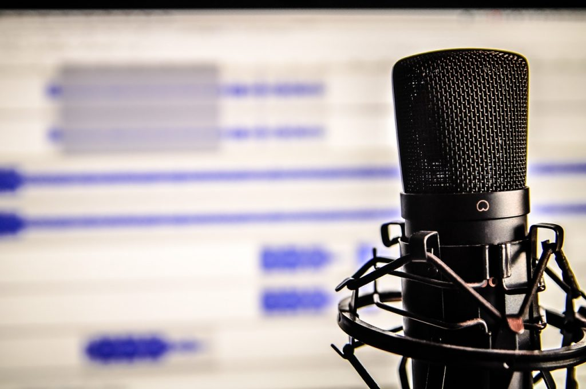

I was recently featured in the [Online Course Masters podcast](https://onlinecoursemasters.com/blog). I sat down with my friend Phil Ebiner to catch up and talk about life because we haven't seen each other in awhile and of course about creating online courses.  \[featured-image single\_newwindow="false" alt="Online Course Masters"\] Before we get to the podcast episode I want to tell you about Phil Ebiner and Online Course Masters.   

## Online Course Masters

Phil has always been one of those instructors in the community that I looked up to. In 2016 I was lucky enough to attend Udemy live and I met Phil along with a number of awesome instructors. In 2017 Phil started a podcast called Online Course Masters and this was the mission: 

> **Online Course Masters** is a podcast that gets inside the minds of online course creators successfully creating and selling courses on marketplaces like Udemy and Skillshare, as well as self-hosting courses on their on sites with tools like Teachable, Thinkific, and others.

It is always great to hear what is and what isn't working for instructors from around the world. I have picked up so many tips and tricks from this podcast and it has been an invaluable resource. I look at podcasts the same way I do books. If I can pick up 1 good idea, then it was worth my time. When Phil asked me to be on his podcast I was blown away.  

## Online Course Masters: Episode 48

I didn't even realize this until I sat down to write this article but I was episode #48. That number has been one of those numbers that have just kind of stuck with me through my life and has been a lucky number for me. Phil and I were supposed to do this episode a long time ago but life happened and we just kept missing each other. It seems fate had a little something to do with us finally getting together to record this episode. If you don't want to watch the video version below you can [subscribe and listen to it on iTunes](https://itunes.apple.com/us/podcast/online-course-masters/id1201319606). https://www.youtube.com/watch?v=6nHUT7oxPuY

## Conclusion

The first thing I noticed was that my audio didn't come out great. I am in the middle of rebuilding the office and trying to perfect my audio so please bear with me. Did you enjoy the podcast? **Question:** What are some of your favorite podcasts out there? I live on podcasts and I am always looking for new ones to listen to so please comment below.  _PS: Thank you, Phil, for creating this awesome podcast!_