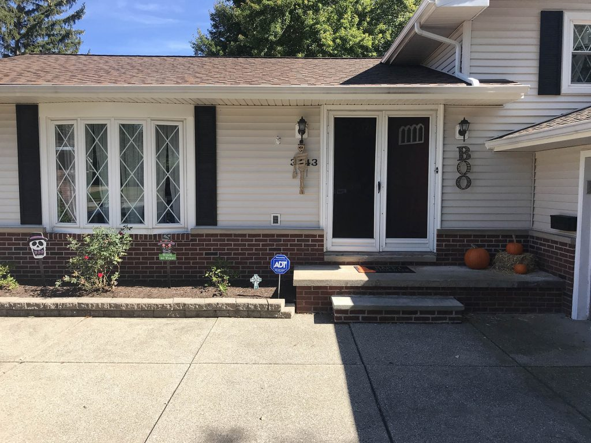

It seems like we say this every year, but can you believe the year is over already? 2017 is going to go down as one of the more memorable years of my life. I thought I would take this time to give you a little "year in review" before I share my 2018 goals. 

## 2017 Year in Review Highlights

As I said before, this has been one of the craziest (in a good way) years of my life. I try and remind myself through the ups and downs just how lucky I am. As I sat down to write this post, it really hit me just how true that is. 

### Being a new homeowner

This was the first year in our new house and as many of you know, being a first time homeowner has its ups and downs.  

We worked on many projects this year, but none bigger than the kitchen remodel. My brother and I woke up on New Years Day (not feeling so great) and started ripping out the kitchen. We stripped the kitchen down to absolutely nothing and built it from scratch. I have to start by thanking my brother Joe because without him we would not have gotten this done. In fact, my whole family pitched in, so I would also like to thank them. Thanks to my wife for her vision of what turned out to be an amazing kitchen!  

homeowner gallery

## Bachelor / Bachelorette Party 

We had a joint bachelor/bachelorette party in New Orleans this year and it was so much fun. We took a huge group of friends down to the Big Easy and had a weekend full of fun, laughter, and great memories. As a group, we spent a lot of time walking the city and enjoying the food and drinks. The food, the architecture and the music are what set this city apart from others. 

the-big-easy gallery

## Wedding Day

The main reason this year is going to go down as one of the best for me is I got married! I got to marry my best friend in the whole world and our wedding day was one for the books. My wife paid attention to every single detail and our big day was one to remember. We had perfect weather and all of our friends and family were there to share in our big day.  

wedding-day gallery

## Honeymoon

After the wedding, it was off to Jamaica for our honeymoon. We spent almost 2 weeks in one of the most magical places I have ever been to. It was just so great to be able to relax and not worry about anything and just enjoy some alone time with my wife.  

honeymoon gallery

## We're expecting! 

As if this year wasn't already the greatest ever, we were so excited to find out that we are expecting our first baby in May 2108!  

baby gallery

## The Real Dan Vega

I had a really good year growing my personal brand. There are going to be changes coming in the new year but for now, I want to focus on what we did this year.

*   Went from 10,000 page views a month to 60,000.
*   Went from 100 email subscribers to 1300.
*   Crossed 35,000 Students worldwide. 
*   Complete website redesign & makeover

### Angular 4 Java Developers

With the help of my friend [John Thompson,](http://springframeworkguru.com) we launched a new course called "Angular 4 Java Developers". We put some real thought and hard work into this course and it shows. I think this is the best course I have created and it's already helping so many people. If you want to find out more about this course visit [https://courses.therealdanvega.com/p/jhipster](https://courses.therealdanvega.com/p/jhipster). 

]

## Conclusion

Well, there it is, my 2017 year in review. I didn't post any goals for this year yet, so I have nothing to hold myself accountable to. That is going to change and in a few days, I am going to let you know what my personal and professional goals are for the year. I think it's so important to sit down and actually put your goals for the upcoming year on paper to make a solid plan for yourself and hold yourself accountable, so stay tuned for mine, and I encourage you to do this as well.  Thanks for reading... until next time! _**Question:** What big things happened in 2017 for you? What goals do you have for 2018? _