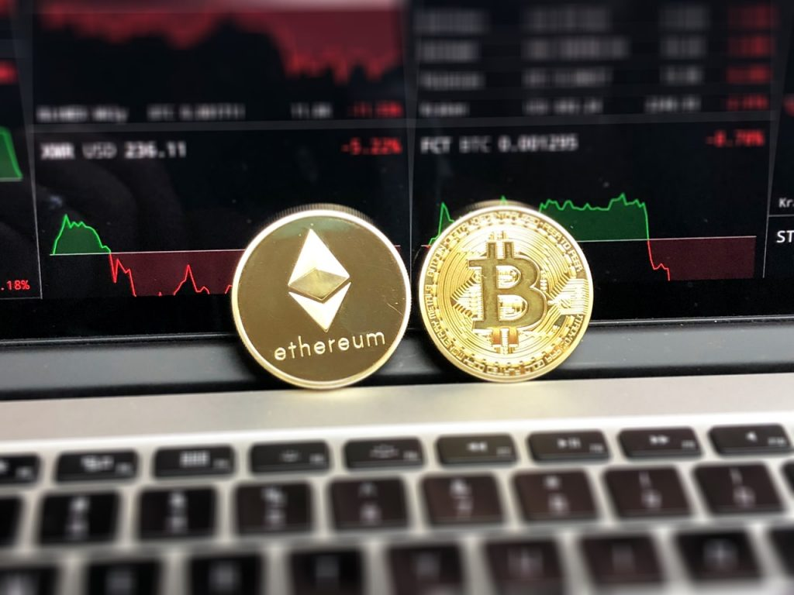
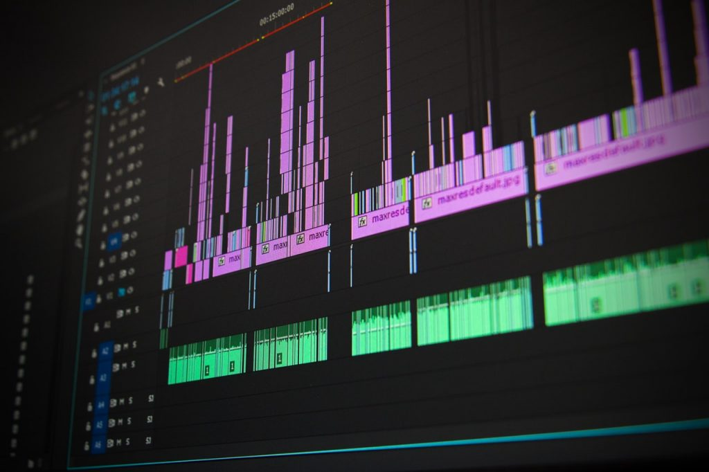
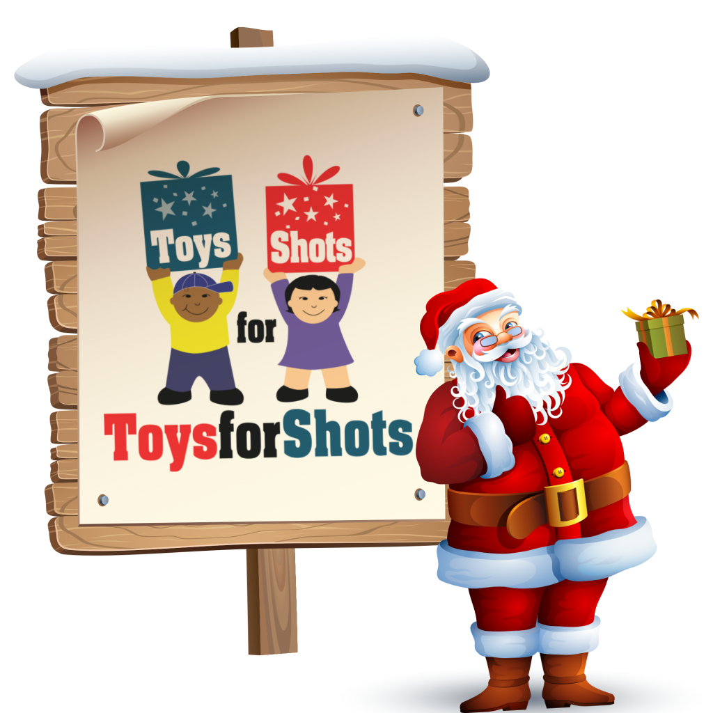
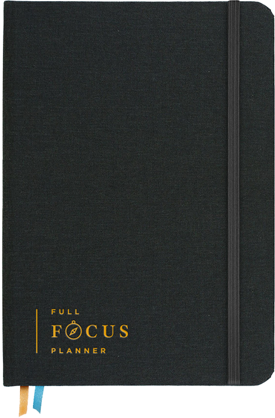

Another year has come and gone and after [spending some time reflecting on 2017](https://therealdanvega.com/blog/2017/12/29/my-2017-year-in-review), it's time to start looking forward to 2018.  \[featured-image single\_newwindow="false" alt="2018 Goals"\] Just so we are clear on where this is going, this isn't a "new year, new me" post. If you want to accomplish goals, you have to define them first. I sat down this week and wrote down some things I wanted to accomplish in 2018.

## My 2018 Goals

These goals are not in any specific order but I did try to group them into buckets. 

### Personal

Personally, 2018 is all about focusing on my health. With a baby on the way and the big 40 arriving this year, I need to make this more of a priority. Exercise has never been an issue for me, but I need to make clean eating a must and not just something I focus on when I want to lose some weight. I have already given up diet soda (which I was literally addicted to) for the past 2 months of the year.   I have also been reading a lot more about the importance of a morning routine. A lot of successful people I look up to swear by it and I think this is going to help me with so many things. I am usually up around 6 AM and don't start work (I work from home) until 8:00 AM. This is going to be a good time to meditate, move for 5 minutes ( squats, pushups, situps, burpees) and spend 30 -60 min reading or listening to podcasts. 

*   Exercise 3-5x per week
*   Run 20 miles per week (When the weather breaks here in Ohio)
*   No more soda
*   Morning routine
    *   Meditate 5 - 10 minutes
    *   Move for 5 minutes
    *   Journal (Productivity and Focus) 5 min
    *   Read for 30 min
*   Complete my home office
*   Complete the nursery (Baby on the way) 
*   Spend more time with my family

### Education

I am not sure if you know this about me, but I am a serial learner. There are some things that I want to make sure I focus on learning this year.  

#### Build an iOS app

I really want to create an iOS application and launch it in the app store this year. Money is not my primary focus here, and I get it.. the app market is a really hard one to get into. It is just one of those things that I have always wanted to do (along with writing a book) so I am making it a priority this year. I don't know what my app is going to do, but I will start brainstorming this soon.  

#### Cryptocurrency 

I have heard the cryptocurrency rumblings for a couple of years now, and like most people, I just ignored it. It seems like 2017 was a big year for Cryptocurrency and it doesn't seem to be going anywhere. Between some books and courses, I would like to inform myself more about a few things.  The blockchain, which is the technology behind the emergence of cryptocurrency, is very interesting. This technology could very well shape the internet as we know it going forward and I don't want to be left behind. I also have a little bit of money invested in some coins, but this is something I would like to expand in the new year as well.  

#### Alexa Skills

This Christmas I got an Amazon echo and I am absolutely loving it. I'm intrigued by the idea of voice-activated applications, and with Echo's popularity, I believe this is a great platform to be on. The programmer in me wants to dive right in and start teaching Alexa some new skills. I will admit I know nothing about writing applications for the echo, so I will be starting from scratch here.  

#### Marketing

I have never been interested in marketing. I have always taken the stance that I will produce content and let someone else worry about the marketing. As an entrepreneur, and someone who puts out a ton of content, it really hit me this year that I was going about it the wrong way.   I produce content for 2 very simple reasons. First, I really enjoy helping people. I remember being a new software developer and learning from people just like the present day me. I also enjoy the extra income some of my work produces, but this should never be the motivating factor. If you can provide a product or service that truly transforms someone's life, then that is a good place to be. With that said, I want to find more ways to get my content out there, and I am not focused enough on this side of my business. I am working on a plan as we speak of books, courses, mentors and even hiring an agency to handle this to make this a bigger priority in 2018. **Marketing Areas of focus**

*   Facebook Ads
*   Google Ads
*   Google Analytics
*   Sales Funnels
*   Chat Bots
*   Digital Marketing in general

_**Question:** Do you have any recommendations for books, courses or agencies to improve in any of topics mentioned above?_

#### Books

I mentioned this in my morning routine, but I want to become a more consistent reader. This isn't going to happen if I don't actually set aside time for it. I know that I am not going to be able to read 30 min every single day, but if I build this into my routine, I should be able to stick to a goal. My goal for is 2018 is to read about 30 books. This is going to be mostly software development and business related, but I am going to try and sneak in a few for fun. I am going to keep a list so we can come back and look at this later.  If you're interested in me writing a quick review of each book I read this year please let me know in the comments below.  

#### Augmented Reality

This is another technology that I keep hearing is going to take over the world. I don't know that I will get into any actual development in the space this year, but at the very least I want to get more informed on where it's current state is and where it's going.  

### Professionally

If you aren't aware, I have been with the same company for almost 6 years now and everything there is going great. I do have some goals there but they aren't really things I want to share here so, for now, I will just leave it at that. 

#### Course Development

I know this might not seem like a huge goal, but I want to release 4 new courses this year. I already know what two of them are going to be (coming soon) and have some ideas for the other two. If you have some ideas for courses that you would like me to pursue, please leave me a comment below. 

#### Video, Live Video & Video Production

When it comes to content on the web, video is king, and I have been preaching this for a couple years now. It's time I take my own advice and focus more on video. In 2017, I really focused on blogging, and while I am going to continue to blog, I am also going to start my content story with video. This means more live videos on [my Facebook page](http://www.facebook.com/therealdanvega), more Youtube videos and just being more comfortable in front of the camera.   With a shift in focus to video, I need to get more creative with video editing. I know the basics of editing and know my way around Final Cut Pro and Adobe Premiere Pro. I know the basics, but would really like to improve the quality of my course promo videos, YouTube tutorials and some videos I will be working on for Facebook ads in the near future.  [Phil Ebiner](https://videoschoolonline.com/) is a friend and someone I look up to when it comes to all things video. That is why I am taking his course "[Adobe Premiere Pro CC for beginners](https://www.udemy.com/adobe-premiere-pro-video-editing)". This is a promo he created for a new course of his and I absolutely fell in love with it. This is a great example of how to create a perfect course promo video.  https://www.youtube.com/watch?v=Tu6vV3huI6E

### Podcasts

There is a big question mark next to this one so I am not sure what to do here. I love podcasts so much that it is probably to a fault. I listen to them in the morning, in the car, on a run and whenever I can find some extra time. The reason I say that this is probably to a fault is that I listen too much and don't take enough action.  I have a voice and would love to share my thoughts on a variety of topics. I have been a software developer & serial entrepreneur for half of my life. These are things I would love to talk about, but I am not even sure where to start.  I do know that If I come up with a good plan for a podcast that I would probably learn from the best before I dive right in. Pat Flynn has a course called [Power-Up Podcasting](https://courses.smartpassiveincome.com/p/power-up-podcasting) that I have had my eye on for a while now.

#### New Business Ventures

Towards the end of this year, I turned my side hustle into a legitimate business. The primary focus was to separate my personal and business finances, but I do have some ideas that need to get put into action in the new year. For now, I am just going to share the name and logo with you and fill you in on this in the coming months.  **Code Monkey, LLC**  Please [follow Code Monkey on Facebook](https://www.facebook.com/codemonkeyu/) for updates.  I also have a very good idea for a physical space right here in Northeast Ohio that could be a game changer. I can guarantee someone is going to do this within the next 2 years and the only question is, will it be me? 

#### Non-Profit

I am the President of a non-profit called CLE Cares. For the past 10 years, we have put on an event called [Toys for Shots](http://www.toysforshots.com). Up until this point, we have strictly been focused on this one single event and this year that stops. We are much more than a single event and in 2018, I have a few goals that I would like us to accomplish.

*   CLE Cares Branding & Website
*   Summer Event
*   Sponsors for Toys for Shots
*   Increase attendance for Toys for Shots 2018

## Productivity and Focus

This seems like a lot, and as I am writing this, I am already a little overwhelmed. We all have the same 24 hours in a day, so how is that some people change the world and others don't? I believe a lot of this has to do with productivity and focus.  So how am I going to accomplish these goals? The first thing I did was pick up [Michael Hyatt's Full Focus Planner](https://fullfocusplanner.com/). I am a huge fan of Michael's, and he certainly knows his stuff when it comes to productivity and focus. This is going to become part of my morning journaling and will help me work towards daily, weekly and monthly goals.   On the 1st of every month, I go through a monthly checklist of items that need my attention like updating growth reports, earnings and expenses. I am also going to add a "Goals check-in" task to this day. When the 1st rolls around, I am going to read this post and ask myself "what have I done to work towards any of these goals?" and check off the ones I have completed. 

## Conclusion

Well, there you have it, my goals for 2018. I have always been taught that if you aren't setting goals that are a little scary, you're doing it wrong. I need to challenge myself and I think this list does exactly that. We will revisit this post at the end of 2018 and see where I ended up. _**Question:** What are your goals for 2108? What are some new things that you want to learn? _