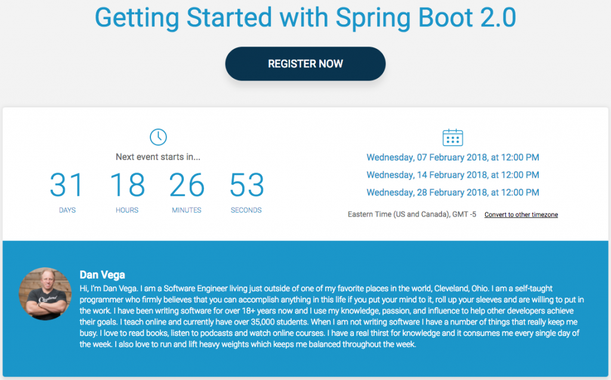

I am really excited to announce that February is going to be packed full of Spring Boot 2 workshops.

Spring Boot 2 is packed full of new features and I can't wait to share some of them with you. In a series of online workshops and 1 in-person presentation, we are going to learn all about Getting Started with Spring Boot 2.0

## Getting Started with Spring Boot 2.0

In this presentation, we are going to discuss how to get started with Spring Boot 2.0. We are going to do this by giving you a quick introduction to the Spring Framework and take a look at what’s new in Spring Framework 5. The Spring Framework is the standard for building enterprise-class applications in Java. If you’re a Java developer looking to expand your skill set, this is a great place to get started.

Building Spring Framework applications used to be confusing and complex. It felt like at times you needed a masters degree in Spring just to spin up a new web application. Thanks to Spring Boot, those days are long gone. Spring Boot takes an opinionated view of building production-ready Spring applications. Did I mention that you can create these applications in minutes and not days? Thanks to a convention over configuration approach, we can quickly get up and running with all types of applications.

With the new releases of Spring Framework 5 & Spring Boot 2.0, there are a lot of new features to talk about. We simply can’t cover them all in this presentation, but I do want to talk at a high level about some of my favorite new features.

At the end of this presentation, you will have a good idea of what Spring Boot 2.0 is and how to get started. The fun doesn’t end here though, as I will leave you with some resources and next steps to dive even further into building real-world applications with Spring Boot 2.0.

### Intended Audience

If you are brand new to the Spring Framework or Spring Boot this presentation is for you. I also believe that if you have only been working with Spring for a short period, you can get a lot out of this talk. While we are going to look at some of the basics, I am also going to discuss what’s new in Spring Framework 5 and Spring Boot 2. If you are a seasoned vet with Spring, this might be a little slow for you, but if you can pick up one new thing in this talk it’s totally worth it.

### Requirements

The only requirement for this presentation is that you have an intermediate understanding of the Java programming language. All of the examples we are going to look at are in Java so an understanding of the language is a must.

### Live in person 

If you live in or are near the Cleveland area you can see this presentation in person on February 21st. I am giving this presentation to the [Cleveland Java Meetup Group](https://www.meetup.com/cleveland-java/events/246524545/) at [Tech Elevator](https://www.techelevator.com/cleveland/). This is actually going to go a little more in-depth than the online presentations so don't be afraid to check out both. 

### Online Presentation

I am excited to announce that in addition to the in-person presentation I will be giving 3 live presentations online. These are going to be shorter (under an hour) lunch and learn style presentations. These online workshops will be limited to 500 people per workshop, so sign up fast. To register Simply click on the image below or [visit this page](https://events.genndi.com/register/169105139238471451/83883f44c9).

- Wednesday, February 07, 2018 at 12:00 PM
- Wednesday, February 14, 2018, at 12:00 PM
- Wednesday, February 28, 2018, at 12:00 PM

## Conclusion

I really hope you will join me in as we have some fun looking at Spring Boot 2.0. If you are attending and have some questions you would like me to answer please leave them below. I would also like to know what a win for this presentation for you would be. What would you like to get out of it?  _**Question**: What are some of your favorite features in Spring Boot 2?_
