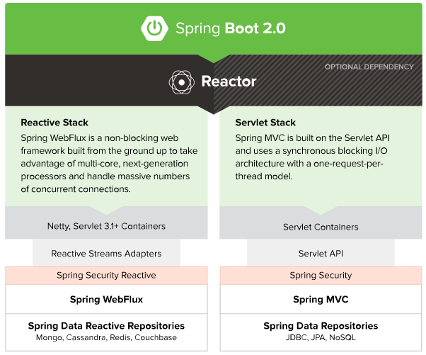
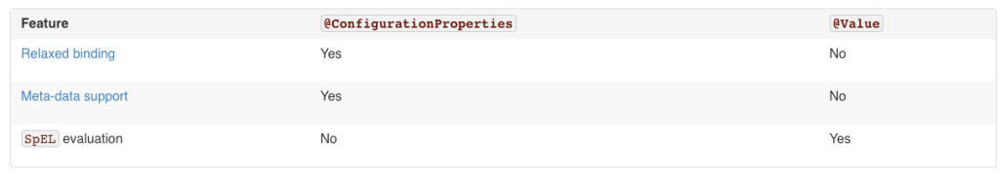
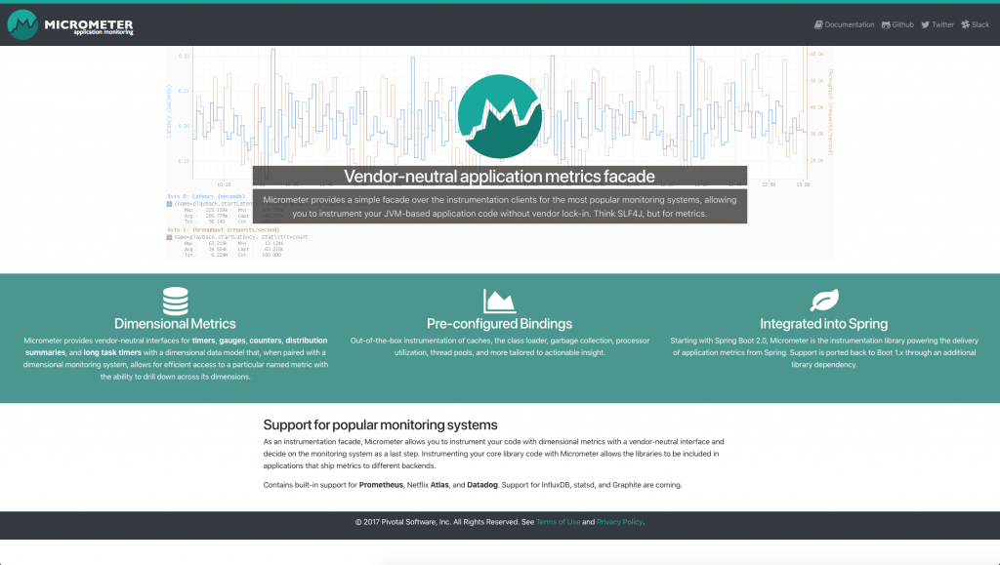
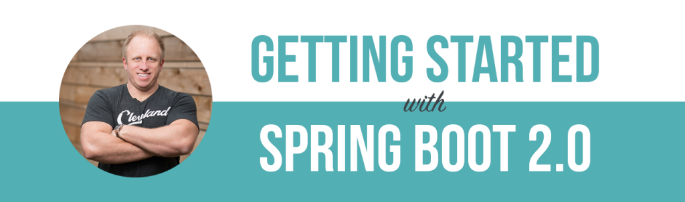

Spring Boot 2 was just released and I am so pumped to see it in action in the coming months. This release is the culmination of 17 months of work and over 6800 commits by 215 different individuals. There are some really great features to talk about so let's talk about What's new in Spring Boot 2. In this article we are going to look at:

*   The history of Spring Boot
*   What's new in Spring Boot
*   Spring Boot 2 Migration Guide
*   Resources

## Spring Boot History

Before we dive into what’s new I want to take this chance to take a quick look at the history of Spring Boot. In a blog post published in August 2013, [Phil Webb announced the first milestone release of a new project called Spring Boot](https://spring.io/blog/2013/08/06/spring-boot-simplifying-spring-for-everyone/).

> Spring Boot aims to make it easy to create Spring-powered, production-grade applications and services with minimum fuss. It takes an opinionated view of the Spring platform so that new and existing users can quickly get to the bits they need. You can use it to create stand-alone Java applications that can be started using ‘java -jar’ or more traditional WAR deployments. 

About 9 months later in April 2014 Spring Boot 1.0 was released. Since then there have been numerous minor releases that have brought us some really great features. 

*   [Spring Boot 1.1 (June 2014) ](https://github.com/spring-projects/spring-boot/wiki/Spring-Boot-1.1-Release-Notes)
    *   spring-boot-starter-test
    *   Metrics & Health Endpoints
    *   Elastic Search, Apache Solr, Spring Social & Spring Integration Auto-configuration 
    *   Additional Templating support (Adding Freemaker, Groov, and Velocity)
*   [Spring Boot 1.2 (March 2015) ](https://github.com/spring-projects/spring-boot/wiki/spring-boot-1.2-release-notes)
    *   Servlet 3.1, Tomcat 8 & Jetty 9
    *   Spring 4.1
    *   @SpringBootApplication Annotation
    *   Email Support
*   [Spring Boot 1.3 (December 2016)](https://github.com/spring-projects/spring-boot/wiki/spring-boot-1.3-release-notes)
    *   Upgrade to Spring Framework 4.2
    *   Upgrade to Spring Security 4.0
    *   Developer Tools
    *   Caching Auto-configuration 
    *   Fully executable JARs and service support
*   [Spring Boot 1.4 (January 2017)](https://github.com/spring-projects/spring-boot/wiki/Spring-Boot-1.4-Release-Notes)
    *   Spring 4.3
    *   Hibernate 5
    *   Testing Improvements
    *   Integration Starter
    *   Couchbase and Neo4J Support
*   [Spring Boot 1.5 (February 2017)](https://github.com/spring-projects/spring-boot/wiki/Spring-Boot-1.5-Release-Notes)
    *   Loggers endpoint
    *   Apache Kafka support
    *   Cloud Foundry actuator extensions
    *   LDAP support
    *   Testing updates

## What's new in Spring 

What's new in Spring Boot 2? If we are going to talk about the biggest feature we need to start with the upgrade to Spring Framework 5. While Spring Framework 5 has been out since September 2017, most developers (like me) have been waiting for the release of Spring Boot 2. Spring Framework 5 introduces a long list of new features but I just want to touch on a few of the major ones here.

### What’s new in Spring Framework 5

[](https://therealdanvega.com/wp-content/uploads/2018/02/mark-solarski-209233-unsplash.jpg)

#### Java 8+ Baseline

If you wish to build Spring Framework applications going forward you must be on a minimum of Java 8. Your first thought might be this is a great change for all of us but in fact its an even bigger one for the Spring team. This gave them a chance to make some major changes to update the code base to all the new features in Java 8 like Lambdas and streams. This not only ads readability throughout the code but also offers some performance improvements to the core of the framework. 

#### Java 9 Support

If you want to use Java 9 you will need to update to Spring Framework 5 and therefore need to update to Spring Boot 2. I know many of us might not be on the latest and greatest version of Java in production but this is a great chance for you to play around with all the cool new toys. This works pretty seamlessly out of the box using the standard classpath but I have read a few people having issues moving to Java 9 modules. 

#### Spring MVC

While Spring MVC isn't the main character in this story there were some nice upgrades. I won't go through them all here so head over to [documentation for Spring Framework 5](https://github.com/spring-projects/spring-framework/wiki/What%27s-New-in-Spring-Framework-5.x#spring-web-mvc).

#### Spring Webflux

The reactive stack is our main character in the story of Spring Framework 5. This is a different way of thinking but fortunately for us, we don't have to learn a whole new way of writing applications. Spring WebFlux is a fully asynchronous and non-blocking web framework built from the ground up allowing us to handle a massive number of concurrent connections. While this is a complete paradigm shift it is really easy to get started.  

[](./reactive_stack.png)

#### Kotlin Support

Kotlin support was added to [http://start.spring.io](http://start.spring.io) but in Spring Framework 5 there is dedicated support for the language. With the dedicated support came some nice features that you can [read about here](https://github.com/spring-projects/spring-framework/wiki/What%27s-New-in-Spring-Framework-5.x#kotlin-support).

#### Testing Improvements

The biggest change in the testing landscape is the complete support for [JUnit 5](http://junit.org/junit5/)'s Jupiter programming and extension model. I will mention this again later but when you fire up a new Spring Boot 2 application you are still using JUnit 4 by default however it is a simple change if you want to start using JUnit 5. 

### What's new in Spring Boot 2

[](https://therealdanvega.com/wp-content/uploads/2018/02/jon-tyson-520864-unsplash.jpg)

#### Third-party Library Upgrades

With any new release of Spring Boot, the Spring team has an opportunity to update various dependencies. 

*   Thymeleaf 3 \* 
*   Jetty 9.4
*   Tomcat 8.5
*   Hibernate 5.2
*   Flyway 5
*   Gradle 4

\* The Thymeleaf starter now includes thymeleaf-extras-java8time out of the box.

#### Reactive Spring Data & Spring Security 

With the move to Spring WebFlux, Spring Data also provides support for reactive applications. Currently, Cassandra, MongoDB, Couchbase and Redis all have reactive API support. Spring Boot includes starter-POMs for all of these which should make getting started really easy.  We also gain the ability to use Spring Security 5.0 in our reactive applications. When Spring Security is on the classpath auto-configuration is provided for WebFlux applications.

#### Actuator

Spring Boot Actuator is nothing new but it has been rewritten from the ground up. If you're not familiar with the Actuator project it automatically exposes endpoints to get information about that status of your application. The Actuator in Spring Boot 1.x was written against the servlet API and with the new reactive stack, the Spring team needed a solution that would work with both. Along with that, there were many changes to Actuator: 

*   Redesign for both servlet & reactive
*   Status & health (all the details) were separated out
*   Simplified Security model
*   Move to micrometer (think SLF4J <span style="font-family: -apple-system, BlinkMacSystemFont, 'Segoe UI', Roboto, Oxygen-Sans, Ubuntu, Cantarell, 'Helvetica Neue', sans-serif;">but for metrics)
*   Improved JSON Structures
*   Simplified process for creating User-Defined Endpoints.
    *   @Endpoint
    *   @WebEndpoint
    *   @JmxEndpoint

[](https://therealdanvega.com/wp-content/uploads/2018/02/pexels-photo-241544.jpeg) 

This might be an area that folks have some trouble upgrading because of the security model changes which we will talk about those in a few. By default, all web endpoints are available beneath the path  `/actuator`  with URLs of the form  `/actuator/{id}` . The  `/actuator`  base path can be configured by using the  `management.endpoints.web.base-path`  property. There is a [dedicated detailed document for Spring Boot Actuator Web API Endpoints](https://docs.spring.io/spring-boot/docs/2.0.x/actuator-api/html/) and this is a great place to start. 

#### Gradle Plugin

I have always been a big fan of Gradle and I am really excited to see that the team took this opportunity to rewrite the Gradle plugin. 

he Spring Boot Gradle Plugin provides Spring Boot support in Gradle, allowing you to package executable jar or war archives, run Spring Boot applications, and use the dependency management provided by spring-boot-dependencies. Spring Boot’s Gradle plugin requires Gradle 4.0 or later.

[](https://therealdanvega.com/wp-content/uploads/2018/02/pexels-photo-209728.jpeg)

**Getting Started**

To get started with the plugin it needs to be applied to your project.

``` java
buildscript {
  repositories {
	maven { url 'https://repo.spring.io/libs-milestone' }
  }

  dependencies {
	classpath 'org.springframework.boot:spring-boot-gradle-plugin:2.0.0.RC1'
  }
}

apply plugin: 'org.springframework.boot'
```

**Building executable jars and wars**

The bootRepackage task has been replaced with bootJar and bootWar tasks for building executable jars and wars respectively. Both tasks extend their equivalent standard Gradle jar or war task, giving you access to all of the usual configuration options and behavior.

**Dependency management**

Spring Boot’s Gradle plugin no longer automatically applies the dependency management plugin. Instead, Spring Boot’s plugin now reacts to the dependency management plugin being applied by importing the correct version of the spring-boot-dependencies BOM. This gives you more control over how and when dependency management is configured. For most applications applying the dependency management plugin will be sufficient:

``` java
apply plugin: 'io.spring.dependency-management'
```

The [Gradle Plugin also has its own documentation](https://docs.spring.io/spring-boot/docs/2.0.x/gradle-plugin/reference/html/) and there is some really great information in there. Anyone that wants to get started using Gradle should start by checking out the link below. 

#### Simplified Security 

In Spring Boot 2.x, one of the main goals was to simplify security configuration and make adding custom security easy. By default, everything is secured, including static resources and Actuator endpoints. If Spring Security is on the classpath, Spring Boot will add  **@EnableWebSecurity**  and rely on Spring Security's content-negoation to decide which authentication mechanism to use. Once users decide that they want to add custom security, the default security configuration provided by Spring Boot will back off completely. At this point, users need to explicitly define all the bits they want to secure. This means security configuration is now in one place and avoids any kind of ordering issues with existing  **WebSecurityConfigurerAdapter**. 

[](https://therealdanvega.com/wp-content/uploads/2018/02/pexels-photo-113726.jpeg) 

Here is an example of a custom security:

``` java
http
    .authorizeRequests()
        // 1
        .requestMatchers(EndpointRequest.to("status", "info"))
            .permitAll()
        // 2
        .requestMatchers(EndpointRequest.toAnyEndpoint())
            .hasRole("ACTUATOR")
        // 3 
        .requestMatchers(StaticResourceRequest.toCommonLocations())
            .permitAll()
        // 4
        .antMatchers("/\*\*")
            .hasRole("USER")
    .and()
  ... // additional configuration
``` 

1.   `/status`  and  `/info`  endpoints do not require authentication.
2.  All other actuator endpoints are protected by the  `ACTUATOR`  role.
3.  Common static resource locations are open to all.
4.  All other application endpoints are protected by the  `USER`  role.

**Actuator Security** With the actuator endpoints locked down, you will need to include or exclude the endpoints you want to see. These are the properties that now control that and have changed since 1.x 

\# ENDPOINTS WEB CONFIGURATION (WebEndpointProperties)
management.endpoints.web.exposure.include=info,health # Endpoint IDs that should be included or '\*' for all.
management.endpoints.web.exposure.exclude= # Endpoint IDs that should be excluded.
management.endpoints.web.base-path=/actuator # Base path for Web endpoints. Relative to server.servlet.context-path or management.server.servlet.context-path if management.server.port is configured.
management.endpoints.web.path-mapping= # Mapping between endpoint IDs and the path that should expose them.

If you're ever unsure what properties to use bookmark the [common application properties documentation](https://docs.spring.io/spring-boot/docs/2.0.x/reference/html/common-application-properties.html). 

#### HTTP/2 Support

It's hard to believe but the HTTP 1.1 specification was released back in 1996. I think this comes without saying but the web is very different today. If you want to enable HTTP/2 in your Spring MVC or WebFlux applications you can use the following property. 

server.http2.enabled=true

This support depends on the chosen web server and the application environment since that protocol is not supported out-of-the-box by JDK8. Please [check out the documentation](https://docs.spring.io/spring-boot/docs/2.0.x/reference/html/howto-embedded-web-servers.html#howto-configure-http2) for more details.  [](https://therealdanvega.com/wp-content/uploads/2018/02/mac-freelancer-macintosh-macbook-40185.jpeg)

#### Configuration Properties

In Spring Boot 1.x this notion of relaxed binding was supported and all that meant is there were multiple ways you could create a property name (camel case, underscore, hyphen) and that property would all bind to the same property. 

This still works the same but what they did tighten up was the way that you read variables in your own code. The  `@Value`  annotation is a core container feature, and it does not provide the same features as type-safe configuration properties.

[](https://therealdanvega.com/wp-content/uploads/2018/02/2018-02-28_07-12-58.png) [https://docs.spring.io/spring-boot/docs/2.0.x/reference/html/boot-features-external-config.html#boot-features-external-config-relaxed-binding](https://docs.spring.io/spring-boot/docs/2.0.x/reference/html/boot-features-external-config.html#boot-features-external-config-relaxed-binding)

#### Metrics

Spring Boot’s own metrics have been replaced by Micrometer. This is being developed by Pivotal and quickly being adopted across projects within Pivotal. 

Spring Boot Actuator provides dependency management and auto-configuration for [Micrometer](https://micrometer.io/), an application metrics facade that supports numerous monitoring systems, including:

*   [Atlas](https://docs.spring.io/spring-boot/docs/2.0.x/reference/html/production-ready-metrics.html#production-ready-metrics-export-atlas "54.2.1 Atlas")
*   [Datadog](https://docs.spring.io/spring-boot/docs/2.0.x/reference/html/production-ready-metrics.html#production-ready-metrics-export-datadog "54.2.2 Datadog")
*   [Ganglia](https://docs.spring.io/spring-boot/docs/2.0.x/reference/html/production-ready-metrics.html#production-ready-metrics-export-ganglia "54.2.3 Ganglia")
*   [Graphite](https://docs.spring.io/spring-boot/docs/2.0.x/reference/html/production-ready-metrics.html#production-ready-metrics-export-graphite "54.2.4 Graphite")
*   [Influx](https://docs.spring.io/spring-boot/docs/2.0.x/reference/html/production-ready-metrics.html#production-ready-metrics-export-influx "54.2.5 Influx")
*   [JMX](https://docs.spring.io/spring-boot/docs/2.0.x/reference/html/production-ready-metrics.html#production-ready-metrics-export-jmx "54.2.6 JMX")
*   [New Relic](https://docs.spring.io/spring-boot/docs/2.0.x/reference/html/production-ready-metrics.html#production-ready-metrics-export-newrelic "54.2.7 New Relic")
*   [Prometheus](https://docs.spring.io/spring-boot/docs/2.0.x/reference/html/production-ready-metrics.html#production-ready-metrics-export-prometheus "54.2.8 Prometheus")
*   [SignalFx](https://docs.spring.io/spring-boot/docs/2.0.x/reference/html/production-ready-metrics.html#production-ready-metrics-export-signalfx "54.2.9 SignalFx")
*   [Simple (in-memory)](https://docs.spring.io/spring-boot/docs/2.0.x/reference/html/production-ready-metrics.html#production-ready-metrics-export-simple "54.2.10 Simple")
*   [StatsD](https://docs.spring.io/spring-boot/docs/2.0.x/reference/html/production-ready-metrics.html#production-ready-metrics-export-statsd "54.2.11 StatsD")
*   [Wavefront](https://docs.spring.io/spring-boot/docs/2.0.x/reference/html/production-ready-metrics.html#production-ready-metrics-export-wavefront "54.2.12 Wavefront")

[](https://therealdanvega.com/wp-content/uploads/2018/02/2018-02-28_06-59-52.png) To learn more about Micrometer visit [https://micrometer.io/](https://micrometer.io/) This might cause a little bit of an upgrade pain for those doing a ton of logging of custom metrics.

#### Quartz Scheduler

Spring Boot 2 provides support for the Quartz scheduler that can be used via the spring-boot-starter-quartz dedicated starter. Both in-memory and JDBC stores can be configured.

```xml
<dependency>
	<groupId>org.springframework.boot</groupId>
	<artifactId>spring-boot-starter-quartz</artifactId>
</dependency>
```


#### HikariCP Connection Pool

The default connection pool has switched from Tomcat to HikariCP. If you used spring.datasource.type to force the use of Hikari in a Tomcat-based application, you can now remove that override. Similarly, if you want to stay with the Tomcat connection pool, simply add the following to your configuration:

```bash
spring.datasource.type=org.apache.tomcat.jdbc.pool.DataSource
```

#### Developer Tools

By default, each time your application restarts, a report showing the condition evaluation delta is logged. The report shows the changes to your application’s auto-configuration as you make changes such as adding or removing beans and setting configuration properties. To disable the logging of the report, set the following property:

```bash
spring.devtools.restart.log-condition-evaluation-delta=false
```

#### Kotlin Support

We talked earlier in this article about the official support for Kotlin. There is also a [dedicated portion of the documentation to Kotlin](https://docs.spring.io/spring-boot/docs/2.0.x/reference/html/boot-features-kotlin.html). 

#### JUnit 5

As I said earlier the default for a Spring Boot application is to still use JUnit 4. If you want to switch to JUnit 5 you will need to exclude JUnit 4 from the spring boot starter test and add the required dependencies. You will also need to add the plugin listed below. 

```xml
<dependencies>
	<dependency>
		<groupId>org.springframework.boot</groupId>
		<artifactId>spring-boot-starter-test</artifactId>
		<scope>test</scope>
		<exclusions>
			<exclusion>
				<groupId>junit</groupId>
				<artifactId>junit</artifactId>
			</exclusion>
		</exclusions>
	</dependency>
	<dependency>
		<groupId>org.junit.jupiter</groupId>
		<artifactId>junit-jupiter-api</artifactId>
		<scope>test</scope>
	</dependency>
	<dependency>
		<groupId>org.junit.jupiter</groupId>
		<artifactId>junit-jupiter-engine</artifactId>
		<scope>test</scope>
	</dependency>
</dependencies>
<build>
<plugins>
	<plugin>
		<groupId>org.springframework.boot</groupId>
		<artifactId>spring-boot-maven-plugin</artifactId>
	</plugin>
	<plugin>
		<groupId>org.apache.maven.plugins</groupId>
		<artifactId>maven-surefire-plugin</artifactId>
		<dependencies>
			<dependency>
				<groupId>org.junit.platform</groupId>
				<artifactId>junit-platform-surefire-provider</artifactId>
				<version>${junit-platform.version}</version>
			</dependency>
		</dependencies>
	</plugin>
</plugins>
</build>
```

## Spring Boot 2 Migration Guide

It probably goes without saying but with any major release like this simply flipping the version number in production isn't your best upgrade path. The first thing I would do is read through the [Spring Boot 2.0 Migration Guide](https://github.com/spring-projects/spring-boot/wiki/Spring-Boot-2.0-Migration-Guide). For me I found most of my issues revolved around the simplified security model changes and property changes. The migration guide includes an awesome tip for migrating your property files. 

> With Spring Boot 2.0, many configuration properties were renamed/removed and developers need to update their  `application.properties` / `application.yml`  accordingly. To help you with that, Spring Boot ships a new  `spring-boot-properties-migrator`  module. Once added as a dependency to your project, this will not only analyze your application’s environment and print diagnostics at startup, but also temporarily migrate properties at runtime for you. This is a must have during your application migration:

```xml
<dependency>
  <groupId>org.springframework.boot</groupId>
  <artifactId>spring-boot-properties-migrator</artifactId>
</dependency>
```

I am not sure what your thoughts are on this but I would certainly start playing with Spring Boot 2 and working on migrating your code over to it but with any major release, I usually wait until the next point release. This isn't just for Spring, I do this with pretty much everything from Apple to Pivotal to Angry Birds!  

[](https://therealdanvega.com/wp-content/uploads/2018/02/pexels-photo-860379.jpeg)

## Resources

### Documentation

There are a ton of great resources out there but I want to start with the documentation. The documentation for Spring Framework and Spring Boot has really improved over the years. I love some of the dedicated guides we got this time around with Actuator and the Gradle Plugin. 

*   Spring Boot Reference Guide: [https://docs.spring.io/spring-boot/docs/2.0.x/reference/html/](https://docs.spring.io/spring-boot/docs/2.0.x/reference/html/)
*   Spring Boot API: [https://docs.spring.io/spring-boot/docs/2.0.x/api/](https://docs.spring.io/spring-boot/docs/2.0.x/api/)
*   Spring Boot Actuator Web API: [https://docs.spring.io/spring-boot/docs/2.0.x/actuator-api/html/](https://docs.spring.io/spring-boot/docs/2.0.x/actuator-api/html/)
*   Spring Boot Gradle Plugin Reference: [https://docs.spring.io/spring-boot/docs/2.0.x/gradle-plugin/reference/html/](https://docs.spring.io/spring-boot/docs/2.0.x/gradle-plugin/reference/html/)
*   Spring Boot Maven Plugin Reference: [https://docs.spring.io/spring-boot/docs/2.0.x/maven-plugin/](https://docs.spring.io/spring-boot/docs/2.0.x/maven-plugin/)
*   Common Application Properties: [https://docs.spring.io/spring-boot/docs/2.0.x/reference/html/common-application-properties.html](https://docs.spring.io/spring-boot/docs/2.0.x/reference/html/common-application-properties.html)

### Books

I have both of these books and think they both have some really good value. If you're looking for more of a reactive path check out Learning Spring Boot 2.0.  

[](https://www.amazon.com/Learning-Spring-Boot-2-0-microservices/dp/1786463784/ref=as_li_ss_il?ie=UTF8&qid=1519826464&sr=8-1-spons&keywords=spring+boot+2&psc=1&linkCode=li3&tag=therealdanveg-20&linkId=02c093ca835465896029afb5ff59d6ce) 

[](https://www.amazon.com/Beginning-Spring-Boot-Applications-Microservices/dp/1484229304/ref=as_li_ss_il?ie=UTF8&qid=1519826464&sr=8-3&keywords=spring+boot+2&linkCode=li3&tag=therealdanveg-20&linkId=431754c7b1270cf3b194761f5df51b34)

### Courses

I am working on wrapping up my next course titled "Getting Started with Spring Boot 2".

#### Course Overview

This course offers hands-on experience building Spring Framework applications using Spring Boot. The first thing that is going to stand out is that we are going to move away from the boring, non-useful demos. In the new course, we are going to build a practical application from start to finish. This will allow you to see the process I use for building applications from idea to launch.  One of the big thing I heard from my students in my first course is that they wanted more information on how to go into production. A great application isn’t that useful if we can deploy it into a production environment. We will take a look at using one of the most popular cloud services around, Amazon Web Services (AWS). On completion, students will have the foundation they need to build enterprise-ready Java applications.  If you're interested in signing up for the waitlist and receive an introductory discount [please head over to the course page](https://therealdanvega.com/spring-boot-2).  

[](https://therealdanvega.com/wp-content/uploads/2018/02/getting_started_spring_boot_2.png)

### Me, Me, Me

Please consider signing up for my mailing list (below) to be notified when I publish new content. I am making a large push towards more video and less long blog posts (like this one) so [please consider subscribing to my YouTube Channel](http://www.youtube.com/therealdanvega) as well. A video of me talking about this blog post. https://www.youtube.com/watch?v=91n6y-T-PC8

## Conclusion

I have been looking forward to this release for a long time now and If you can't tell, I am super excited.  _**Question:** What are your favorite features in Spring Boot 2? _