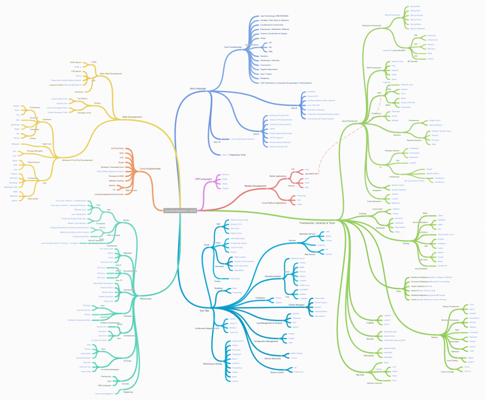

In this tutorial, we are going to look at what you should learn as a Java Developer in 2018. 

 When you're trying to keep up to date or learn a new language it can often be confusing on what you should be learning in that space. New projects pop up and often go away and its hard to tell what's still relevant. In this article (and the video above), we will try and make sense of what you should be learning today as a Java Developer. 

## Java Development in 2018

This project started out as a really simple fun exercise for me. I wanted to get a list of what I thought Java developers should be learning in 2018 depending on their career path. That simple project I started has grown into the large list that you will see today. I just kept finding a reason to create another node or drill down even further.

When looking at this list I really want you to keep a couple of things in mind. When you see this large list of technologies please don’t let it scare you off. This is not a “you should know every single one of these” lists. It is just what I believe to be relevant in 2018. That last part is important, what I BELIEVE. I don’t know everything and I want this to be a fluid list, if you think I should add something to this list please let me know in the comments below and why and I will add it the mind map. 

## Java Development in 2018 Mind Map

I really love using Mind Mapping software to organize my thoughts. It's actually really great for teaching and learning something new. It might make more sense if you watch the screencast below but if you want to jump right in you can check out the [Java Development in 2018 mind map here](https://coggle.it/diagram/WqgTTNMJtPiHph_q/t/java-development-in-2018). Also if you're new to mind mapping, in general, you can check out another short presentation I did on [mind mapping for programmers](https://www.youtube.com/watch?v=FINqHqYjTlE). 

### Java Development Mind Map Sections

This is a quick breakdown of what we cover in the mind mapping presentation. I will also give you a time next to the title in case you want to jump directly to that section.  

**Core Fundamentals** (3:10) These are core fundamentals that we should be learning during our development journey.

**Basic Web Development** (6:30) Even if you don't want to become a full-stack developer you should know the basics of front-end development. I would argue that no matter what language you're learning that having a foundation in HTML, CSS & JavaScript is important. 

**Advanced Front-end development** (9:20) As you start to move through web development you might find out that you really like it. If you want to become a Java Developer and still want to learn some advanced front-end development skills you could become a full-stack developer. 

**Java Language** (16:00) This is going to be the largest area of learning on your Java Developer path. In this section, I lay out what I think are the fundamentals to learn as well as what are the things you should be learning from the new releases. 

**JVM Languages** (22:50) This is a collection of other languages that run on the JVM.

**Mobile Development** (23:55) A quick overview If you want to build applications for different form factors like phones and tablets.

**Framework, Libraries & Tools** (25:00) This is probably the largest section of the mind map. Here we are going to look at different frameworks, libraries or tools you might come across on your development journey. 

**DevOps** (35:00) “DevOps is about moving from having a single skill, such as being a developer or network engineer, to having multiple skill sets that adapt to the changing needs of the business and market.”

**Resources** (40:55) A collection of resources for learning a lot of the things we discussed in this tutorial. 

## Conclusion

I really hope you enjoyed that tutorial friend. This started out as a small little side project and ballooned into what it is today. If you think something is missing from this list please let me know. I hope you have a wonderful day and as always...

Happy Coding
Dan
