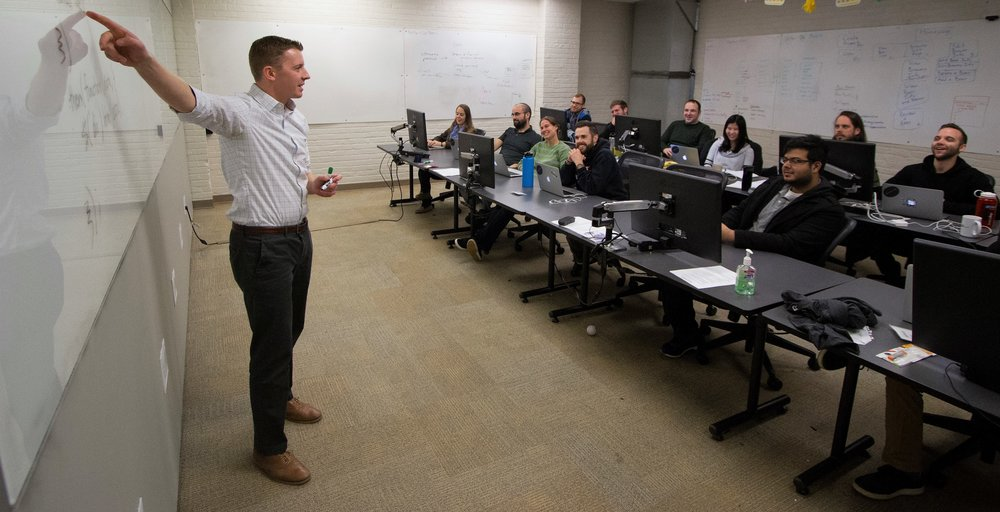
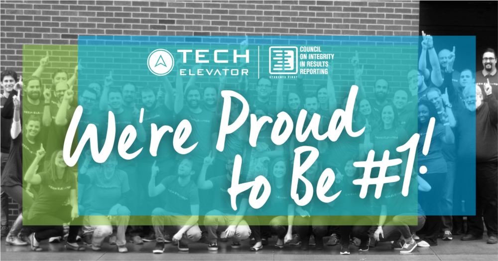
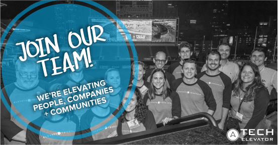
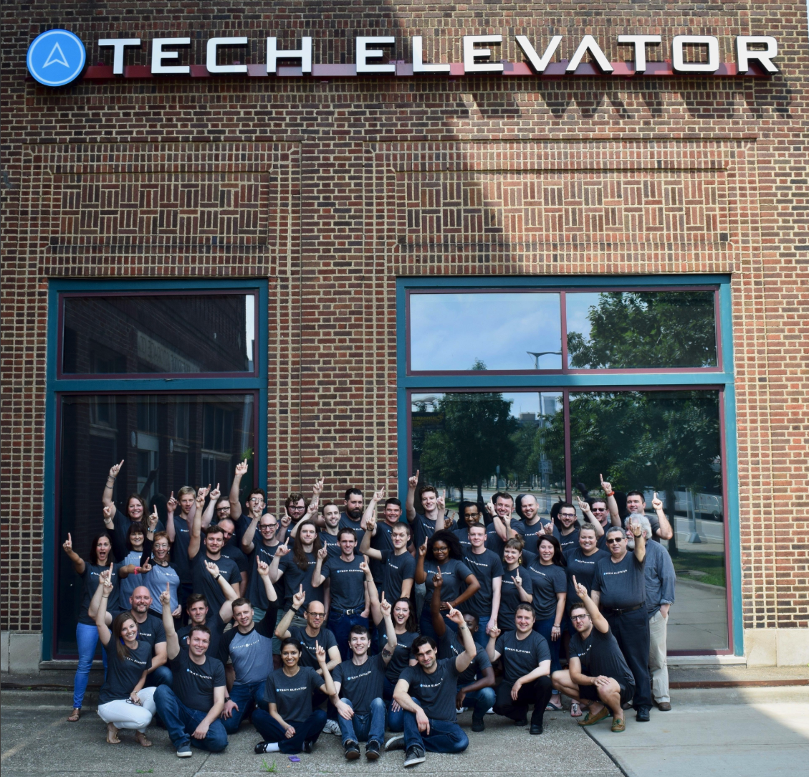

I am happy to announce that I am joining [Tech Elevator](https://www.techelevator.com/). I am beyond excited to join this amazing company and I can't wait to tell you a little bit more about them and what they do.

## What I am leaving behind

Before we get to the good news and what I have to look forward to, I want to spend a few minutes talking about what I am leaving behind. For the past 6 1/2 years, I have spent my days working for [Markel](http://www.markelcorp.com/). This is an amazing company that has done some amazing things, and I just want to thank them for the opportunities they gave me.

I was brought into Markel by my good friend [Jason Delmore](https://www.linkedin.com/in/jasondelmore) and I can't thank him enough for everything he has done for me over the years. I had a chance to work with some really great people and work on some really fun projects.

This was a really hard decision for me because I really enjoyed the people I worked with and my commute to work was a short one (I work from home). I gave up some things in this move to do something I am really passionate about. Stepping outside of your comfort zone is never easy, but this is usually where the biggest rewards in life come from.

## Hello, Tech Elevator!

[Tech Elevator](https://www.techelevator.com/) is a Coding Bootcamp that started right here in Cleveland, Ohio and now has 4 locations. In just 14 weeks they can teach you the skills that you will need to land a job as a software developer. What's great about Tech Elevator is they have a 92% graduation rate and an 89% placement rate. That placement rate is the top in the country, how awesome is that!

Josh teaching students at our Cleveland Campus

### What is a Coding Bootcamp?

Traditionally, if you wanted to learn a specific skill you had to go to college to get it. You could attend a 4-year university or a more targeted trade school that typically takes 2 years. Even in a 2-year program, you're typically taking other classes that don't really have anything to do with the skill you're trying to learn.

This is where a coding boot camp or specialized trade school comes in. In a coding boot camp, you will spend a shorter amount of time in school but you're going to learn about software development the whole time. This allows the boot camp to focus in on the skills you need to land a job. The need for these boot camps is due to the overwhelming amount of available software development positions across the country.

### Why Tech Elevator

Tech Elevator limits the class sizes so that instructors have time to focus on each student and it's one of the things that I really admire about them. They don't just spend 14 weeks in a textbook, they teach you concepts and give you practical examples to work on.

The last 2 weeks is used splitting students up into teams, teaching them agile principles and having them go off and build a real-world project together. I was able to see some of the student's projects and for only having 2 weeks to complete and having just learned to program, I was really impressed! 

They also have a [pathway program](https://www.techelevator.com/pathway-program/) that helps students with interview prep and the placement of graduates. I think this is as important as the computer skills they are learning. When I graduated I was sent out on my own with no help at all and just expected to find my own way. They take a real interest in student placement and it shows by being #1 in the country.

#### Check us out

If this sounds like something you're interested in, we have 4 locations in the following cities.

*   [Cleveland](https://www.techelevator.com/cleveland/)
*   [Columbus](https://www.techelevator.com/columbus/)
*   [Cincinnati](https://www.techelevator.com/cincinnati/)
*   [Pittsburgh](https://www.techelevator.com/pittsburgh/)

### What is my Role?

Now that you know a little bit about coding boot camps and Tech Elevator, I want to share with you what I will be doing. I am coming in as a Product Developer and my main product is our curriculum which has 2 tracks and is taught at all 4 of our locations.

It is my responsibility to take a look at the curriculum and make sure that the students are learning the skills that they will need and that employers are looking for. This will be done by taking feedback from instructors, listening to students and staying up to date in a fast-paced industry. We only get 14 weeks with these students and we need to make sure that every single day is an important one.

I will also be working on supplemental material for the students to help in making their day to day learning experience an even better one. We also have corporate training classes and we will be developing new classes for a variety of topics.

### We are hiring!

Join our growing, passionate team and contribute your talents to our mission of elevating people, companies, and communities. Browse all openings: [https://lnkd.in/e3Yuf45](https://lnkd.in/e3Yuf45)

We are hiring! 

## Conclusion

I consider myself extremely lucky to be a part of something special. I get to wake up and contribute to the next generation of software developers and for that, I am very grateful.

This is a picture of the most recent graduates in Cleveland along with the Cleveland team.