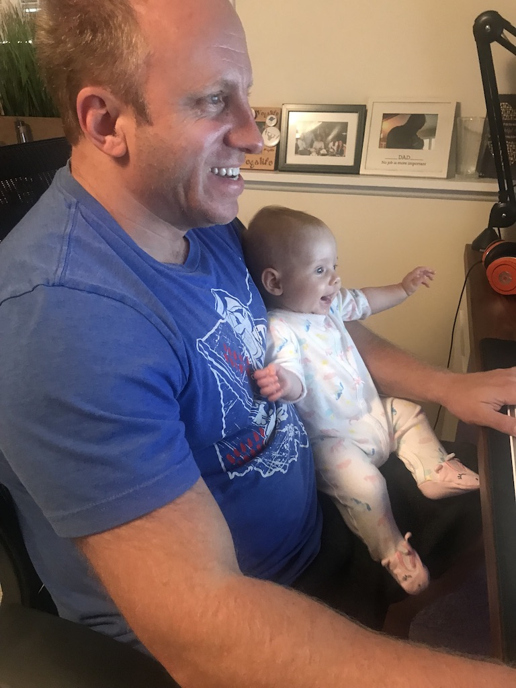
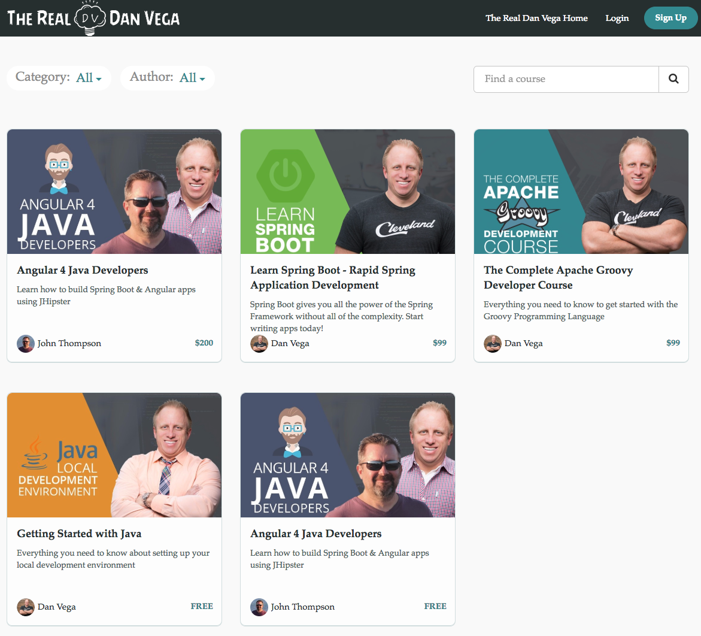
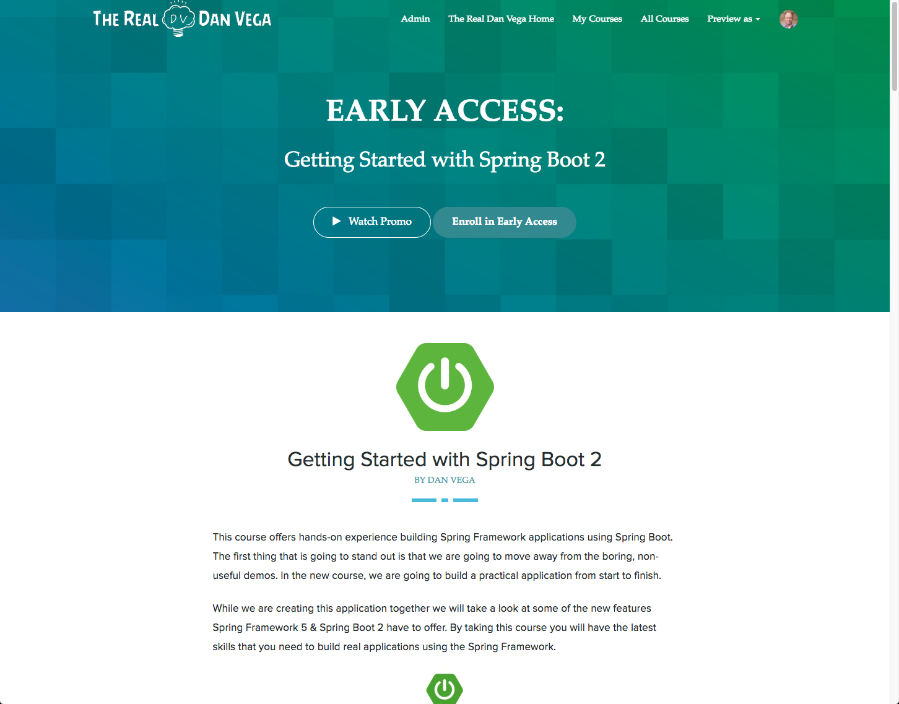

I don't feel like I have had a chance to really sit down and talk with all of you. I want to spend some time with you today and let you know where I have been and tell you about some exciting news I have.

## What have you been up to Dan

### My Daughter was Born!

I want to apologize for my absence over the past few months. Someone really should have warned me that I wouldn't get anything done with a newborn. Who knew that a baby would be so much work (and fun at the same time). My wife and I are beyond grateful to have Isabella in our lives but the fact of that matter is she has taken up all of our time. She is growing right before our eyes and is even helping Dad with his content creation.

Bella helping Dad with his new course

### Tech Elevator

If you haven't heard I have also taken a [new position with Tech Elevator](https://therealdanvega.com/blog/2018/09/07/i-am-joining-tech-elevator). I can't tell you how excited I am to get started. I still remember working full time and going to school at night to learn computer science. I remember sitting in these classes completely lost at times. I also remember looking up to these instructors and just admiring how they could know so much. Now I am in that position of helping the next generation of programmers. Life has a funny way of paying you back and rewarding your hard work. It seriously is a dream come true for me.

### Get to the point Dan

What I am getting to is that I realize I can no longer spend all of my nights and weekends producing content like I used to. This is also something I don't want to give up because I love helping students learn a new subject. What this does mean is that I need to be much smarter about the content I am producing and maximize the time that I do have.

**Blog/YouTube**  
I want to get back to frequently posting on my Blog & YouTube but I am still trying to figure out what that looks like. I feel like for tutorials my time is better spent on videos for YouTube. In the past, I have been way too consumed with finding the perfect shot versus focusing on the content. I am going to keep trying to get over that and try to remember that people are viewing my videos for the tutorial, not the set design or video production.

I would be interested in hearing your thoughts on this though. My thought is to release a tutorial on YouTube first and then follow it up with a Blog post that includes the video.

**Courses**  
What feels like a lifetime ago I announced that I was working on a Spring Boot 2 course. I mentioned earlier what has been taking up my time but the other hold up on this course was the massive size of the course I wanted to build. With limited time on my hands, I realize that producing these large 15-hour courses are probably not realistic.

I have made some good progress on this course and I have a really cool announcement about it but first I want to address the real problem. When I set out to teach someone a subject I want to teach them everything. This is great in certain cases but not every single course I make needs to cover this much content. I need to get away from my fear that If I am going to teach a subject I need to throw everything including the kitchen sink at you. What I have found is that students do want to learn everything but maybe not all at once as it can be overwhelming.

http://courses.therealdanvega.com 

With that, I am slimming down my Getting Started with Spring Boot 2 course and adding some very targeted follow-up courses. For instance, I wanted to teach you how to take the application we build in the course into production but I was only going to show you AWS. It makes much more sense to create a targeted course that shows you how to get your application into production on a variety of platforms.

Smaller, targeted courses are my plan going forward and I have something really exciting in the works, but more on that in a couple of months.

**Udemy**  
If you have taken one of my courses on Udemy you might have noticed that I haven't been answering questions lately. Not to worry I would never leave you without help. I hired a teacher's assistant a few months ago and I am so happy and grateful for his help. Thai knows his stuff and he has been very helpful answering students questions. If he answers one of your questions please let him know what a wonderful job he is doing. This was another case of delegating some work so that I can get that time back to focus on content creation. 

**Schedule**  
I still haven't figured out a schedule but that is what I will be working on over the next couple of months.

*   Producing consistent YouTube & Blog Content
*   Completing Getting Started with Spring Boot 2 Course
*   Spring into Production Course
*   A new platform (teaser)

## Getting Started with Spring Boot 2

Now that we got all of the housekeeping out of the way I want to talk about my new course, [Getting Started with Spring Boot 2](https://therealdanvega.teachable.com/p/spring-boot-2). I am happy to announce that I am pre-releasing my new course today!

As of today, I have 4 modules complete (23 lessons) with another 5-6 in the works. So what is the incentive for you to order the course now?

*   You are going to be the first to get your hands on this course.
*   Get weekly course updates.
*   Help provide feedback and shape the final course.

If you're interested in getting early access to the course or just want to find out more please [head over to the course landing page](https://therealdanvega.teachable.com/p/spring-boot-2). I don't have a schedule of when this course is going to be complete and available on other platforms so if you want to get your hands on it, this is your chance.

## Introduction to Spring Boot

Now that we are focused on the Spring Boot 2 course I won't be making any updates to my Introduction to Spring Boot course. This is still a very relevant course and with close to 12 hours of content, it is packed with everything you need to get up and running with Spring Boot.

I have [created a coupon](https://www.udemy.com/spring-boot-intro/?couponCode=SPRING_BOOT_10) so that everyone can get their hands on this course for only $9.99 but hurry up, I only created 99,999 of them :)  
  
[https://www.udemy.com/spring-boot-intro/?couponCode=SPRING\_BOOT\_10](https://www.udemy.com/spring-boot-intro/?couponCode=SPRING_BOOT_10)  

## Conclusion

I really appreciate the support of everyone who visits my blog, watches a YouTube video or purchases one of my courses. Your feedback and support keep me going and I love that I helping people around the world.