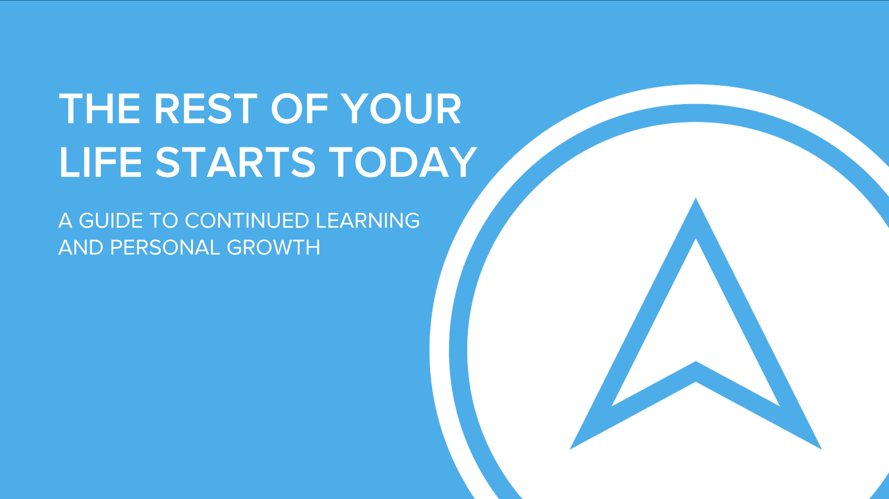

Today I have the honor of representing [Tech Elevator](http://www.techelevator.com) and presenting at the very 1st [getWITit conference in Cleveland](https://getwitit.org/agenda-cle/). This conference has been a huge success in Columbus and it is just getting started in Cleveland. 

When I first started my new position at Tech Elevator I was approached about speaking at this conference. I jumped all over this opportunity to represent us at this inaugural conference. 

When we started working on an idea for the presentation I wasn't really sure what we were going to do. A coworker suggested that I talk about something I am passionate about, learning. I thought it was a great idea and ran with it. 

## Presentation Details

The title of my presentation is "The rest of your life starts today. A guide to continued learning and personal growth."

This is the first time I have ever given a presentation on something that wasn't code related. I mean I found a way to work in some code related slides but that isn't the theme of the presentation.

This presentation is about something I love, learning new skills. It also comes at a great time in my life. I have a newborn at home so time comes at a premium these days. In this presentation I share some of my best tips on how to learn a new skill. After 20 years of "loving to learn" I believe that I have a lot to share around this subject. 

### Slide Deck

I had a lot of fun putting this slide deck together. While it isn't perfect and there are some slides I wish weren't as boring I think for the most part I am happy. They are fun slides and my hope is they will keep the audience engaged. Did I mention there were 52 of them? 

[Cleveland Women in Tech Conference](./Cleveland-Women-in-Tech-Conference.pdf)

### Resources

Throughout the presentation, I mentioned a number of resources. I wanted this to be a place where I can mention all of those resources so here they are. 

**Books**

*   [Outliers: The Story of success](https://amzn.to/2OqS87U)
*   [The first 20 hours. How to learn anything fast.](https://amzn.to/2FoMx2J)
*   [Your best year ever: A 5-stop plan for achieving your most important goals](https://amzn.to/2OnA7at)

**Tools**

*   [Asana](https://asana.com/)
*   [Trello](https://trello.com/)
*   [Evernote](https://evernote.com/)
*   [Visual Studio Code](https://code.visualstudio.com/)
*   [Google Chrome](https://www.google.com/chrome/)

**Websites**

*   [Michael Hyatt](https://michaelhyatt.com)
*   [Tech Elevator](https://www.techelevator.com/)
*   [The Real Dan Vega](https://therealdanvega.com)
*   [Toys for Shots](http://www.toysforshots.com)
*   [Audible](https://www.audible.com)

### Conclusion

I really wanted to thank the conference organizers for allowing me to speak. I also want to thank everyone who came out to my presentation. I know my coworkers will be in full force so I also want to thank them for supporting me. If you're interested in having me give this presentation at your next conference or meetup, [contact me](https://therealdanvega.com/contact).