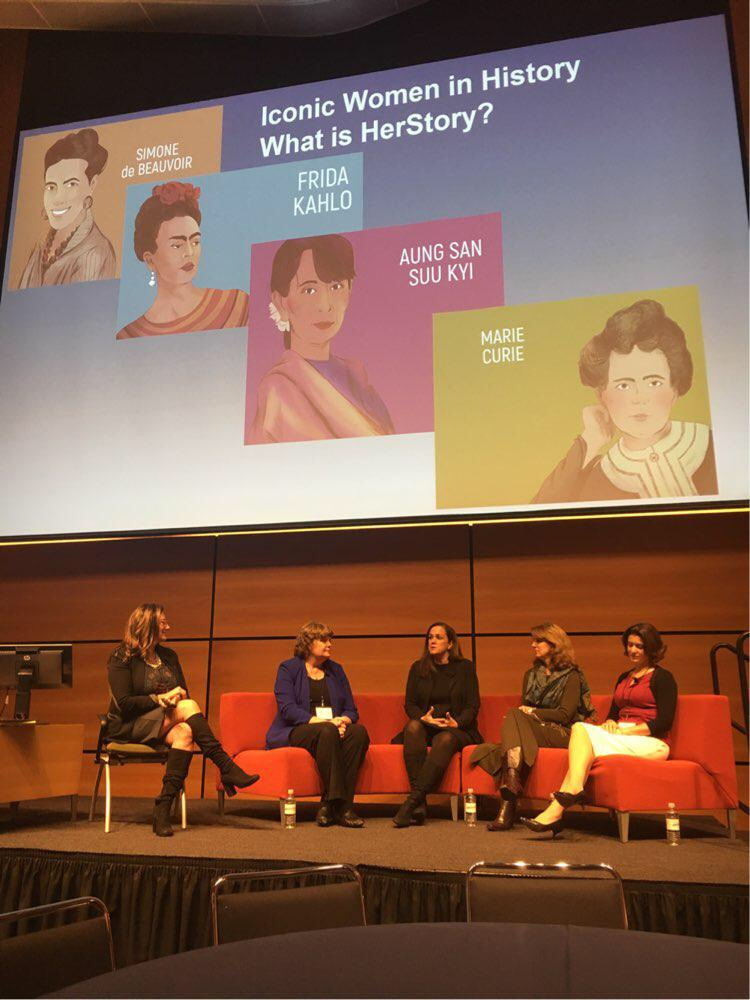
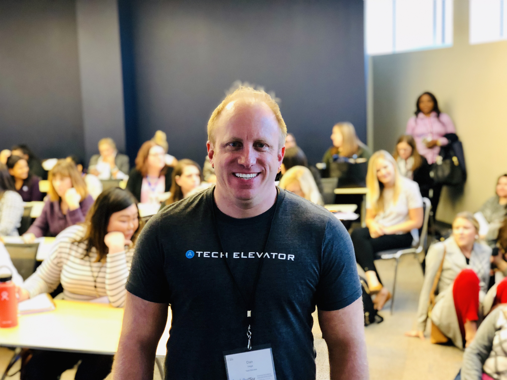
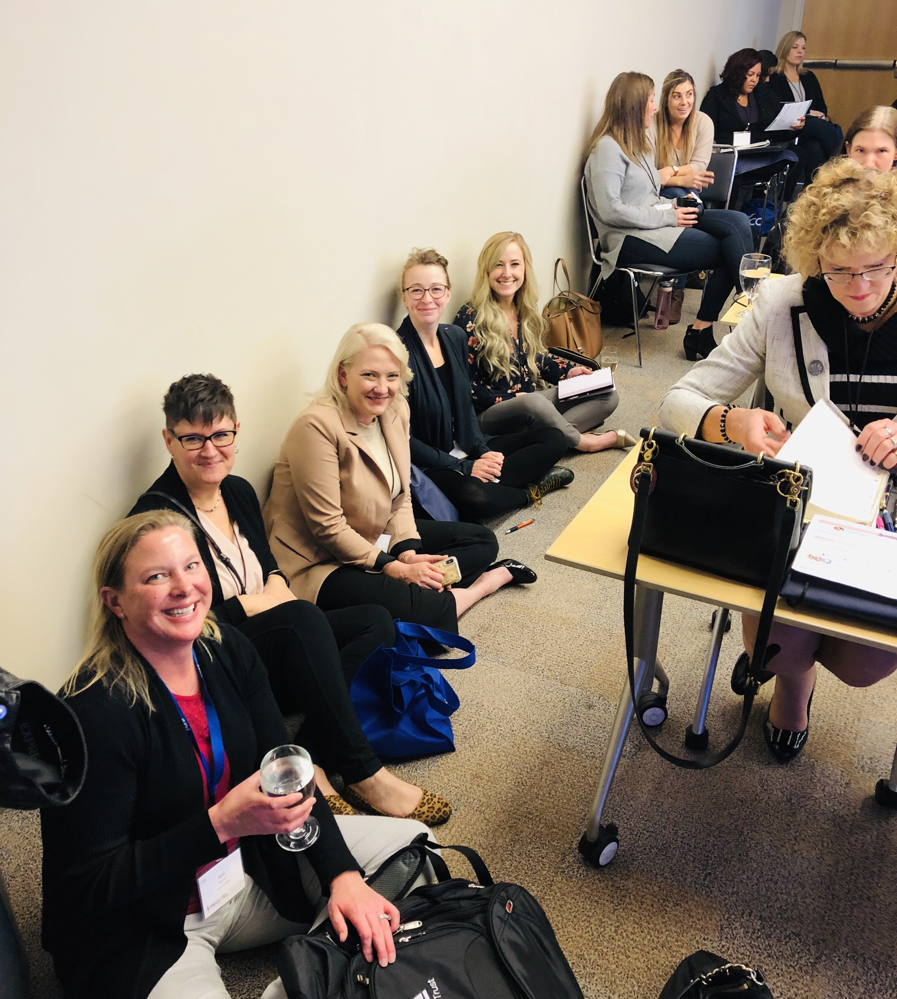
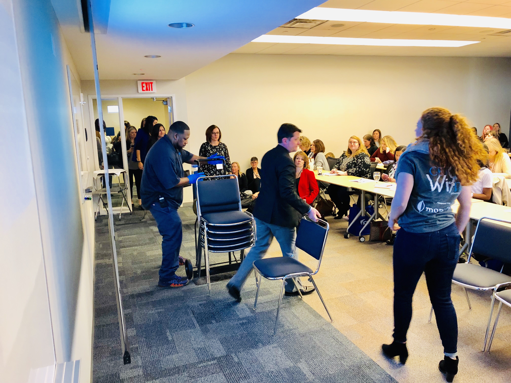
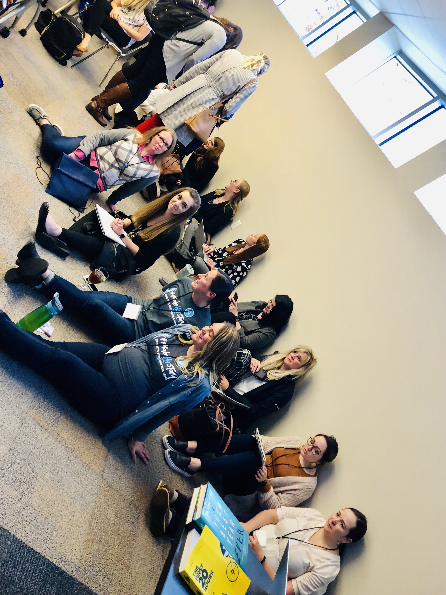
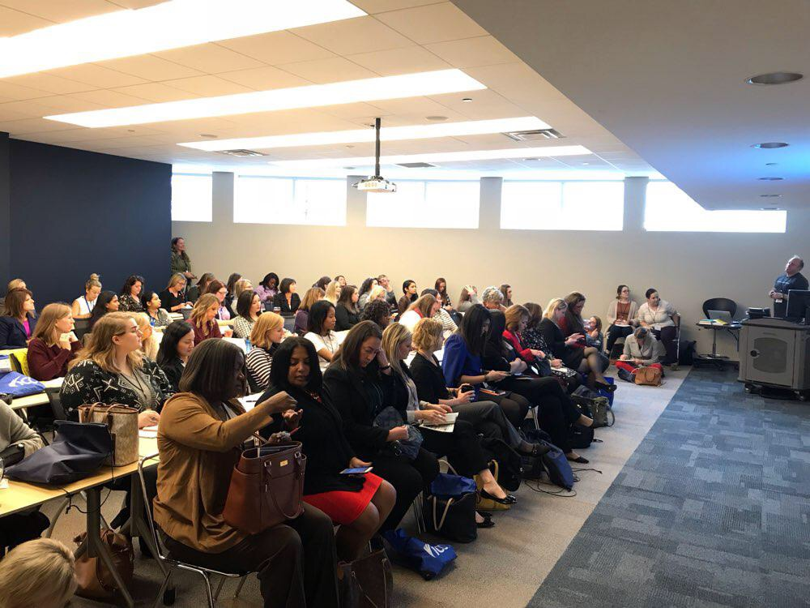
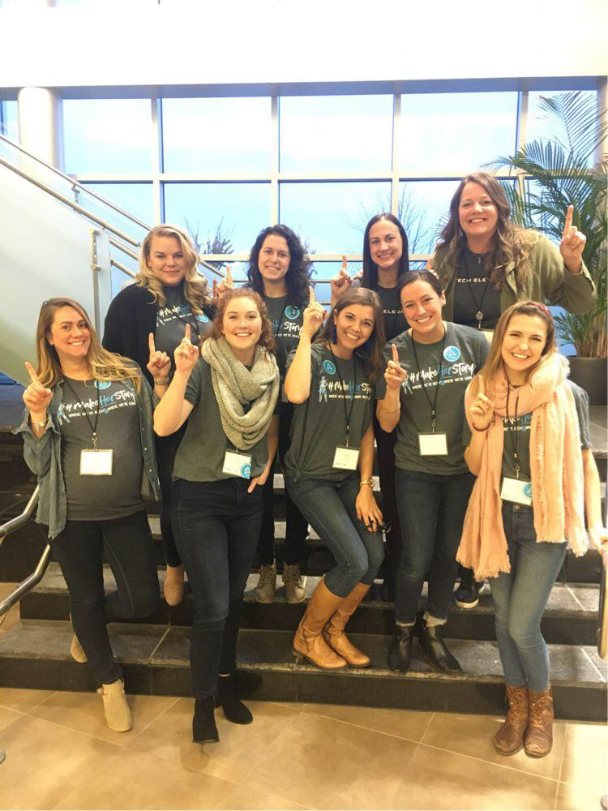

This is going to be just a quick recap of the inaugural [Cleveland Women in Tech Conference](https://getwitit.org/agenda-cle/). I think I will have a little bit of a unique perspective to share on this as I am a presenter at this conference and one of a handful of men in attendance. 

## Opening Keynote  

The conference was held at Corporate College in Warrensville Heights and last I heard there were about 230+ attendees. The conference in Columbus doubled in year 2 and I really hope we see the same in Cleveland next year. The title of the keynote was "Making HERstory stick" and I thought it was an amazing panel discussion with some CIOs from the Cleveland area, each who had some unique perspectives on each of the questions. 

> Various industry leading trailblazers from prominent organizations all speak about their journey to leadership and their views on developing and nurturing a welcoming supportive culture of diversity. Discussion will include how innovation in technology changed their organization, delivery to the business and improved results.
> 
> Making HERstory stick

The panel was made up of:  

*   Sandy Rapp - VP & CIO, The Timken Company
*   Tracey Petkovic - CIO, Westfield Insurance
*   Jane Alexander - CIO, The Cleveland Museum of Art
*   Lisa Ward - VP R&D and Strategy, STERIS Corporation

### CIO Panel

I wish I would have had my laptop in front of me to take some notes but I didn't. There were some really great questions asked and some excellent responses.

One thing that really stood out to me that everyone in tech has an obligation to take the businesses requirements and then return to them a solution. You shouldn't be taking solution requests from the business and I agree with this 1000%.

## Sessions I attended

I'll be honest and say it was pretty tough being one of only a few guys sitting in on each of these sessions today. It's that perspective that gave me a greater appreciation for the women who make it out to these conferences who are mostly filled with men. Not that I didn't already appreciate you but I think I will make a greater effort next time I see someone in that position to make them feel more welcome.

### The Blockchain Disruption - Lisa Turner

This was a good introduction to Blockchain and cryptocurrency. This is another one of those technologies on my list that I am interested in but at the same time not sure why I am interested in it. I get that the idea of decentralized networks are important for privacy.

What I don't get is where all of this currency actually comes from. I mean I understand the role of miners but It still makes not sense to me how we can just invent currency. As much as we hate the big bad banks I at least know that my money is backed by the federal reserve. 

I did find a stand at the conference for an upcoming conference in [Cleveland put on by Blockland](https://blocklandcleveland.com/solutions). I don't know if I can make it to this but this seems like a really good conference that I would love to attend. 

### Imposter Syndrome and How mentoring helped me combat it - Joanna Hughes

Joanna is a front-end developer for Vitamix and started the presentation off detailing what Imposter Syndrome is. She started out describing how this affects junior developers and in particular females. 

While both of these are true I want to point out that 20 years into my career I still feel like an imposter at times. I didn't go to some fancy school and I haven't worked for any of the big tech companies that only hire the best of the best. I often get the feeling of who am I and why should anyone listen to me. You just need to keep reassuring yourself that you know what you're doing and to move forward.

She went into a conversation about how mentoring other developers really helped her combat Imposter Syndrome. When you start to see that other developers face the same problems as you do it really helps take down a wall. I thought Joanna did a great job and couldn't believe that it was her first conference talk. You certainly couldn't tell! 

## My Presentation

My presentation was titled "The rest of your life starts today. A guide to continued learning and personal growth." and I had the session right after lunch. Now, being a conference attendee pro, I know the sessions right after lunch are tough to stay awake in so I was going to need to be on my game today. 

While I was setting up my presentation the room started to fill up quickly. It filled up so much that everyone started lining the walls and sitting on the floor. Luckily the event staff was on it and wheeled in a ton of chairs. Thanks to everyone for making a guy feel special. 

*   
    
*   
    
*   
    
*   
    
*   
    

I thought my presentation went really well. I practiced enough to where I knew what I was going to talk about in each slide without it feeling rehearsed. I had some great pictures of my daughter in there so even if it wasn't going well I could always fall back on the cute baby.

I thought it was a good pace and my hope is that everyone learned something new yesterday. Thanks again to everyone who attended the presentation, asked questions and laughed at my jokes. If you want to grab the slide deck or the resources I discussed you can [get them here](https://therealdanvega.com/blog/2018/11/05/cleveland-women-in-tech-presentation).

### Tech Elevator

A special thanks to my Tech Elevator family for not only helping me with the presentation but also supporting it. They were all there bright and early to volunteer for the conference. You ladies rock! 

## Finding Mentors

I got an interesting question after the presentation. The question is where did my mentors come from and where can we find our mentors at. I feel like I did an ok job answering this in person but there is so much more I want to say on the subject. 

### Mentor

I am going to try and put together a whole post on this but here is the short answer. The best place to find mentors are in the places where your types of people are. If you're a junior developer and work for a bigger company with lots of developers, this is a great place to start. If you work for a smaller company try to attend local meetup groups where like minded developers might be. 

Another great approach to this is to get involved in an online community. If you are really into the VueJS framework for instance, be where other VueJS developers are. Try getting involved in discussions in the places where they hang out, comment on blog articles and if you can try and contribute back to the community. I have made some amazing friends and developers I look up to just by being involved in a community and attending meetups & conferences. 

## Conclusion

I had such an amazing time at this conference. Weather I'm asked back next year or not my hope is that this conference really grows. I think it's a great place for women in tech to have their voices heard and inspire the next generation of movers and shakers. Round of applause Cleveland, you did really well yesterday :)