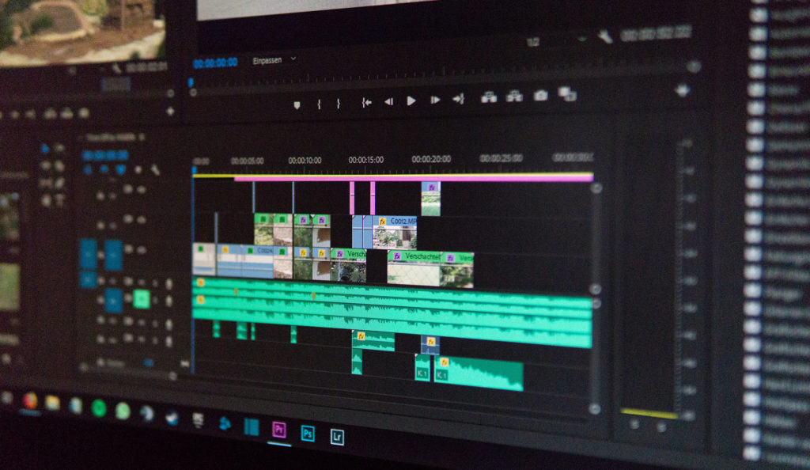

I am so excited to announce that [my new course is live](https://www.udemy.com/spring-boot-2/?couponCode=TRDV_BLOG_10)! This course was a long time in the making and I am just so thrilled that I get to share it with all of you because I believe it is my best one yet!

## What's Included in the course?

The biggest feedback I received from you was that you wanted a more project focused course instead of some I'm examples. In this course, we are going to build a real application together from start to finish. We are going to use the latest technologies to build out our application including:

*   Spring Framework 5
*   Spring Boot 2
*   Spring Data JPA
*   Spring Security 
*   So Much More

This course is packed with over 10 hours of content and I really hope you enjoy it. I created a short trailer to give you a better idea of what to expect. 

https://www.youtube.com/watch?v=cz\_7KhbfaNE

## The Road to this course launch

If you had a chance to read my [content announcements](https://therealdanvega.com/blog/2018/09/24/content-announcements) in September I gave you a pretty good update as to what has been going on in my life. Trying to find dedicated time to work on this course is probably the biggest reason for the delay of this course. I also wanted to make sure that it wasn't rushed and that I was able to produce the course that you asked for.

I can also tell you that I learned some valuable lesson producing this course. I am in the process of trying to gather my thoughts and put something out there that might help other developers who want to create their own courses. I might not be the best course creator on the planet but I have definitely learned a few things and can hopefully show you what not to do. 

### Video Editing

Launching a new course can be extremely gratifying and very stressful at the same time. I don't have this feeling when I write a new blog post or launch a new video on YouTube and it's probably due to the exchange of money. Even under $10 for 10 hours of content, I still feel a sense of Imposter Syndrome. Who am I to ask for money in exchange for knowledge? What if everyone hates my course? What if they don't learn anything?  These are all very real feelings that I continue to battle. Thank you to all of you who continue to support my efforts, I appreciate you more than you will ever know. 

## Conclusion

I am really happy to finally get this course into your hands. This is not a final product and I will be working on a few things to improve this course over the next month. If you have feedback (good or bad) please let me hear it so I can make this the best Spring Boot 2 course around. 

[Get this course for $9.99](https://www.udemy.com/spring-boot-2/?couponCode=TRDV_BLOG_10)