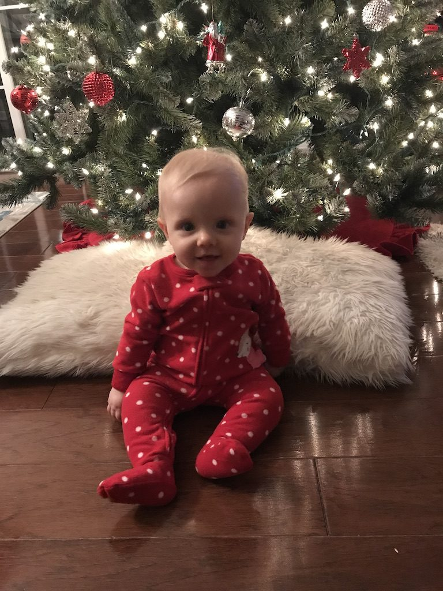
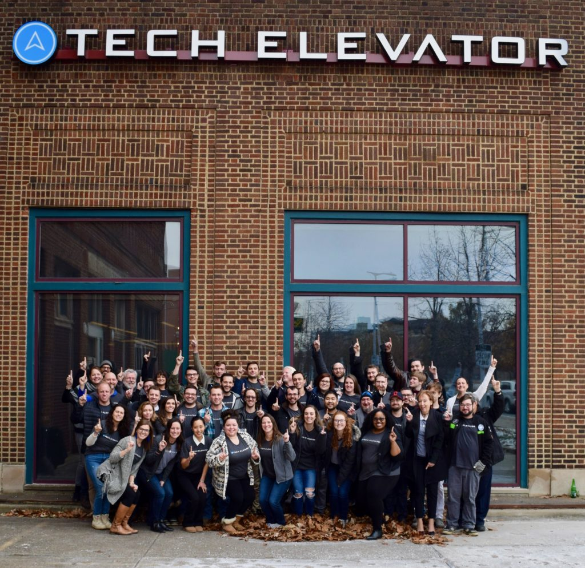
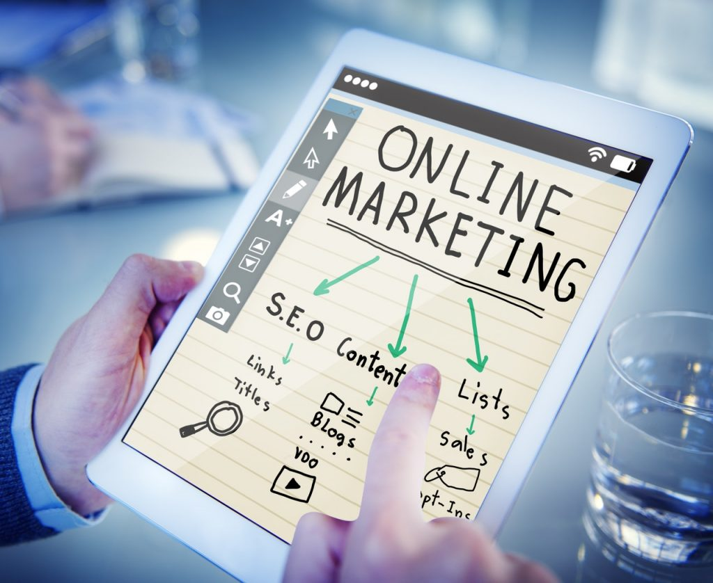
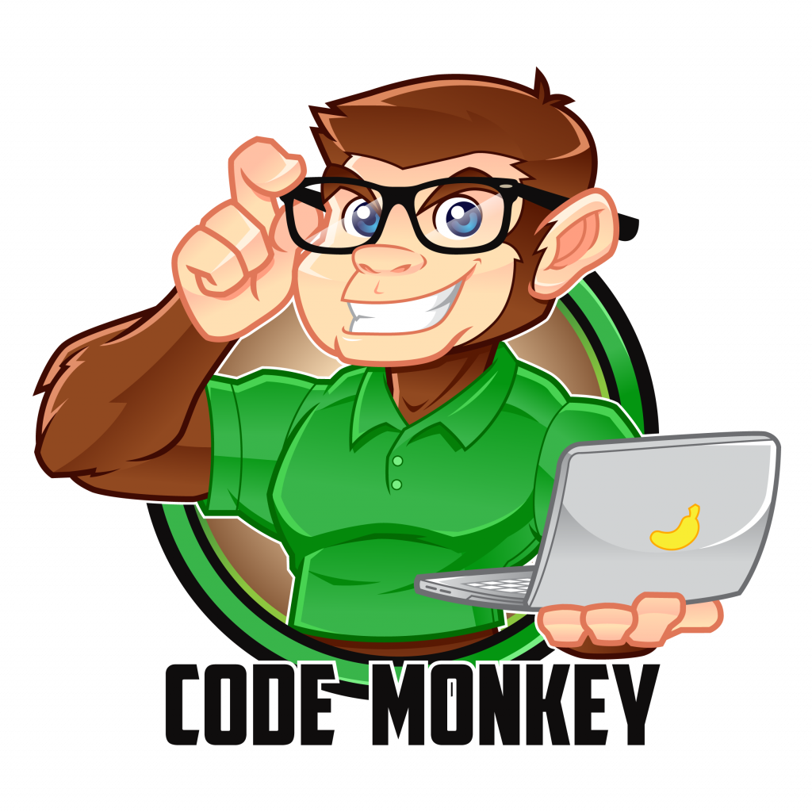
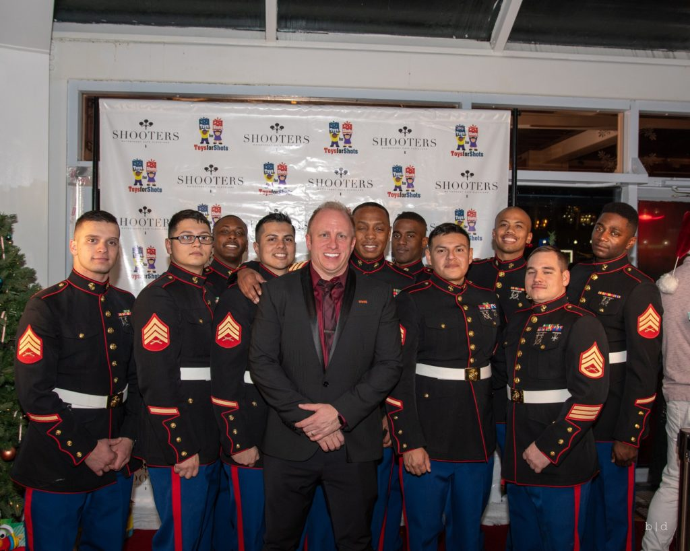

It is that time again friends. Time to find out what goals I fell short of and which ones I made good on. This is my 2018 year in review and in a couple weeks I will posting my goals for 2019.

This year was life-changing as my wife and I welcomed our first child, Isabella Margaret Vega into the world. I never knew I could love anything as much as I love this little girl and she was completely changed my life, for the better.

I think I could pretty much end the post there. I knew having a child would be life-changing but I didn't understand just how much life would change. I use to have so much time to work on a project or learning a new skill but that for the most part has gone out the window.

I also [joined Tech Elevator](https://therealdanvega.com/blog/2018/09/07/i-am-joining-tech-elevator) this year and looking back on it that was certainly the right decision for me. I love the people that I work with, the mission that we have and seeing our students transform their lives in just 14 weeks.

I am going to revisit each of the goals I had last year and let you know whether I completed them or not. If you didn't already guess I fell short on a lot of them but I am glad I did because some of them are no longer goals I want to pursue.

## Personal Goals

For the most part, I met my personal goals. I didn't drink a single ounce of soda in 2108 and I am pretty proud of that one. The only one I didn't complete here was running 20 miles per week. That was probably pretty ambitious considereing I spend 3-4 days a week in the gym.

*   Exercise 3-5x per week
*   Run 20 miles per week (When the weather breaks here in Ohio)
*   No more soda
*   Morning routine
    *   Meditate 5 - 10 minutes
    *   Journal (Productivity and Focus) 5 min
    *   Read for 30 min
    *   Move for 5 minutes
*   Complete my home office
*   Complete the nursery (Baby on the way) 
*   Spend more time with my family

## Education Goals

These were a list of things that I wanted to learn more about. To be fair this list is very long but these are what I narrowed it down to in 2018 and looking back on it I made some bad choices here.

### Building an iOS app

I am not sure why but I have always wanted to build a mobile application and more specifically one for iOS. I have done some coding challenges in Swift and I love the programming language. I haven't however had a good idea for a practical application that I want to build. Until I do so I think this is going to sit on the shelf.

### Cryptocurrency & Blockchain

In one of my best moves of 2018 I didn't purchase any bitcoin which turned out to be a huge win. With that said I am still a big believer in the blockchain and want to learn more. Just like the iOS skill though I haven't found a practical need to learn anything in this space so for now it's probably going to be down on my list.

### Alexa Skills

1 year later and I love the 2 Echo's that we have in our house. I mainly use them to play music, books or podcasts in different rooms but there are also a few skills that I am using. This is another instance of me wanting to learn something just to learn something with no practical reason to learn it. This will go on the backlog but stay pretty hi.

### Marketing

This is something I did spend some time learning at the beginning of the year. I learned a few things about ads, analytics and using different sales funnels. As my time to work on this sort of thing became less and less I started to focus on creating new content and not worrying about the marketing sides of things. I wouldn't call this one a pass but I also wouldn't say its a failure.

### Augmented Reality

This is one of those technologies that I think is going to continue to get more interesting. I didn't do anything this year in this this space and sadly this is going to go on the backburner.

## Books

I set a pretty lofty goal of reading 30 books and I missed that by a lot. I will blame missing this goal on the baby but I probably could have found a way to read more than 5 books this year.

## Course Development

My goal was to release 4 new courses this year and that didn't happen. I did, however, release one new course, [Getting Started with Spring Boot 2.](https://therealdanvega.com/blog/2018/11/20/new-course-getting-started-with-spring-boot-2) This was a course I spent a lot of time working on and it ended up being a course with over 13 hours of content so you could say I created 4 courses and wrapped them up into 1. My main focus with my time is going to be spent creating new content but going into 2019 I need to have a better approach. Creating 1 course a year is not going to do much for me.

### Video Production

One of my biggest goals for the year was to get better at video production. I am going to call this goal completed. Now, I am no rockstar but I got much better this year at using Adobe Premiere Pro & After Effects. [Here is the trailer](https://www.youtube.com/watch?v=cz_7KhbfaNE&t=1s) I created for my Spring Boot 2 course.

## Podcasting

I love podcasts. They are one of the tools that I use to learn and advance my skill set. It is that love of learning that has always made me curious about creating a podcast. I don't know what my podcast would be about except that it would be somewhere in the Software Development space. I had no time to pursue this goal this year but it's going towards the top of the list for something I want to explore further in 2019.

## Business Ventures

Last year I announced that I started a new company called CodeMonkey, LLC. This was mainly to organize what I was doing with content creation. I did have some ideas around this but the theme of this year continues and I didn't get to any of them. I did reach to the person that owns Code Monkey dot com and he said he would sell me the domain for 100k so he could buy a Porsche. So there's that.

### Toys for Shots 2018

This was another successful year that took up a lot of my free time after September. We ended up having a little over 500 people attend the event and more importantly, we raised 20+ boxes of toys. This provided almost $15,000 worth of toys for children right here in Northeast Ohio. What we accompolish in 1 night is so amazing and I am so thankful for everyone involved.

  

## Conclusion

From a goal setting standpoint this year was a pretty big failure. I think it's more of a failure on my part on being a little bit smarter about the goals that I set. With that I can't wait to share with you what my plans are for 2019. From a personal standpoint I could care less about failing on some of these goals because I have spent the bulk of my year raising the most amazing daughter ever.