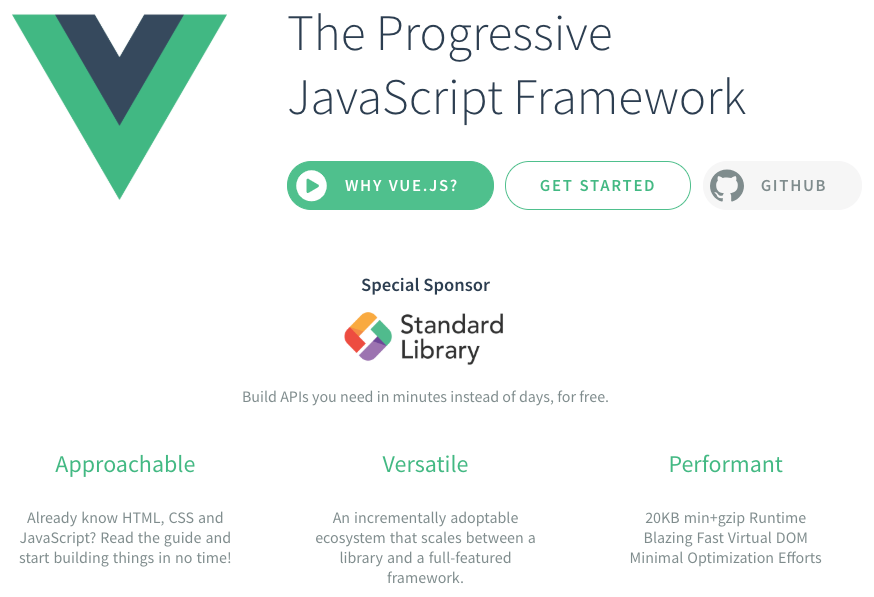
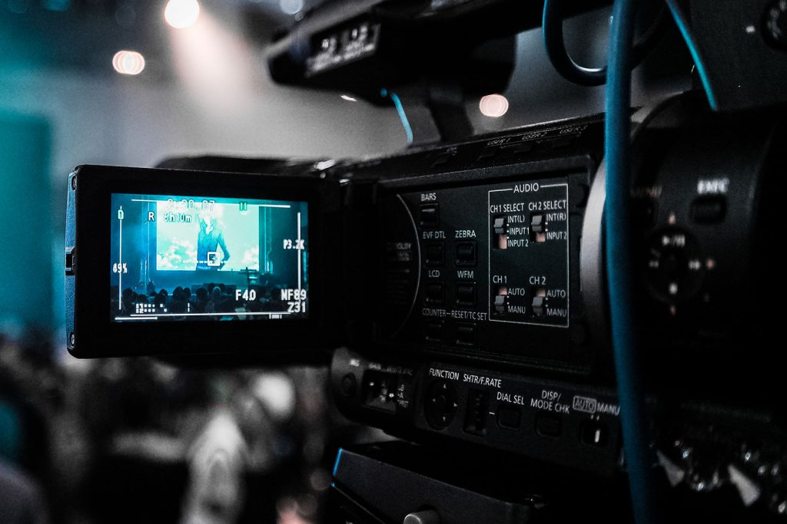
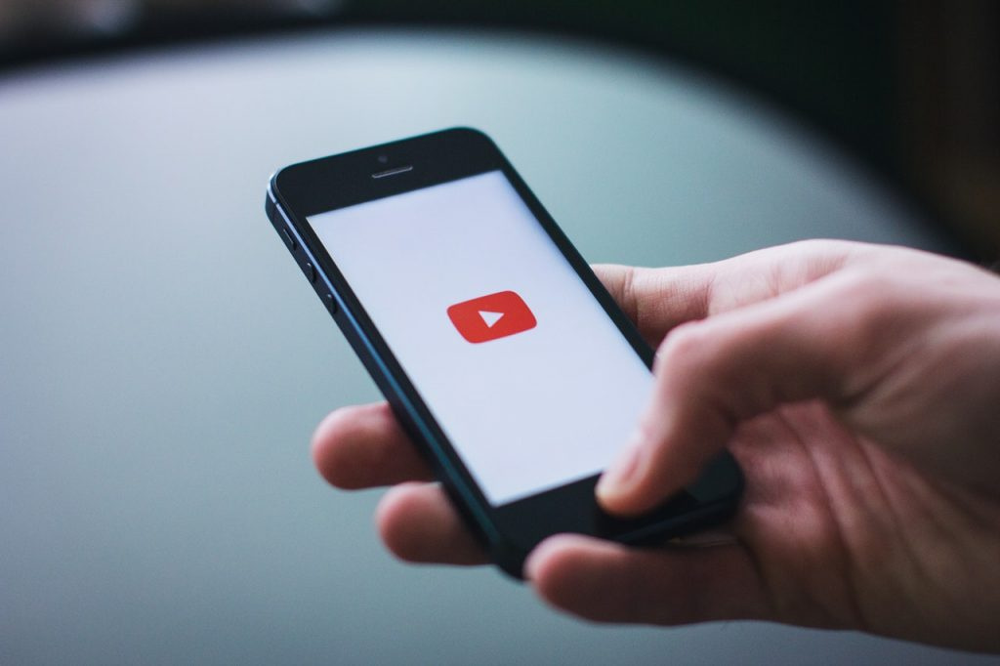

It is hard to believe that another year has come and gone. After I spent some time last week [reflecting on 2018](https://therealdanvega.com/blog/2018/12/24/my-2018-year-in-review) it's time we look ahead to the new year and set some new goals.

If you read my last post you know that my free time to work on side projects and learn new things is minimal these days. With that in mind, my goals have to be smart and planned out this year. These are my goals for 2019 in no specific order.

## Personal Goals

The best thing I did in 2018 was giving up soda. I was drinking too much Diet Coke in 2017 and I decided to completely give it up this. I am taking this into 2019 and absolutely no soda is for the entire year. At this point health is very important to me now and going forward so its going to be the majority of my personal goals.

*   No Diet Coke or soda of any kind
*   Exercise 3-5x a week.
    *   Minimum of 12x per month
    *   Run 10 miles a week when possible (I live in Cleveland)
*   Be a good person & be a great role model for my daughter.
*   Get back to journaling every morning.

### Household Projects

There are a lot of projects around the house that need to get done but these are the projects that need my attention in 2019.

*   Baby proof the entire house
*   New carpet upstairs and downstairs
*   New bathtub in the main bathroom.
*   Update the garage, add storage and update gym.
*   Continue with updates to the office

## Learning Goals

I say this every year but I am a serial learner. I LOVE to learn new things and then tell all of you about what I just learned. WIth that most of my goals this year revolve around investing in myself and continuing to learn.

### Books

Last year I had a goal of 30 books to read and while I got out to a hot start it came to a complete stop once my daughter was born. This year I am going to dial back the goal to an easy 8 books. I already have 4 that I want to read to start the year off so I will start with those and move forward.

### Podcasts

I absolutely love listening to podcasts on my way to work, at work, going home from work and If I can get back to the gym with a treadmill I will use it there as well. There is just something about being entertained and learning something new at the same time. With that these are some of my favorite podcasts but certainly not my entire list. If you have any suggestions for podcasts I would love to hear them below.

*   [Indie Hackers](https://www.indiehackers.com/)
*   [Syntax](https://syntax.fm/)
*   [Hansel Minutes](https://www.hanselminutes.com/)
*   [Software Engineering Dialy](https://softwareengineeringdaily.com/)
*   [The Changelog](https://changelog.com/podcast)
*   [JS Party](https://changelog.com/jsparty)
*   [Full Stack Radio](http://www.fullstackradio.com/)
*   [The Official Vue News](https://news.vuejs.org/)
*   [Views on Vue](https://devchat.tv/views-on-vue/)
*   [Code Newbie](https://www.codenewbie.org/podcast)
*   [The Tech Guy with Leo Laporte](https://techguylabs.com/)
*   [The Tim Ferris Show](https://tim.blog/podcast/)

### Things to Learn

As always my "stuff to learn" list is a mile long and instead of getting crazy ambitious here I am going to narrow it down to 3 things I want to learn in 2019.

#### VueJS

I already have a solid foundation in Vue but I will be doubling down on Vue in 2019. We are teaching Vue this year at work to our [bootcamp students](https://www.techelevator.com/) and I am running a [local meetup group called VueCLE](https://www.meetup.com/vuecle/). This will involve diving deep into everything Vue related and becoming an expert at things I haven't learned yet like Nuxt.js.

I don't think I have ever been as excited about anything as a programmer as I am about where JavaScript is heading and a framework like Vue.

#### Live Video

My life's work is centered around delivering content. Live video is becoming more and more popular and the tools available to make this easy to use and available to everyone is just getting better and better. I want to start creating some live streams on platforms like YouTube, Facebook & Twitch. There is some awesome software for helping you do this on the Mac called [ecamm live](https://www.ecamm.com/mac/ecammlive/).

SAMSUNG CSC

I need to learn how to use that software, the different platforms and define what my live sessions will look like and how often to go live. This is going to be a fun process so look for more of this in 2019.

#### The Cloud

I realize this last one is kind of vague but it needs to be. I don't know a whole lot about DevOps or the cloud so I don't know what I need to know. What I do know is that I like to build things and when I build things I need a way to get them out to the public for everyone to see. I am fascinated with all things AWS and just the amount of services they provide.

I was recently introduced to [A Cloud Guru](http://www.acloud.guru) and I will be going through some of their courses to get caught up on all things "cloud". I was also really inspired by [a talk given from the founder and CEO of A Cloud Guru](https://acloud.guru/series/serverlessconf-sf-2018/view/6c7c00f8-3183-db34-83fc-f8931e070da5) on how they built their entire platform on serverless.

## Proffessional Goals

At Tech Elevator we have some exciting things happening this year that I can't talk about just yet so I am going to leave you in suspense but I hope to talk more about these as the year goes on.

### Content Creation

My main focus at my day job and outside of work is content creation. Outside of work I really need to define what that looks like. I have a blog, YouTube Channel, Courses and I feel like I am all over the place with this. I'm not quite sure blogging makes much sense for me anymore except maybe to talk about a video I posted or a course I created. I just don't know, I have a lot of questions here that I need to answer. When I figure out what this looks like I will share it with you.

### Side Hustle

Last year I started a company called [CodeMonkey LLC](https://codemonkeyu.com/) just so I could separate what I was making teaching online from my personal income. I haven't done anything with this yet and I am not sure that I will. I did reach out the person who owns the dot com domain and he offered to sell it to me for 100k. So I guess you could say I got that going for me.

## Conclusion

I just want to wish all of you a happy New Year! I wish all of you and your families continued health and happiness. 2019 looks to be an exciting year for me personally and professionally and I am looking forward to it.