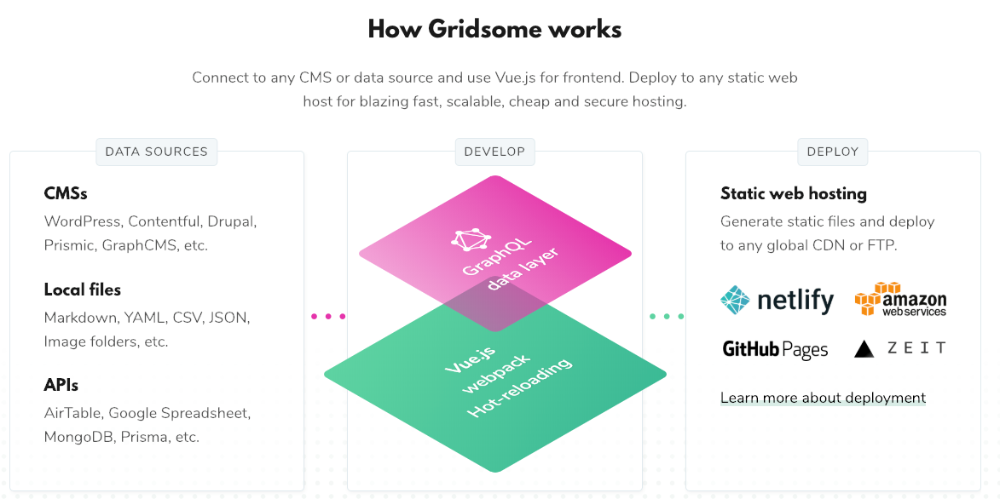

I would like to welcome you to a new side project of mine. I thought I would take this opportunity to tell you about the motivation behind creating this website and the technologies that power it.

_TLDR; I want to move my [blog](https://www.therealdanvega.com) from WordPress to Gridsome._

## Blogging

While writing this article I did a bit of digging through my archives and found out that my [first blog post](https://therealdanvega.com/blog/2005/10/07/why-you-should-now-about-sifr) was written October 7, 2005. That means I will be celebrating 14 years of blogging later this year which on one hand is pretty amazing and on the other makes me feel really old. 

### Why I started blogging

I started blogging because I thought it would be a great chance for me to learn about how open source software worked. At the time I was a ColdFusion developer and [BlogCFC](https://github.com/teamcfadvance/BlogCFC5) was a popular open source blogging platform written by [Raymond Camden](https://www.raymondcamden.com/). I learned so much by looking at how someone else wrote code and structured a project and I will always be thankful for that experience.

Another reason I started blogging was to get involved in the community. There were a lot of really great developers that would often blog about what they working on and I really looked up to them. I wanted to be one of the cool kids and tell others what I was working on.

Finally, I thought this was a great chance for me to help others. In the early days, I often found myself struggling with projects that I was working on and thought to myself someone else must be experiencing the same issues as me. This was a great opportunity for me to take what I was learning and share it with other developers so that they didn't make the same mistakes that I did.

### Moving to WordPress

In 2014 I decided to [move my blog](https://therealdanvega.com/blog/2014/11/25/welcome-new-home) over to WordPress. It had been a while since I was using ColdFusion and I just didn't want to maintain it any longer. I also thought that this was a good chance to give the blog a fresh look. The migration to WordPress went pretty smooth thanks in part to open source. There were some migration scripts floating around that really helped me through that process. 

While the WordPress platform has served me well over the years I have had my problems with it. First I originally was running this site on a Digital Ocean droplet for $5 a month which was great because at the time it wasn't really generating any revenue. 

I quickly found out that WordPress doesn't perform well on that plan because it was a huge resource hog. It would go down often and require me to login and restart the server. After upgrading to the $20/month plan a lot of those problems went away. 

There was still the problem of me having to manage a server. I am not a server admin and really didn't enjoy everything that went along with that. I ended up getting really lucky and finding someone on Upwork to manage the server. His name is Justin and he was able to fix my server when it when down as well as make sure the server was up to date with security patches. He runs a hosting company called [Big Scoots](https://bigscoots.com/) which is now where my website is hosted. I can't recommend him or his company enough if you're looking for a WordPress host. I have had 0 problems since moving to them.

The other main issue I have with WordPress is that I am not a PHP developer nor do I care to be. I have been able to get in there and mess around with the layouts and templates but that is about as far as I have gone. I also don't have a local WordPress installation so working on theme updates isn't easy for me.

While I have had some issues I do think WordPress is an amazing product. It's just no longer the product for me.

### New Solution Requirements

Now that you know my story and where I have been we can talk about what I am looking for. I have become a huge fan of the **JAMStack** which stands for **J**avaScript + **A**PI + **M**arkup. The idea behind this is pretty simple, serve up a static site for everything that you can and then reach out to an API for any data or functionality that your site needs. This is a big shift from the traditional server-side monolithic applications of the past and one I am very excited about. 

Static Site Generators (SSGs) like [Gatsby](https://www.gatsbyjs.org/) have become really popular and they have their advantages. First, we get to serve a static site to our users which means it is going to be extremely fast. My visitors are coming to my site to check out content, not some loading bar. The other big advantage is the options we have when it comes to hosting our static sites. If you want to host it on something like [Amazon Web Services (AWS)](https://aws.amazon.com/free/free-tier/) it can be very inexpensive. There is also one of my favorite services around [Netlify](https://www.netlify.com/), which is **FREE** for personal projects. 

Another advantage of this approach is that I am not tied to some server-side language. I get to build my layouts and views in good old HTML/CSS/JavaScript. Another feature I am looking for is the ability to write all of my blog posts in Markdown. I write a ton of documentation for work and in my personal projects so I have become very comfortable writing in this format. 

I had a bunch of options when building out this new site. I can't wait to tell you about what I found but for now, I am going to just talk about the one ended up using. 

## Gridsome

I mentioned Gatsby earlier and while this was definitely a possible solution for me I wanted something that was Vue based. I really love Vue, the ecosystem and the community so I wanted a solution that would keep me there. After looking around and creating a few projects i decided on [Gridsome](https://gridsome.org/).

### What is Gridsome

Gridsome is a static site generator similar to Gatsby (though still new so not as feature rich) for the [Vue](https://vuejs.org/) framework. Gridsome has a ton of features but here are just a few. What this means for me is I get to write Vue applications that can then generate a static website. Now I know what you're thinking, Vue can do that on its own and you're right. Let's take a look at a few more features of Gridsome.

### How Gridsome Works

If you were just going to have a plain static site you wouldn't really need something like Gridsome. Where Gridsome really shines is its ability to use multiple data source and combine them into a single GraphQL data layer. This means that you can work with local files like Markdown as well headless CMS's like WordPress, Contentful and so on. If you're new to GraphQL don't worry I was too and it's pretty easy to pickup.



### Markdown

As I mentioned one of those data sources is Markdown which made me very happy because I can start writing in a familiar environment. I am going to go over this in detail in another post but the quick version is that this was really easy to set up. You start with some configuration to use the plugin `@gridsome/source-filesystem`

``` javascript
module.exports = {
  plugins: [
    {
      use: '@gridsome/source-filesystem',
      options: {
        path: 'blog/**/*.md',
        typeName: 'Post',
        route: '/blog/:slug',
        resolveAbsolutePaths: true,
        remark: {
          autolinkClassName: 'fas fa-hashtag',
          externalLinksTarget: '_blank',
          externalLinksRel: ['nofollow', 'noopener', 'noreferrer'],
          plugins: [
            [ 'gridsome-plugin-remark-shiki', { theme: 'nord' } ]
          ]
        }
      }
    }
  ]
  
}
```

In that plugin, you configure some options like what the path will be and the component that will handle the type. I'm also using the [Gridsome Transformer Remark](https://www.npmjs.com/package/@gridsome/transformer-remark) plugin which is the Markdown transformer for Gridsome. [Remark](https://github.com/remarkjs/remark) can include a number of options and plugins itself one of which is a syntax highlighter called [shiki](https://github.com/EldoranDev/gridsome-plugin-remark-shiki) which is what formatted the code that is right above this. 

### Gridsome is awesome

This was just the start of what Gridsome can do. I have so many things to share so I hope you will sign up for my newsletter or [follow me on Twitter](http://twitter.com/therealdanvega) and learn about all the cool things you can do in Gridsome and in Vue.

## Should I move my existing website?  

Now the real question and much harder than a simple yes or no. Should I move my existing website to Gridsome? I am really happy with this website and the workflow I have for adding new content to it.

Moving my close to 1000 blog posts is easier said than done. 1 question that comes into play is should I just get rid of all the posts that I don't think hold much weight anymore? This could slim down the migration process substantially. These are some of the concerns I have to look into before making my decision.

* Existing URLs must keep the same format /month/day/year/slug
* I have lots of images and should probably move those to something like S3
* I have photo galleries on posts, what to do with that.
* I need to make sure existing code blocks work with this new syntax highlighter.
* Should I use [Disqus](https://disqus.com/) comments (free vs paid) or roll my own with Firebase?
* I want to display tweets in a post.
* When I share a post on social media there are some meta tags to customize the display.
* SSL: I need to make sure the entire site runs on https.

## Conclusion

I still have some things to think about but I would love to hear your thoughts on this. If you have migrated from WordPress to Gridsome I would really love to hear what that process was like for you. If you're interested in hearing how I decided on Gridsome or how I created this site, stay tuned! In the meantime, you can check out the source for this site [here](https://github.com/cfaddict/danvega-me/).

Happy Coding!<br/>
Dan
