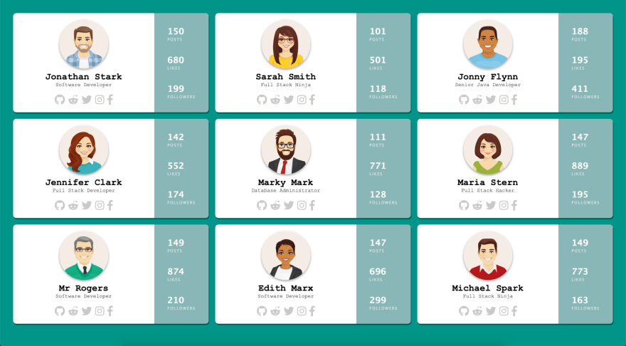

For the past few months, I have been writing a ton of documentation, tutorials, and exercises around VueJS and Vanilla JavaScript. Just for some context, I am Curriculum Developer at [Tech Elevator](https://www.techelevator.com/), a coding bootcamp that teaches students how to code in 14 weeks. With that in mind, all of the content is geared towards beginners but made for everyone. 

I was recently working some tutorials and exercises around The Fetch API and I wanted to put together a nice example of how to read some JSON data from a local file and then add it to a page. In a simple example I would just use a [createElement](https://developer.mozilla.org/en-US/docs/Web/API/Document/createElement) and [createTextNode](https://developer.mozilla.org/en-US/docs/Web/API/Document/createTextNode) and append the items to the DOM. 

In a more complex example where there is a lot more markup involved it can become very cumbersome to create elements, nodes as well as dealing with attributes and classes. In this instance, a great solution is [The Content Element Template](https://developer.mozilla.org/en-US/docs/Web/HTML/Element/template). I also realized that a lot of developers (beginning and vets) might not know what this is or why we would use it. 

In this article, I am going to take a look at the template tag in HTML & Vanilla JavaScript. When you know why this tag exists it might make more sense why its used in Vue Single File Components. 

## The Content Element Template

You can think of the template tag in HTML the same way you would think of any other template. A template is a mold or pattern that gives you a starting point to create something else from. The MDN docs define The HTML Content Template as:

>The HTML Content Template element is a mechanism for holding client-side content that is not to be rendered when a page is loaded but may subsequently be instantiated during runtime using JavaScript.
>
>Think of a template as a content fragment that is being stored for subsequent use in the document. While the parser does process the contents of the template element while loading the page, it does so only to ensure that those contents are valid; the element's contents are not rendered, however.

That sounds pretty straight forward but if it doesn't make total sense yet don't worry. We are going to take a look at a practical example that will hopefully clear everything up for us.

## HTML Content Template Demo

I put together that shows off how to use the template tag in Vanilla JavaScript. If you want to check out the source code for this demo you can find it on [Github](https://github.com/cfaddict/html-template-article). We are going to build a page that loads a list of user cards based on some JSON data and it will end up looking like this. 



### Markup

As I said before the goal of this project was to read in some user data from a JSON file and then write the user information to the page. This gets really cumbersome when you have to create elements one by one and add them to the page. 

A better way to approach this is to build out what the markup and CSS are going to look like and then wrap the markup in a template tag. The following HTML is what I ended up with. When I was done I just add a template tag around the markup and give it an id.

``` html
<template id="user-card-template">
<div class="user">
    <div class="profile">
        
        <h2></h2>
        <span class="title"></span>
        <div class="social">
            <a href="https://www.github.com" target="_blank"><i class="fab fa-github fa-2x" target="_blank"></i></a>
            <a href="https://www.reddit.com" target="_blank"><i class="fab fa-reddit-alien fa-2x"></i></a>
            <a href="https://www.twitter.com" target="_blank"><i class="fab fa-twitter fa-2x"></i></a>
            <a href="https://www.instagram.com" target="_blank"><i class="fab fa-instagram fa-2x"></i></a>
            <a href="http://www.facebook.com" target="_blank"><i class="fab fa-facebook-f fa-2x"></i></a>
        </div>
    </div>
    <div class="stats">
        <div class="posts">
            <h3></h3>
            <span>Posts</span>
        </div>
        <div class="likes">
            <h3></h3>
            <span>Likes</span>
        </div>
        <div class="followers">
            <h3></h3>
            <span>Followers</span>
        </div>
    </div>
</div>
</template>
```

### JavaScript

Now that I have my markup its time we take a look at the JavaScript. I have a JSON file called `users.json` that has an array of 9 users that look like this. 

``` javascript 
{ 
    "id": 1,
    "fullname": "Jonathan Stark",
    "title": "Software Developer",
    "avatar": "img/user_1.png",
    "social": {
        "github": "github_username",
        "reddit": "reddit_username",
        "twitter": "twitter_username",
        "instagram": "instagram_username",
        "facebook": "facebook_username"
    },
    "stats": {
        "posts": "150",
        "likes": "680",
        "followers": "199"
    }
}
```

The first step is to read the JSON in and to do so we will use the Fetch API. If you have used fetch before this is nothing new. 

``` javascript
fetch('users.json') 
.then((response) => {
  return response.json();
})
.then((users) => {
  // we have an array of users
})
.catch((err) => console.error(err));
```

Now that we have an array of users we can begin to work with our template. First, we need to check to see if the user's browser supports the HTML Content Template tag. As long as you're using a modern browser [it should support it](https://caniuse.com/#feat=template) but it is best practice to make this check.  


``` javascript
if('content' in document.createElement('template')) {

});
} else {
    console.error('Your browser does not support templates');
}
```

Now that we know the browser supports this feature we need to get a reference to the parent container that we will be appending each user card to and in this case it's the element with the id of users. We will then iterate over each element in our array.

``` javascript
if('content' in document.createElement('template')) {
    const container = document.getElementById('users');
    users.forEach((user) => {

    });
} else {
    console.error('Your browser does not support templates');
}
```

During each iteration of our user's array, we are going to create a copy (clone) of our template. The way that we do that is by getting a reference to the element, getting the content (what's inside the template tag) and then cloning it. We are passing true to the cloneNode method so that we use a deep clone and grab all of the children with it. 

```javascript
const tmpl = document.getElementById('user-card-template').content.cloneNode(true);
```

From there we can simply query the template for a specific element and set its content to the value we are reading in from the user array. In most cases, I am just setting the inner text of the element. Finally, we use the reference to our container element and append everything that was inside the template tag to our page.

``` javascript
fetch('users.json') 
.then((response) => {
  return response.json();
})
.then((users) => {
  if('content' in document.createElement('template')) {
    const container = document.getElementById('users');
    users.forEach((user) => {
      const tmpl = document.getElementById('user-card-template').content.cloneNode(true);
      tmpl.querySelector('h2').innerText = user.fullname;
      tmpl.querySelector('.title').innerText = user.title;
      tmpl.querySelector('img').setAttribute("src",user.avatar);
      tmpl.querySelector('.posts h3').innerText = user.stats.posts;
      tmpl.querySelector('.likes h3').innerText = user.stats.likes;
      tmpl.querySelector('.followers h3').innerText = user.stats.followers;
      container.appendChild(tmpl);
    });
  } else {
    console.error('Your browser does not support templates');
  }
})
.catch((err) => console.error(err));
```

### Conditionals

After writing this article my friend Todd asked me a really good question.

https://twitter.com/recursivecodes/status/1089184943673090048

What we have done here is cloned the markup that is inside of the template tag. Because this is normal markup we can do whatever we want with it. So let's say that some users have an account on all of the social networks and some don't. 

``` javascript
"social": {
  "github": "github_username",
  "reddit": "reddit_username",
  "twitter": "twitter_username",
  "instagram": "instagram_username",
  "facebook": "facebook_username"
}
```

``` javascript
"social": {
  "github": "github_username",
  "reddit": "reddit_username",
  "twitter": "twitter_username"
}
```

What we could do here is iterate over all the know social networks that we support and if the users.social object doesn't have that key then we will remove that element from the DOM. Again we are working with normal elements here so we can do things like set the visibility to hidden or remove them completely. In this case, we want to remove it because if just hide it then we will have this empty space in certain cases and that doesn't look good. 

```javascript
// this is a list of social networks we display under a users profile
const socialLinks = ['github','reddit','twitter','instagram','facebook']
// iterate over that list and check to see if they have an account on that network
socialLinks.forEach((social) => {
  // if they don't have a link in the JSON data hide that link & icon
  if(!user.social.hasOwnProperty(social)) {
    tmpl.querySelector(`.${social}`).remove();
  }
});
```

### HTML Template in Vanilla JavaScript Wrapup

And that is really all you need to create a template in markup, clone it and add data to it. I will mention this because it is important to know but if you take this approach and view source you will only see the template code. This means that if you have data that needs to be written to the page that needs to be search engine friendly this probably isn't a good solution.

## Template Tag in Vue

Now that we know what the template tag is it should make a little more sense what Vue is using this for. If you create a new Single File Component in Vue you will have some code that looks like this.

``` html
<template>
    <div id="users">
        <!-- markup here -->
    </div>
</template>

<script>
    // js here
</script>

<style>
    /* css here */
</style>
```

It should be really clear why we need a top-level element inside of the template tag now. Vue is going to compile everything inside of the template tag into the Virtual DOM. The Vue documentation describes the template syntax as: 

>Vue.js uses an HTML-based template syntax that allows you to declaratively bind the rendered DOM to the underlying Vue instance’s data. All Vue.js templates are valid HTML that can be parsed by spec-compliant browsers and HTML parsers.
>
>Under the hood, Vue compiles the templates into Virtual DOM render functions. Combined with the reactivity system, Vue is able to intelligently figure out the minimal number of components to re-render and apply the minimal amount of DOM manipulations when the app state changes.
>
>If you are familiar with Virtual DOM concepts and prefer the raw power of JavaScript, you can also directly write render functions instead of templates, with optional JSX support.

## Conclusion 

If you have never used the template tag before I hope you learned something new today. Please feel free to ask any questions about this article or the demo I built. 
