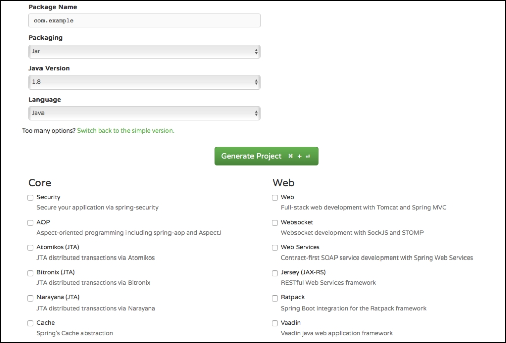

The Spring Team [just announced](https://spring.io/blog/2019/03/05/spring-initializr-new-ui) that the Spring Initializr has been updated with a brand new UI and it is now available at http://start.spring.io. You can see a screen shot of it below but I have say my first impressions were all positive.

## What is the Spring Initializr

Before I get into my thoughts on the redesign it might be a good idea to discuss what the Spring Initializr is for those of you who might be new to it. The [Spring Initializr](https://start.spring.io) provides a web UI that will allow you the ability to quickly create a new Spring Boot project customized just the way you want it.

When I am describing this to students I often make the analogy of going to the grocery store when you're planning on preparing a big meal. You know what you need to make and you know what the ingredients are and now you need to gather them all up.

When you're building a new application you have a similar story. You know what you're building, even if you don't know all the details. If you find out later on you need to add new features you can certainly do so, the same way you inevitably will need to run out on Thanksgiving for those cranberries.

### Spring Initializr Features

It is worth mentioning that the Spring Intitializr at https://start.spring.io isn't the only way to create a new project. IDE's like Eclips, IntelliJ IDEA Ultimate and NetBeans have this built in and make it really easy to select your dependencies. You can also kick start a project running a similar wizard from Visual Studio Code which is really handy. Finally if the command line is your thing you can create a new project using the [Spring Boot CLI](https://docs.spring.io/spring-boot/docs/current/reference/htmlsingle/#cli-init) or by using `cURL` or `HTTPie`.

The Spring Initalizr let's you customize the following options in your prjoject.

- Build System
  - Maven
  - Gradle
- Language
  - Java
  - Kotlin
  - Groovy
- Spring Boot Version
- Project Meta Data
- Dependencies

## The new look & feel

Now that you know a little bit about what the Spring Boot Initilaizr is let's talk about the new look and feel. As I said earlier in the article my first impressions were all great. I am someone who has always enjoyed a nice clean interface so this appealed to me. At a quick glance I was able to fill out everything I needed for my project but there is one small problem and to some folks its a big issue.

I didn't even notice this at first but I was scrolling through the comments on Damien's announcement I noticed a theme.

https://twitter.com/oodamien/status/1102875897290473472

The problem is that in the previous version of the Spring Initializr you could switch to a full version and see all of the available starters.

This was very useful for beginners and but I don't think it was just geared towards them. There are a ton of available dependencies and it's really hard to remember what is available. The team addressed this in their announcement post and I am hoping this is something they address in the future.

The important thing to note is that you will still get the full list if you're in an IDE like IntelliJ so this is only affecting the web UI.

## Conclusion

I really like the fresh and clean design but I think the lack of a full list of dependencies is a bit of a downer. Personally it doesn't affect me as much because I am the proud owner of IntelliJ Ultimate. It does hurt beginners though like my students who might be using the community edition and rely on the web UI to kick start their project.

I would love to hear your thoughts, find me on [Twitter](https://twitter.com/therealdanvega) and let me know what you think! Until then...

Happy Coding 
Dan
