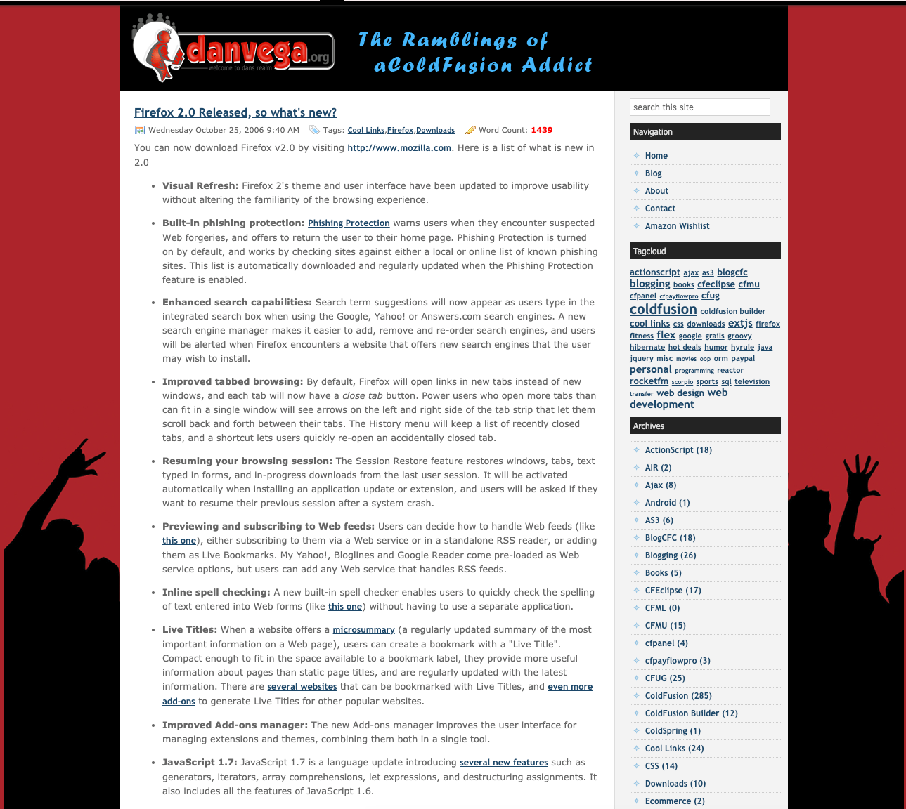
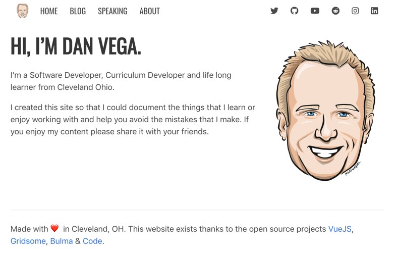

I'm not sure if you have noticed or not but the personal blog is making a comeback. There aren't just more people blogging these days, there are more people building their own blogs which are really great to see. In this article, I am to give you some background on why I started blogging which I believe are good reasons for you to start blogging if you haven't already.

## Why I started Blogging

I have been blogging since October of 2005 and have written somewhere near 1,000 blog posts. If that sounds like a lot I can assure you its weird for me to say out loud because I can't believe it. I can, however, remember clearly when and why I started blogging.

In 2005 I was a ColdFusion developer and I wanted some practice building real applications. Like most junior developers I knew the only way I was going to get better was by doing. You have to remember that at this time we didn't have Github or the vast amount of resources that we have today.

What we did have, especially in the ColdFusion community is a number of people who loved to blog and share their experiences. I looked up to a lot of these developers and wanted to follow in their footsteps. I thought this was a great opportunity to set up my own blog.

I found an open source blogging platform called [BlogCFC](http://www.blogcfc.com/) that was written in ColdFusion. Before I could even start blogging I learned how to set up and work with an open source project which was a great experience. I got a chance to see how someone outside of me or the company I worked for at the time was creating and distributing software.

I really loved the idea of theming the blog and giving it a unique look to match my personality. Now, I have never been known for my design skills but It is still something I enjoy doing to this day. Here is a screenshot of an early version of my blog using the [Wayback Machine](https://archive.org/web/).

Now that I had my new blog up and running I can remember a lot of my early posts were talking about things that I learned while setting up that blog. My motivation for blogging always came down to 2 simple objectives.

First I wanted to help others that were trying to do the same thing I was doing but allow them to avoid all of the mistakes I made. If I could help someone avoid the discomfort of yelling at the monitor and banging their heads against the desk (I speak from experience) then I considered it a success.

Second, I wanted a reference for a problem that I just solved that I could come back to later. I have to tell you one of the coolest things for me is googling something that you're stuck on only to find your own blog post that solves your issue. This has a great way of reminding you why you do what you do.

## Why developers stopped building personal blogs

Now that you have some background on me I can talk a little bit on why I think developers stopped creating their own blogs.

### Twitter

I am really starting to date myself in this article but when I started blogging Twitter wasn't even a thing yet. In fact I didn't even join Twitter until May of 2008 and I can't even remember when I began seriously using it a platform to curate information.

The reason I bring up Twitter is that a lot of bloggers used their blog to share information & links with others. If I had a cool tool, product or link to a website I would just blog about it. Now, unless I have more to say about this cool thing I just found I will just share it on Twitter.

Now this isn't a bad thing because I am big fan of Twitter but I really enjoy a developers insight and experience into using this tool that I can come back to later.

### WordPress

WordPress is an amazing CMS + Blogging platform that is used by something like 33% of the entire internet. That number is staggering but not shocking if you have ever used it. When I moved away from ColdFusion there were a lot of features that I was looking for and WordPress seem to have them all, so I switched.

I have been using it for awhile now and have really enjoyed it for the most part. The 3 main issues I have had with it are:

- Hosting: WordPress is a resource hog and hosting runs me $30 month
- Plugins: Installing lots of plugins can cause performance issue
- PHP: I am not a PHP developer nor do I want to be.

I think the last one is really the big issue for me. I know enough to get in there and hack some things together but whenever I want to update themes it just seemed overwhelming for me. I think this could be the case for a lot of developers. Maybe they moved to WordPress, bought some theme and just used it as a blogging platform.

I am not saying there is anything wrong with this at all but it could be something that led to developers like myself from building a personal blog. Again when I say building I just mean creating something from scratch and giving it some style to match their personality.

### Medium

In 2012 Medium launched and it offered a platform for writers to start writing without having to setup a blog. A few years ago I started writing on there and at first I really liked it but I always came back to the fact that I didn't own my content. I also didn't want to have to migrate my 700 posts at the time so it quickly became a place where I would syndicate posts from my own blog.

Fast forward to today and I see a lot of developers that did move to Medium, moving off of it. Medium took a bunch of funding so you had to know at some point that they needed to start making money. If you're reading a post on Medium these days you might be all of a sudden hit with a paywall. I also don't think its a great writing experience for developers.

*If you're looking for a solution like Medium but for developers, I would suggest taking a look at [http://www.dev.to](http://www.dev.to).*

## Don't call it a comeback

I gave some reasons why I think there was a period where developers weren't building their own blogs. I'm here to tell you that times, they are a changing! Here are a few things that I think have contributed to the comeback.

- JAMStack (Static Site Generators)
- Evolution of JavaScript Frameworks
- JavaScript Rocks 🤘🏻

### JAMStack (Static Site Generators)

I think that static site generators are a huge reason for the comeback. I know for me personally as great as a platform like WordPress was it was just too much for what I wanted to do. My visitors are coming to my site to read my content and view information on the courses that I have available. They don't visit my site for long load times and the occasional random WordPress is out of resources error.

Static site generators allow us to build our entire site so that when our visitors get the content they are looking at HTML/CSS/JS and it is blazing fast. This has always been the appeal of static sites but until recently they have been pretty limited in what they can do. With advancements in JavaScript frameworks, tooling and cloud computing we now have a pretty awesome workflow.

I write a lot of documentation, tutorials, and exercises in Markdown so starting with a simple markdown file is very appealing to me. From there I am able to just write a new blog post and when I am ready to commit the file to my git repository and push it. My hosting provider builds my static site, deploys it and its live for everyone to see.

I have mentioned Gridsome a few times in this article and it's the one that I selected because it uses Vue. There are plenty of great options out there including a very popular one called [Gatsby](https://www.gatsbyjs.org/). I would suggest looking at your options, trying out a couple that fit your stack and go from there.

*P.S If you're interested in hearing more on JAMStack tweet at me and tell me to write that article! I love everything about it and have a lot to say on the subject.*

### Evolution of JavaScript Frameworks

We wouldn't have these amazing static site generators without the evolution of JavaScript frameworks. In the past 5 years we have seen frameworks like Angular, React & Vue rise to the top. These frameworks along with the JavaScript language itself have really made front end development fun again.

No matter what your project requirements are chances are any of the big 3 frameworks have an answer for you. Developers love to get caught up in framework wars but if you just like to build stuff you can't go wrong with any of them.

I always tell people that they shouldn't listen to anyone when it comes to "which framework should I choose". Try building some components or applications using each of them and decide for yourself.

### JavaScript Rocks 🤘🏻

Behind every great framework is a great language. JavaScript has taken a lot of flak over the years (rightfully so) but it has stood the test of time as "the language of the web". I had to learn JavaScript before jQuery was cool and I can't tell you how good you have it today.

In the last few years, JavaScript has really come into its own and I think ES6 brought a lot of features to the language that got developers excited. There is just something very clean and elegant about some well-written JavaScript and I can't wait to see what the future of the language brings.

## danvega.dev

If you're not reading this article on my blog and want to check it out head over to [https://www.danvega.dev](https://www.danvega.dev). I also have a few articles on why I moved over to Gridsome and how I built certain features. If you're interested my entire site is open source and you can [grab the code here](https://github.com/danvega/danvega-dev).

## Conclusion

I had so much fun building my new personal website using [Gridsome](https://gridsome.org/). It really took me back to what I love about being a software developer. I like to build things and tell people how I did it so that others can learn and avoid making the same mistakes that I did. If you're new to this blog that is what you can expect from so I hope you will visit again.

If you moved your blog or created a new on top of a new framework or static site generator please let me know. I would love to check it out and I will retweet some of my favorites.

**Happy Coding**

Dan
