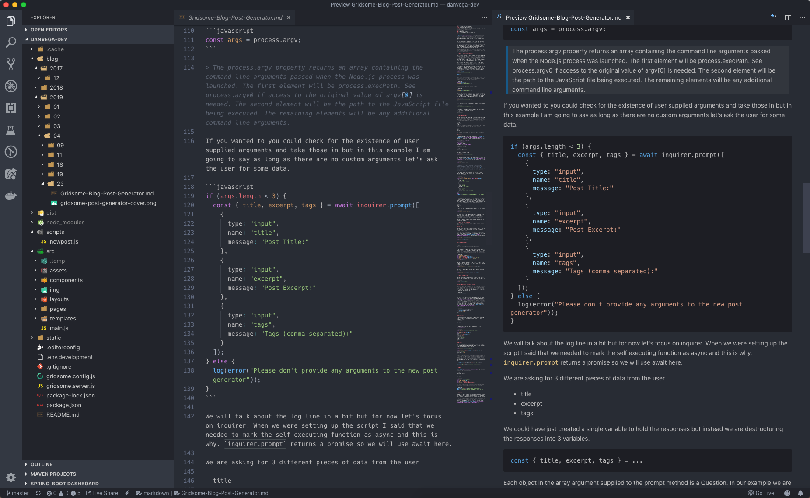
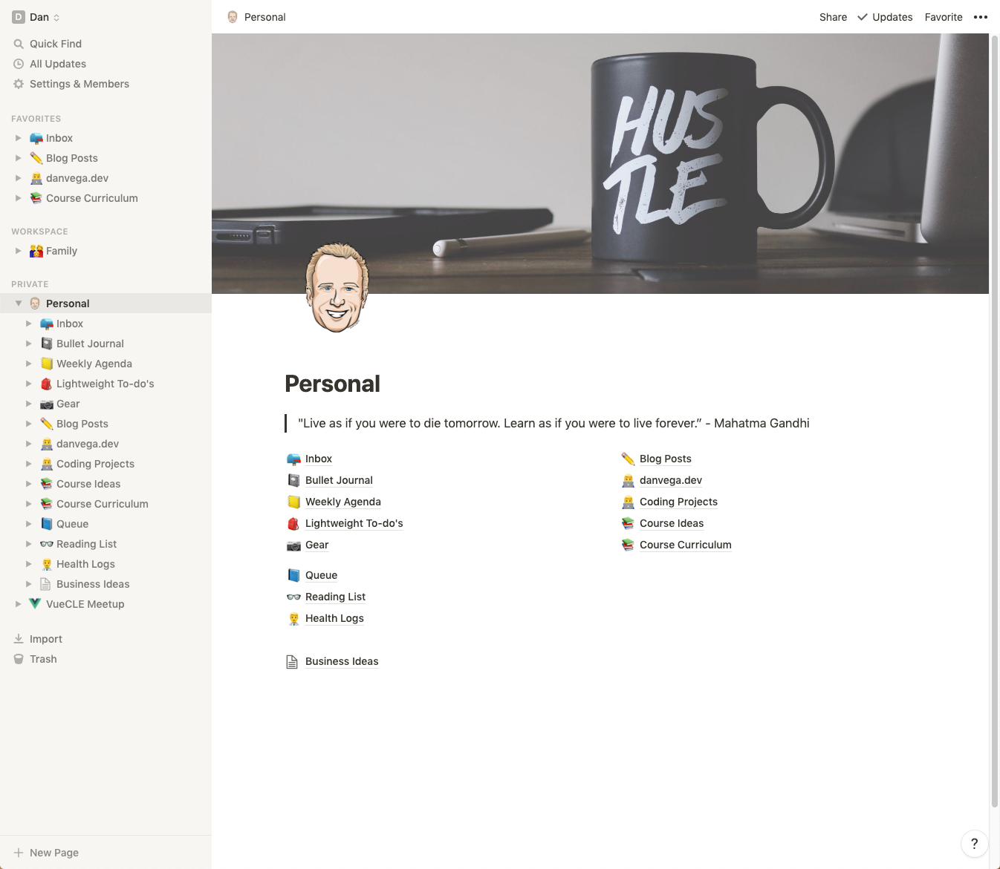
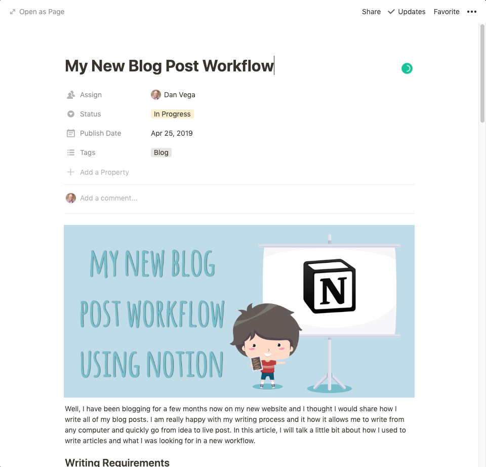
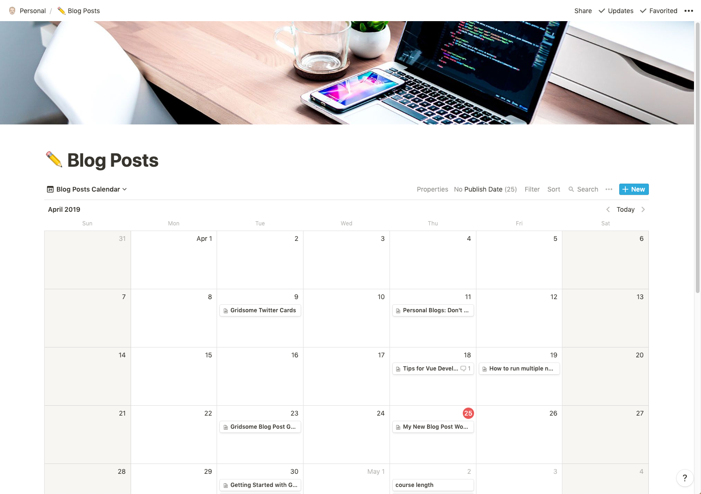
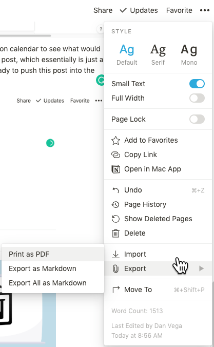
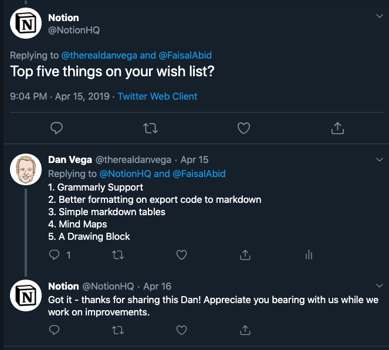
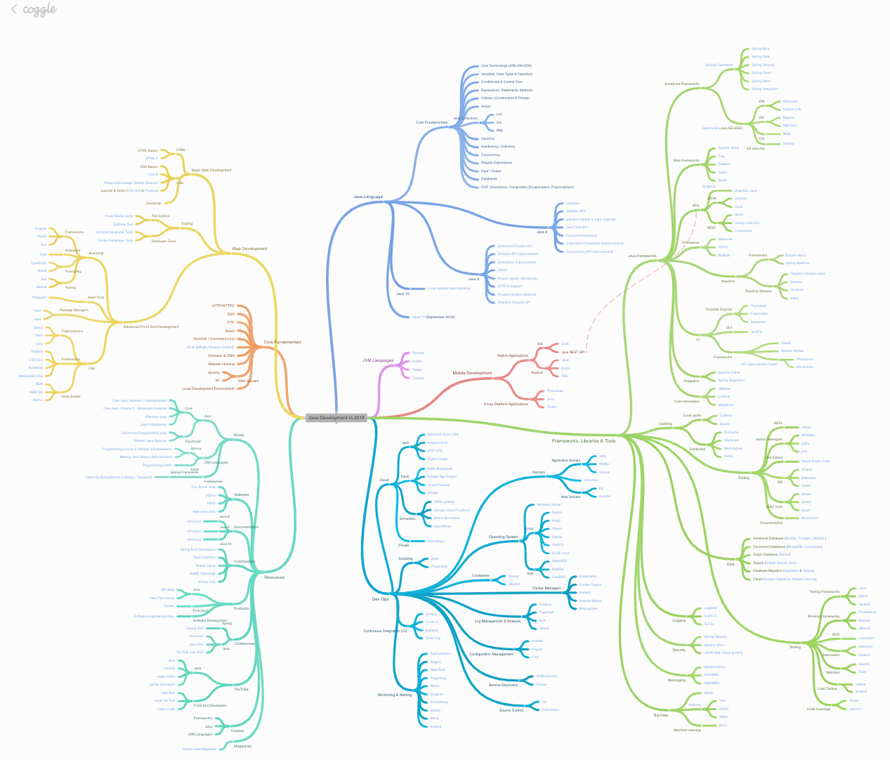
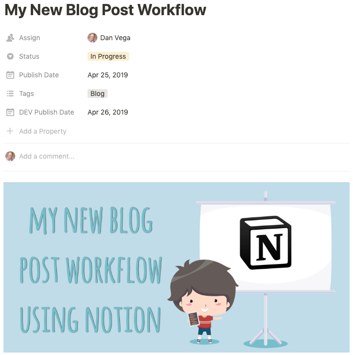

Well, I have been blogging for a few months now on my new website and I thought I would share how I write all of my blog posts. I am really happy with my writing process and it how it allows me to write from any computer and quickly go from idea to live post. In this article, I will talk a little bit about how I used to write articles and what I was looking for in a new workflow.

## Writing Requirements

If you have been following me you know that I am coming from writing all of my articles using the WordPress administrator. I would say that 90% of my WordPress posts were using the classic editor but I was one of the few people that really liked the Gutenberg block editor.

I write a lot of documentation for personal projects and work. Almost everything I write these days is in Markdown so as far as requirements go I only have a few:

- Clean & Distraction free writing
- Markdown
- Spelling & Grammar checking

### Clean & Distraction free writing

I can be easily distracted when I sit down to start writing so for me I need a distraction-free zone. If I am writing in a notebook this means no tv on in the background and somewhere comfortable by myself where I can collect my thoughts.

If I am writing in a text editor application that the document needs to be the only thing open. This is especially true when I am working in the browser. If there are any tabs open or the lure of something else is right there I might be pulled in another direction.

### Markdown

I really like Markdown because it is the easiest format that can transfer between platforms. I remember clearly when I started writing in Markdown and for the life of me, I couldn't understand why people liked it. Now, I couldn't imagine writing in any other format. For me, I am more productive writing in Markdown than anything else.

### Spelling & Grammar Checking

I feel like an important aspect of being productive is to know your strengths and weaknesses. If you can spend more of your time on your strengths and less time worrying about your weaknesses you can be more productive. I am pretty darn awful when it comes to spelling and grammar and this is where I need help. So until someone wants to volunteer to be my full-time editor I will rely on tools & services to help me out with this.

## Visual Studio Code Markdown

For the last 6 months or so I have been writing documentation, tutorials, and exercises on a full-time basis in markdown using Visual Studio Code. For the most part, I really do enjoy it but there is one problem that is a deal breaker for me.

I am a huge fan of [Grammarly](https://www.grammarly.com/) and use it for almost everything in the browser. This could be for writing an important email to the non-trivial social media status update. It is my go to service and I just can't imagine writing without it.

Well it turns out there is no way to use Grammarly in Visual Studio Code. So what I used to do is write an entire markdown document in visual studio code and the copy and paste the text content into a Google Document or Grammarly has an editor you can use.

As you can imagine this isn't very efficient and I got really tired of doing this. I have reached out to Grammarly on Twitter on a number of occasions asking them to please add support to Visual Studio Code. I am still hoping that this becomes a reality one day but until then I was on the hunt to find another process.

Another component of this that is not a deal breaker but it just bothers me from time to time is the markdown preview window. I don't like having my Markdown file open and the need for a preview window to see what the result looks like.

## Notion

[Notion](https://www.notion.so) was one of those tools that I kept hearing about but I just didn't get it. Now granted they have made some major improvements over the last year but I remember trying it a number of times and saying I just don't get it.

The reason I kept trying it is that I kept hearing about it on podcasts and Twitter and I kept asking myself what do they know that I don't. Well, it turns out that this is one of those tools you can't really appreciate playing around with for just 5 min.

After I spent a little time over a weekend setting up Notion I really started to see the power behind it. This was a replacement for a number of tools I used and became a one-stop shop for everything I needed. Below is a screenshot of my personal Notion workspace. If you're interested in how I use Notion for almost everything let me know and I will put together a post or video walking you through how I use it.

If you're new to Notion I would also suggest checking out [their new template gallery](https://www.notion.so/181e961aeb5c4ee6915307c0dfd5156d). This is a great place to get some ideas and templates for your own workspace. I think most of the battle with the platform is understanding what to use it for and then how to set it up.

### Blogging on Notion

The one feature that I absolutely love about Notion is that you can use 1 set of data and have multiple views for it. If you're not quite sure what that means, that's ok I am going to explain that now.

I have set up a kanban board for blog posts and this is where I have a view into all of my ideas, what's up next, what I am working on now and what has been completed. Having a place where you can quickly add an idea for a blog post with some notes, images or sample code is crucial for my writing process.

I did something like this in Asana but over there I had to create a new content calendar to see what would be posted and when.

In Notion, you can set up some properties for each new post, which essentially is just a new page. This allows me to define a publish date for the post for when I expect this article to go live.

So far nothing new but he is where the real power of Notion comes into play. You can create a different view of the same set of data. So now I can create a new calendar view for by blog posts and based on the published date I can get a calendar view of all my blog posts. This really helps me stay on track and let's me know what I have published and when.

I also like using this view to see if I have been posting about a certain topic too frequently. I try and break my posts up so it's not focused on a single topic and this really helps out.

### Markdown & Block Editor

I really enjoy the writing process in Notion. Everything you do is just a block so when you start writing it's a block of text. If you hit enter and you know you're going to add a new headline (or any block type for that matter) you just type a forward slash (/) and you are given a list of block types. This is just a sample of the types of blocks you can use when creating a page in Notion.

- Text
- Page
- To-do List
- Heading 1, 2 & 3
- Bulleted, Numbered & Toggle List
- Quote
- Link to Page
- Mention a Person or Page
- Date or Reminder
- Database (A large list of blocks here)
- Images, Bookmarks, video, audio
- Code
- Files
- Embeds (Things like tweets, Gists, Google Maps & More)

Most of my blog posts are text, images and code. So I really appreciate that working with these content types are so easy. Here is a code block from a previous blog post. I enjoy the nice code formatting out of the box and the ability to determine what langauge that code is.

The other really nice part of the writing process I enjoy is that because it's web-based I can do it from any computer or phone. Yes, I use my phone sometimes to write something I don't want to forget or adding a link to the article so I remember to reference it later.

### Grammarly Support

Remember when I said that Grammarly support was a must? Well the good news is that it works, sorta. When I first started writing in Notion it didn't work at all. The Chrome plugin would kick in and show me suggestions but whenever I tried to apply that suggestion something in Notion would kick in and revert it back to what it was. The other problem is that it sometimes takes awhile for the plugin to notice problems.

The weird thing is that just this week it sorta started working for me. Sometimes I have to hard refresh the page but when I do get Grammarly suggestions now I can hover over them and accept the change. I reached out to Notion and asked them if they fixed anything and they did not.

While this sorta works it's not working as I would hope and this is something I absolutely need going forward so I hope they are working on this.

### Export to Markdown

When my blog post is ready to go I just go to the upper right hand corner, click on the 3 little dots and export as Markdown. It can be confusing as there is also an option to Export All as Markdown. What that feature is for is in the situation where you have pages embedded inside of pages.

What I really appreciate about the export is that I have all of my code and images in Markdown and I am ready to post. From there I will generate a new blog post using a custom generator [I wrote and blogged about here](https://www.danvega.dev/blog/2019/04/23/gridsome-blog-post-generator). Then I copy all of my images into my new post folder and all of the markdown into the new markdown file my generator created.

### What's Missing

This process is far from perfect and there are some things that don't work well and some things I wish they would add. As I mentioned earlier the Grammarly support is a must for me and I hope they can fix that up a bit. The export as Markdown works but it isn't perfect.

The code blocks don't export in Markdown format so there are no backticks with the language definition around them. This means that I have to go through and manually fix these before I post which is a bit tedious and annoying.

The other part of the export process is that when I create a table it doesn't export it as a simple table in Markdown format. It thinks of the table as a database and therefore exports it as another page and this doesn't work for me.

### Wish List

Notion asked me on Twitter what would be the top 5 things on my wish list would be and here is how I responded.

A few of those I have already talked about but I want to talk quickly about the last 2. I am a huge fan of mind maps as a teaching tool. I [created this map](https://coggle.it/diagram/WqgTTNMJtPiHph_q/t/java-development-in-2018) of what to learn as a Java Developer in 2018 and it was really well received.

I would love the ability to create Mind Maps within Notion and then include them in my posts. I'm still not sure if that would mean Notion creating a whole new tool for Mind Mapping or just embedding something like Coggle.

The other feature I would love to see is a drawing block. If I had an iPad Pro with a pencil and I could quickly sketch something out or add a drawing to a post I think that would be super cool. I am not the greatest artist but I could see this coming in super handy sometimes.

## Cross posting on dev.to

The final piece of the blogging process is to cross-post my article on [https://www.dev.to](https://www.dev.to). If you're not familiar with DEV it's a great community for developers. I found that when I posted my articles on platforms like Reddit I got a lot of hate thrown at me for being a spammer. I mean my articles are meant to help others, what part of this process is spamming?

DEV allows me to not only post my articles but I get some really great feedback from the community. Everyone there is so nice and I have never had the engagement I do there on any other platform. I usually wait a day or 2 after it appears on my blog to post it there but when I do DEV allows me to add a canonical URL to the front matter for each post.

I also create all of my blog post cover images using the dimensions of 1000w x 492h because this is the size DEV would like them in. That size works out well for my blog as well but now I have a cover image for both platforms. If you haven't checked out [DEV](https://dev.to) yet, I highly recommend doing so.

Because you can add custom properties to each post I have even added a DEV publish date so I know when this will go live there.

## Conclusion

So that is my blogging process which I am sure will change again at some point but for now, I am really happy. I would love to hear from you on what your process is and any tips and tricks you are willing to share. Are you using Notion for anything, what are your thoughts on it as a tool and or a blogging platform? Until next time...

Happy Coding 
Dan
