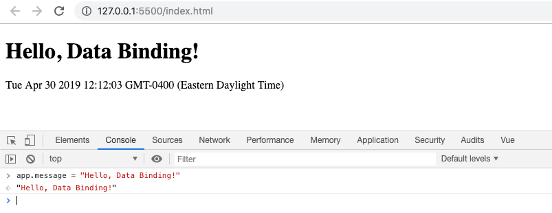
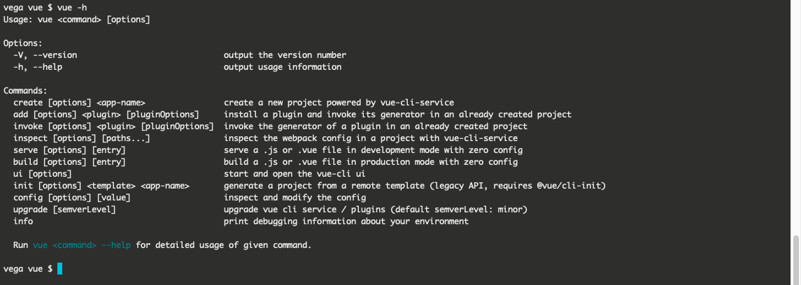
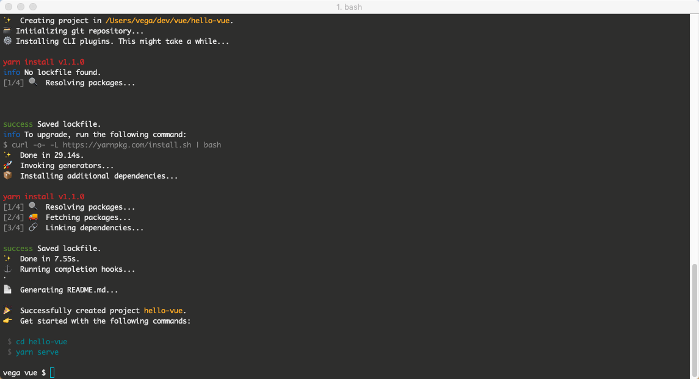
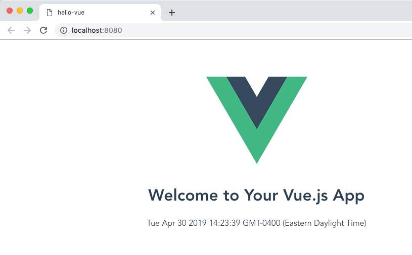
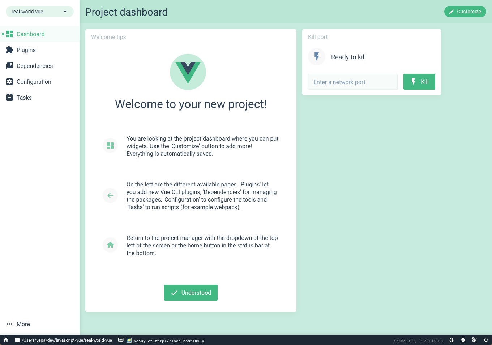
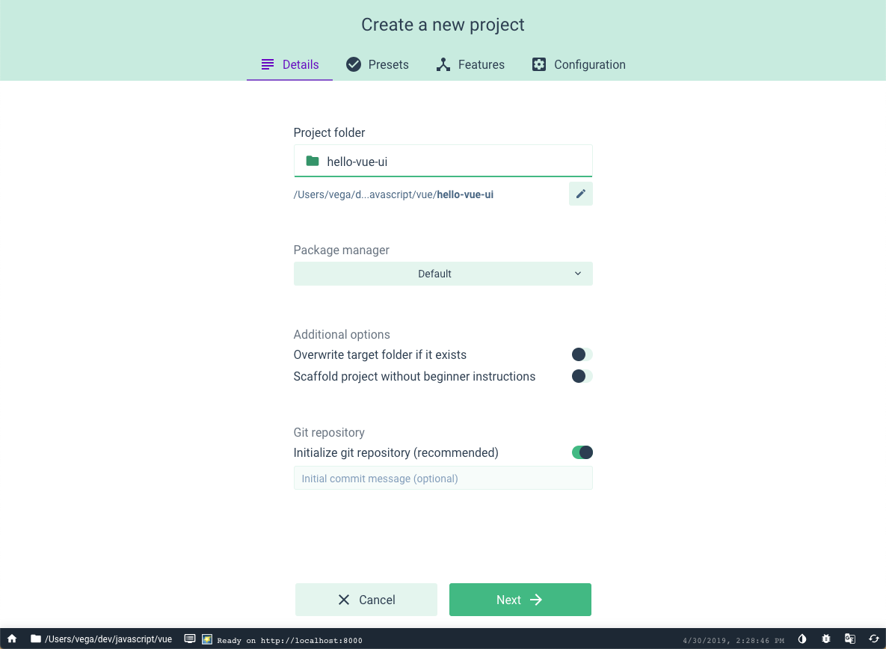
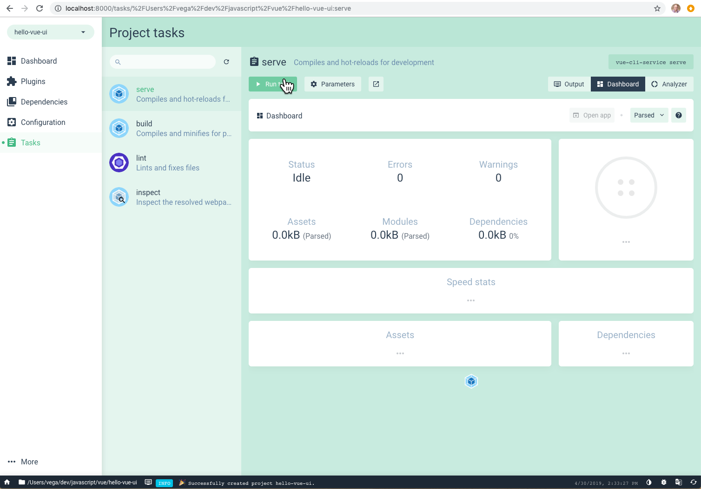
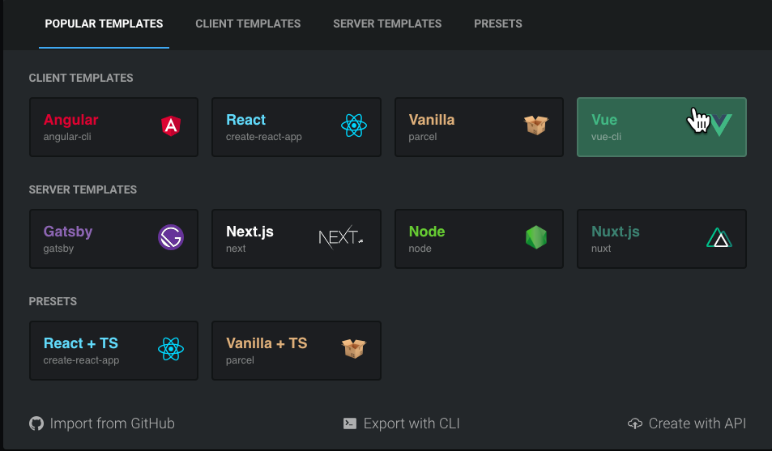
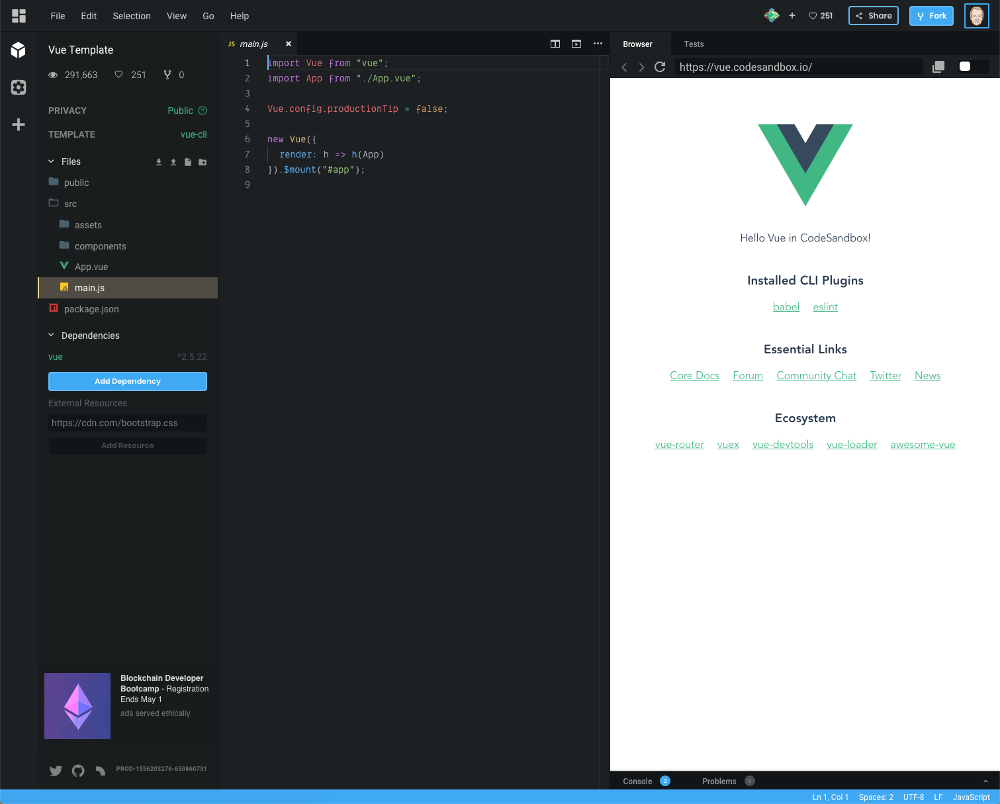
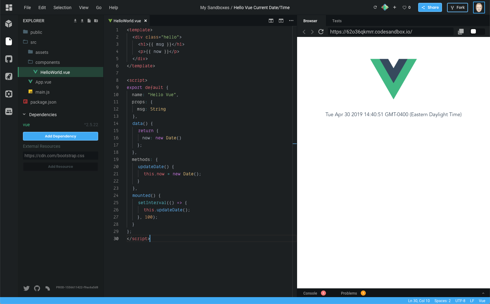

At this point, you have most likely heard about the JavaScript framework called [Vue](https://vuejs.org/). If it's been on your list as something to try out but you weren't quite sure where to start I am here to help. In this article, I am going to tell you why I love Vue and give you 4 different ways you can write your first application. 

Normally I shy away from giving someone new to a framework too many options for doing the same thing but in this case, I think it's important. You might be someone who enjoys working with the command line or you might be someone who prefers working within a GUI. There are also ways to start writing Vue applications without a CLI by just adding a script tag to an HTML page. Finally, you might not want to bother setting up a development environment and instead dive right in and try it now. No matter what option suits you best I got you covered. 

As you move through this article I will leave you with some resources and when you reach the end I will leave you with what I think you should focus on next. This is not a deep dive into what Vue is or how to use the each of the options I give you so please keep that in mind. 

## Low Barrier of entry

For me, the real power of Vue is just how welcoming of a framework it is. The core team has done an amazing job of making sure that developers of all skill levels can jump on in and be productive. As long as you are comfortable with HTML, CSS & JavaScript you can get started building some pretty powerful applications right now. 

I also believe that of the 3 top frameworks (Angular, React & Vue) Vue has the lowest barrier to entry. There are a few reasons for this but for me, it comes down to 3 things

- Great Documentation
- Awesome Community
- Progressive Framework

### Great Documentation

When you ask most developers who enjoy using Vue I think one of the first things they will tell you is just how great the documentation is. If you head over to the Vue.js website you will find the docs broken down into a few sections. 

**Guide**

In the [Guide](https://vuejs.org/v2/guide/), you will find everything you need to get started with Vue.js. It's broken down into a nice logical flow of concepts you will need to learn to start building component-based applications. 

**API**

In the [API](https://vuejs.org/v2/api/), you will find everything you need to begin working with the Vue API. If you ever see a method in Vue and you're not quite sure what it does, this should give you the answers.

**Style Guide**

In the [Style Guide](https://vuejs.org/v2/style-guide/), you will find some awesome recommendations for avoided errors and anti-patterns. It's important that these aren't rules but more of a guide. After you get comfortable writing some applications I would start to walk through as I have found it to be a very valuable resource. 

**Examples**

In the [Examples](https://vuejs.org/v2/examples/), you will find sample applications built with Vue. I would save this resource for later and focus on building simple components but when you're ready to see how full applications are composed check it out.

**Cookbook**

In the [Cookbook](https://vuejs.org/v2/cookbook/), you will find answers to common questions you might have. This could be things like "How do I do form validation" or "How can I unit test a component". This again is a valuable resource but I would save it for when you start asking these types of questions. 

**Tooling & Core Libraries**

There are also great resources and documentation around tooling and core libraries. I am not going to far into these because I want to dive in and start writing some code. I do want to leave these as resources and I suggest giving them a look over so you know what is available to you.

**Tooling**

- [DevTools](https://github.com/vuejs/vue-devtools)
- [Vue CLI](https://cli.vuejs.org/)
- [Vue Loader](https://vue-loader.vuejs.org/)

**Core Libraries**

- [Vue Router](https://router.vuejs.org/)
- [Vuex](https://vuex.vuejs.org/)
- [Vue Server Renderer](https://ssr.vuejs.org/)

### Awesome Community

I feel like I have been a part of some amazing communities in my development career and the Vue community is no different. Everyone is very welcoming, friendly and beyond helpful. An easy way to see what others in the community are building or excited about is to follow some of them on Twitter. Here are 10 people I think you should start following today. 

- [Evan You](https://twitter.com/youyuxi)
- [Chris Fritz](https://twitter.com/chrisvfritz)
- [Sarah Drasner](https://twitter.com/sarah_edo)
- [Damian Sulisz](https://twitter.com/DamianDulisz)
- [Divya Sasidharan](https://twitter.com/shortdiv)
- [Guillaume Chau](https://twitter.com/Akryum)
- [Ben Hong](https://twitter.com/bencodezen)
- [Sebastien Chopin](https://twitter.com/Atinux)
- [Natalia Tepluhina](https://twitter.com/N_Tepluhina)
- [Edd Yerburgh](https://twitter.com/EddYerburgh)

### Progressive Framework

If you visit the home page for Vue.js you will see it is known as "The Progressive Framework" and while it might seem like marketing mumbo jumbo at first, you quickly realize that it isn't. Let's start with the definition of progressive 

> happening or developing gradually or in stages; proceeding step by step.

As you will see in just a minute you can take a very gradual approach to building Vue applications. If you have an existing project that you would like to add Vue too, no problem. You can start by dropping in a script tag and writing a few lines of code.

If you want to use a CLI to scaffold a new project out based on features you might need, also not a problem. As your application starts to scale and you need to add things like routing or state management it's really easy to do. 

We talked about it earlier but Vue is an approachable framework. If you already know HTML, CSS & JavaScript you can get started today. If this is you let's jump on in and start writing some 

## Vue JS Script

The first option we are going to look at is using the script tag. If you have worked with JavaScript in the past this is nothing new to you. You have an HTML page and you need to add some functionality to the page so you drop in a script tag. This isn't just for learning Vue because it has some real practical uses. 

It's usually really hard to introduce new tools, libraries and frameworks at work. If you really like working with Vue and went to your boss and asked if you could rewrite the whole system in Vue he or she would almost immediately shoot your idea down. 

If instead you went to them and asked to introduce Vue on this new page you were building, that is a much easier sell. In this example, we are going to build a pretty arbitrary application but it's good for explaining a couple of different concepts.  

### Hello, Vue!

In this application you are going to display the text "Hello, Vue!" and the current date and time below it. You will then write some logic to update the current date/time so that the user will see the time change in real time. You are going to start off by creating a directory and adding the following to a new page `index.html`.

```html
<!DOCTYPE html>
<html lang="en">
<head>
  <meta charset="UTF-8">
  <meta name="viewport" content="width=device-width, initial-scale=1.0">
  <meta http-equiv="X-UA-Compatible" content="ie=edge">
  <title>Hello, Vue.js</title>
</head>
<body>
  
</body>
</html>
```

Now that you have the basic part of your page setup it's time to add the Vue.js script. You can add the following lines of code right before the body closing tag.

```html
<!-- development version includes helpful console warnings -->
<script src="https://cdn.jsdelivr.net/npm/vue/dist/vue.js"></script>
<script>

</script>
```    

I left the comment in there because it's important to note this is the development version of the script. If you were going to put this in production you would want to use the production script. You can read more about this is the [Vue.js Guide Documentation](https://vuejs.org/v2/guide/). 

The first thing you need to is add a root element to mount your Vue instance to. 

```html
<div id="app">

</div>
```

And then create a new Vue instance and tell Vue what your root element is.

```html
<script>
  const app = new Vue({
    el: '#app'
  })
</script>
```

What you want to do now is to create a couple of variables that hold values that you can then use to display information on the page. You do this by declaring properties on the data object. 

```html
<script>
  const app = new Vue({
    el: '#app',
    data: {
      message: 'Hello Vue!',
      now: new Date()
    }
  })
</script>
```

Now that your data is setup Vue gives us a really clean way to display that data on the page. 

```html
<div id="app">
  <h1>{{ message }}</h1>
  <p>{{ now }}</p>
</div>
```

Give yourself a big pat on the back because just created your first Vue application. If you run this application you should get the heading "Hello, Vue!" and the current date/time below it. I am using Visual Studio Code and the [Live Server extension](https://marketplace.visualstudio.com/items?itemName=ritwickdey.LiveServer) to run mine.

This doesn't look like much but Vue is actually doing a lot under the hood for you. The data and the DOM are now linked, and everything is now reactive. How do we know? Open your browser’s JavaScript console (right now, on this page) and set app.message to a different value. You should see the rendered example above update accordingly.



Vue also gives you the ability to "hook" into the lifecycle of a component. This means that you can listen for events like `created`, `mounted`, `destroyed` and more. I don't want to get too much further into this because this article is meant to show you different ways to create a Vue application, not everything else. I do want to finish our application though.

The following code will update the variable now every second. When Vue is mounted you run a function every second using the `setInterval` method. Just like adding your own data on the Vue instance you can create methods by adding them to the methods object. 

```html
<script>
  const app = new Vue({
    el: '#app',
    data: {
      message: 'Hello Vue!',
      now: new Date()
    },
    methods: {
      updateDate() {
        this.now = new Date();
      }
    },
    mounted() {
      setInterval(() => {
        this.updateDate();
      }, 100);
    }
  })
</script>
```

If you run the application now you should get the same display but every second the current date time is now updated. You didn't have to update the DOM manually because Vue has tied your data variables to the DOM for you and when they are updated, the DOM is updated. 

## Vue CLI

While dropping the script tag on a page got us up and running quickly it doesn't scale all that well. In cases where you want to build full-blown Single Page Applications (SPA) and take advantage of the toolchain, the Vue CLI is a great way to get up and running.

If you're not a huge fan of doing everything on the command line don't worry, the same CLI tool that you install here has a UI version. 

### Installing the Vue CLI

The first thing you need to do is install the Vue CLI. A requirement for this is having NodeJS and npm installed so if those are new to you take some time to install them and do a little reading on them to get a better understanding of what they are used for. To install the Vue CLI run the following command: 

```bash
    npm install -g @vue/cli
``` 

To `create` a new application you can use the command `vue create`. If you're not sure what commands are available you can run vue -h



The create command takes an app name so let's create a new vue application by running the following command: 

```bash
vue create hello-vue
```    

This will create a new folder for you in the current directory called `hello-vue`. I will go through this in more detail in a later post but for now, just accept the defaults and a new application will be created for you.



Open up `src/components/HelloWorld.vue` and replace everything in there with the following. 

```vue
<template>
  <div class="hello">
    <h1>{{ msg }}</h1>
    <p>{{ now }}</p>
  </div>
</template>

<script>
export default {
  name: "Hello Vue",
  props: {
    msg: String
  },
  data() {
    return {
      now: new Date()
    };
  },
  methods: {
    updateDate() {
      this.now = new Date();
    }
  },
  mounted() {
    setInterval(() => {
      this.updateDate();
    }, 100);
  }
};
</script>
```

From the command line (or the integrated terminal) run your app using the following comand

```bash
npm run serve
```

When your application starts the command line should tell you where it's running but by default, it should be at [http://localhost:8080/](http://localhost:8080/) 



That was just a quick walkthrough of using the CLI but I hope you saw just how easy it was to create a new application that has a strong infrastructure and is ready to scale with you as your needs grow. 

## Vue UI

With the Vue CLI installed you can use the UI by running the following command from the command line

```bash
vue ui
```

This will open a new application at [http://localhost:8000/dashboard](http://localhost:8000/dashboard) that looks like this



You can create a new project using the Vue UI and it will give you the same options the command line gives you.



And when your project is done you can run it right from the UI using the Project Tasks. 



## CodeSandbox

While those are all great options to get up and running with Vue they also require you to have something of a development environment setup. If you haven't had a chance to give it a try I am here to tell you about an awesome online code editor for the web called [CodeSandbox](https://codesandbox.io/).

The first thing you need to do is to sign up for a CodeSandbox account by sign in using your Github account. Once you're signed in click on create a sandbox and from there you can select from a large variety of templates. You can select Vue from the popular or client templates tab.



In just seconds you have a new Vue application up and running! In the left pane, you have all of your project files, your editor in the middle and a browser preview of the application running. 



Open up `src/components/HelloWorld.vue` and replace everything in there with the following. 

```vue
<template>
  <div class="hello">
    <h1>{{ msg }}</h1>
    <p>{{ now }}</p>
  </div>
</template>

<script>
export default {
  name: "Hello Vue",
  props: {
    msg: String
  },
  data() {
    return {
      now: new Date()
    };
  },
  methods: {
    updateDate() {
      this.now = new Date();
    }
  },
  mounted() {
    setInterval(() => {
      this.updateDate();
    }, 100);
  }
};
</script>
```

And you should see the same application you have been working with. The nice thing about CodeSandbox is now you can take this and share the applications with friends to just show something off or get some advice.

[https://codesandbox.io/s/62o36qkmrr?fontsize=14](https://codesandbox.io/s/62o36qkmrr?fontsize=14)



## Resources

These are a few of my favorite resources to help get you going. For an in-depth look at everything in the Vue ecosystem checkout [Awesome Vue](https://github.com/vuejs/awesome-vue).

- [Vue Core Repos](https://github.com/vuejs)
- [The Vue Point (Official Blog)](https://medium.com/the-vue-point)
- [DEV Community](https://dev.to/t/vue)

### Podcasts

- [The Official Vue News](https://news.vuejs.org/)
- [Views on Vue](https://devchat.tv/views-on-vue/)

### Frameworks

- [VuePress](https://vuepress.vuejs.org/)
- [Nuxt](https://nuxtjs.org/)
- [Gridsome](https://gridsome.org/)

## Where to go from here?

No matter what framework you're using you need to keep up on your JavaScript skills. The more time you can spend improving your JavaScript skills the better. This will make sure that you are able to use any framework or library thrown your way. 

I mentioned the [guide documentation](https://vuejs.org/v2/guide/) earlier but it's worth mentioning again. This is the first place I would start and read through as much of this as you can but to also to make sure you're practicing the examples as you go. Repetition is an important step in the learning process and something that can't be overlooked. While you're going through the docs I would focus in on the core concepts of Vue. 

- Component Basics
- Data Binding
- Event Handling
- Directives
- Methods
- Computed Properties
- Vue Component Lifecycle
- Props

Don't feel to build large applications at this point. Focus on building components and the rest will come in time.

## Conclusion

If you follow me on Twitter (if you're not, stop what you're doing and [follow me now](https://twitter.com/therealdanvega)) you know that I am a huge fan of Vue. I love writing component-based applications and I think Vue makes it not only easy but it really makes writing code fun. If you have any questions on your journey into Vue.js please don't hesitate to reach out. As always friends...

Happy Coding

Dan