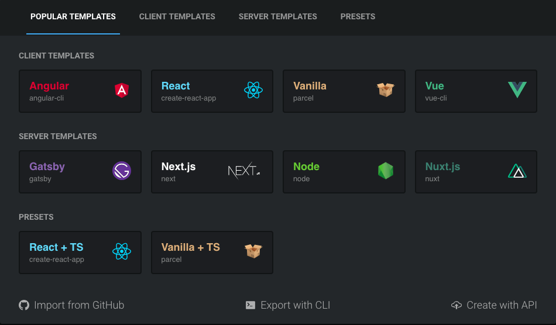
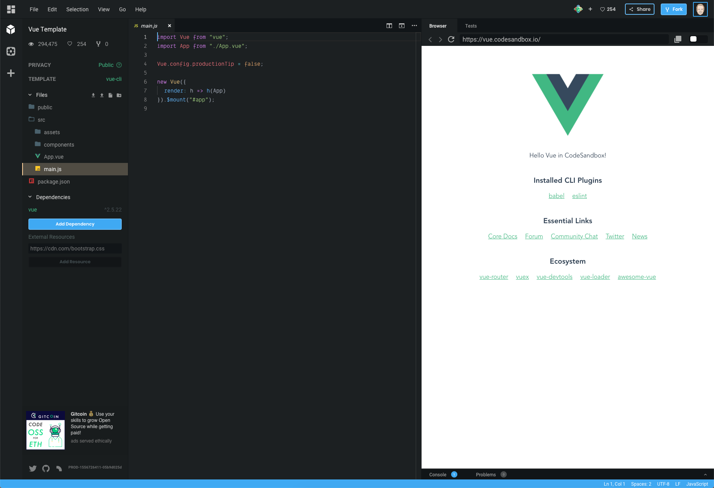
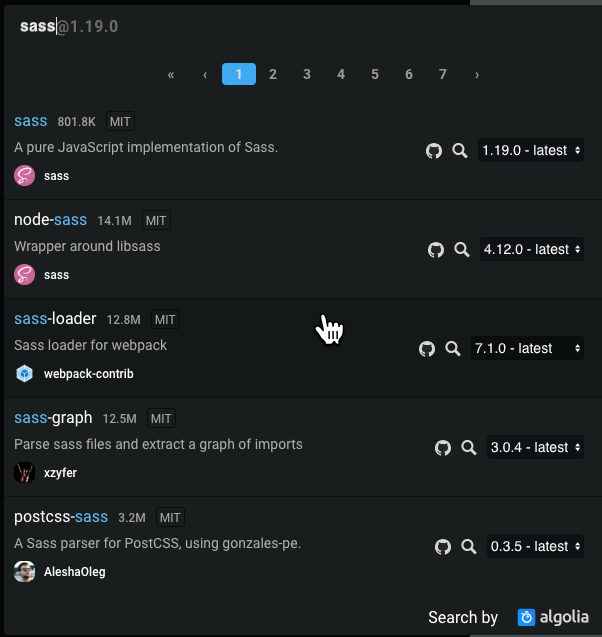
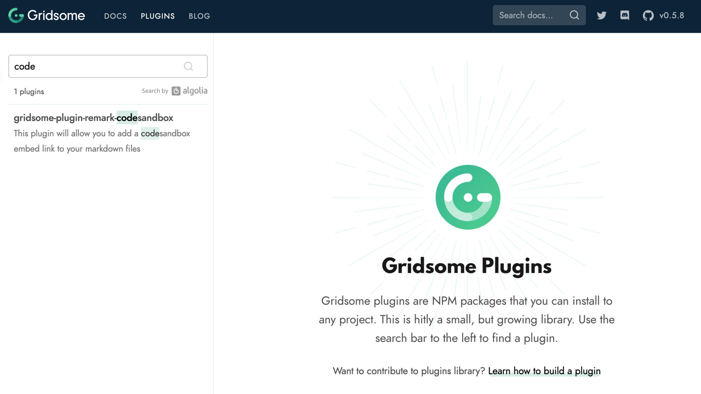

I have been a big fan of what [CodeSandbox](https://codesandbox.io) has been doing for a while now. Lately, I have been using it a lot more and I am finding it to be one of the tools that I can't live without. In this article, I am going to introduce you to CodeSandbox and tell you a little bit about why I love it. Then I will walk you through the plugin I created so that I can embed a CodeSandbox in Markdown so that I could display them on my Gridsome powered blog.

## What is CodeSandbox

[CodeSandbox](https://codesandbox.io) is an online editor that helps you create web applications, from prototype to deployment. Just as an example let's say that you wanted to [create your first](https://www.danvega.dev/blog/2019/04/30/up-and-running-with-vue) [VueJS](https://vuejs.org/) application. You could make sure you had Visual Studio Code installed locally with the right extensions, node & npm, the Vue CLI and then create your first application from the command line. If you understood all of that and you wanted to take the time to get your development environment setup that's great, but what if you didn't?

What if you just wanted to check it out and create a new project hassle free? What if you wanted to do this for a number of web projects like React, Vue, Gatsby, Gridsome, VuePress, Next, Nuxt and so on. What if you wanted to use it as a teaching tool where a single concept was more important than the whole story. This is where CodeSandbox comes in and really shines bright.

### Getting Started with CodeSandbox

To understand what it is and why you would want to use it I think it's one of those tools that you need to just go in and try for yourself. To get started you will need to signup using your Github account. From there you will be taken to your dashboard where you can create and organize new CodeSandboxes.

If you click on create sandbox you will be given a dialog that looks something like this. From here you can choose from a variety of templates. If you select Vue as your template it will spin up a new application using the Vue CLI.





If you were to just exit out of here and go back to your dashboard nothing would have been saved for you. You can tell from the browser window preview URL that it's currently [https://vue.codesandbox.io/](https://vue.codesandbox.io/) and not a unique address.

Once you click File > Save you should see that URL change to a unique one and now this is your CodeSandbox ready for you to play with. I also like to give this CodeSandbox a name so in the top header where it currently says `My Sandbox / Vue Template`, click on Vue Template and change the name to whatever you're working on. In my case, I will change it to Hello VueSandbox.

If you're used to using Visual Studio Code than this should look pretty familiar. Yes, that is correct, this is Visual Studio Code (extensions and all) running in the browser. Take some time to open and edit some files and watch your changes trigger a reload of the preview. Have you noticed how smooth this online editing experience is?

If you need to install a dependency for your project simply click on the Add Dependency button in your project files and search for the npm package you want to install.



It's just that simple to create a new project and now you have something that you can share with anyone. If you look in the upper right hand corner you will see a share button with a variety of ways to share your CodeSandbox. Here is a tutorial I followed along with on YouTube to learn about a using a draggable component.

https://codesandbox.io/embed/wq3o75v4qk?fontsize=12

### Why CodeSandbox

When I first heard about CodeSandbox I was pretty skeptical because I just couldn't for the life of me understand why anyone would want to code online. I have this great development environment on my local machine with Node + NPM, Visual Studio Code and everything set up to my preference.

Not to mention that this has been tried before and performance has never been anything but undesirable. Well, I am here to tell you that all my doubts and concerns about such a product have been removed thanks to CodeSandbox.

If you spend anytime in the editor you will see that the performance is great. I don't even want to think about the engineering feats that went into making this possible but I sure am grateful. So now that it works what are some reasons that you might want to use it?

Do you remember the days of zipping up your code and uploading to your FTP site and sharing it with your friends? Well I'm old so I do but you live in a great time where Github allows you to share your code with anyone right? Sure, but they still need to clone your repo and have all of the tools setup locally to run your code. Not to mention that your code probably isn't tried and tested at this point and while it runs fine on your machine it might not work on mine.

This can be extremely frustrating when you just want to view a cool demo or try out a framework/library for the first time. These are great use cases to share your CodeSandbox with friends, readers, followers or even students.

## Creating the Gridsome Plugin

Now that you know a little bit more about CodeSandbox I want to tell you how and why I created a plugin for Gridsome. If you have been following me you know that I moved my blog over to [Gridsome](https://gridsome.org/) this year. This allows me to write all of my blog posts in Markdown which is my preferred way of writing content.

This does comes with a challenge though when you need to add some sort of custom HTML, like in this case. When you are on a CodeSandbox you can hit the share button and you will be given an embed link or some HTML using an iframe that you can use to embed the CodeSandbox in your application.

Remark is the [Markdown processor used by Gridsome](https://www.npmjs.com/package/@gridsome/transformer-remark) and that is the first thing you need to understand if you're going to create a Markdown plugin. I have written a [Gridsome Remark plugin](https://github.com/danvega/gridsome-plugin-remark-twitter) before that allows you to insert Twitter Cards so I have a little bit of an idea what I need to do here.

## Gridsome plugin first steps

If you have never written a Gridsome Plugin I would check out [their documentation](https://gridsome.org/docs/how-to-create-a-plugin) before moving on. The first step you need to do is to create a folder called `gridsome-plugin-remark-codesandbox` which follows the convention of other Gridsome Remark plugins. From there you will create a new `package.json` by running the command `npm init`.

```javascript
{
  "name": "gridsome-plugin-remark-codesandbox",
  "version": "0.1.0",
  "description": "This plugin will allow you to add a codesandbox embed link to your markdown files",
  "main": "index.js",
  "scripts": {
    "test": "echo \"Error: no test specified\" && exit 1"
  },
  "keywords": [
    "gridsome",
    "gridsome-plugin",
    "markdown",
    "vuejs",
    "codesandbox"
  ],
  "author": "Dan Vega <danvega@gmail.com>",
  "license": "MIT",
  "dependencies": {

  }
}
```

One important note here is that you need to add the keyword `gridsome-plugin` if you want it to get picked up on the Gridsome Plugins Search at [https://gridsome.org/plugins](https://gridsome.org/plugins).



At this point I would create a new Github (or your favorite Git Host) Repository to store your plugin code in. After you create the Github Repository you can follow the instructions to make the initial commit and add your remote origin.

```bash
git init
git add .
git commit -m "initial commit"
git remote add origin https://github.com/danvega/gridsome-plugin-remark-codesandbox.git
git push -u origin master
```

### Gridsome Markdown Remark Processing

Before you dive into the code it's good to have a plan of how you want your Markdown structured. When I want to embed a CodeSandbox I am just going to add the embed link on it's own line (paragraph). This is probably the easiest way to handle it because the parser can make its way through paragraphs and find links.

```markdown
# CodeSandbox Embed Demo

This is a really cool sortable demo

https://codesandbox.io/embed/wq3o75v4qk?fontsize=12
```

With all the infrastructure setup It's time to write some code. You can start by creating `index.js` in the root of your project. This project will only have a single dependency and you need to install it now by running the command `npm install unist-util-visit` and then requiring it at the top of `index.js`.

```javascript
const visit = require("unist-util-visit");
```

The [unist-util-visit](https://www.npmjs.com/package/unist-util-visit) package does all the heavy lifting for us and is really helpful for working with remark. Within the visit function we are moving down the tree looking for paragraphs. This means that the embed code needs to be on it's own line in it's own paragraph which is exactly how I want it. Next you will call a method called `isCodeSandboxLink` and pass it the current node. Each time you find one you will add it to the nodes array so that you can process them later.

```javascript
const visit = require("unist-util-visit");

module.exports = options => {
  const debug = options.debug ? console.log : () => {};

  return tree => {
    const nodes = [];

    visit(tree, "paragraph", node => {
      debug(node);
      if (isCodeSandboxLink(node)) {
        debug(`\nfound codesandbox link`, node.children[0].url);
        nodes.push([node, node.children[0].url]);
      }
    });
  };
};
```

The `isCodeSandboxLink` function checks a couple of things

- The embed link should be on its own line by itself.
- It should be a link so just putting an id there won't work.
- It matches the Regular Expression defined to match an embed link.

```javascript
const codeSandboxRegexp = /https:\/\/codesandbox\.io\/embed\/.\*/;

const isCodeSandboxLink = node => {
  return (
    node.children.length === 1 &&
    node.children[0].type === "link" &&
    codeSandboxRegexp.test(node.children[0].url)
  );
};
```

Now that you have an array of all CodeSandbox links in your Markdown file you need to process them. You will do this right after your visit function call and it looks something like this:

```javascript
for (let i = 0; i < nodes.length; i++) {
  const nt = nodes[i];
  const node = nt[0];
  const csLink = nt[1];
  debug(`\nembeding codesandbox: ${csLink}`);
  try {
    const csEmbed = getEmbeddedCodeSandbox(csLink);
    node.type = "html";
    node.value = csEmbed;
  } catch (err) {
    debug(`\nfailed to get iframe for ${csLink}\n`, er);
  }
}
```

Finally you will need to return the HTML needed to embed it using an `iframe`.

```javascript
const getEmbeddedCodeSandbox = link => {
  return `<iframe src="${link}" style="width:100%; height:500px; border:0; border-radius: 4px; overflow:hidden;" sandbox="allow-modals allow-forms allow-popups allow-scripts allow-same-origin"></iframe>`;
};
```

What I really like about this approach is you can customize each embed with it's own options.

```markdown
// smaller font
https://codesandbox.io/embed/wq3o75v4qk?fontsize=11

// different view
https://codesandbox.io/embed/wq3o75v4qk?fontsize=14&view=editor
```

If you're curious what options are available you can check out the [CodeSandbox documentation](https://codesandbox.io/docs/embedding#embed-options). If you're following along you should end up with a solution that looks something like this.

```javascript
const visit = require("unist-util-visit");

const codeSandboxRegexp = /https:\/\/codesandbox\.io\/embed\/.*/;

const isCodeSandboxLink = node => {
  return (
    node.children.length === 1 &&
    node.children[0].type === "link" &&
    codeSandboxRegexp.test(node.children[0].url)
  );
};

const getEmbeddedCodeSandbox = link => {
  return `<iframe src="${link}" style="width:100%; height:500px; border:0; border-radius: 4px; overflow:hidden;" sandbox="allow-modals allow-forms allow-popups allow-scripts allow-same-origin"></iframe>`;
};

module.exports = options => {
  const debug = options.debug ? console.log : () => {};

  return tree => {
    const nodes = [];

    visit(tree, "paragraph", node => {
      debug(node);
      if (isCodeSandboxLink(node)) {
        debug(`\nfound codesandbox link`, node.children[0].url);
        nodes.push([node, node.children[0].url]);
      }
    });

    for (let i = 0; i < nodes.length; i++) {
      const nt = nodes[i];
      const node = nt[0];
      const csLink = nt[1];
      debug(`\nembeding codesandbox: ${csLink}`);
      try {
        const csEmbed = getEmbeddedCodeSandbox(csLink);
        node.type = "html";
        node.value = csEmbed;
      } catch (err) {
        debug(`\nfailed to get iframe for ${csLink}\n`, er);
      }
    }
  };
};
```

### NPM Package Testing and Publishing

I don't want too much time on this because I actually wrote a whole article title "[Creating your first npm package](https://www.danvega.dev/blog/2019/02/10/creating-your-first-npm-package)" that goes through all of this but I do want to mention it.

When you're developing the plugin you need a way to test it without installing it from NPM because it isn't there yet. In the plugin project you can run the command `npm link` which will take your package and create a symbolic link in the npm global folder to it.

```bash
/Users/vega/.nvm/versions/node/v10.12.0/lib/node_modules/gridsome-plugin-remark-codesandbox ->
/Users/vega/dev/npm/gridsome-plugin-remark-codesandbox
```

Then from the project that you wish to use it in (for me it was my Gridsome blog) run the following command:

    npm link gridsome-plugin-remark-codesandbox

Which will add it to your `node_modules` folder and you are ready to go. When the plugin is ready to go you can publish it using `npm publish`. Once the [package is on NPM](https://www.npmjs.com/package/gridsome-plugin-remark-codesandbox) you can install it just like any other package:

```bash
npm install gridsome-plugin-remark-codesandbox
```

### Using the plugin in Gridsome

However you have the plugin installed in your project there is one more step to making it work. Where you are defining your remark plugins you need to add this one to the plugins array:

```javascript
plugins: [{
  use: '@gridsome/source-filesystem',
  options: {
    path: 'blog/**/*.md',
    typeName: 'Post',
    route: '/blog/:year/:month/:day/:slug',
    refs: {
      tags: {
        typeName: 'Tag',
        route: '/tag/:slug',
        create: true
      }
    },
    resolveAbsolutePaths: true,
    remark: {
      autolinkClassName: 'fas fa-hashtag',
      externalLinksTarget: '_blank',
      externalLinksRel: ['nofollow', 'noopener', 'noreferrer'],
      plugins: [
        ['gridsome-plugin-remark-shiki', {
          theme: 'nord'
        }],
        ['gridsome-plugin-remark-twitter', {}],
        ['gridsome-plugin-remark-codesandbox', {}]
      ]
    }
  }
},
```

## Conclusion

If you follow this blog at all you probably already know this but I love Gridsome and adding CodeSandbox shares to my Markdown really makes me happy. Are there any plugins that you would love to see added to Gridsome? What are you using CodeSandbox for? As always friends...

Happy Coding
Dan
