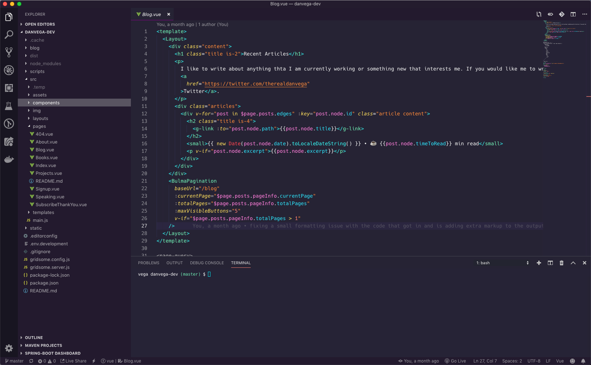
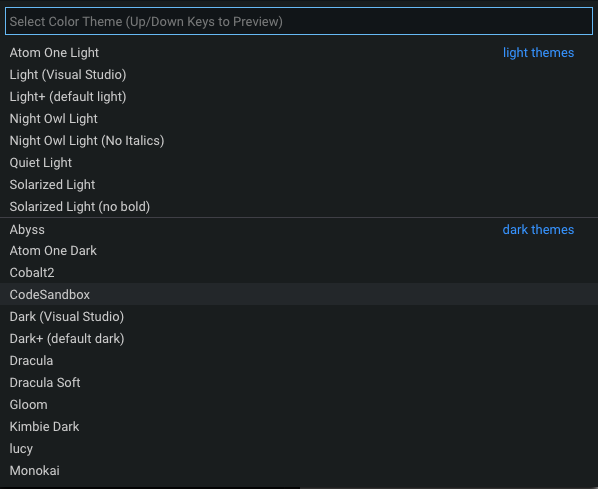
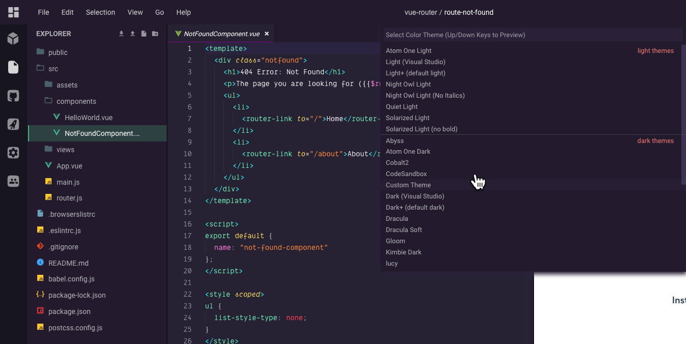

This is going to be a short tutorial today but it's a goodie. In my [last article](https://www.danvega.dev/blog/2019/05/02/gridsome-codesandbox-plugin), I talked about what [CodeSandbox](https://codesandbox.io/) is and why I love it so much. In this article, I am going to give you a quick tip on how to customize the VSCode Theme in CodeSandbox.

## Visual Studio Code Themes

I think one of the first things developers like to do when they start using VSCode is to customize the theme. VSCode comes with a lot of great built-in themes and my more in the extension marketplace.  

If you [follow me on Twitter](https://twitter.com/therealdanvega) you might already know this but for those of you who don't 🤔 I have a new favorite VSCode Theme and it's called [Synthwave 84](https://github.com/robb0wen/synthwave-vscode). 

This a quick description of where the author ([Robb Owen](https://github.com/robb0wen)) got his inspiration from 

> This colour scheme is influenced by the music and the cover artwork of modern Synthwave bands like FM-84, Timecop 1983 and The Midnight. By association, that means I've also taken heavy influence from the excellent retro-tinged artwork of [James White](https://signalnoise.com/) (check out his work, it's awesome).

I have been using it now for almost 2 weeks and I have really fallen in love with it. For some reason it just puts me in a calm/good mood. Here is a quick screenshot of what editing my blog in this theme looks like.

Now that I have this theme on all of my machines it's time to move this over to CodeSandbox. It uses VSCode so this should just work right? 

## Custom VSCode Theme in CodeSandbox

When I first started using CodeSandbox I thought I was limited to whatever themes were preloaded in the editor. If you open a project in CodeSandbox and go to `File > Preferences > Color Theme` you will be presented with a list of Themes. 

After scrolling through the list I quickly found out that my new favorite theme was not available. What was I going to do? How would I ever be productive without it? I am joking of course but us developers love to have consistency across our development environments. 

After doing some digging I found out that it was possible to bring Synthwave 84 over to CodeSandbox and here is how you do it. From the editor go to `File > Preferences > CodeSandbox Settings`. You will notice under Editor Theme there are instructions to use a Custom VSCode Theme.

If that is a little hard to read from the screenshot here are the instructions. You can use your own theme from VSCode directly: 

1. Open VSCode 
2. Press (CMD or CTRL) + SHIFT + P
3. Enter: `> Developer: Generate Color Scheme From Current Settings`
4. Copy the contents and paste them here.

After that is done you can close that dialog by just clicking outside of it. To activate the theme go back to your list of Color Themes `File > Preferences > Color Themes` and select Custom Theme. If you don't see `Custom Theme` as an option you might need to refresh CodeSandbox.

With that my new favorite theme is in CodeSandbox and I can get back to being a semi-productive developer!

## Conclusion

If you can't tell already I am really loving everything about CodeSandbox right now. I am using it more and more personally and I have introduced it as a tool that we can take advantage of at work and the whole team is on board. Are you using CodeSandbox and if so for what? Also please let me know what some of your favorite themes are. As always...

Happy Coding
Dan