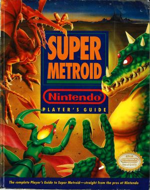

2019 seems to be the year of the live coder. In this article I am going to tell you what you can learn from live coders. When I was younger I used to love playing video games. I actually do still enjoy them now but if I have free time these days I would much rather spend it working on code. 🤓

I remember the first Nintendo I got for Christmas and I thought it was the coolest thing ever. Every day after school my friend Mike and I use to play whatever game we were trying to conquer at the time. When we got stuck we couldn't turn to Google for the answers (Yes, I am that old). We had to wait for Nintendo Power, or a guide dedicated to that game or as a last result we would just ask our friends the next day at school.

|                                                                                |                                                       |
| ------------------------------------------------------------------------------ | ----------------------------------------------------- |
|  |  |

## Live Streaming Gamers

I bring this up because we are in the middle of an era of gamers who are live streaming. Twitch is the most popular platform for gamers and they saw 2.2 million broadcasters and 15 million daily views in 2018. Some of the top streamers on the platform earn upwards of $300,000 a year while the top earner pulled in over $3.5 million for 2018.

These numbers are just mind blowing to me and shows just how little faith I had in the idea when I first heard about it. My initial reaction was "Why would anyone want to watch someone else play a video game"? It's funny to think about my reaction because if I start to think about it I did the same thing when I was younger but on a much smaller scale.

When I first got into video games we didn't have the ability to play with others online. If we wanted to test our skills against the best we had to go to the arcade at the mall. I was really into Street Fighter and Mortal Kombat and used to think I was so good until I got to the mall and found out there were some much better players out there.

After I got beat though I used to stand around the big crowds and watch the really good players play. Not because I didn't have anything better to do but because I wanted to learn why they were so good. What strategies were they using to dominate anyone who played against them.

This was the big picture point I was missing when I first dismissed the idea of live streaming. I am sure there are other reasons to watch these days as a lot of the big earners are just fun to listen to and there is a lot of entertainment value there.

You can probably see where I am going with this but I thought it would be good to relate it to this experience.

## Live Streaming Coders

While 99% (not a real % just feels that way) of Twitch is using the platform to live stream gaming there is a small percentage of coders that have been using it to write code. YouTube & Facebook also give us the ability to go live in front of audience with the push of a button. There are also services like [Restream.io](http://restream.io) that allow you to stream to multiple platforms at once.

This is not anything new as there have been developers who have done this before but it just feels like 2019 is where this has really started to take off. There are a handful of developers that I have been watching this year and I have really enjoyed it.

I started telling friends and people at work about this and the immediate reaction I got was "Why would you want to watch someone else live code?". Does that sound familiar? Most of the time it's not as dismissive as my initial gaming comments but there is usually an eye roll involved.

The biggest argument I get is why wouldn't these developers just create a video and edit out their mistakes and upload this to YouTube like we have been doing for years now.

### Problem Solvers

Problem solving is a key skill that all developers will need as they get started and it's something they will improve on throughout their career. The ability to break down a problem into smaller problems to solve the overall problem is something I do on a daily basis.

So when I hear comments like "I would rather just see the finished product" I have to disagree. There is so much that goes into watching another developer talk through his or her thought process when they are trying to solve a problem.

There is a reason that this is a part of the interview process. You might not always have all the answers but what we are looking for there is your ability to break down a problem into smaller problems and solve those one at a time.

### Rock Star Developers (They are like us)

The other part of watching someone live code is understanding that we all have the same struggles. This isn't always the case but usually the developers who are live coding have a lot of experience under their belt.

I think we hold some developers to a higher standard and think that they don't have the same struggles as we do. So when we see some of these rockstar developers that we all look up to doing the same things that we do, it really helps give us some confidence in our own abilities.

When I see someone unsure of a particular API or not sure how to do something and watch them Google for the answer I think it makes all of us realize that we are all in the same boat. Sure there are probably some really brilliant engineers out there who can code for hours without looking anything up but the rest of us just don't work like that.

### Tips and Tricks

I think another underrated feature of watching live coders is picking up little tips and tricks that developers take for granted. You might start watching because of the headlines but you will stay for the tips and tricks. While a developer might have a live session to build a new app from start to finish I always find the small things really helpful.

I like learning about the different tools in a developers toolbox. Even if its a tool I have heard of or even used before seeing how someone else uses it might inspire me to use it in a way I wouldn't of thought of. I also love seeing how developers setup their IDEs or what themes and extensions they are using.

### Live or Recorded

All of these benefits can also be gained through watching a recording. I need to make sure that I am very clear about this. I don't mean that you need to watch them as they are live but there is a big advantage to watching them live and that is the interaction. A lot of live coders are very interactive with the audience and use them to drive tutorials and discussions so don't be afraid to speak of.

When it comes to live coding you can certainly watch a recording but all I am referring to is that the developer didn't edit down the video to be perfect. When I am talking about live coding I want to see developers talk through problems and stumble just like we all do.

## Live Coding

Now that you know why I love watching developers live code I want to leave you with some next steps. First we are going to start with some developers who are live coding regularly and then I will leave you with some resources if you're interested in live streaming yourself.

### Developers to follow

This is a list of developers that I have either watched at one point or watch on a regular basis. This list is in no particular order and I think everyone below is really amazing and I appreciate all of their efforts. These developers take time out of their day to help others so if you have a chance reach out to them and thank them for everything that they do.

| Name             | Twitter                             | Twitch                               | YouTube                                                  |
| ---------------- | ----------------------------------- | ------------------------------------ | -------------------------------------------------------- |
| Chris Sevilleja  | https://twitter.com/chrisoncode     | https://www.twitch.tv/chrisoncode    |                                                          |
| Brian Clark      | https://twitter.com/_clarkio        | https://www.twitch.tv/clarkio        |                                                          |
| Fun Fun Function | https://twitter.com/mpjme           | https://www.twitch.tv/funfunfunction | https://www.youtube.com/funfunfunction                   |
| Suz Hinton       | https://twitter.com/noopkat         | https://www.twitch.tv/noopkat        |                                                          |
| Aaron Frost      | https://twitter.com/aaronfrost      | https://www.twitch.tv/frostydev      |                                                          |
| Daniel Shiffman  | https://twitter.com/shiffman        |                                      | https://www.youtube.com/user/shiffman                    |
| Jeff Fritz       | https://twitter.com/csharpfritz     | https://www.twitch.tv/csharpfritz    |                                                          |
| Steve Smith      | https://twitter.com/ardalis         | https://www.twitch.tv/ardalis        |                                                          |
| Brendan Enrick   | https://twitter.com/brendoneus      | https://www.twitch.tv/DevChatter     |                                                          |
| Ted Young        | https://twitter.com/jitterted       | https://www.twitch.tv/jitterted      |                                                          |
| Kent C Dodds     | https://twitter.com/kentcdodds      |                                      | https://www.youtube.com/channel/UCz-BYvuntVRt_VpfR6FKXJw |
| Scott Tolinkski  | https://twitter.com/stolinski       |                                      | https://www.youtube.com/c/leveluptuts                    |
| Ed Charbeneau    | https://twitter.com/EdCharbeneau    | https://www.twitch.tv/edcharbeneau   |                                                          |
| Alec Dilanchian  | https://twitter.com/alec_dilanchian | https://www.twitch.tv/pixelogicdev   |                                                          |
| Nick Larsen      | https://twitter.com/fody            | https://www.twitch.tv/nick_larsen    |                                                          |

This is **NOT** a full list so if you think I have left someone off who should be recognized please reach out and I will get this updated. I would also like to mention the [Live Coders Twitch Group](https://www.twitch.tv/team/livecoders) which has a really nice collection of developers who are live streaming so check them out.

## Live Streaming Setup

Live streaming is one of those things that I wish I had more time to do. I have a list of about 10 things that I would love to walk through not to mention I have a ton of blog posts that could transfer to video.

I have done a total of 1 live stream so I am not the best person to ask for live streaming setup advice but I do have a couple resources for you.

Suz Hinton (who is on the list above) is an amazing developer who does live streaming on Twitch. She put together an amazing article on her [Live Coding Setup](https://medium.com/@suzhinton/my-twitch-live-coding-setup-b2516672fb21) that is a must read if you're looking to get into this space.

### Ecamm Live

I also want to mention [Ecamm Live](https://www.ecamm.com/mac/ecammlive/) which is the all in one live streaming production platform for the mac. If you're on a mac this an amazing piece of software with some really great features. I used it for the 1 broadcast I did but you can also use it for recording videos. If you're interested in hearing more about this reach out to me and let me know. I would love to do a detailed write up on Ecamm Live and the awesome team behind it.

## Conclusion

If you can't tell from this article I really love everything you can learn from live coders. I am curious about your thoughts on developers live streaming. What do you get out of it? Who are some of your favorites? If I were to start live streaming what would you like to see from me? Until next time friends...

Happy Coding
Dan
