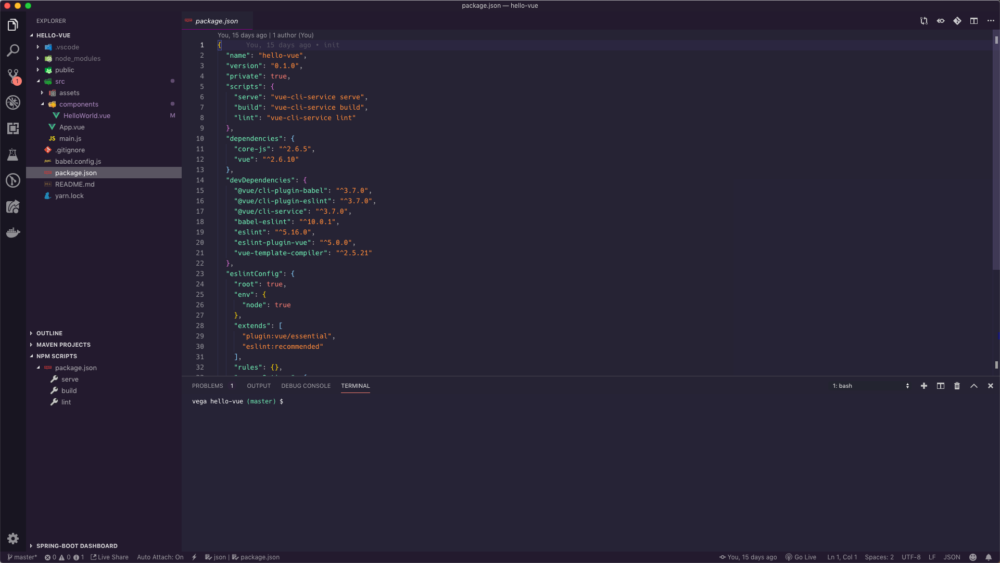
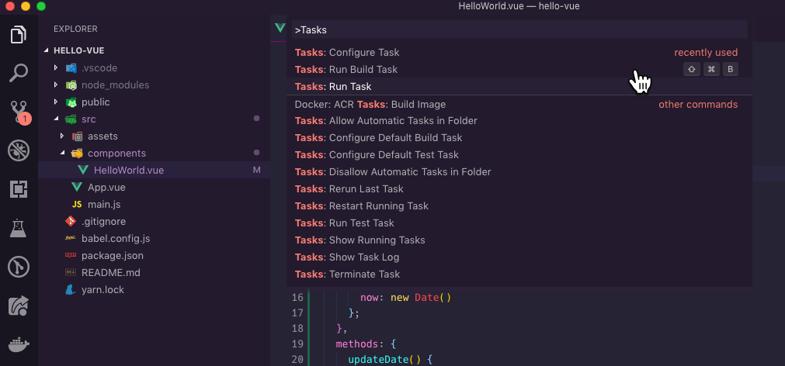
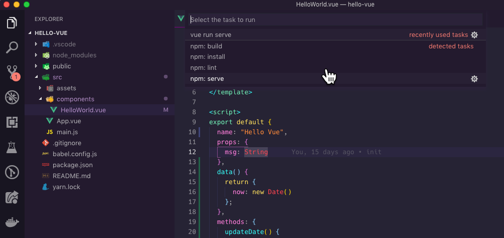
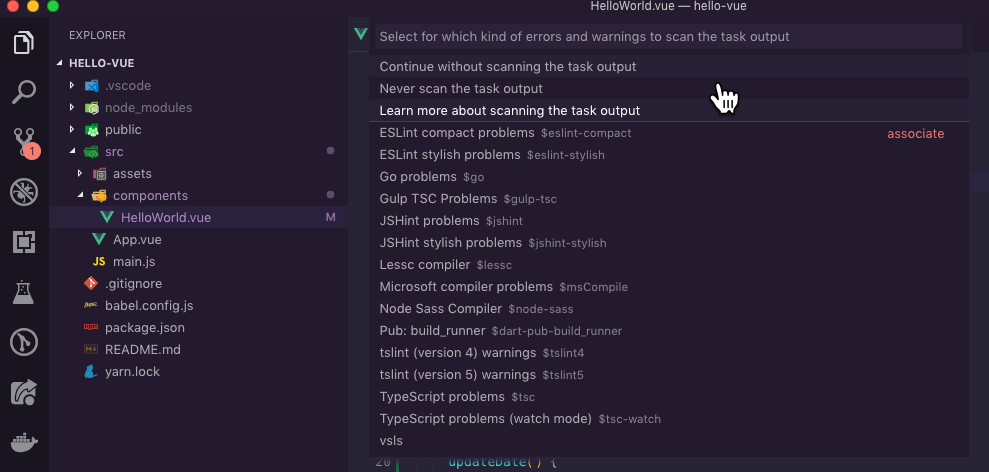
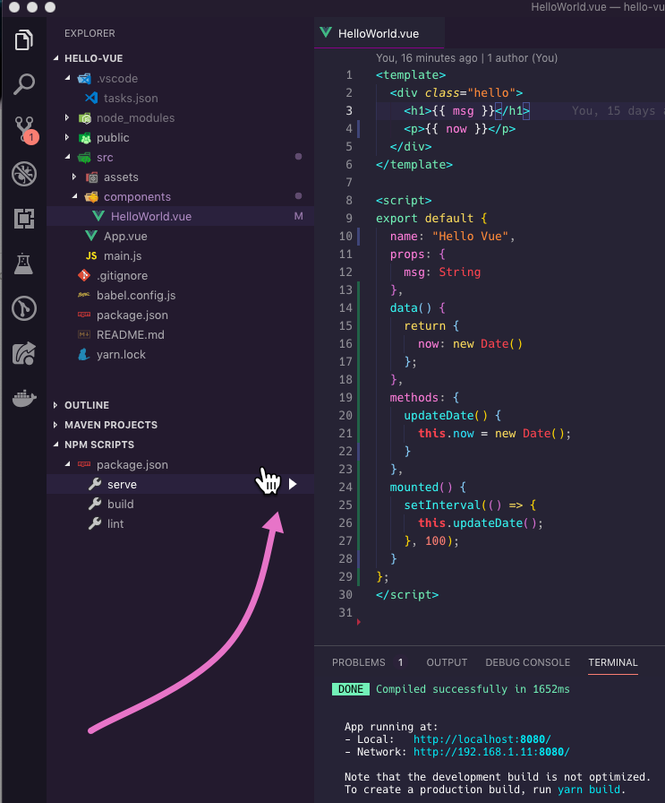

In this tutorial, I am going to show you 3 ways to run your VueJS applications from Visual Studio Code. This will also work for any NPM project that has a `package.json` but I am going to focus on Vue for this article. I have found that developers who are new to both NPM & Vue have some difficulty getting started so hopefully this will help.



## Node, NPM & package.json

If you're new to Node & NPM the good news is you don't need to know everything to get up and running. Whenever you see a `package.json` just know that this file is there to help you manage your project. In this file, you will find metadata about the project, packages that this project depends on and scripts that are available to run. Here is a simple `package.json` of a project created using the [Vue CLI](https://cli.vuejs.org/).

```javascript
{
  "name": "hello-world",
  "version": "0.1.0",
  "private": true,
  "scripts": {
    "serve": "vue-cli-service serve",
    "build": "vue-cli-service build",
    "lint": "vue-cli-service lint",
    "test:e2e": "vue-cli-service test:e2e",
    "test:unit": "vue-cli-service test:unit"
  },
  "dependencies": {
    "core-js": "^2.6.5",
    "vue": "^2.6.10"
  },
  "devDependencies": {
    "@vue/cli-plugin-babel": "^3.7.0",
    "@vue/cli-plugin-e2e-cypress": "^3.7.0",
    "@vue/cli-plugin-eslint": "^3.7.0",
    "@vue/cli-plugin-unit-mocha": "^3.7.0",
    "@vue/cli-service": "^3.7.0",
    "@vue/test-utils": "1.0.0-beta.29",
    "babel-eslint": "^10.0.1",
    "chai": "^4.1.2",
    "eslint": "^5.16.0",
    "eslint-plugin-vue": "^5.0.0",
    "vue-template-compiler": "^2.5.21"
  }
}
```

## Visual Studio Code

Now that you have a brief introduction to what information the `package.json` contains it's time to learn how to run our VueJS applications from Visual Studio Code.

### Using the integrated terminal

The first way to run your VueJS applications from Visual Studio Code is the one you might have already learned about and that is by using the integrated terminal. If you're opening up a new terminal/command prompt to run your projects this will speed things up and bring everything back to Visual Studio Code.

With your project open in Visual Studio Code hit the keyboard shortcut (cmd/ctrl) + `. The backtick is located right above the tab key on your keyboard. This will open the integrated terminal and from there you can run any script for your project.

### What commands can I run?

Now this is often a point of confusion for those new to VueJS and NPM in general. What is the command that I type to start my application? What is the command that I type to run my tests? After you have been working in Vue for a while these will become second nature but there are cases where you might inherit a project that has custom scripts.

The easiest way to find out what scripts are available is to open the `package.json` and look in the scripts block.

```javascript
{
  "name": "hello-world",
  "version": "0.1.0",
  "private": true,
  "scripts": {
    "serve": "vue-cli-service serve",
    "build": "vue-cli-service build",
    "lint": "vue-cli-service lint",
    "test:e2e": "vue-cli-service test:e2e",
    "test:unit": "vue-cli-service test:unit"
  },
  ...
}
```

Looking at this I can tell right away that the 5 scripts I have available to me are:

- serve
- build
- lint
- test:e2e
- test:unit

So if I want to run any of these I simply type `npm run serve` or the name of the script you want to run. The serve script is the one that will start your application up in development mode. The scripts block above is what a typical VueJS project will look when you create it using the Vue CLI and selecting both Unit & End to End testing.

There is a chance that if you're working on an existing project there could be a bunch of custom scripts. [In a recent article](https://www.danvega.dev/blog/2019/04/23/gridsome-blog-post-generator), I documented the process that I used to create a new post generator that I can run to add a new blog post. In that case, I have a `newpost` script so to run that I just run the command `npm run newpost`.

```javascript
{
  "name": "danvega-dev",
  "private": true,
  "scripts": {
    "build": "gridsome build",
    "develop": "gridsome develop",
    "explore": "gridsome explore",
    "newpost": "node ./scripts/newpost.js"
  },
```

### Tasks: Run Task

So that's how we run scripts from the command line but not everyone loves typing out commands every time they want to run a project. With your project open the command palette by using the menu item `View > Command Palette` or by using the keyboard shortcut `Shift + CMD + P` or `Shift + CTRL + P` on Windows. From there type `Tasks` and click on the Run Task command.



This will examine your project and give you a list of the available scripts to run.



You can click on `npm:serve` or you can start typing the word serve and hit enter when it's selected to run it without using your mouse. If you see the following options you can go [here to learn more about scanning the task output](https://code.visualstudio.com/docs/editor/tasks#vscode).



If you hit continue without scanning the task output Visual Studio Code will run your task. This opens up a terminal for you and runs the script.


_The next time you run the task you won't be asked about scanning the output and this process becomes very quick_.

### NPM Scripts Explorer

If you follow me on Twitter I put this tweet out promising a tip that you might not know existed.

https://twitter.com/therealdanvega/status/1128628100898619392

To enable this go into your Visual Studio Code settings and add the following setting

```javascript
"npm.enableScriptExplorer": true,
```

With your project open you will now have a NPM Scripts Explorer in the sidebar. If you click on the play icon next to the script name it will run the script for you, how awesome is that!



## Conclusion

I hope this article was helpful in identifying and running your VueJS applications from Visual Studio Code. There is usually more than one way to accomplish a task and not all of us have the same preferences. As always friends...

Happy Coding<br/>
Dan
