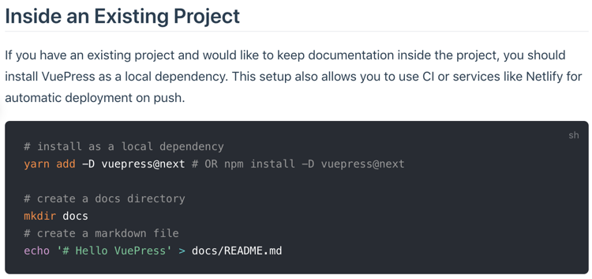

This is going to be a pretty short tutorial but I was so excited that I had to share it with all of you. It isn't often but there are times where I need to share a markdown code block in a blog post or in a Github comment and I never know how to do it. In this article, I am going to show you how to escape a backtick ` within a code block in Markdown

## Fenced Code Blocks

If you have made it this far I am going to assume you're pretty familiar with Markdown. You can create fenced code blocks by placing triple backtick ``` before and after the code block. Whatever Markdown processor you're using will have a plugin that takes that code and the language you defined and add some highlighting to it.

In the following example I am using VuePress and in my markdown template I want to display text and some code to a user.

````markdown
## Inside an Existing Project

If you have an existing project and would like to keep documentation inside the project, you should install VuePress as a local dependency. This setup also allows you to use CI or services like Netlify for automatic deployment on push.

```bash
# install as a local dependency
yarn add -D vuepress@next # OR npm install -D vuepress@next

# create a docs directory
mkdir docs
# create a markdown file
echo '# Hello VuePress' > docs/README.md
```
````

When that is rendered to the page it looks like this:



Anything in between the triple backtick ``` is processed by the Markdown processor (in this case Markdown-it) and turned into the nice looking code block you see above complete with syntax highlighting. So knowing that the markdown process will take that code and turn it into a nice looking code block how can I display the actual code to you on this blog post or in a Github comment?

## Escaping the backtick

The answer is of course that you need to escape the backtick. Seems like something that would be really easy to do but after a lot of searching I kept coming up empty. I'm happy to tell you that I have found an answer to this but it might differ for you depending on the markdown processor you're using.

The first solution to our problem is to use more backticks. You will need to place 4 of them around your code block that contains 3. Notice that I have also specified the language as markdown which will allow you to get some syntax highlighting for your code.

~~~markdown
````markdown
```js
console.log('Hello, World!');
```
````
~~~~

Will render the following instead of displaying the console.log inside of a rendered code block.

````markdown
```js
console.log('Hello, World!');
```
````

If you're going to have multiple blocks you don't need to surround each of them with 4 backticks. You can just put this around all of the text that you need to be escaped.

~~~markdown
````markdown
This is some text
```js
console.log('Hello, World!');
```

```js
console.log('Hello, World!');
```
````
~~~

If you don't want to add more backticks or your markdown processor doesn't support it you can also solve this problem by using the tilde character. Another really good use case for 2 different options is this blog post. If I didn't have 2 options I wouldn't be able to escape the escape. This is getting very Inception like so I am going to stop here 🤯

````markdown
~~~markdown
This is some text
```js
console.log('Hello, World!');
```

```js
console.log('Hello, World!');
```
~~~
````

## Conclusion

I hope this short tutorial saved your desk from your head banging on it 😉and as always friends...

Happy Coding<br/>
Dan
