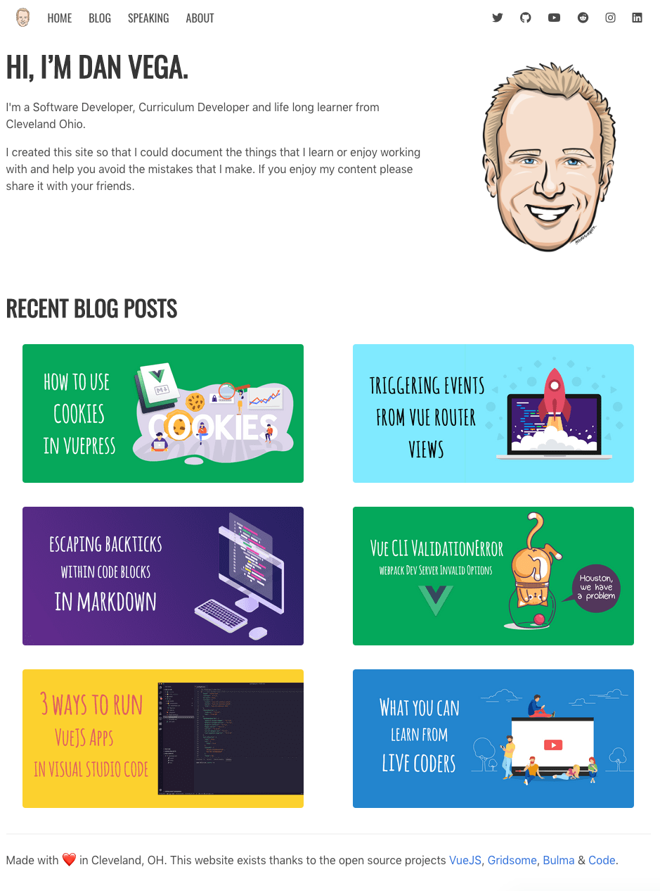
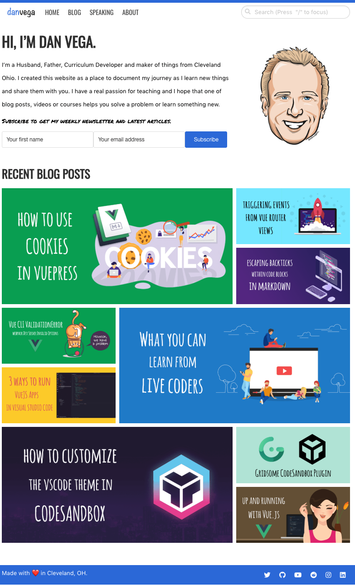
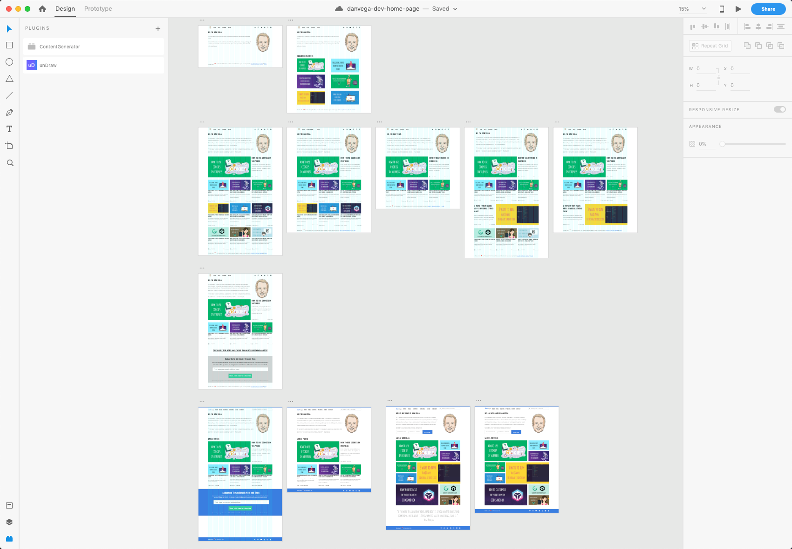
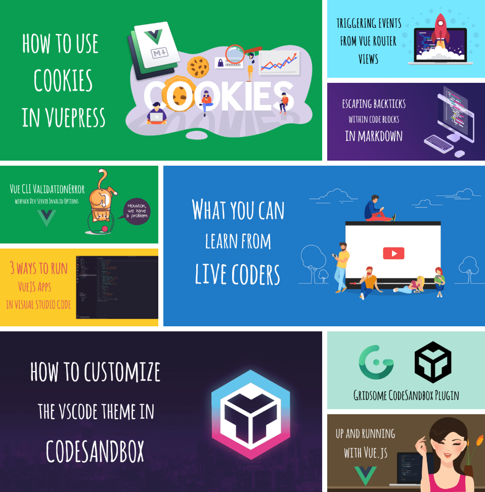
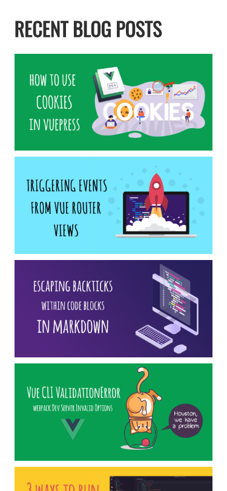
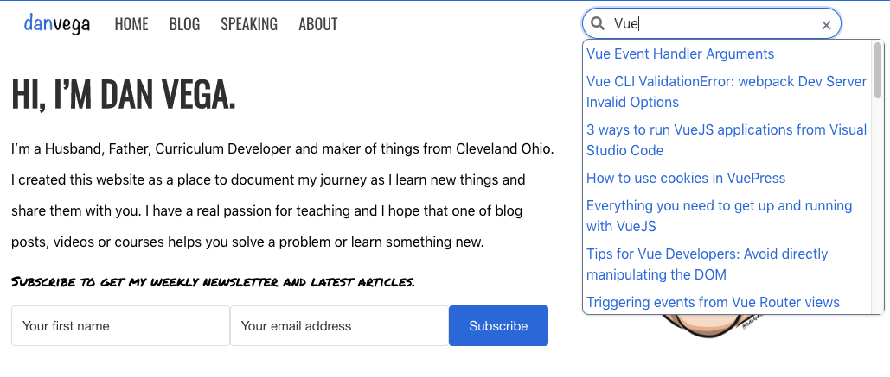
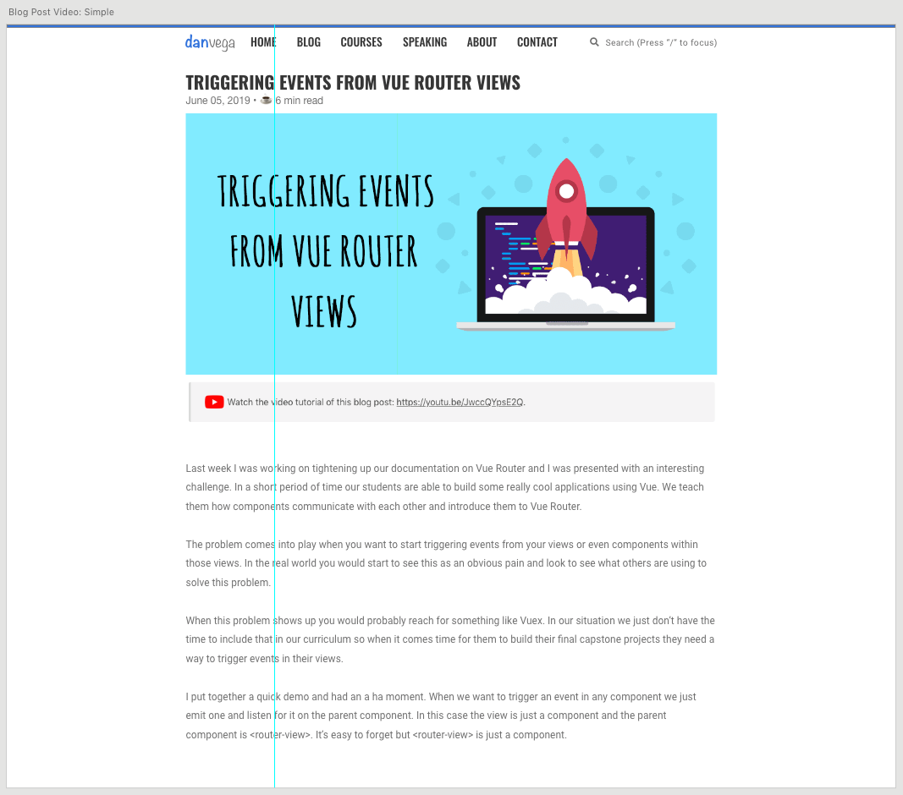
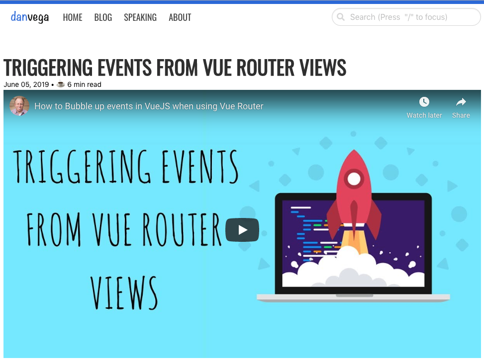

I launched my new personal website earlier this year and I am really happy with how it's been working out. I believe in the "ship it early and often" philosophy so my first priority is to get something out there and then improve on it later. Well, it's later now, and I have built a list of features and improvements that I wanted to add to this website. In this article, I will tell you what I have been working on and why I made the few changes that I did.

## New Look & Feel

In case you are reading this in a galaxy far far away and this site has completely changed here is what the previous landing page looked like and what it looks like now.

### Before (January 2019)



### After (July 2019)



I know it's not a huge difference but it feels much cleaner to me and I added some features that are going really going to help improve my visitor's experience. Design is one of those things that I have just never been really good at.

I am able to put together very simple and clean layouts but trying to come up with the look is where I have struggled forever. The reason for this is I usually go into it without much of a plan. I would jump right into the code and try to start slapping elements together and hope for the best. After some amount of time with nothing to show for it, I would usually give up and move on.

### Adobe XD

I have the entire Adobe Creative Suite so I have been looking for a reason to jump in and learn how to use [Adobe XD](https://www.adobe.com/products/xd.html) and this was the perfect opportunity. If you aren't familiar with Adobe XD it is a design tool that lets you prototype out a design quickly and share it with the world.

What I really appreciate about this tool is just how non-designer friendly it was. I got up to speed in just a couple hours and I was able to to put together some ideas on what I wanted the home page to look like. I also love that I can quickly duplicate artboards and try something new. Now that I could actually see all of these options in front of me I knew what I wanted the new look and feel to look like. With that, I could now open a code editor and get straight to work knowing what I was going to build.



## Bulma CSS

When I started this project it was the first time that I had ever used the [Bulma CSS Framework](https://bulma.io/). The best way to learn something new is to build something with it so I decided to give it a shot and I am glad I did. I have really enjoyed working with Bulma but as I started to work on the new layout one thing became apparent, I was using Bulma wrong.

The first thing you need to understand is how to create layouts in Bulma. The [container class](https://bulma.io/documentation/layout/container/) is great for creating a simple container that centers your content horizontally. The `.container` class can be used in any context, but mostly as a direct child of either:

- `.navbar`
- `.hero`
- `.section`
- `.footer`

This is where I messed up the first time by not using the top level layouts and container correctly and it was causing some issues. When you want to divide your page into sections you can use the `.section` class along with `.container` to create a nice looking responsive section.

```html
<section class="section">
  <div class="container">
    <h1 class="title">Section</h1>
  </div>
</section>
```

The other problem I was having was with how I was importing Bulma. In my `/src/main.js` I was just importing Bulma and this approach wasn't working because I wasn't able to customize my [Bulma variables](https://bulma.io/documentation/customize/variables/). I needed the ability to do this so I could turn off the widescreen and HD breakpoints in the responsive system.

I created a new stylesheet and I import that in `/src/main.js`

```js
import '~/assets/style/index.scss';
```

In there I import a custom stylesheet called variables before I import Bulma and this allows me to customize everything.

```css
/** Import the Bulma variables */
@import "variables";

/** Import Bulma */
@import "~bulma";

/** Import overrides */
@import "overrides";
```

Now I can turn off those break points in Bulma.

```scss
$widescreen-enabled: false;

$fullhd-enabled: false;
```

## Recent Posts Grid

The biggest change and challenge was adding a new layout for recent posts. The first thing I needed to do was grab the 9 latest articles and with GraphQL this is pretty easy.

```graphql
<page-query>
query Posts {
  recentPosts: allPost(perPage: 9) {
    edges {
      node {
        id
        title
        cover
        path,
        date(format: "MMMM DD, YYYY"),
        timeToRead
      }
    }
  }
}
</page-query>
```

Now that I have my posts I can loop over them and display them.

```html
<div class="posts">
  <div v-for="post in $page.recentPosts.edges" :key="post.node.id" class="post">
    <g-link :to="post.node.path" :aria-label="post.node.title">
      <div class="overlay"></div>
      <g-image :src="post.node.cover.src" class="post-img" :alt="post.node.title" />
      <div class="post-details fadeIn-bottom">
        <h3 class="post-title">{{ post.node.title }}</h3>
        <p class="post-text">{{ post.node.date }} • ☕️ {{ post.node.timeToRead }} min read</p>
      </div>
    </g-link>
  </div>
</div>
```

The toughest part was with the grid being so dynamic how would I be able to get the sizes I wanted from specific grid items. It turns out this was easier than I thought it would be using CSS[: nth-child() selector](https://developer.mozilla.org/en-US/docs/Web/CSS/:nth-child).

```css
.posts {
  display: grid;
  grid-template-columns: repeat(3, 1fr);
  grid-gap: 10px;
  margin-bottom: 30px;
}

.post {
  position: relative;
  overflow: hidden;
}
.post:nth-child(1),
.post:nth-child(6),
.post:nth-child(7) {
  grid-column: span 2;
  grid-row: span 2;
}
.post:nth-child(6) {
  grid-column: 2/4;
  grid-row: 3/5;
}
.post:nth-child(4),
.post:nth-child(5) {
  grid-column: 1;
}
.post:nth-child(3),
.post:nth-child(5),
.post:nth-child(9) {
  display: flex;
  align-self: flex-end;
}
.post-img {
  width: 100%;
  height: 100%;
  object-fit: cover;
}
```

Which gives us this really nice grid layout.



The other thing to think about is what is this going to look like for mobile users. In this case, I decided to use a media query to just stack them when we hit a certain breakpoint.



## Search

When I first started this blog I did so without migrating posts from my current blog which had close to 1000 articles on it. Because I only had a few I had no real need for search at the time. Now that I have been writing for a while and I have migrated some of my posts over I have a real need for it.

My first pass on this was to use Algolia Search which I have to say is a really great product. I actually had it working pretty well but it did take me awhile and what I found out in the end is that it was overkill for what I needed to do.

I saw a [presentation from Andre Madarang](https://www.youtube.com/watch?v=6i8D8j5Gkk8) on VueJS Search with [vue-fuse](https://github.com/shayneo/vue-fuse). This was the first time I heard of vue-fuse and I was really excited about the idea. Vue Fuse is a wrappper for [Fuse.js](https://fusejs.io/) library which is a lightweight fuzzy search library.

I pretty much followed Andre's tutorial to get the search component setup and then realized that for this to work we need to build a json file of blog posts each time we build as the source for the search. In Gridsome you can do this in the `gridsome.server.js`

```js
const fs = require('fs');
const path = require('path');
const pick = require('lodash.pick');

module.exports = function (api, options) {
  api.loadSource(store => {
    // Use the Data store API here: https://gridsome.org/docs/data-store-api
  })

  api.beforeBuild(({ config, store }) => {

    // Generate an index file for Fuse to search Posts
    const { collection } = store.getContentType('Post');

    const posts = collection.data.map(post => {
      return pick(post, ['title', 'path', 'excerpt']);
    });

    const output = {
      dir: './static',
      name: 'search.json',
      ...options.output
    }

    const outputPath = path.resolve(process.cwd(), output.dir)
    const outputPathExists = fs.existsSync(outputPath)
    const fileName = output.name.endsWith('.json')
      ? output.name
      : `${output.name}.json`

    if (outputPathExists) {
      fs.writeFileSync(path.resolve(process.cwd(), output.dir, fileName), JSON.stringify(posts))
    } else {
      fs.mkdirSync(outputPath)
      fs.writeFileSync(path.resolve(process.cwd(), output.dir, fileName), JSON.stringify(posts))
    }
  })
}
```



The styles don't look great on this right now but that is something I can come back and fix up later.

## Newsletter

Another one of the main reasons for the new look and feel is because I wanted to get a call to action front and center when you visited my home page. I am working on plans to actually start writing a newsletter every Sunday so I am trying to build my list up.

## Video Covers

There are a few blog posts that I have screencasts of and in those cases, I want to make the visitor aware of them. Some people (heck probably most) would prefer to watch a video over reading a post so I want to start offering this to visitors.

I went back to Adobe XD and tried to come up with a solution to this problem. My first and only idea was to just put a link below the cover image if there was a video. This functionality would work but didn't look all that great and didn't feature the video the way I wanted it to.



I asked for some advice on Twitter and Ryan Edgar replied with an awesome suggestion.

https://twitter.com/ryanedg/status/1147426471633440768

I immediately got to work and to get started I added a new property to the front matter for this blog post.

```yaml
---
slug: 'triggering-events-router-vue'
title: 'Triggering events from Vue Router views'
date: '2019-06-05T20:13:17.445Z'
published: false
excerpt: 'In this article, I will show you how to trigger events from views using the Router View component.'
author: 'Dan Vega'
tags: ['vue']
cover: ./triggering-events-router-vue-cover.png
video: https://www.youtube.com/embed/JwccQYpsE2Q
---
```

Now in my post template I could check to see if the post had a video and if did I would display that an not the cover.

```html
<div class="embed-container" v-if="$page.post.video">
  <iframe
    width="1000"
    height="563"
    :src="$page.post.video"
    frameborder="0"
    allow="accelerometer; autoplay; encrypted-media; gyroscope; picture-in-picture"
    allowfullscreen
    v-if="$page.post.video"
  ></iframe>
</div>
<g-image v-if="!$page.post.video && $page.post.cover" :src="$page.post.cover" class="cover" />
```

Now when you go to a [post that has a video](https://www.danvega.dev/blog/2019/06/05/triggering-events-router-vue) it will display the YouTube embed instead of the cover image.



If you're going to do something similar it's important to remember that you still need a cover image even if you aren't displaying one. This is because you will still use that image for social media sharing and you don't want to lose that.

## Conclusion

I have a lot of fun working on my personal website because I am constantly learning new things. If you can find side projects that are fun and allow you to learn you are getting the best of both worlds. This was meant to be more of an overview of features I have been working on. If there is anything in the post that I talked about and you would like me to go more in-depth, please reach out and let me know.  As always friends...

Happy Coding<br/>
Dan
