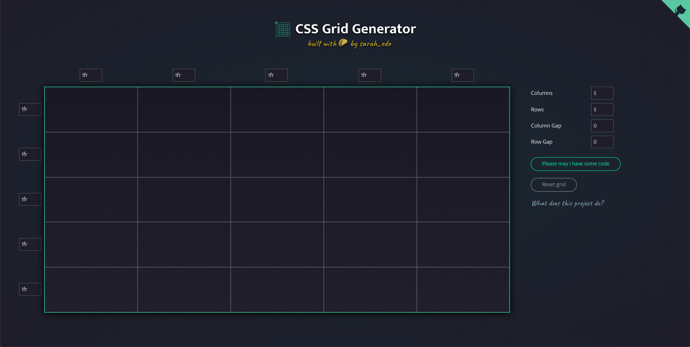
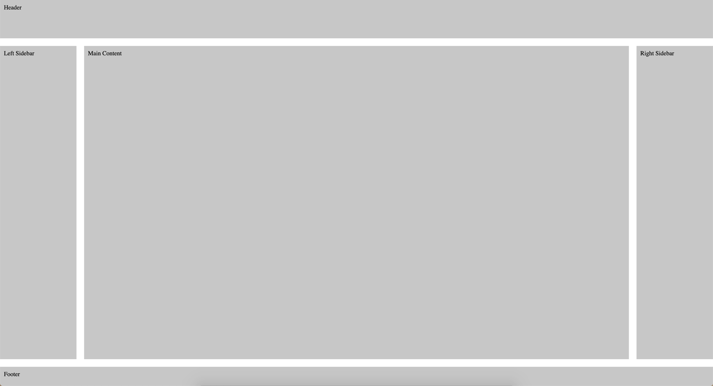
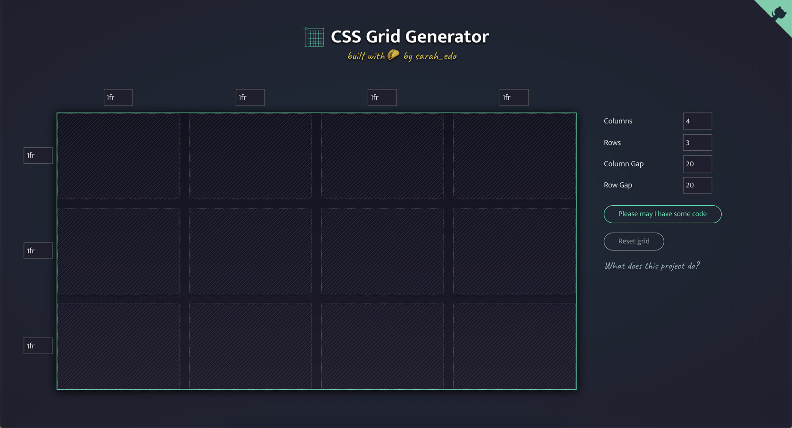
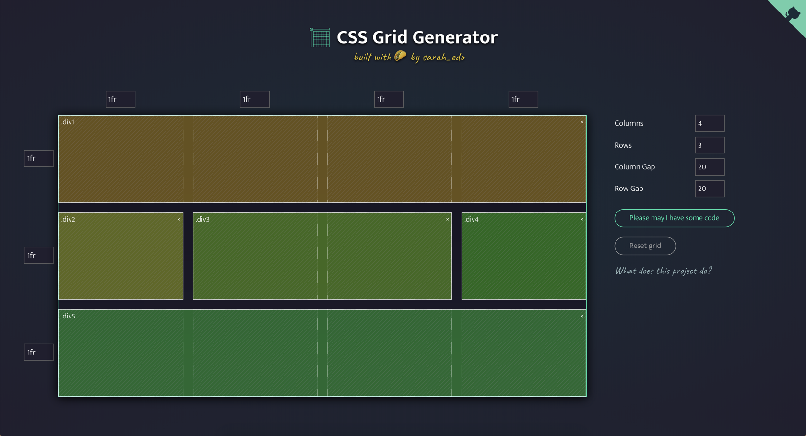
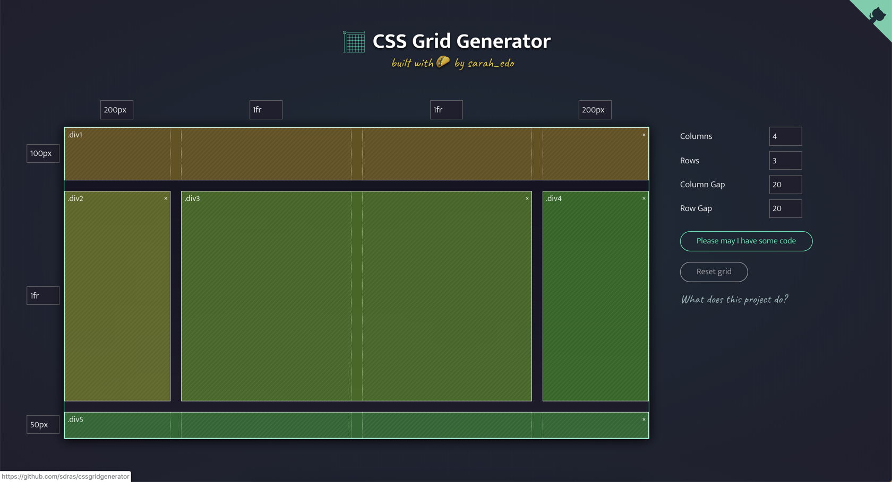
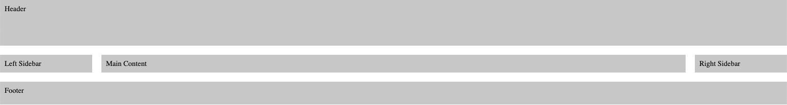

As someone who has been developing web applications for almost 20 years now, I have seen it all. I started in FrontPage, moved to Dreamweaver, nested tables inside of tables and learned how to float and clear fix everything.

While you won't see any awards for my designs on my bookshelf I am able to create some very nice simple and clean layouts. That said I have never really enjoyed it because it has always been a huge pain in the a\$\$. I have always felt like I was just hacking away until my layout looked almost like what I had in mind.

This is why when tools like [CSS Grid](https://css-tricks.com/snippets/css/complete-guide-grid/) & [Flexbox](https://css-tricks.com/snippets/css/a-guide-to-flexbox/) came along I was beyond excited about the possibilities of creating clean layouts. I think if you combine these 2 technologies along with just how far JavaScript has come it is what has really got me excited about front end development these days.

While I have a pretty good understanding of CSS Grid at this point I know it can be a little bit confusing to get started. That is why I am really excited to share with you a new tool that I came across that I really think can help you out if you're trying to understand CSS Grid.


[https://undraw.co/](https://undraw.co/)

## CSS Grid Generator by Sarah Drasner

[CSS Grid Generator](https://cssgrid-generator.netlify.com/) is a free tool created by the super talented [Sarah Drasner](https://twitter.com/sarah_edo). It is a visual design tool that allows you to create a basic grid layout and then copy the code that was used to create it. When you first open the tool you will be presented with a default layout but from here you can easily customize the layout to your needs.



### CSS Grid Layout Example

When I am learning something I find the best way to learn is by building something practical with my shiny new toy. In this article, you are going to take a very simple layout and then use the CSS Grid Generator to create the code needed to use in a real project. This is the finished layout with a little bit of styling just so each section is apparent.



Now that you know what we are aiming for we can start building it out the layout. Start by updating the right hand side to the following.

- Columns: 4
- Rows: 3
- Column Gap: 20
- Row Gap: 20

The gaps allow us to have some margin between our content. I could have just used column gap but I wanted some margin after the header and before the footer so that is what the row gap is doing.



Next you will want to define the different areas of your application. In the CSS Grid Generator you can click and drag to create an area. You will want the header to span the entire grid, the sidebars to take up one cell, the main content area to span 2 columns and the footer to span 4 columns. If you do everything correctly you should end up with something that looks like this.



This is starting to look more like our layout but you still need to define some sizes of different things. You will notice an input box next to each row and column that you can use to set a specific size.

- Header: 100px height
- Sidebars: 200px width
- Footer: 50px height



This is starting to look more like the layout we were going for but you might be asking what that `1fr` unit is.

> Tracks can be defined using any length unit. Grid also introduces an additional length unit to help us create flexible grid tracks. The new fr unit represents a fraction of the available space in the grid container.

The `1fr` in 2nd row will tell that area to take up the rest of the available space. If you set the container to `100vh` you can then have content that takes up the full page and same goes for the columns.

### CSS Grid Generated Code

If you look under the columns and row inputs on the right hand side you will see a button that says "Please may I have some code", click it. You should see some generated code that looks something like this. Click the copy button to copy the code and then head over to a text editor.

```scss
.parent {
  display: grid;
  grid-template-columns: 200px 1fr 1fr 200px;
  grid-template-rows: 100px 1fr 50px;
  grid-column-gap: 20px;
  grid-row-gap: 20px;
  .div1 {
    grid-area: 1 / 1 / 2 / 5;
  }
  .div2 {
    grid-area: 2 / 1 / 3 / 2;
  }
  .div3 {
    grid-area: 2 / 2 / 3 / 4;
  }
  .div4 {
    grid-area: 2 / 4 / 3 / 5;
  }
  .div5 {
    grid-area: 3 / 1 / 4 / 5;
  }
}
```

Create a new document `simple-layout.htm` and add the following code which will reset the margin and padding for the body.

```html
<!DOCTYPE html>
<html lang="en">
  <head>
    <meta charset="UTF-8" />
    <meta name="viewport" content="width=device-width, initial-scale=1.0" />
    <meta http-equiv="X-UA-Compatible" content="ie=edge" />
    <title>Simple Layout</title>
    <style>
      body {
        margin: 0;
        padding: 0;
      }
    </style>
  </head>
  <body></body>
</html>
```

Next add in the CSS (the copied code was in SASS but you can pull the divs out)

```html
<!DOCTYPE html>
<html lang="en">
  <head>
    <meta charset="UTF-8" />
    <meta name="viewport" content="width=device-width, initial-scale=1.0" />
    <meta http-equiv="X-UA-Compatible" content="ie=edge" />
    <title>Simple Layout</title>
    <style>
      body {
        margin: 0;
        padding: 0;
      }
      .parent {
        display: grid;
        grid-template-columns: 200px 1fr 1fr 200px;
        grid-template-rows: 100px 1fr 50px;
        grid-column-gap: 20px;
        grid-row-gap: 20px;
        height: 100vh;
      }

      .div1 {
        grid-area: 1 / 1 / 2 / 5;
      }

      .div2 {
        grid-area: 2 / 1 / 3 / 2;
      }

      .div3 {
        grid-area: 2 / 2 / 3 / 4;
      }

      .div4 {
        grid-area: 2 / 4 / 3 / 5;
      }

      .div5 {
        grid-area: 3 / 1 / 4 / 5;
      }
    </style>
  </head>
  <body></body>
</html>
```

What the tool gave you was the css needed to create this layout. You will need to add markup needed which by looking at the CSS is just a `.parent` with 5 `.div` nested. I am adding the text just so you can see each section.

```html
<body>
  <div class="parent">
    <div class="div1">
      Header
    </div>
    <div class="div2">
      Left Sidebar
    </div>
    <div class="div3">
      Main Content
    </div>
    <div class="div4">
      Right Sidebar
    </div>
    <div class="div5">
      Footer
    </div>
  </div>
</body>
```

Finally add the follow CSS that will just add some padding a background color for `.div1` - `.div5`

```css
div:not(.parent) {
  padding: 10px;
  background-color: rgb(199, 199, 199);
}
```

If you were to run this you would end up with the following.



This looks pretty good but you want this to take up the entire browser window. An easy way to fix this is to add `height: 100vh` to the `.parent` class

```css
.parent {
  display: grid;
  grid-template-columns: 200px 1fr 1fr 200px;
  grid-template-rows: 100px 1fr 50px;
  grid-column-gap: 20px;
  grid-row-gap: 20px;
  height: 100vh;
}
```

With that, you have the layout you were looking for!


This tool is meant to help you create a basic layout in CSS Grid really fast. From here it will be up to you to go out and learn more about CSS Grid so that you can start customizing and creating advanced layouts.

## Conclusion

The user interface of CSS Grid Generator is beautiful, clean and easy to use. I **love** that the entire project was written in Vue and hosted on [Netlify](https://www.netlify.com/), 2 of my favorite technologies.

If you're ever curious how a project like this is built you can pop open the source code and take a look (Thanks Sarah!). There is a nice SVG animation in the upper right hand side that will take you to the [Github repository](https://github.com/sdras/cssgridgenerator). I hope you found this tool as useful as I have, as always...

Happy Coding<br/>
Dan
