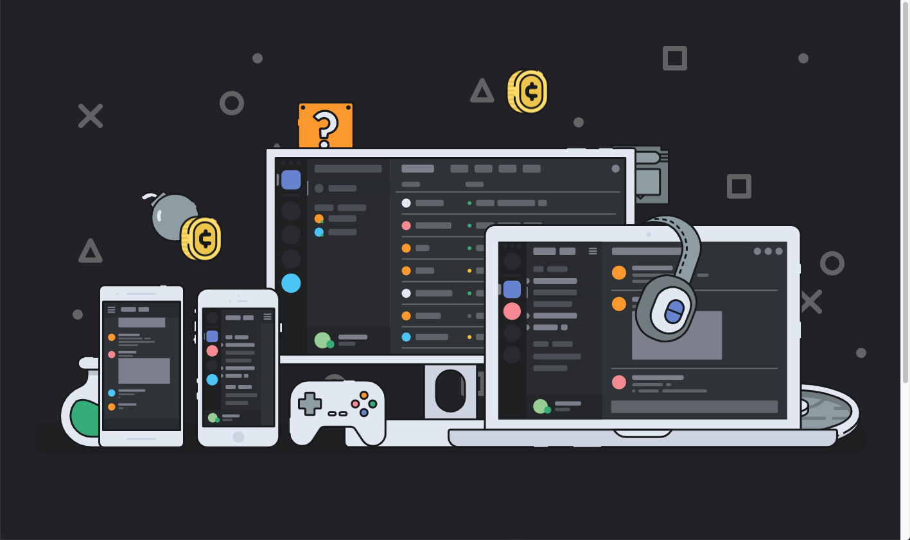
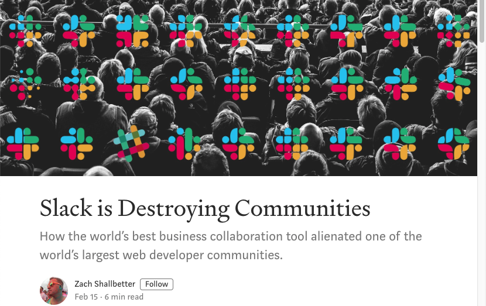
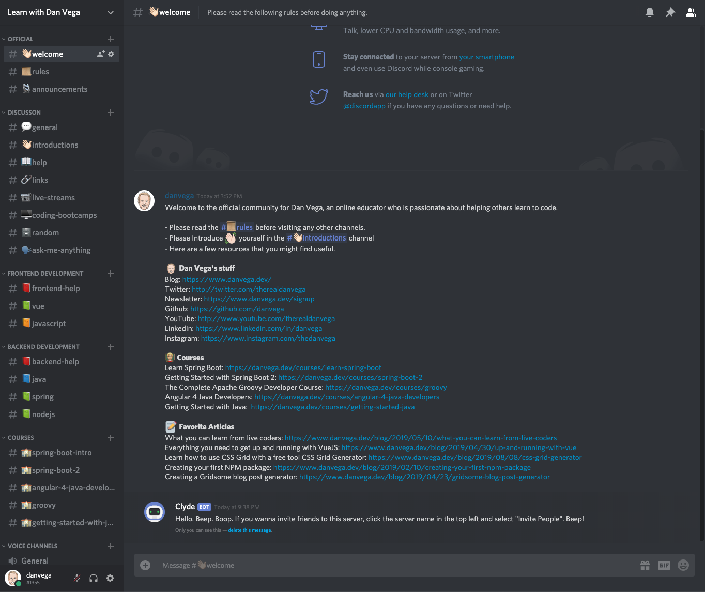

I have decided to create a [Discord](https://discordapp.com) community. I have been giving this a lot of thought for the last few months and I am really excited about it. In this article, I am going to give you a quick introduction to what Discord is, why I chose it as a platform and how it compares to something like Slack or Facebook Groups.

## What is Discord?

If you're not familiar with Discord it is an all-in-one voice and text chat for gamers that's free, secure and works on both your desktop and phone. For a long time Discord was primarily geared towards gamers, and it still is. With that said it has been building some pretty great features on that has been attracting communities to it.

I have been a part of 5 or so communities this year on Discord and have really fallen in love with how easy it to use. I also love in the communities I am in everyone has been very helpful and nice.

People want to join communities where they are going to have helpful discussions without being ridiculed. That is why Discord has a strong focus on preventing spam as well as giving server administrators the tools they need to moderate them.

## Why do I need a community?

The real question that I have been fighting with is ***Do I really need to start a community***? I mean who am I? I am just a guy on his small corner of the internet who likes to help people learn how to code. The more and more I started thinking about it though the more it made a lot of sense to me.

### Course Student Discussions

If you're new here I teach courses online and currently have over 85,000 students across multiple platforms. First It's become really hard to manage students questions across these platforms. The platforms I teach on have ways for students to ask questions but they aren't great for getting students to engage with each other.

I think by moving these students to Discord I can get a better handle on the questions being asked. Once I can get a better handle on what questions are being asked I can try and correct these problems in my courses and cut down on the number of questions I have to respond to. I also think this might turn into something where students can help other students with their questions. The reality is with a full-time job and a family I need to make the most of what little free time I have.

### Not just for students

If you're not a student of mine don't worry, there is something for you here as well. I like to teach through articles and videos. If you have questions about one of these pieces of content there will be a place here for you to ask questions.

I also try and answer questions on Twitter from time to time. These might be questions that I see others asking or someone might have asked me something. While I love Twitter this isn't the greatest place to give an answer to technical or coding questions. So these are other types of discussions I would love to see started in my community.

### Why not Slack?

This sounds exactly like what Slack is made for right? I use Slack for work and I actually like it a lot but it isn't great for communities. I already understood this at some level because if you aren't paying for Slack messages start to disappear which isn't great when you want to archive content.

I could go on and on about the problems with using Slack building a community but I won't. Instead, you should check out this amazing article by Zach Shallbetter titled ***[Slack is destroying Communities](https://medium.com/@zachshallbetter/slack-is-destroying-communities-1ce49dad96ca)***.

### Why not Facebook Groups?

I currently run a Facebook group for [Spring Boot Developers](https://www.facebook.com/groups/157072618416340/). I have grown the group to over 11,000 people but to be honest it's become really hard to manage. Approving new members is pretty easy but I have to weed through about 50 posts a day most of which is someone trying to post their article or video.

There is nothing wrong with wanting to share something you created but with Facebook I just don't find that its a good place to do so. There are no channels on facebook so it's all one big feed and questions get lost too easy so I try and limit the group to just discussions. On top of the self promotion links I get a bunch of spam and Facebook Groups Tools aren't great for moderation.

### Join my Discord

Now that you know what Discord is and why I ultimately decided I needed a community it's time for you to join. This is free to you and none of your personal information is shared with me or anyone else and you can leave at any time.

Below is a link to my Discord Community and look what my current chat room layout looks like. This will probably change by the time you get there but this is iteration #1.

Join my Discord Community: [https://discord.gg/gx4Z8XY](https://discord.gg/gx4Z8XY)

## Conclusion

If you want to learn how to code, help others learn to code or just love learning I think you're going to find a lot of value here. If you have any questions you can ask them in the Discord or reach out to me on Twitter. As always friends...

Happy Coding 
Dan Vega
