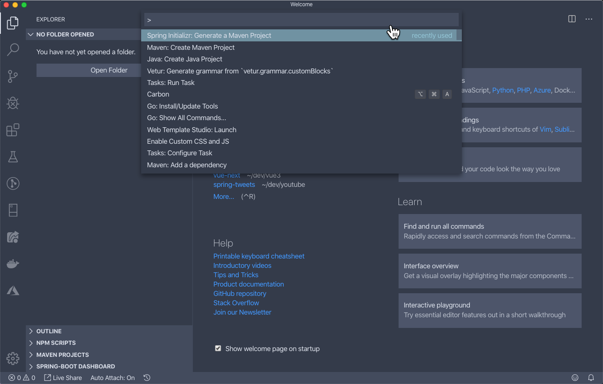

In this tutorial, we are going to use Visual Studio Code to create a Spring Boot application. I've been working a lot more on the front-end over the last year or two. As much as I love IntelliJ, I'm just more comfortable in Visual Studio Code and I don't like going back and forth. I don't like having like my Vue projects open in Visual Studio and then going over to IntelliJ to use Spring Boot & Java.

Lately I've been using Visual Studio Code for a lot more development these days. I've been working with Java, Spring, C# and now Go, so I'm using Visual Studio Code more and more and more. Because I'm in it more, I'm just more comfortable with it.

Now, this is not to say to go out and replace whatever IDE you're used to. If you really like Eclipse and you really like IntelliJ IDEA, they're both fantastic IDEs. I'm not saying get rid of them. I'm just saying if you happen to work on projects like this where you might have a front-end application and a back-end application and you're just used to using Visual Studio Code, you can do so.

## Visual Studio Code Extension Packs

I don't know if a lot of people know about this, but there are some really good extensions for Visual Studio Code if you're a Java developer. This is something I am going to cover in a future post/video so in this tutorial we will focus on Spring.

The problem with getting up and running with a new language or framework is that there can be a lot of extensions that you need to install. Fortunately for us there is a feature in VS Code called extension packs. This allows a single extension, the extension pack, to group multiple extensions into one. Instead of asking you to go out and install 10 extensions, you just need to install these two.

- [Java Extension Pack](https://marketplace.visualstudio.com/items?itemName=vscjava.vscode-java-pack)
- [Spring Boot Extension Pack](https://marketplace.visualstudio.com/items?itemName=Pivotal.vscode-boot-dev-pack)

## Spring Initializr in Visual Studio Code

We are going to create a simple Vue application that talks to a Spring Boot REST API. These are the types of projects I have been working on lately so I thought it would be nice to show off. I know there are a lot of tutorials out there that show you how to set this up as a multi-module project but I actually like having them as separate projects.

The first thing that we're going to do is create our Spring Boot project. To do this you need to open up the `Command Palette` by either going to `Go > Command Palette` or by using the shortcut `shift+(ctrl or cmd)+p`. From there you can type to find the command `Spring Initializr: Generate a Maven Project`.

This will ask you a series of questions that you should be familiar with if you have ever created a project using the Spring Initializr before.

- Language: Java
- Group Id: com.danvega
- Artifact Id: backend
- Spring Boot Version: 2.2.1
- Dependencies: Spring Boot DevTools, Spring Web

The last step of the wizard will ask you to select a folder that you want this project generated in. That is important to note that it will not create a separate folder, the folder you select is where all of your files will be created. After you do so It will ask you if you want to open up the project.

### Running your application

The first thing you probably want to know how to do is to run your project. You can open up the main application class which in my case is `src/main/java/com/danvega/backend/DemoApplication.java`. You will notice that right above the main method there is a `Run` & `Debug` command. Simply click on `Run` to run your application. After you had a chance to check out your application go ahead and stop it by hitting `ctrl+c` in the integrated terminal.

Before we go and buld the

Now, the first thing that I'm going to do is I know that my... Actually, let's go over to the browser real quick and go to Local Host 8080 and we're going to see that we are going to be greeted with this nice error page. That is because we don't have any request mappings for the route context.

One thing that I know is I know that 8080 is usually by default what my Vue apps run on, so I'm going to go ahead and change the port that Spring Boot runs on. The nice thing here is in our application.properties, we get some assistance from Visual Studio Code on what properties we can go ahead and enter. If I start typing Server and I start typing Port, we see that we get some help here, so Server HTTP Port and the default is 8080. I'm going to actually change this to 8085 and 8085 has a special meaning in my heart. If you happen to know what Default Port 8085 used to use or an applications ever used to use, then comment below. Only some old scores will know that one. But, anyways. Now, if we look down here, our Spring Boot application is running on 8085.

We're going to do one thing here. We're going to come in here and we're going to add a new controller. What I want to do is I'm going to create a HomeController.java. As I type Package Out, it's going to help me out so it knows what Package I'm in. I'm going to create a new class called Home Controller and that'll give us what we need. This is going to be a REST Controller. So I'm going to type Rest Controller and I'm going to get some help, so that's really nice. It gives me some IntelliSense and it actually gives me some documentation on what I'm actually looking for. This is going to be a REST Controller and we are going to hit it from a different URL. I want to go ahead and put that cross origin on there so we don't have a CORS issue. As I come down here I can just start to type code and start coding right away.

Now, there are some snippets in some of these, so if I wanted to do a request mapping, you'll see I get a couple in there, so there's a request mapping. There's also a snippet for doing request mapping that doesn't seem to be coming up. But what I'm going to do is I get mapping anyway, so I'm going to say, "Get Mapping," and that's just going to be two slash. We're going to create a method called Home and it's going to return a string, "Hello from Spring Boot."

You'll see that this is reloading very fast. One of those dependencies that we selected was the Spring Boot DevTools. Now I know one thing. I've kind of set even the community edition up for students before and you have to go in and kind of tinker with the DevTools in IntelliJ to get an automatic reload working right away and it just works right out of the box here in Visual Studio Code, which I really appreciate. You'll see it's very fast. So, as we change things, we kind of get that instant reload. If we go back to the browser and we reload this, we should see Hello. Oh, we're on the wrong port, so let's go there and Hello from Spring Boot. Okay.

That's all I want to show from the Spring Boot side. The Spring Boot app is running, so I'm going to leave this where it is.

What I'm going to do is go ahead and hit Plus here and get a new terminal open. What we're going to do is we are in here. Yup. What we're going to do is use Vue Command Line, the CLI to create a new applications. I'm going to say Vue, Create and we'll just call this Front end because that's going to be our front-end application and we're just going to have a standard project, so it's going to... Again, if you're not familiar with Vue, don't worry about this. We're just creating it for an end project. I will go ahead and link a video that I've done on the Vue CLI. So if you're kind of new to Vue, I have a bunch of content on Vue as well. Really great front-end JavaScript framework. So I will link a couple of videos below if you want to take a look at that.

Would you like to add... Oh, yes, please add that to that. Okay, so looks like it's going and it's done. Project. It has things like VueX and Vue Router, but don't worry about any of that. All we care about is in this Vues folder there is a Home Vue and this is what is displayed on the homepage. We're going to get rid of the stuff that was created for us. We don't need any of it.

All we're going to do is we're going to add a new data property here, so we're going to add a function. This function returns an object. Inside of here we're going to display a message and that message is going to be here and will say, "Message." Actually, let's call this Title. It seems a little bit more appropriate. What we want to do is we want to reach out to our back-end application, grab that data from the controller, which is just text at this point and display it on our page.

Here we are. I'm going to use the mounted lifecycle hook and inside of mountain, we're going to call to our backend. So we're going to use the fetch API and inside of this we're just going to say... Remember our port is 8085 this time, so 8085. When we get that back, that's going to return a promise. We're going to get a response, response. When that comes back we're going to actually get the text out of that response. Again, we're not returning JSON from the back-end. It's just a simple string. If we created an object, Jackson will Marshall that for us and do some JSON and we can get the JSON out of that if we needed to. But in this case, we just need the text. Once that text comes back, we're going to get the data. All we're going to do here is we're going to say this.title is equal to whatever that data is. That looks pretty good.

Now, again, we have two processes going here. We have a Java console and we're here in Bash. Now, if I look in here, I'm going to go into my front-end application and I'm going to go ahead and run NPM run serve. This will pick up our front-end application, which when we hit the homepage, should go ahead and call out to our backend service, get some text and then set the title to remember it was Hello from Spring Boot. Let's go back to the browser and let's go to 8081. Nope, 8080. Sorry. Here's our homepage and here's our Hello from Spring Boot. Again, if we look at this in the console here, we should see here is the call to Local Host 8085, it's a GIT, get a 200 response and we got back the text Hello from Spring Boot.

Now, if you were following along and that's not working, one of the things I mentioned before is you do need to add a cross origin annotation to the home controller. Otherwise, CORS error will come up and that's something that you'll often hit. That was that. I'm going to go ahead and stop the front-end. If we go over to the back-end, we can also stop that. That was that.

Now, I want to do is show you the extensions that I was using to create this application. We go into Extensions, you can actually look at Show Installed Extensions, so basically, two things we want to look at. From the Java side, there's a Java extension pack, which gives you a lot of this stuff, like the debugger, the test runner, there's Maven for Java, which I like.

Then let's get into the Spring side, which is the important stuff here. There's a Spring Boot extension pack, which if we look at this, this really gives you a whole bunch of other extensions. So any time you see an extension pack, it's really just a collection of extensions and for this case, it's for all the Spring Boot stuff. This was released by Pivotal and so you get that Spring Boot dashboard. That was that down here when you wanted to go ahead and see what applications you have and go ahead and start and stop and debug from there. That's that one.

The Spring Initializr is what allows us to go ahead and add a new Spring Initializr project right within Visual Studio Code, so that's an important one. If you don't know what these do or what their options are, you can always come in here and look at the details for each of these extensions. You look at this feature list, there's a whole bunch of stuff going on here, how to install it, how to use it, more configuration. There's some really good stuff in here that you should go ahead and look at after you do a few projects.

Then there's Spring Boot Tools, so VS Code Language Server for Spring Boot Tools. This is really what gave us that insight in application.properties or a .YML file and even in the Java files. Then there's, obviously, ways to customize this and there's so much more. We should probably spend a whole 'nother video on just how to get around Spring Boot projects within VS Code because you can do things like navigate to Spring-specific elements within your source code. There's just a whole bunch of things that you can do that we're not going to cover in this one.

I hope that was helpful. Being able to set up your Spring Boot project right here in Visual Studio Code without the need for anything else, and really being able to have both your front-end and your back-end code right within the same project is really, really nice because it keeps you working in a consistent environment.

I think that's all for today. If you enjoyed this content, if you liked it, please give me that thumbs up, subscribe to the channel and leave me some feedback below. As always, friends, happy coding.
