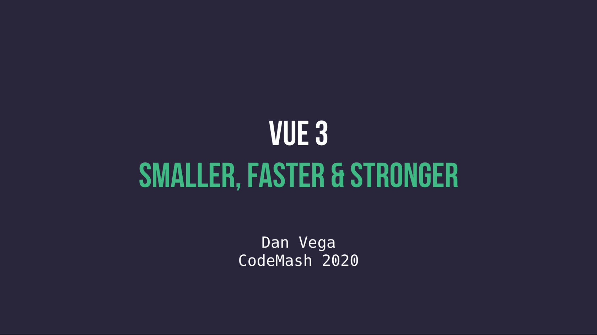

## Overview

This was one of the more interesting & challenging presentations that I have had to put together. Usually when I create a presentation I have a wealth of knowledge and examples to fall back on. In the case of Vue 3 still being in alpha I didn't have a lot to go on. This took a lot of tinkering around with the source code which I love to do so I was up for the challenge.

I think I watched a few presentations by Evan You at least a dozen times, so Thank You Evan. I also want to give a huge kudos to the entire Vue Core team for the RFCs. These documents were extremely detailed and I loved the fact that they were explicit with the motivation behind each feature. These were the two main resources I used for both learning the new features of Vue 3 and putting together this presentation.

Going into this talk I had higher hopes of showing off more features than I actually covered. I think this is usually the case though whenever I start thinking about a talk and then realizing I only have an hour. I ended up with 134 slides which is extremely ambitious but I will get through them.

After taking a look at all the new features in Vue 3 it became clear to me that there were a couple of goals with this release. First, they wanted to make the framework **Smaller** and **Faster** (which they accomplished) and a lot of what I covered aligned with those goals. Second, they wanted to make the framework scalable and for me that is where the Composition API shines and makes Vue **Stronger**.

This is how I ended up coming up with the title "Vue 3: Smaller, Faster and Stronger" for my presentation. These are a list of features I ended up talking about that really fit into those buckets.

- Smaller
  - TypeScript Rewrite
  - Global API Change
  - Treeshaking
  - Fragments
- Faster
  - Virtual DOM
  - Reactivity System
- Stronger
  - Composition API

Below are some resources such as slides, a Github repository with demo code and any links I mentioned during the presentation.

## Resources

### Slides

For now I have exported my slides to a PDF that you can find in the Github repository below. I might share these out in additional formats later but I am curious to find out how speakers are sharing the keynote presentations so please let me know.

### Github

This repository contains most of the examples that I showed off during my presentation. There was no live coding so most of this code was just shown on slides.

https://github.com/danvega/vue3-smaller-faster-stronger

### Articles

I wrote an article for Vue Mastery on some of my favorite resources for learning Vue 3.

https://www.vuemastery.com/blog/top-ways-to-learn-Vue-3

### Documentation

- [Vue Next](https://github.com/vuejs/vue-next)
- [Vue 3 + Webpack Setup](https://github.com/vuejs/vue-next-webpack-preview)
- [Vue Request for Comments (RFCs)](https://github.com/vuejs/rfcs)
- [Composition API RFC](https://vue-composition-api-rfc.netlify.com/)
- [Composition API Reference](https://vue-composition-api-rfc.netlify.com/api.html)

### Vue 3 Course

I am currently building out a curriculum for the upcoming release of Vue 3 . If you're interested in learning about all of the new and exciting features this course is for you. Please use the form on this page and you will receive updates as they become available.

https://www.danvega.dev/courses/vue3

## Conclusion

If you attended this presentation I really hope you enjoyed it. I put a lot of work into this and my hope is that it showed. I am hoping to give this presentation at more conferences and meetups this year so if you're interested in me presenting please reach out to me. As always friends...

Happy Coding 
Dan Vega
