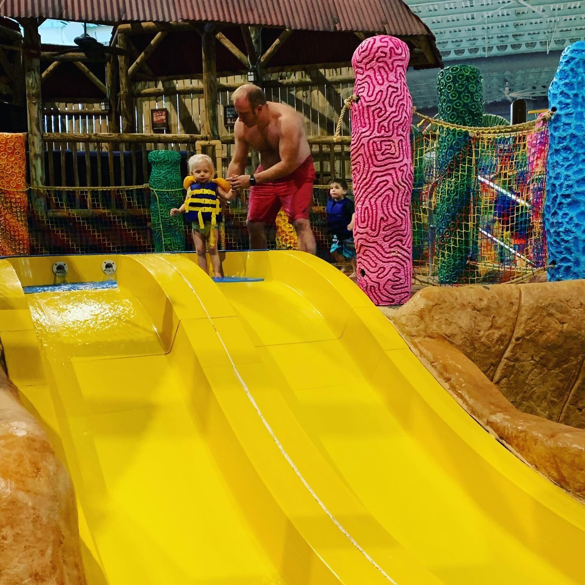
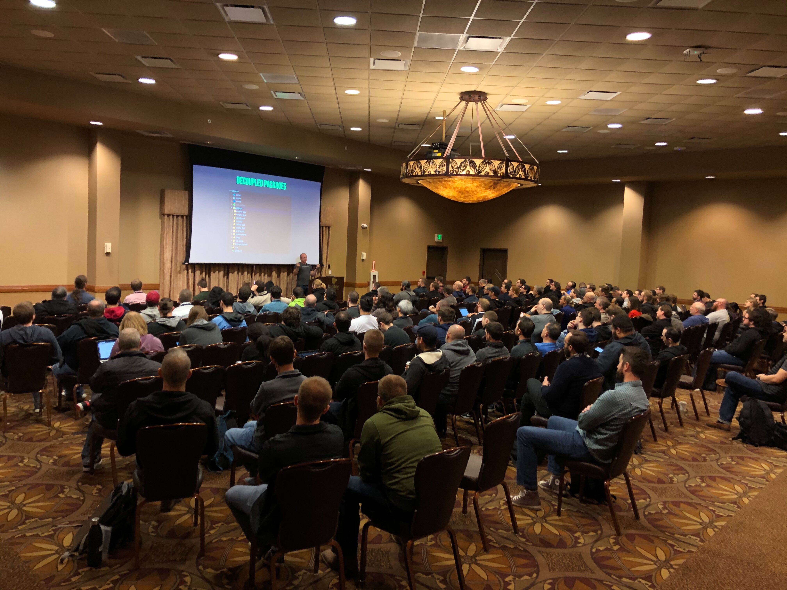

I'm back home after attending and speaking at my first CodeMash and I would like to tell you all about it. The highlights for me were the awesome venue, being able to take my family with me and getting to spend some time with my friend Todd who I haven't seen in awhile.

## CodeMash Newbie

The first thing I need to say is that I have been to a decent amount of conferences in my life and this was one of the most organized and well run conferences I have ever attended. I just want to give a huge kudos to everyone involved in putting this conference together. The venue was amazing, the sessions were great and I couldn't think of a better way to kick off the new year.

## Kalahari

I was lucky enough to bring my wife and daughter with me to Kalahari so this conference doubled as a nice little vacation for the family. This was my first trip to Kalahari and we had a blast. The water park had so many things to do for everyone. They also had a great assortment of places to eat and drink. I will definitely be taking the family back there one day.

## Sessions & Workshops I attended

I attended a lot of sessions and workshops but these are a few that I want to share with you.

### Java 9, 10 & 11 Workshop

Presented by: Chris Judd ([@javajudd](https://twitter.com/javajudd))

This was a really great workshop that went into some of the new features in Java 9, 10 & 11. Most companies are stuck on Java 8 so a lot of these features really are new to people. Chris did a really great job of opening the workshop by answering some questions around licensing and LTS (long term support) which really confuses a lot of people.

https://twitter.com/therealdanvega/status/1214969350869995520

### Calculating Insulin With Automated Carb Counting Using AI, ML and Web Bluetooth

Presented by: Todd Sharp ([@recursivecodes](https://twitter.com/recursivecodes))

Not only is Todd a good friend but he is a better human being and developer. In this session Todd shows off the app he built to help is daughter out who was diagnosed with Type 1 Diabetes. There is a lot of cool tech and code that went into building this application and it was fun to see how it all goes together. I really enjoyed how Todd closed his presentation by saying we all have passions outside of coding, try and take your coding skills and your passions and do something good for this world. Kudos to you my friend.

https://twitter.com/therealdanvega/status/1215689790756179968

The picture above is a really bad picture by me because it looks like there are no people in the talk. I zoomed in on Todd and I just need to point that out because it was a well attended session. Sorry Todd 🤦‍♂️

### Building a super performant GossipGirl.com in Gatsby in under 50 Minutes

Presented by: Jennifer Wadella ([@likeOMGitsFEDAY](https://twitter.com/likeOMGitsFEDAY))

I am not a React developer but I have heard so many great things about Gatsby so I thought I would check out this session and I am glad I did. Jennifer is a really great presenter who had a lot of fun with this talk and brought some great energy to the morning crowd. She ended up live coding an entire website from scratch and did an amazing job with it.

https://twitter.com/therealdanvega/status/1215661794238324739

### Supersonic, Subatomic Java

Presented by: Scott Seighman ([@ScottSeighman](https://twitter.com/ScottSeighman))

I have known Scott for a long time and I was excited to run into him at the conference. He told about this project he was working on at RedHat called [Quarkus](https://quarkus.io/) and that he was giving a presentation on it. I was really interested in this for writing AWS Lambda functions. While you can use Java to write your serverless functions startup times and memory consumption with using the out of the box Java 11 runtime are a big issue. With the small memory footprint and really fast startup times I think this could be the answer I have been looking for.

https://twitter.com/therealdanvega/status/1215703419543003136

## Pool Party

I am really glad that I was selected to speak on Thursday so that I could enjoy the pool party on Thursday night. The water park opened up for CodeMash attendees at 10 PM and I went down with some friends. We go to go on some really cool slides and relax in the swim bar. It was a lot of fun and if you plan on attending CodeMash in the future I would try and make the party.

## My Session: Vue 3 - Smaller, Faster & Stronger

I put a lot of time and effort into this presentation and at the end of the day I think it really showed. The session was well attended and the audience was engaged. I got a lot of really great feedback after the talk which really makes me so happy and I feel incredibly lucky to be a speaker at such an amazing conference. My wife and daughter hung out in the back and watched the beginning of my talk and that made it all the more special.

I als want to really thank everyone at [Tech Elevator](https://www.techelevator.com) for supporting me. It means a lot to work for such a great company where everyone shares the same mission.

https://twitter.com/Tech_Elevator/status/1215730352582512640

Thank you to the CodeMash selection committee for such a privilege. If you want to learn more about the talk I have a [blog post here](https://www.danvega.dev/blog/2020/01/09/codemash-2020/) that has details and resources about it. The talk was recorded by Pluralsight and I will let you all know when it has been released to the public.

## Conclusion

CodeMash reminded me just how much I love going to & speaking at conferences. I am going to make a huge effort to submit more CFPs this year and I hope to see all of you at a conference near you. I also look forward to attending CodeMash next year as an attendee and hopefully speaker!
