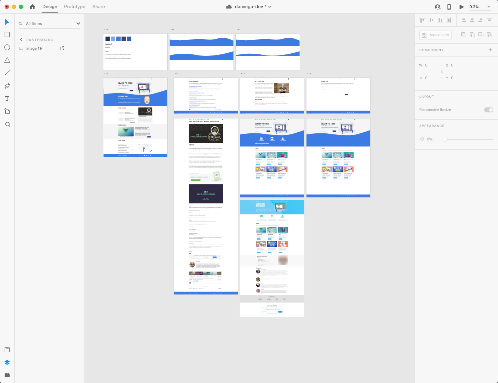
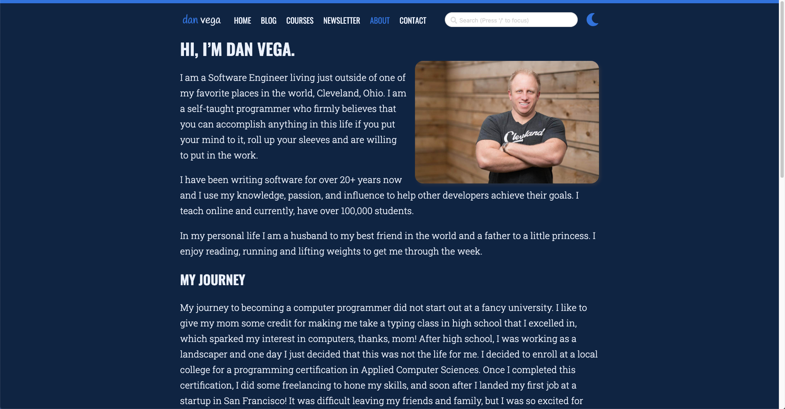
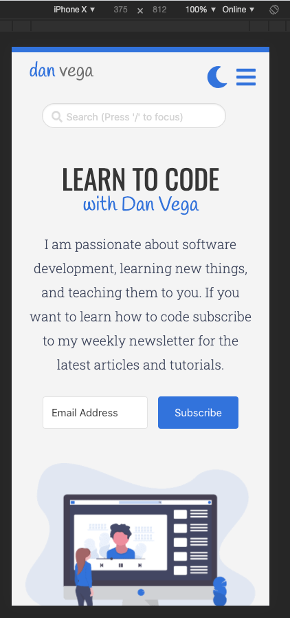
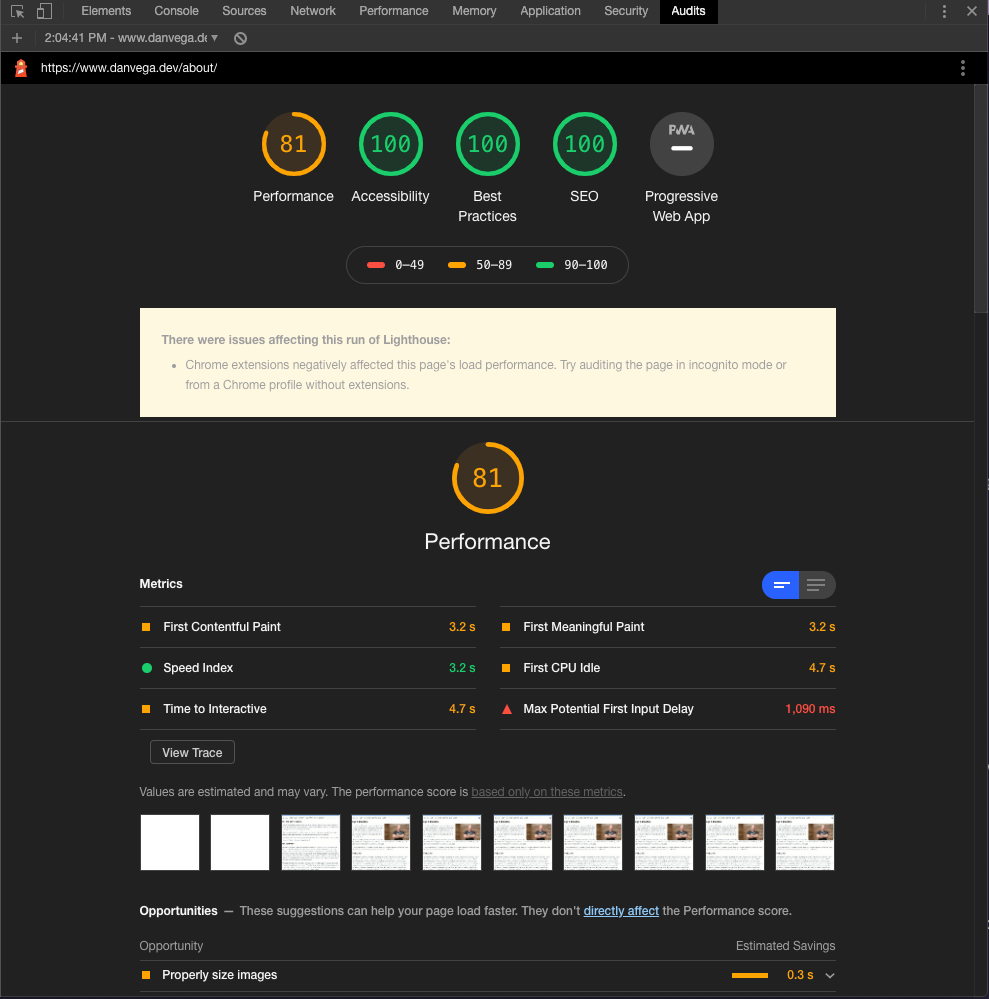

A couple of months ago I decided it was time to update my website. I normally get this feeling every couple of years but this time it was different. I liked the look and feel but there were a list of things that I wanted to improve on.

## Areas of improvement

- Design
- Removing CSS frameworks
- Home Page Layout
- Dark Mode
- Responsive Design
- Lighthouse Scores

### Design

I am not a designer but I like to wear this hat from time to time and pretend I am one. I have gravitated towards [Adobe XD](https://www.adobe.com/products/xd.html) and I have been using it for a lot of my projects lately. I find it's really easy to use and it allows me prototype my application quickly. Once I have something I like its really easy for me to grab the colors, fonts and assets and build out the design in HTML & CSS. Below are some artboards from a couple of months ago when I decided to start redesigning the site.



#### Lesson Learned

It might seem like extra work up front to sit down and come up with a design but it pays off in the long run. When I know what I need to build I spend so much less time in development. Looking at a design I know what content is needed so I start with my HTML structure. With my content in place with the semantic structure I use CSS to make my look and feel match my design.

### Removing CSS frameworks

The previous version of my website used a CSS framework called Bulma. I need to make something clear and say that I have absolutely nothing bad to say about Bulma. If I had to select a CSS framework not named Tailwind CSS Bulma would be my framework of choice. I didn't know Bluma when I started using it and that caused a lot of my problems. If you combine that with a lack of CSS foundational knowledge I had a pretty messy codebase.

Now that I understand layouts in CSS and how to accomplish different designs I find component-based frameworks less useful. In the past few years my frontend skills have gotten better and I thought this was a great time to put them to use. My redesign makes use of a variety of tools that make frontend development a lot of fun

- CSS Variables
- Flexbox
- CSS Grid
- Responsive Design

#### Lesson Learned

Learn the foundations of HTML & CSS. I have been building websites for 20+ years and a lot has changed in the last 5 years. I am constantly hearing the same from other developers who have been doing this for a long time. Learn modern techniques like Flexbox & CSS Grid, they are both awesome and a real joy to work with.

### Home Page Layout

My previous home page was really boring and I just wanted to add some style to it. I started messing around with some different designs and one thing that always stuck out to me with a total "cool factor" were layouts that had some type of wave or diagonal design. I came up with the wave on the home page and now it was time to implement it.

I attempted to figure this out on my own and failed a few times. I was trying to use an image that I exported from XD as a background image and had issues with it not being responsive and not working well in dark mode. I finally did some digging around and came across this [great tutorial by Richard Zimerman](https://blog.prototypr.io/how-to-add-svg-waves-to-your-next-web-project-b720efe1c692).

#### Lessons Learned

The trick here was using an SVG and setting it to `display:block`. I am still pretty new to using SVG images but I am finding them really useful. In this case I combined CSS custom properties with an SVG and now I have the header for the home page that looks nice, is responsive and looks good in dark mode!

```css
.wave-container {
  position: relative;
  background: var(--home-header-background);
  color: #4a4a4a;
  overflow: hidden;
}
.wave-container > svg {
  display: block;
}
```

### Dark Mode



I have always loved the idea of having a dark mode on my website. I don't know how much my readers were asking for it but this is my website and I wanted to add it 🤷‍♂️. I have used CSS Custom Properties (variables) before but maybe not at this scale. The way this works is by setting some custom properties on the `:root` which will be your default light theme. For each property you create you will create a dark theme property as well.

```css
:root {
  --background: white;
}

[data-theme="dark"] {
  --background: black;
}
```

Now in your CSS instead of setting the background color to white or black you refer to the custom property

```css
body {
  margin: 0;
  padding: 0;
  background-color: var(--background);
  border-top: 8px solid var(--bright-blue);
  font-family: "Roboto Slab", serif;
}
```

Next, I setup some icons using Font Awesome and by default the moon is displayed. When you click on that icon you are enabling dark mode. A little custom JavaScript will set the `data-theme` to dark:

```js
if (document.documentElement.getAttribute("data-theme") === null) {
  document.documentElement.setAttribute("data-theme", "dark");
}
```

#### Lessons Learned

If you are going to implement something like dark mode do it right from the start. If you notice yourself defining colors anywhere that don't use a CSS property you probably need to think about doing so. This is something I need to go back and fix up. I feel like I have too many properties defined and can probably condense this down.

### Responsive Design

I know that both myself and my audience use my website on a variety of form factors so making sure my design was responsive was important. As you can tell by XD designs I didn't have a mobile-first approach and that caused me some issues along the way. It's important to always be thinking about how a layout or design element will scale up or down. I am really thankful for tools like Flexbox and CSS Grid which are really helpful in creating responsive designs.



#### Lessons Learned

When I design a layout in Adobe XD I need to make sure I have a plan for my responsive designs. The term mobile-first means that your layout starts out with a mobile layout and scales up. This ensures that the mobile design is not just an after thought. Take some time to look at the analytics and understand what devices your visitors are using.

### Lighthouse Audits

I knew that once I finished my site I wanted to take a look at the [Lighthouse Audits](https://web.dev/measure/) and try to improve scores where I could. If you aren't aware the Google Developer Tools has a tab called Audits where you can check your site for:

- Performance
- Accessibility
- Best Practices
- SEO

Right now the site is doing well on some page but still needs some work on others. My advice here is let these audits guide you to improve your site but do not obsess over them.



#### Lessons Learned

The first big lesson I learned here was that pulling in the entire Font Awesome library for < 10 icons was a big no no. I mean I knew this but I needed to find a way to resolve this and the audit gave me a big kick in the rear to do so. I was just going to grab the icons I needed but what happens if I want to use more in the future? There had to be a way to pull in just the icons I needed and thanks to the Gridsome documentation I came across a wonderful [library from Fort Awesome](https://github.com/FortAwesome/vue-fontawesome) for using Font Awesome in Vue.

I still have some work to do here but I am trying to take my own advice and not obsess over it. I think there are two big things that would really help me out. Right now on the home page all of the images for recent posts are pulling from GraphQL. There is a way to resize them but unlike when you use a `<g-image>` tag this isn't lazy loading the images and I need to figure out a way around this. The other problem is all of my ConvertKit forms are pulled in via JavaScript. I would like to just create these forms myself so I can make sure they are accessible and at the same time it would reduce some page weight.

### Conclusion

I have had a lot of fun working on the redesign for my website and I hope it shows. If you have any questions about anything I did here you can check out the source code for it here. If you would like me to explain anything in more detail please leave me a comment below or reach out to me on Twitter.
