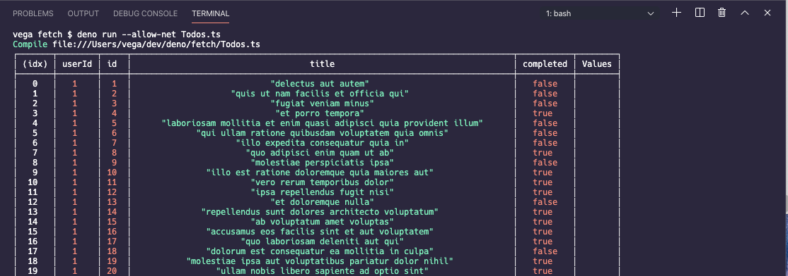

After two years of development, [Deno 1.0](https://deno.land/v1) was recently released and it has everyone talking. In this article, I want to give you a quick introduction to Deno, how to install it and how to create your first application. Finally, we will take a look at some of the features that make Deno an exciting project to pay attention to.

## Summary

- [What is Deno](#what-is-deno)
- [Installing Deno](#installing-deno)
- [Deno Features](#deno-features)
  - [Secure Runtime](#secure-runtime)
  - [TypeScript Support](#typescript-support)
  - [Standard Library](#standard-library)
  - [Built-in Testing Library](#built-in-testing-library)
  - [Promises, Async & Await](#promises-async--await)
  - [Browser Compatible APIs (fetch, Window object)](#browser-compatible-apis-fetch-window-object)
  - [ECMAScript Modules (ES Modules)](#ecmascript-modules-es-modules)
  - [Built-in tools](#built-in-tools)
- [Conclusion](#conclusion)

## What is Deno?

Deno is a **secure** runtime for **JavaScript** and **TypeScript**. Wait, a runtime for JavaScript, isn't that what Node is? Yes, and Deno was created by Ryan Dahl, the creator of Node.

As most developers do we often look back at projects that we built and think about what we might do different if we started it from scratch today. Ryan has a popular talk called [10 Things I Regret About Node.js](https://www.youtube.com/watch?v=M3BM9TB-8yA) and if you haven't had a chance to watch I would check it out.

I know what you're thinking because I was thinking the same thing before I watched that video. Why not just address all of these concerns in Node instead of starting a brand new project. Node has grown into a massive project used by millions and it's not going anywhere. This led Ryan to create a new project called Deno and fix the problems he had with Node.

The first major difference with Deno is that it is written in Rust while Node was written in C++. Like Node it executes JavaScript using [V8](https://v8.dev/) which is Google’s open-source high-performance JavaScript and WebAssembly engine.

## Installing Deno

The first thing you should do is get Deno installed and write a **Hello, Deno** script. Deno ships as a single executable with no dependencies. You can install it using the installers below, or download a release binary from the [releases page](https://github.com/denoland/deno/releases).

Shell (Mac, Linux)

```bash
curl -fsSL https://deno.land/x/install/install.sh | sh
```

Powershell (Windows)

```bash
iwr https://deno.land/x/install/install.ps1 -useb | iex
```

After you install it you can use the REPL (Read Evaluate Print Loop). This will allow you to test some code right from the command line.

```bash
vega deno $ deno
Deno 1.0.2
exit using ctrl+d or close()
> console.log("Hello, Deno 🦕");
Hello, Deno 🦕
undefined
>
```

While you're in the REPL run the following code 🤓

```js
"node"
  .split("")
  .sort()
  .join("");
```

### Deno Help

If you're not sure what version of Deno you're running you can use the command `deno --version` which will give you the versions of Deno, V8 & TypeScript.

```bash
vega deno $ deno --version
deno 1.0.2
v8 8.4.300
typescript 3.9.2
vega deno $
```

And if you ever forget where the docs are, how to start the REPL or can't remember what sub commands are available just run the command `deno help`.

```bash
vega deno $ deno help
deno 1.0.2
A secure JavaScript and TypeScript runtime

Docs: https://deno.land/manual
Modules: https://deno.land/std/ https://deno.land/x/
Bugs: https://github.com/denoland/deno/issues

To start the REPL:
  deno

To execute a script:
  deno run https://deno.land/std/examples/welcome.ts

To evaluate code in the shell:
  deno eval "console.log(30933 + 404)"

USAGE:
    deno [OPTIONS] [SUBCOMMAND]

OPTIONS:
    -h, --help                     Prints help information
    -L, --log-level <log-level>    Set log level [possible values: debug, info]
    -q, --quiet                    Suppress diagnostic output
    -V, --version                  Prints version information

SUBCOMMANDS:
    bundle         Bundle module and dependencies into single file
    cache          Cache the dependencies
    completions    Generate shell completions
    doc            Show documentation for a module
    eval           Eval script
    fmt            Format source files
    help           Prints this message or the help of the given subcommand(s)
    info           Show info about cache or info related to source file
    install        Install script as an executable
    repl           Read Eval Print Loop
    run            Run a program given a filename or url to the module
    test           Run tests
    types          Print runtime TypeScript declarations
    upgrade        Upgrade deno executable to given version

ENVIRONMENT VARIABLES:
    DENO_DIR             Set deno's base directory (defaults to $HOME/.deno)
    DENO_INSTALL_ROOT    Set deno install's output directory
                         (defaults to $HOME/.deno/bin)
    NO_COLOR             Set to disable color
    HTTP_PROXY           Proxy address for HTTP requests
                         (module downloads, fetch)
    HTTPS_PROXY          Same but for HTTPS
vega deno $
```

### Setting up your development environment

Now that Deno is installed there is one last thing to do before you write that first program. You can check out [the manual](https://deno.land/manual/getting_started/setup_your_environment) for complete instructions on setting up your development environment.

If you're a Visual Studio Code user (of course you are 😜) there are a few Deno extensions in the Marketplace. I haven't had a chance to look at all of them yet but the link below is the official extension from the Deno team and it's the one I am using.

https://marketplace.visualstudio.com/items?itemName=denoland.vscode-deno

### Hello, Deno!

In your editor of choice create a new file called `HelloWorld.ts` and enter the following code

```js
console.log("Welcome to Deno 🦕");
```

To run the program type `deno run HelloWorld.ts` from the command line. When you run that command you should get the following output.

```bash
vega hello-world $ deno run HelloWorld.ts
Compile file:///Users/vega/dev/deno/hello-world/HelloWorld.ts
Welcome to Deno 🦕
vega hello-world $
```

You just wrote some JavaScript inside of a TypeScript file. Deno saw the `.ts` extension and used the built-in TypeScript compiler to compile your application. As you just saw you are not forced into writing TypeScript but it is nice that it is supported out of the box and, we will talk more about that later in this article. If you change the extension to `.js` and run it you will the same output minus the compilation process.

```bash
vega hello-world $ deno run HelloWorld.js
Welcome to Deno 🦕
vega hello-world $
```

## Deno Features

Now that you have an introduction to Deno and have your first script I want to dive into some of the features. Here are some things I think make Deno an exciting project to pay attention to:

- ✔ Secure Runtime
- ✔ TypeScript Support
- ✔ Standard Library
- ✔ Built-in Testing Library
- ✔ Promises, Async & Await
- ✔ Browser Compatible APIs
- ✔ ES Modules
- ✔ No `node_modules`
- ✔ Built-in tools

### Secure Runtime

The Node Package Manager (NPM) allows you to quickly find a package to solve just about any problem. A big problem here is that we as developers have gotten lazy when it comes to questioning if a package is necessary.

We have gotten to the point where if we need some code to perform some task we will just `npm i write-my-code-for-me`. I'm not saying you can't install that library, but take the time and ask yourself is this something I really need and if so what is this code doing. That library you just downloaded has been given full permission to do whatever it wants and that can lead to some real problems.

Deno on the other hand executes code in a sandbox. This means that by default Deno will not have permission to access the network, file system, and the environment.

#### Http Server Demo

Below is a script that will start up a simple http server on port 8000 and respond to a request with a simple key/value pair in JSON. Create a new file called `server.ts` and add in the following code:

```ts
import { serve } from "https://deno.land/std@0.50.0/http/server.ts";
const s = serve({ port: 8000 });
console.log("http://localhost:8000/");
for await (const req of s) {
  req.respond({ body: JSON.stringify({ msg: "Hello, World!" }) });
}
```

If you try and run this script using `deno run server.ts` you will get the following error:

```bash
vega basic-server $ deno run server.ts
Compile file:///Users/vega/dev/deno/basic-server/server.ts
error: Uncaught PermissionDenied: network access to "0.0.0.0:8000", run again with the --allow-net flag
    at unwrapResponse ($deno$/ops/dispatch_json.ts:43:11)
    at Object.sendSync ($deno$/ops/dispatch_json.ts:72:10)
    at Object.listen ($deno$/ops/net.ts:51:10)
    at listen ($deno$/net.ts:152:22)
    at serve (https://deno.land/std@0.50.0/http/server.ts:261:20)
    at file:///Users/vega/dev/deno/basic-server/server.ts:2:11
vega basic-server $
```

To run the script you will need to run the command `deno run --allow-net server.ts`. This is what Deno means when it says that it is secure by default. If you're interested there is a list of permissions in the [Deno Manual](https://deno.land/manual/getting_started/permissions#permissions-list).

### TypeScript Support

I mentioned this a couple of times already but Deno supports both JavaScript and TypeScript as first-class languages. Coming from a Java background I appreciate the benefits of types especially working on a team in larger projects. If you're not a fan of TypeScript, stick with JavaScript.

There are many frameworks & runtimes that support TypeScript but they have to provide additional tooling to do so. Deno is designed with TypeScript in mind and the standard modules are all written in TypeScript. The `deno types` command provides type declarations for everything provided by Deno.

Because both JavaScript and TypeScript are supported it means that you need to provide fully qualified names, including the extension.

```ts
import { serve } from "https://deno.land/std@0.53.0/http/server.ts"; // RIGHT
import { serve } from "https://deno.land/std@0.53.0/http/server"; // WRONG
```

If you want to learn more about using external type definitions or customizing the TypeScript compiler options checkout the [Deno Manual](https://deno.land/manual/getting_started/typescript).

### Standard Library

I recently started learning the [Go Programming Language](https://golang.org/) and when I started diving into the [Deno Standard Library](https://deno.land/std) it felt familiar to me. The reason for this is that Deno was originally written in Go and to this day draws a lot of inspiration from the language. If you look in the documentation for the standard library it even says the following:

> deno_std is a loose port of Go's standard library. When in doubt, simply port Go's source code, documentation, and tests.

As I mentioned earlier the standard library is written entirely in TypeScript and it is async by default, more on that in a bit. The standard library modules do not have external dependencies and they are reviewed by the Deno core team.

These modules are tagged in accordance with Deno releases. So, for example, the v0.53.0 tag is guaranteed to work with Deno v0.53.0. You can link to v0.53.0 using the URL https://deno.land/std@v0.53.0/. Not specifying a tag will link to the master branch. It is strongly recommended that you link to tagged releases to avoid unintended updates.

#### UUID Example

If you wanted to use UUID from the standard library the following example would always pull the latest version from master.

```ts
import { v4 } from "https://deno.land/std/uuid/mod.ts";

// Generate a v4 uuid
const myUUID = v4.generate();

// Validate a v4 uuid
const isValid = v4.validate(myUUID);

console.log(isValid);
```

You should be specific with the version number to avoid uninteded updates

```ts
import { v4 } from "https://deno.land/std@0.53.0/uuid/mod.ts";
```

Deno provides a standard library at https://deno.land/std.

### Built-in Testing Library

Deno has a built-in test runner that you can use for testing JavaScript or TypeScript code. I for one think this helps to improve the developer experience. When you don't have to investigate what testing framework to use and the language can just provide one out as part of the runtime it might help developers write more tests. This doesn't mean that you can't go use your favorite testing framework but it does make it easier to test out of the box.

Create a new file called `HelloWorldTest.ts` with the following code:

```ts
import { assertEquals } from "https://deno.land/std/testing/asserts.ts";

Deno.test("hello world", () => {
  const x = 1 + 2;
  assertEquals(x, 3);
});
```

You can run the test from the command line using the command: `deno test HelloWorldTest.ts`

```bash
vega test $ deno test HelloWorldTest.ts
Compile file:///Users/vega/dev/deno/test/.deno.test.ts
running 1 tests
test hello world ... ok (3ms)

test result: ok. 1 passed; 0 failed; 0 ignored; 0 measured; 0 filtered out (3ms)

vega test $
```

The method `assertEquals` came from the standard library and if you take a look at it there are a number of helpful assertions.

https://deno.land/std/testing

### Promises, Async & Await

For a technology built for events, Node.js didn’t do a great job with them. It came out before the concepts of Promises or the async/await patterns, so had to come up with its own version. Deno takes full advantage of Promises and the standard library is asynchronous by default.

Deno also provides [`top-level-await`](https://github.com/tc39/proposal-top-level-await) which really helps remove some boilerplate code. In a Vanilla JavaScript if you want to use `await` it needs to be wrapped in `async` function.

```js
async function loadUsers() {
  const users = await fetch("https://users.com");
}
```

With `top-level-await` support you don't have to wrap this in `async` function.

```js
const users = await fetch("https://users.com");
```

But wait, isn't `fetch()` a Browser API?

### Browser Compatible APIs (fetch, Window object)

Deno has Brower Compatible API's like `fetch()` and the `Window` object built into the runtime. This is important because as a JavaScript developer that already understands fetch you don't have to learn something new or install a third-party library. For APIs where a web standard already exists, like fetch for HTTP requests, Deno uses these rather than inventing a new proprietary API.

If you combine `fetch()` with `top-level-await` it becomes simple and clean to make a request and get some data back.

```ts
const todos = await fetch(
  "https://jsonplaceholder.typicode.com/todos"
).then(response => response.json());
console.table(todos);
```



The subset of Deno programs which are written completely in JavaScript and do not use the global Deno namespace (or feature test for it), ought to also be able to be run in a modern web browser without change. Deno 1.0 provides the following web-compatible APIs.

- addEventListener
- atob
- btoa
- clearInterval
- clearTimeout
- dispatchEvent
- fetch
- queueMicrotask
- removeEventListener
- setInterval
- setTimeout
- AbortSignal
- Blob
- File
- FormData
- Headers
- ReadableStream
- Request
- Response
- URL
- URLSearchParams
- console
- isConsoleInstance
- location
- onload
- onunload
- self
- window
- AbortController
- CustomEvent
- DOMException
- ErrorEvent
- Event
- EventTarget
- MessageEvent
- TextDecoder
- TextEncoder
- Worker
- ImportMeta
- Location

### ECMAScript Modules (ES Modules)

This is probably the biggest fundamental difference between Node and Deno. Node created it's own module system called Common JS. The way this works is the code that is being executed and code that it depends on both live in the same physical location so the server can stop what its doing, load the dependency and pick up where it left off. This is known as synchronous module loading and because this is done from disk it is extremely efficient.

The browser works very different from this model. When we execute our code we are doing so on our user's device. Those devices are not on the same machine as it's dependencies, in fact they are far across the network. So when our code that is running and it needs to load a dependency it can't just stop what its doing because the process of fetching it across the network can be very slow.

Node and the browser are two different runtimes and Common JS could never work in the browser. So the browser needed its own module system and this is where the design specification for ES Modules came from. Deno uses the official ECMAScript module standard rather than legacy CommonJS.

When your application depends on another module you can bring it into a script using the `import` keyword. The module is referenced using a URL or file path and includes a mandatory file extension.

```ts
import * as log from "https://deno.land/std/log/mod.ts";
import { serve } from "https://deno.land/std/http/server.ts";
import { foo } from "./app.ts";
```

#### Goodbye 👋🏻 node_modules

You just saw an example of importing an ES Module directly from a URL or file path. This means that we no longer need a package manager like NPM (Node Package Manager) or the project bloat that comes along with the `node_modules` folder.


This is probably going to be something that developers debate about the most when it comes to Deno. Rather than relying on a central repository, it is decentralized. This means that anyone can host any type of file on the web, anywhere. There are pros and cons to this and I will need more time to share my personal thoughts on this. If you're looking for a collection of Third Party Modules you can find them on the official Deno website.

https://deno.land/x

### Built-in tools

Another feature I am really excited about is the set of built-in tools. This is a collection of tools that will help improve the developer experience.

- bundler (`deno bundle`) will output a single JavaScript file, which includes all dependencies of the specified input. For example:
- debugger (`--inspect, --inspect-brk`) will support debugging using Chrome Devtools or other clients that support the protocol (eg. VSCode).
- dependency inspector (`deno info`) will inspect ES module and all of its dependencies.
- documentation generator (`deno doc`) will generate documentation for Deno
- formatter (`deno fmt`) a built-in code formatter that auto-formats TypeScript and JavaScript code.
- test runner (`deno test`) a built-in test runner that you can use for testing JavaScript or TypeScript code.
- linter (`deno lint`) coming soon

## Conclusion

I know a lot of developers reading this might be asking the question "Is this going to replace Node". The short answer is no and I think that is probably the wrong question to be asking. Node is a well-established runtime and relied upon by many so It won't be going away anytime soon.

The question you should be asking yourself is "Do the features in Deno solve any of the problems that I currently have with Node?" and if the answer to that is yes or you just like learning something new, give Deno a look.
