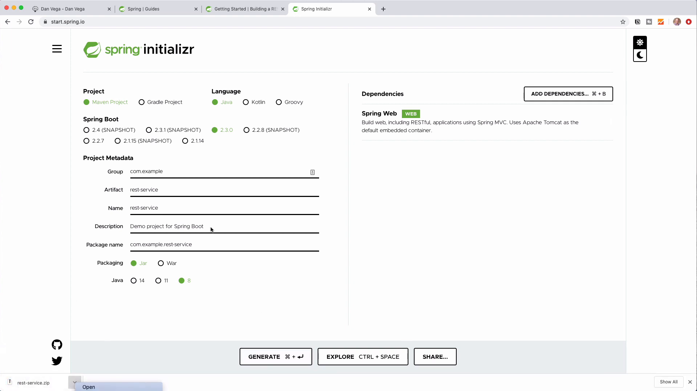

## A Comprehensive Guide to Building RESTful Web Service with Spring Boot

Today, we'll be going over a tutorial on how to build a RESTful web service using Spring Boot. This is perfect for visual learners who may prefer to start with a tutorial before diving into the actual [Spring.io documentation](https://docs.spring.io/spring-boot/docs/current/reference/htmlsingle/). So, let's dive into the tutorial and start building our web service.

## Building a RESTful Web Service: Prerequisites

Before we get started, let's make sure you have the following tools installed and ready to go:

- A favorite text editor or IDE (we'll be using IntelliJ Ultimate Edition)
- JDK 1.8 or later

With those in place, we're ready to get started on building our web service!

## Step 1: Setting Up the Project

To ensure a smooth start, we'll begin by creating our project using the Spring Initializer. This will automatically configure our build system, dependencies, and folder structure for us.

Here's what to do:

1. Head to [start.spring.io](https://start.spring.io/)
2. Select `Maven`, `Java`, and choose the latest stable version of Spring Boot
3. Set the Group to `com.example` and Artifact to `rest-service`
4. Add the `Web` dependency and click `Generate`
5. Download and unzip the generated project



Once that's done, open the project in your favorite IDE, and you're ready for the next step.

## Step 2: Creating a Model

With our project structure in place, we need to create a model class to describe the data we'll be working with. In this case, it will be a simple greeting with an ID and some content.

To create a `Greeting` class with the appropriate fields, follow these steps:

1. Navigate to the `main` package in your project
2. Create a new class named `Greeting`
3. Add `private final long id` and `private final String content` as fields
4. Generate a constructor and getters for the fields

```java
public class Greeting {

  private final long id;
  private final String content;

  public Greeting(long id, String content) {
    this.id = id;
    this.content = content;
  }

  public long getId() {
    return id;
  }

  public String getContent() {
    return content;
  }

}
```

And that's it for our `Greeting` class! Now, let's move on to creating the controller that will define the behavior of our web service.

## Step 3: Creating a Greeting Controller

In this step, we'll create our `GreetingController` class, which will handle the interaction between our web service and its users.

Here's how to set up the `GreetingController`:

1. Navigate to the `main` package in your project
2. Create a new class named `GreetingController`
3. Add the `@RestController` annotation at the beginning of the class
4. Create a `private static final String template` with an initial value of `Hello, %s!`
5. Create a `private final AtomicLong counter` with an initial value of `new AtomicLong()`
6. Add a `greeting` method with a `@GetMapping("/greeting")` annotation and a single `String` parameter annotated with `@RequestParam(value = "name", defaultValue = "World")`

```java
@RestController
public class GreetingController {

    private static final String template = "Hello, %s!";
    private final AtomicLong counter = new AtomicLong();

    @GetMapping("/greeting")
    public Greeting greeting(@RequestParam(value = "name", defaultValue = "World") String name) {
        return new Greeting(counter.incrementAndGet(), String.format(template, name));
    }

}

```

Now that we've set up our `GreetingController`, let's start the application and test our endpoint.

## Step 4: Testing the Application

To test our application, run the `main` method in your `RestServiceApplication` class to start the server. You can then access the `/greeting` endpoint using a browser or tools like Postman.

Once the application is up and running, navigate to `http://localhost:8080/greeting` and verify that you receive the expected JSON response with an ID and content. You can also test the `name` parameter by appending `?name=YourName` to the endpoint URL.

## Step 5: Building an Executable JAR

Now that our web service is functional, it's time to package it as an executable JAR. This will allow us to easily deploy and run the web service on any machine with Java installed.

To package the application as a JAR, follow these steps:

1. Open a terminal and navigate to your project directory
2. Run `./mvnw package` (`mvnw.cmd package` on Windows) to build the JAR file
3. Verify that a JAR file is generated in the `target` directory

You can now run the web service using the command `java -jar target/rest-service-0.0.1-SNAPSHOT.jar`.

## Wrapping Up

Congratulations! You've just built a simple RESTful web service using Spring Boot!

This tutorial covered the basics of creating a RESTful web service, but there's plenty more to learn. The [Spring.io guides](https://spring.io/guides) provide numerous tutorials and examples to help you continue building your skills and expanding your knowledge of Spring Boot and its many features.

Remember to leave a comment below if you enjoyed this tutorial, and let us know if you'd like to see more like this!

Happy coding!

