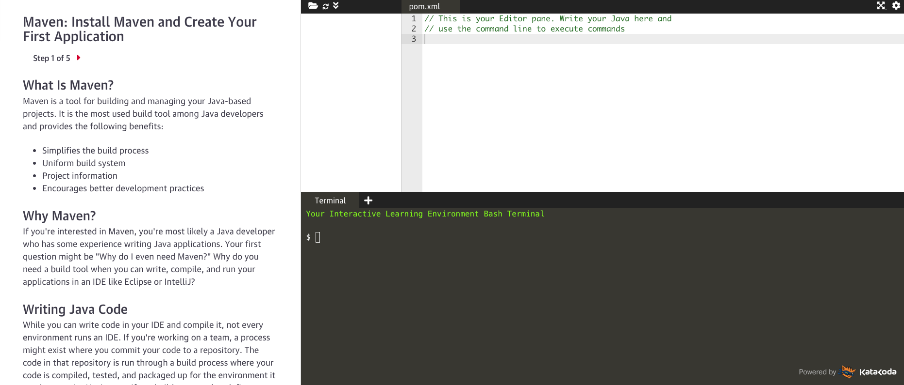

I'm happy to announce that a few projects I have been working on with [O'Reilly Media](https://learning.oreilly.com/) are now live.
First off I want to thank everyone at O'Reilly for all of their help launching these projects. For me, O'Reilly has long
been the gold standard for technical training materials. Their physical books line my bookshelf and I also have a
subscription to the [O'Reilly Learning Platform](https://learning.oreilly.com) which I highly recommend. When I got
approached to collaborate with them on a new type of learning platform I was really excited.

## Interactive Learning powered by Katacoda

Before I dive into the specific projects that I worked on it might help to have a little context on what the interactive learning
platform is. We all know that you can buy all the books or watch all the videos you want but if you want to truly learn
something you have to learn by doing.

Interactive Learning is a short, 5-15 minutes hands-on learning experience. There is no development environment to set up-just write
and run code as you learn, right in your browser. Each interactive learning tutorial is called a scenario and you can have
three to five scenarios grouped together that will make up a set.

Below is an example from one of the scenarios I built for getting started with Maven. Each step has a tutorial, a code
editor and a terminal to run commands. This layout is customizable based on what you are teaching but this made sense
for this particular scenario.

If you want to learn more about Interactive Learning or browse there hundreds of scenarios head over to https://learning.oreilly.com/interactive.
You will need an O'Reilly account to access these but as someone who had an account before working on these I can tell
you that it is well worth the money.

## My Interactive Learning sets

Now that you know a little more about what Interactive Learning scenarios are I can tell you about the sets that I put together.
I think my biggest challenge creating these was that it was a new system to me with its own rules and boundaries. The first
set I put together took a long time but soon after getting used to things I was able to get into a grove.

Below are each of the sets that I put together, links to each of the scenarios and a description of the set.

### Spring Boot: Creating your first REST API

In this set you will how to create a new Spring Boot project that will be a REST API. If you are new to Spring Boot
and creating REST APIs this is a perfect place to get started.

- [Spring Boot: Create a New Project](https://learning.oreilly.com/scenarios/spring-boot-create/9781492088547/)
- [Spring Boot: Create a REST Controller](https://learning.oreilly.com/scenarios/spring-boot-create/9781492088554/)
- [Spring Boot: Dependency Injection](https://learning.oreilly.com/scenarios/spring-boot-dependency/9781492088561/)
- [Spring Boot: Handling JSON](https://learning.oreilly.com/scenarios/spring-boot-handling/9781492088578/)
- [Spring Boot: Handling Errors](https://learning.oreilly.com/scenarios/spring-boot-handling/9781492088585/)

### Spring Boot: Connecting to a database

In this set you will learn how to connect, populate, access and manipulate date from a database in a Spring Boot application.
This is perfect for anyone who is just getting started with Spring Boot and want to learn how to interact with a database.

- [Spring Boot: Connect to a Database](https://learning.oreilly.com/scenarios/spring-boot-connect/9781492088608/)
- [Spring Boot: Populate a Database](https://learning.oreilly.com/scenarios/spring-boot-populate/9781492088615/)
- [Spring Boot: Accessing Data with JdbcTemplate](https://learning.oreilly.com/scenarios/spring-boot-accessing/9781492088622/)
- [Spring Boot: Manipulating Data with JdbcTemplate](https://learning.oreilly.com/scenarios/spring-boot-manipulating/9781492088639/)
- [Spring Boot: Using the Command Line Runner Interface](https://learning.oreilly.com/scenarios/spring-boot-using/9781492088646/)

### Maven: First Steps

In this set you will learn what Maven is and how to use it in Java projects. Maven is a tool for building and managing your Java-based projects
and is the most used tool among Java developers. This set is perfect for anyone who wants to understand how to use Maven.

- [Maven: Install Maven and Create Your First Application](https://learning.oreilly.com/scenarios/maven-install-maven/9781492088660/)
- [Maven: Compiling, Packaging, and Running Your Application](https://learning.oreilly.com/scenarios/maven-compiling-packaging/9781492088677/)
- [Maven: Dependency Management](https://learning.oreilly.com/scenarios/maven-dependency-management/9781492088684/)
- [Maven: Using Maven Plugins](https://learning.oreilly.com/scenarios/maven-using-maven/9781492088691/)
- [Maven: Using Maven Archetypes](https://learning.oreilly.com/scenarios/maven-using-maven/9781492088707/)

## Conclusion

I had a lot of fun putting these together and now that I know what I am doing and how to approach building out each scenario
I am excited to put together more of them. I have put together some suggestions for new scenarios and I will let all of you
know if I build any more. Thanks again to O'Reilly for giving me the opportunity to work on these. Having an [author page](https://learning.oreilly.com/search/?query=author%3A%22Dan%20Vega%22&extended_publisher_data=true&highlight=true&include_assessments=false&include_case_studies=true&include_courses=true&include_orioles=true&include_playlists=true&include_collections=true&include_notebooks=true&is_academic_institution_account=false&source=suggestion&sort=relevance&facet_json=true&page=0&include_scenarios=true&include_sandboxes=true)
on their platform with some of my work is a dream come true.

