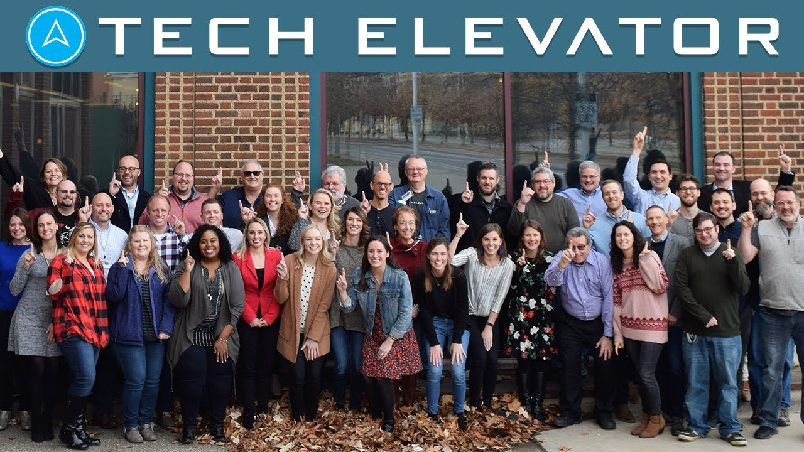

I think we can all agree that we would like to put 2020 in the rear-view mirror and begin to look forward to the new year. In this post, I am going to share some exciting personal news, what I'm looking forward to learning, and some goals I want to set for myself this year.

## Goodbye Tech Elevator

Leaving an employer is never easy and it's especially hard when you love the company you work for. [Tech Elevator's](https://www.techelevator.com/) mission is near and dear to my heart and I will continue to be an advocate for them. If you're looking into [coding bootcamps](https://www.switchup.org/rankings/best-coding-bootcamps) I honestly think they are one of the best in the country and you should check them out.

I was a curriculum developer for 2.5 years and love everything about the content the curriculum team was able to produce. As a team, we refined our process over that time and I went from someone who was a content creator to someone who understands what a professional curriculum looks like.

I owe a lot of this to my boss, co-founder of Tech Elevator, David Wintrich. Not only did I learn a lot from him but he was one of the best people I have ever had the privilege to work for. As I am writing this it's clear to me how much I am going to miss him. **#MapleHeights**

I haven't been in the office since the first week of March and it's starting to hit me that I won't be going back. I love the energy that the students and my coworkers brought to that space every single day. I'm going to miss the morning coffee chats with so many wonderful people. There are so many great people at Tech Elevator and I hope that I left a good impression on them and that we all stay in touch. 💔

## Hello, Briebug Software

> “Life is a circle. The end of one journey is the beginning of the next.”
> ― Joseph M. Marshall III

I am excited to announce that I have joined [Briebug software](https://briebug.com/) as an Enterprise Java Architect. I didn't know much about Briebug going into this process but I was referred to by my friend [Jordan Powell](https://twitter.com/JordanPowell88).

Jordan had nothing but great things to say about the company culture and how he thought I would be a great fit. After talking to a few employees at Briebug I was beyond excited about this opportunity.

Java was the first programming language I learned and I have spent most of my career on the JVM. This opportunity gives me the chance to work on some exciting projects solving some of the most challenging problems our clients have.

As much as I love solving problems through code it isn't what drives me. I really love to learn new things and teach what I have learned to others. This position gives me the chance to work with some very smart people and I feed off of that. It also gives me a chance to teach and mentor other developers as a team lead and I think I'm looking forward to that the most.

If that wasn't exciting enough, we are hiring! We are looking to fill many roles so if you're interested in working with me please check out our [careers page](https://briebug.com/careers).

What this means for you is that you can expect a lot more content on this blog and on my [YouTube](https://www.danvega.dev/youtube) channel around the projects I will be working on day to day. If you have specific items you would like to see me cover please leave a comment below 👇🏻 or reach out to me on [Twitter](https://www.danvega.dev/twitter).

## Learning

I don't know about you but I keep a long list of subjects that I am interested in learning. This could be something brand new or brushing up on an existing skill. This list is always changing and given my new role I am going to focus a lot on Enterprise Architecture, Cloud and leadership skills.

### Software Architecture

As an architect, I am looking forward to obsessing over finding the best solutions to our customer's problems. I am going to start by re-reading ["Clean Architecture" by Robert C Martin](https://amzn.to/3niCGfq). This book does a great job by covering a lot of the fundamentals of architecture and design principles.

I also picked up a new book [Fundamentals of Software Architecture](https://amzn.to/3ousa6x) that I am looking forward to reading. Finally, I plan on spending some time take a deeper dive into software architecture patterns like microservices and event-driven architecture.

If there is anything you would like to see me cover please let me know below 👇🏻.

### AWS

I am in awe of all the capabilities that Amazon Web Services (AWS) provides. In my [Getting Started with Spring Boot 2](https://www.udemy.com/course/spring-boot-2/?referralCode=ECB6B9F8EF104672AF4A) course I used AWS to launch the application that we built into production.

I spent some time over the break to better understand what services are available and when to reach for them. I have just begun to scratch the surface of what AWS can do and here are a few services that I am excited to learn more about.

- [AWS Amplify](https://docs.amplify.aws/)
- [AWS AppSync](https://aws.amazon.com/appsync/)
- [AWS Lambda](https://aws.amazon.com/lambda/)

### Azure

I haven't had the opportunity to use Microsoft's cloud services yet and I am going to take advantage of them this year so I am looking forward to diving right in. I am especially excited to check out [Azure Spring Cloud](https://azure.microsoft.com/en-us/services/spring-cloud/) which is a fully managed Spring Cloud service, jointly built and operated with VMware.

### Leadership Skills

On the non-technical front, being a good leader is important to me. My goals here are to build trust and respect with my team and I found the perfect book. The Art of leadership by Michael Lopp looks like a fantastic read. Michael spent time at Netscape, Apple, and Slack and he shares a series of small but compelling practices to help you build leadership skills.

### Just for fun

There are a few things on my list that If I ever found myself sitting around with nothing to do (unlikely) that I would love to learn.

- **Go**: I have already started learning Go but I need to find more time for it and a few real-world applications to give me a kick start.
- **Mobile Development** (Swift / Flutter): I don't know why but I have always wanted to build a mobile application. I don't have any ideas for an app at the moment but when I do I think it would be so cool to publish an application to an app store 🤷‍♂️

## Goals

When the new year starts I usually like to set some goals. I have talked about this before but one of my favorite books on this subject is [Your Best Year Ever by Michael Hyatt](https://amzn.to/3ni9Goj). I learned how to make specific goals and how to achieve them. I'm throwing a lot of that knowledge out the door this year.

The pandemic has been a real challenge with two young daughters at home. I'm also starting a new job that is going to require my full focus. This doesn't leave a lot of time to work towards some of these goals. With that said there are things I want to do or at the very least work towards this year. That is why I am not going to put any specific time measurement on my goals and they very well could go into next year.

### Java Champion

[Java Champions](https://developer.oracle.com/javachampions/) are leaders in the Java community who are experts at what they do. I happen to know a few Java Champions and I look up to them and aspire to be like them. I feel like I do a lot for the Java community but I could be doing so much more. I am going to figure out more ways to contribute to the community who has given me so much so that one day I might join this list.

### Cloud Certifications

I would really like to get a few cloud certifications from AWS and build from there. I am going to start with the Cloud Practitioner, Solutions Architect Associate, and Solutions Architect Professional.

### Content Creation

My new job is going to afford me the opportunity to give back to the community and create content. This will be through my blog, YouTube channel and live streaming. This is one of those things that I can't put a number on yet but when I do I just want to be consistent. Consistently provided value for you is my goal, not burnout.

### Author

Career aspiration for me has always been to write a book. I'm not naive and realize that this isn't going to happen this year but It's always in the back of my head. As a way to kickstart this, I have a few ideas of e-books that I could create. This would be a shorter more manageable goal and something I could finish this year.

### Courses

I miss creating courses. The whole process from idea to curriculum design to production. Some of my most popular courses are 12-15 hours long and I just don't have the time for that these days. That doesn't mean that I couldn't create a smaller course in the range of 2-4 hours. I think If I aligned this with my ideas for an e-book I could use the content across both mediums and package them up.

### Newsletter

I stopped releasing my weekly newsletter this year because, you know 2020. I need to come up with a plan where this is a manageable task that I can stick to each week. The format and cadence is also something I need to examine.

### Conferences

I miss conferences, a lot. I miss learning and talking to all of you. A goal of mine this is year is to speak at or at the very least attend a conference later this year if everything is safe.

## Conclusion

Leaving your comfort zone is never easy but the biggest gains come from the things that scare you the most. I'm looking forward to some sense of normalcy returning in 2021 and taking this new challenge on. What are you looking to learn in 2021? Do you have any resources or books you want to share? Please share below.
