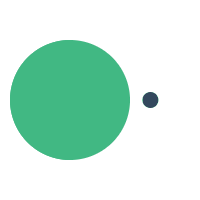
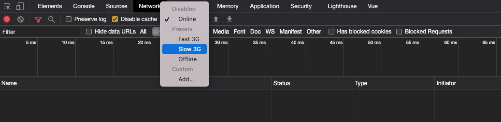

So you have this amazing loading animation, and you want to test it out but you have a problem. When you're working on your local machine there isn't much latency so you never see your animated art.



While it's good that you want to test this out this is also an opportunity to test our application for visitors that might be on a slower connection. We have to remember that not everyone is lucky enough to have access to hi-speed internet like you and I do. There are many ways that you can test this out but we are going to cover the following in this tutorial.

* Chrome DevTools (Bandwidth Throttling)
* Client Side (Force Delay)
* Server Side (Force Delay)

The code samples in this article will use Vue on the frontend and Java on the backend but the concepts are the same regardless of languages or frameworks.

## Chrome DevTools

As I mentioned in the intro it is important to test your applications on a slower connection. One way to accomplish this is by using the Chrome DevTools to throttle the network speed.

> Network throttling is an intentional slowing down of internet speed. In web performance, network throttling, or network condition emulation, it is used to emulate low bandwidth conditions experienced by likely a large segment of a site's target user base

To do this open up DevTools and go to the Network tab. There is a dropdown on the first line that defaults to "Online". Change to what speed you want to imitate and reload the page to simulate that connection.



This is a great first step but this will throttle the entire connection and I often don't have the patience for this during development.

## Client-Side (Vue)

The next solution I want to cover is building in a delay to the client-side code. In the following example, I am using a [public API](https://icanhazdadjoke.com/) to return a random dad joke. When the component is mounted the `loadJoke()` method is called and a `fetch()` request is made to the API. We use state within the component to display the loading animation until the fetch request has been completed and we have a joke to display.

```html
<template>
  <div class="dadjoke">
    <h1>Random Dad Jokes</h1>
    <p v-if="loading"></p>
    <p v-else>{{ joke }}</p>
  </div>
</template>

<script>
export default {
  name: "App",
  data() {
    return {
      joke: "",
      loading: true,
    };
  },
  methods: {
    loadJoke() {
      fetch("https://icanhazdadjoke.com/", {
        headers: {
          Accept: "application/json",
        },
      })
        .then((response) => {
          return response.json();
        })
        .then((data) => {
          if (data.status === 200) {
            this.joke = data.joke;
            this.loading = false;
          }
        })
        .catch((err) => console.log(err));
    },
  },
  mounted() {
    this.loadJoke();
  },
};
</script>
```

Even in a CodeSandbox environment, this is pretty fast and you don't see the loading animation.

<iframe src="https://codesandbox.io/embed/angry-fast-3te0x?fontsize=14&module=%2Fsrc%2FApp.vue&theme=dark"
     style="width:100%; height:500px; border:0; border-radius: 4px; overflow:hidden;"
     title="angry-fast-3te0x"
     allow="accelerometer; ambient-light-sensor; camera; encrypted-media; geolocation; gyroscope; hid; microphone; midi; payment; usb; vr; xr-spatial-tracking"
     sandbox="allow-forms allow-modals allow-popups allow-presentation allow-same-origin allow-scripts"
   ></iframe>

To force a delay you can use the `setTimeout()` function in JavaScript to set a timer which executes a function or specified piece of code once the timer expires. The first argument is the function or code you want to execute and the second argument is the delay in milliseconds. In this example, I am forcing a three-second delay.

```js
mounted() {
  setTimeout(this.loadJoke, 3000);
}
```

Now when we run our example we can have a three second delay and we can clearly see our loading animation.

<iframe src="https://codesandbox.io/embed/cocky-benz-o2x09?fontsize=14&module=%2Fsrc%2FApp.vue&theme=dark"
     style="width:100%; height:500px; border:0; border-radius: 4px; overflow:hidden;"
     title="cocky-benz-o2x09"
     allow="accelerometer; ambient-light-sensor; camera; encrypted-media; geolocation; gyroscope; hid; microphone; midi; payment; usb; vr; xr-spatial-tracking"
     sandbox="allow-forms allow-modals allow-popups allow-presentation allow-same-origin allow-scripts"
   ></iframe>

The one downside to this approach is that you might forget to remove code like this and you don't want this getting checked in and pushed into production. One solution to this problem is to use environment variables to make sure you are in development mode when forcing a delay. In the following example, I am using [Vite](https://github.com/vitejs/vite) to get the environment and to set a custom delay.

```js
mounted() {
  if (import.meta.env.DEV) {
    setTimeout(this.loadJoke, import.meta.env.VITE_FETCH_DELAY);
  } else {
    this.loadJoke;
  }
}
```

## Server-Side

The next solution I want to look at is building in a delay to the server-side code. This wouldn't work for the previous example because we didn't have control over that API. If you are the one working on the server-side code though you can force a delay there.

In the following example, I am using Java but you can accomplish this in whatever language you're using. I have a Spring Boot Controller that returns a random joke but before that happens we force a delay of three seconds using the static `sleep()` method in the `Thread` class.

```java
@RestController
@RequestMapping("/api/jokes")
public class JokeController {

    @GetMapping
    public String random() throws InterruptedException {
        Thread.sleep(3000);
        return "What do you call a pig that knows karate? A pork chop!";
    }
}
```

As with the client-side solution you should be careful about checking this in and letting this go into production. You could set an active profile in `application.properties`:

```java
spring.profiles.active=dev
```

Back in your controller, you can get that value and as along as it's not a production environment you can force your delay.

```java
@RestController
@RequestMapping("/api/jokes")
public class JokeController {

    @Value("${spring.profiles.active}")
    private String ENV_MODE;

    @GetMapping
    public String random() throws InterruptedException {
        if( ENV_MODE != "prod" ) {
            Thread.sleep(3000);
        }
        return "What do you call a pig that knows karate? A pork chop!";
    }
}
```

## Conclusion

This question came to me from one of our students and I thought it was a good one. Just remember while you might want to test one component or feature for latency it is important to test the entire application with a slower connection to ensure each visitor has a good experience.


