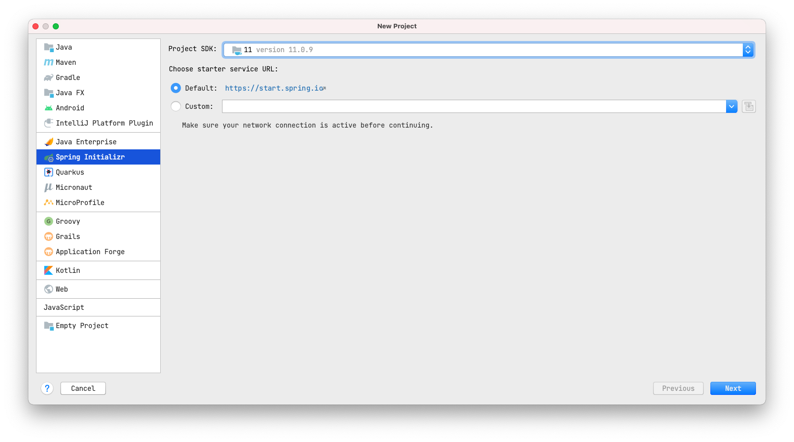
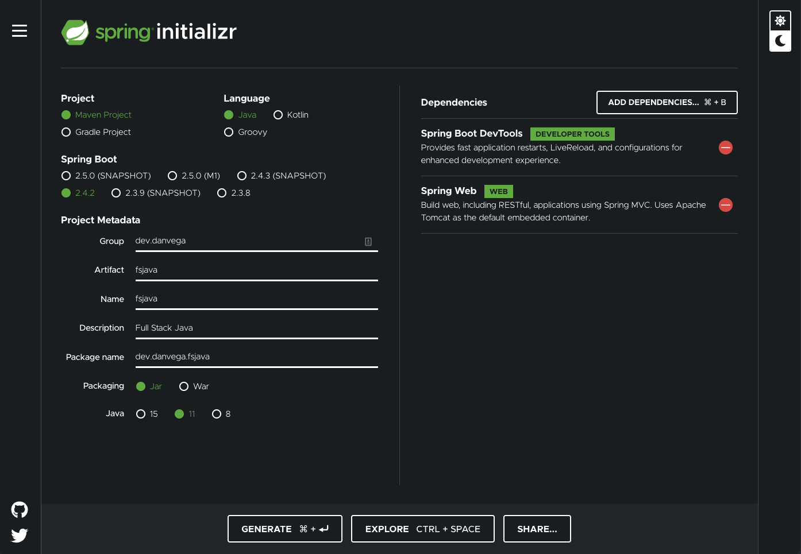
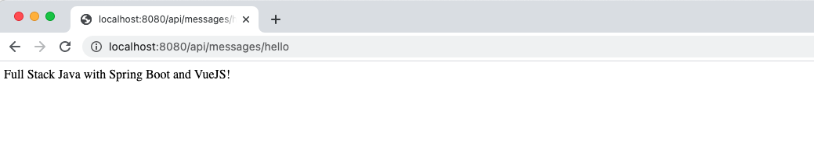
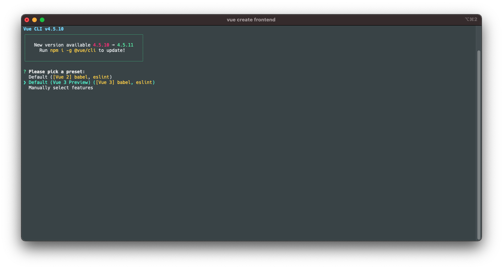
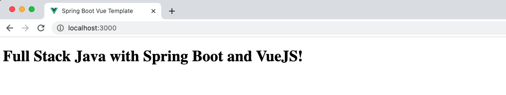
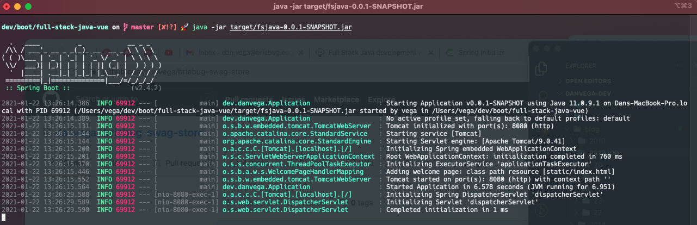

In this tutorial, you will learn how to build a full-stack application that uses Vue for the frontend and Spring Boot for the backend. As always you can find the code associated with this over on [Github](https://github.com/danvega/full-stack-java-vue).

## Table of Contents

- Design decisions
- Monolithic architecture
- Creating the project
  - Requirements
  - Spring Boot
  - Vue
  - Build plugins
- Conclusion

## Design decisions

Creating a brand new application from scratch is exciting, isn't it? The possibilities are endless but the freedom to create whatever you want comes with some future implications. I know your first instinct is to jump right into the deep end and start writing code but before you do, you should have a clear idea of what you're trying to build.

> "IF YOU FAIL TO PLAN, YOU ARE PLANNING TO FAIL"

Without fully understanding the problems you are trying to solve for I can't recommend the absolute best solution but I will give you a general approach. One of the first questions I try to answer is "What is the structure of the development team on this project?". This shouldn't be the driving force for all of your decisions but it is an important one.

If you have full-stack developers that will be working on both sides of the application a monolithic approach could make sense. If you have separate teams working on the frontend and backend splitting these projects into two independent projects might make sense. There are pros and cons to each and these should really be evaluated on a per-project basis.

## Monolithic architecture


In this article we are going to focus on building a Monolithic application that uses Vue on the fronted and Spring Boot on the backend. A lot of developers I come across are familiar with both of these technologies but aren't quite sure how to configure them in a single project.

Having a single deployable asset simplifies the deployment process which I know a lot of developers don't like to deal with. If you're a single developer or a team of full-stack developers this is a great option. There are some tricks to getting this all into a single project but that is exactly what you will learn in this tutorial.

The biggest advantage to this approach is that you end up with a single artifact to deploy. If you don't have a team dedicated to the DevOps side of development this will help cut down some of the complexities of moving to production.

This also means that if you want to change something small on the frontend you will to redeploy the entire application. If you have a large team there could be a lot of paths crossing which could end up causing lots of merge conflicts. I don't know about you but the only thing worse than real life conflicts is dealing with merge conflicts 😳

## Creating the project

You will start by creating a Spring Boot project that will act as the foundation for your project. You can then generate a new Vue project in the Spring Boot project and with some configuration you will be able to put all of the puzzle pieces together.

> This could be done using any front end technology (Angular,React,Vue,Svelte,etc..)

### Requirements

I am going to make some assumptions about you before we get started. You should be familiar and have some experience with the following:

- Java
- Maven
- Spring Boot
- JavaScript
- VueJS

### Spring Boot

My IDE of choice is IntelliJ Ultimate Edition. If you're using the same you can create the project right in the IDE:



If you're not you can do the same from https://start.spring.io



Start by creating a new Spring Boot project with the following properties:

- **Group:** dev.danvega
- **Artifact:** fsjava
- **Type:** Maven
- **Spring Boot:** 2.4.2 (or latest)
- **Language:** Java
- **Packaging:** Jar
- **Java Version:** 11
- **Package:** Jar
- **Dependencies:**
  - Spring Boot DevTools
  - Spring Web

The first thing I like to do with any new project is to make sure it runs as expected. Open up the main application class (I renamed mine to Application.java) and run it to make sure

```java
@SpringBootApplication
public class Application {

    public static void main(String[] args) {
        SpringApplication.run(Application.class, args);
    }

}
```

#### Message Controller

The first class you are going to create is a simple controller that contains a single mapping. This will be a public REST endpoint that you can call from your client application.

```java
@RestController
@RequestMapping("/api/messages")
public class MessageController {

    @GetMapping("/hello")
    public String hello() {
        return "Full Stack Java with Spring Boot & VueJS!";
    }

}
```

With DevTools your application should have restarted after this change, if it hasn't please re-run the application. Open up a browser and navigate to http://localhost:8080/api/messages/hello



### Vue

Next, you will create the frontend application using the [Vue CLI](https://cli.vuejs.org/). If you're in IntelliJ you can open up the terminal or open up what ever shell you use. If you have the Vue CLI installed you can navigate to the `/src` folder and run the command `vue create frontend` which will generate a project into `/src/frontend`. For this project I am generating a Vue 3 application but this will also work with v2.



Once the application has been created navigate to `/src/frontend` and run the application.

```bash
npm run serve
```

If your Spring Boot application isn't running the client app will start on port 8080, if it is it will find the next available port. At this point you should be able to run both of the applications independently.

### Vue Configuration

Next let's add some configuration so to our Vue application that will solve a couple of problems.  Create a new file in the root of the `/frontend` folder named `vue.config.js` that contains the following:

```js
// vue.config.js
module.exports = {
    // https://cli.vuejs.org/config/#devserver-proxy
    devServer: {
        port: 3000,
        proxy: {
            '/api': {
                target: 'http://localhost:8080',
                ws: true,
                changeOrigin: true
            }
        }
    }
}
```

This will set the port to 3000 so we don't collide with the Spring Boot application. Next you're setting a proxy so that any request that starts with `/api` will be forwarded to http://localhost:8080. This means that you don't have to worry about setting up different environment variables for development and production.

#### App.vue

`App.vue` is the main component that is loaded in your Vue application. You can start by cleaning this up and removing some of the default styles.

```vue
<template>
  <HelloWorld />
</template>

<script>
import HelloWorld from './components/HelloWorld.vue'

export default {
  name: 'App',
  components: {
    HelloWorld
  }
}
</script>

<style>

</style>
```

### HelloWorld Component

Last step on the frontend is to remove the boiler-plate code from the `HelloWorld.vue` component. In this component you can make a fetch request to your backend API to retrieve the message that is being exposed on your hello endpoint. I am doing this in the `mounted()` lifecycle hook and I am using the Fetch API.

```html
<template>
  <h1>{{ msg }}</h1>
</template>

<script>
export default {
  name: 'HelloWorld',
  data() {
    return {
      msg: ''
    }
  },
  mounted() {
    fetch("/api/messages/hello")
      .then((response) => response.text())
      .then((data) => {
          this.msg = data;
      });
  }
}
</script>
```

If you run the Vue application using `npm run serve` you should see the message from your backend API being displayed.



My development workflow consists of running these as separate applications. I usually start up a new shell in the background for running the Vue application. This gives me one less distraction in IntelliJ and I appreciate the larger iTerm window to view anything going wrong with the client.

### Build plugins

When it comes to production the goal of our Monolithic application is to have a single deployable artifact. To accomplish this you will need to build a production version of our VueJS application and copy that to your `/target/classes/static` directory.

With `index.html` in the static folder this is the file that will be served when you hit the root. Finally as part of that build process Spring Boot will build a runnable JAR. Open up your `pom.xml` and make sure you have the following properties set:

```xml
<properties>
    <java.version>11</java.version>
    <node.version>v10.15.0</node.version>
    <npm.version>6.14.3</npm.version>
</properties>
```

Next, locate the `<build>` section and add the [frontend-maven-plugin](https://github.com/eirslett/frontend-maven-plugin). This plugin downloads/installs Node and NPM locally for your project, and runs `npm install` and `npm build` to build your Vue application. The output for this build is stored in the `/src/frontend/dist` directory.

```xml
<plugin>
    <groupId>com.github.eirslett</groupId>
    <artifactId>frontend-maven-plugin</artifactId>
    <version>1.7.6</version>

    <executions>
        <execution>
            <id>Install node and npm</id>
            <goals>
                <goal>install-node-and-npm</goal>
            </goals>
            <phase>generate-resources</phase>
            <configuration>
                <nodeVersion>${node.version}</nodeVersion>
                <npmVersion>${npm.version}</npmVersion>
            </configuration>
        </execution>

        <execution>
            <id>npm install</id>
            <goals>
                <goal>npm</goal>
            </goals>
            <phase>generate-resources</phase>
            <configuration>
                <arguments>install</arguments>
            </configuration>
        </execution>

        <execution>
            <id>npm build</id>
            <goals>
                <goal>npm</goal>
            </goals>
            <phase>generate-resources</phase>
            <configuration>
                <arguments>run build</arguments>
            </configuration>
        </execution>
    </executions>
    <configuration>
        <nodeVersion>${node.version}</nodeVersion>
        <workingDirectory>src/frontend</workingDirectory>
    </configuration>

</plugin>
```

Next, add the [maven-resources-plugin](https://maven.apache.org/plugins/maven-resources-plugin/) which handles the copying of project resources to the output directory. You will need to copy everything from the `src/frontend/dist` directory to the `target/classes/static` directory.

```xml
 <plugin>
    <groupId>org.apache.maven.plugins</groupId>
    <artifactId>maven-resources-plugin</artifactId>
    <executions>
        <execution>
            <id>Copy Vue frontend into Spring Boot target static folder</id>
            <phase>process-resources</phase>
            <goals>
                <goal>copy-resources</goal>
            </goals>
            <configuration>
                <outputDirectory>target/classes/static</outputDirectory>
                <resources>
                    <resource>
                        <directory>src/frontend/dist</directory>
                        <filtering>true</filtering>
                    </resource>
                </resources>
            </configuration>
        </execution>
    </executions>
</plugin>
```

And that is all of the configuration you need. From the command-line you can now package the application using Maven:

```bash
mvn clean package
```

When that is complete you should see something that looks like this and it will end up producing a new JAR `fsjava-0.0.1-SNAPSHOT.jar` for you.

```bash
[INFO]
[INFO] Results:
[INFO]
[INFO] Tests run: 1, Failures: 0, Errors: 0, Skipped: 0
[INFO]
[INFO]
[INFO] --- maven-jar-plugin:3.2.0:jar (default-jar) @ fsjava ---
[INFO] Building jar: /Users/vega/dev/boot/full-stack-java-vue/target/fsjava-0.0.1-SNAPSHOT.jar
[INFO]
[INFO] --- spring-boot-maven-plugin:2.4.2:repackage (repackage) @ fsjava ---
[INFO] Replacing main artifact with repackaged archive
[INFO] ------------------------------------------------------------------------
[INFO] BUILD SUCCESS
[INFO] ------------------------------------------------------------------------
[INFO] Total time:  20.083 s
[INFO] Finished at: 2021-01-22T13:24:38-05:00
[INFO] ------------------------------------------------------------------------
```

You can run this jar from the command line `java -jar target/fsjava-0.0.1-SNAPSHOT.jar`



With this single artifact you can push this into a production environment and you are ready to go. A few of my favorite options for doing this are:

- [Heroku](https://www.heroku.com/)
- [AWS Beanstalk](https://aws.amazon.com/elasticbeanstalk/)
- [Azure Spring](https://azure.microsoft.com/en-us/services/spring-cloud/)

## Conclusion

I wanted to keep the application simple in this article so we could focus on the plumbing of the project. That said if you're interested in seeing more please let me know. Spring Boot and Vue are two technologies I really enjoy using and I hope this helps others put the two together. As always friends...

Happy Coding<br/>
Dan
