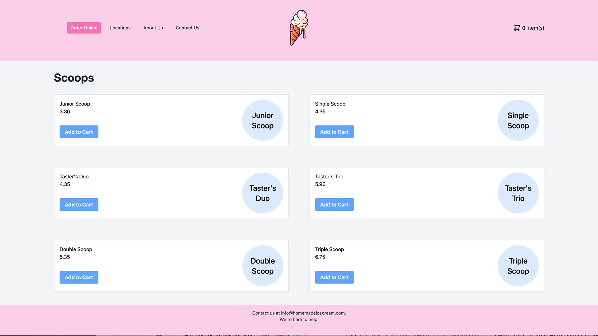

This year [SpringOne](https://springone.io/) takes place September 1-2, 2021, and is free to virtually attend. As much as I want to get back to speaking in person I am just so thankful to have been selected to speak at this conference. I am looking forward to sharing the virtual stage with so many of the best speakers in our community.

## Full Stack Java Development with Spring Boot and Vue

I am going to be presenting on two of my favorite frameworks, Spring Boot and VueJS. I have a bit of a confession to make, I am a lazy programmer and both of these frameworks are enablers. They both make all of the hard stuff easy and let me focus on the business requirements of the project.  Here is the presentation abstract to give you a bit more context on the presentation.

> Are you interested in building full-stack web applications with Spring Boot and Vue 3? If so, this session is going to give you everything you need to get started. You will learn some of the different approaches to building full-stack applications and the pros and cons to each.

> First, we will look at how Vue is a progressive framework and will allow you to incrementally adopt it in your Java applications as your needs grow. Next, we will look at how to build a monolith application where you end up with a single deployable JAR. Finally, if your frontend and backend teams are separate, we will look at a solution for you.

> When you leave this session, you’ll have everything you need to start building full-stack web applications with Spring Boot and VueJS.

### What will you learn?

As I said in the abstract I want to focus on three different approaches to using Spring Boot and VueJS together. What approach you choose will depend on the project's requirements and the makeup of your team. You will learn what to use each of these as well as some pros/cons to each.

1. Progressive Vue - Incrementally adopting Vue to enhance an existing page
2. Monolith - The Spring Boot project contains the Vue frontend and you will package both of them into a single deployable JAR.
3. Single Page Application (SPA) - The frontend and backend applications are built and deployed independently.

To illustrate these approaches we will be building out functionality for an Ice Cream store. If you don't learn anything you either weren't paying attention or completely consumed with the idea of getting ice cream.

### Resources

If you would like to get access to the source code for any of the demos I walked through or the slide deck for the presentation please visit the following Github Repository.

https://github.com/danvega/spring-one-2021

### Feedback

I love putting presentations together but without your feedback, they can sometimes leave me feeling incomplete. If you have any feedback (positive or negative) please reach out to me and let me know. I hope to give this talk again so I would love to know what I can do to improve it for next time.
