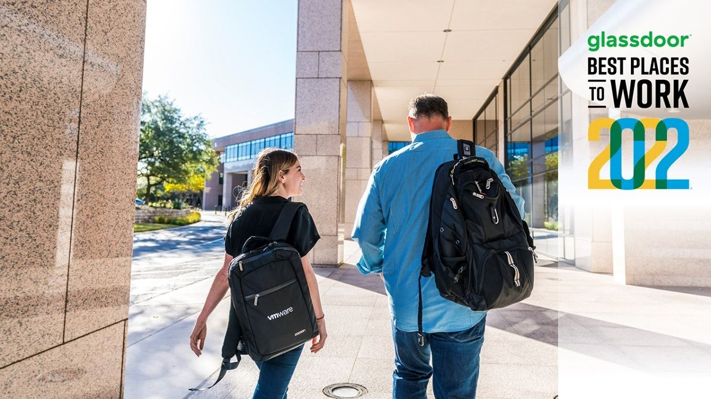
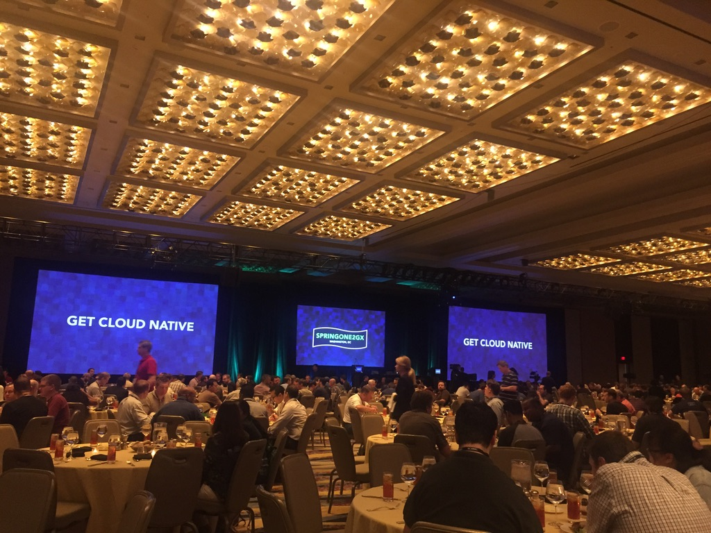
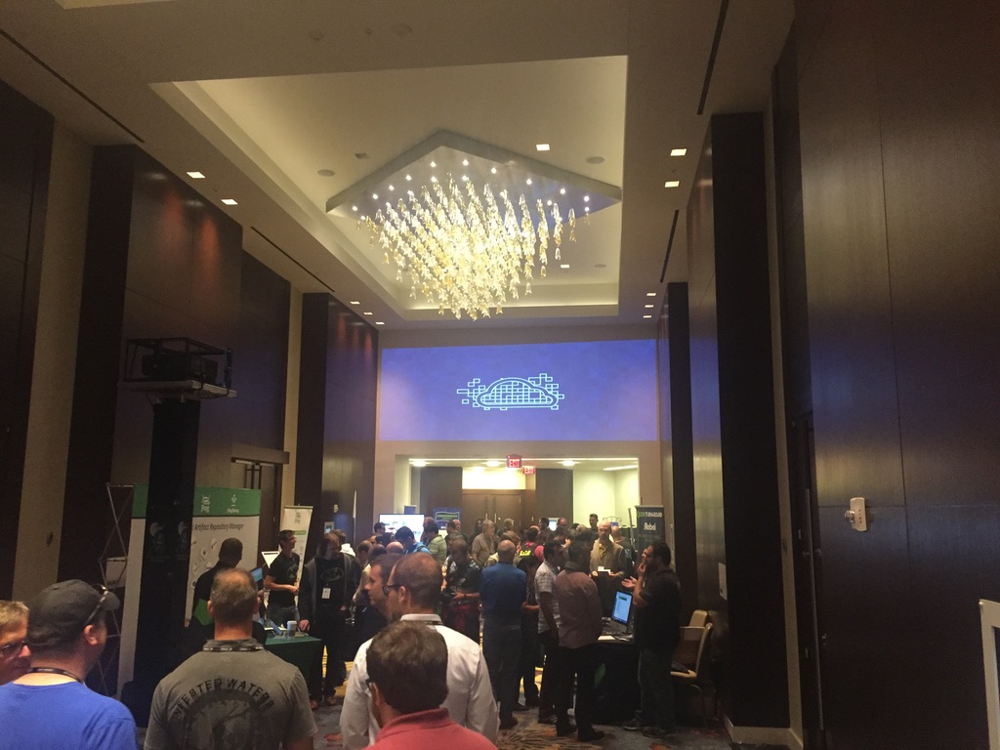
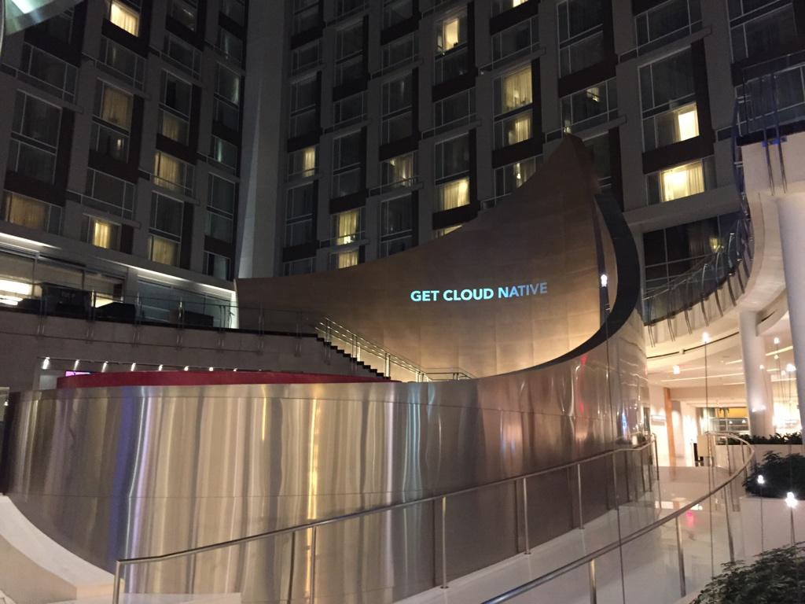
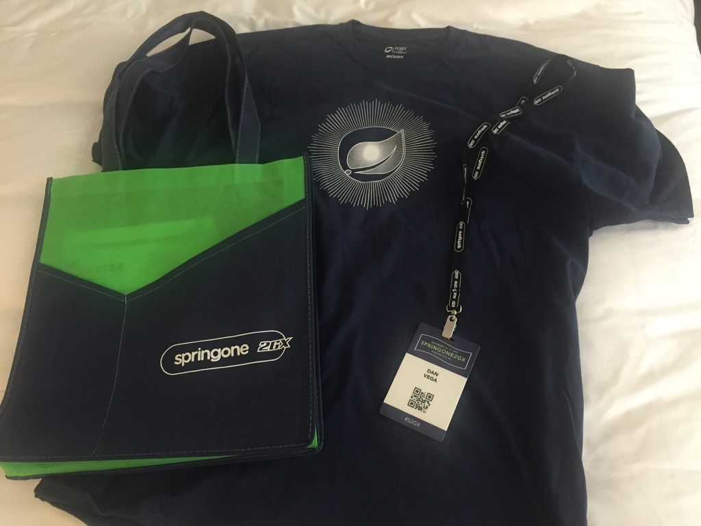
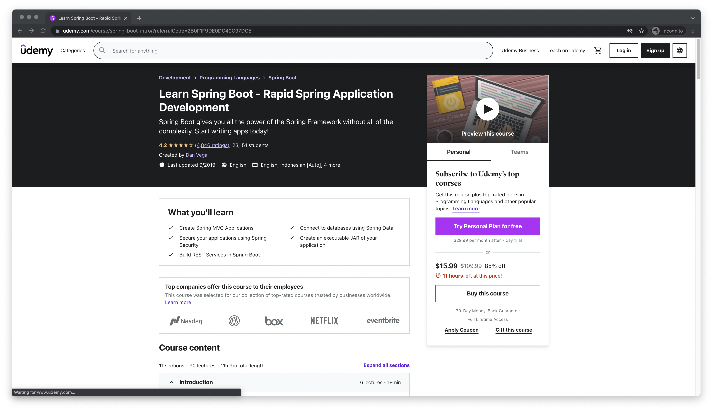
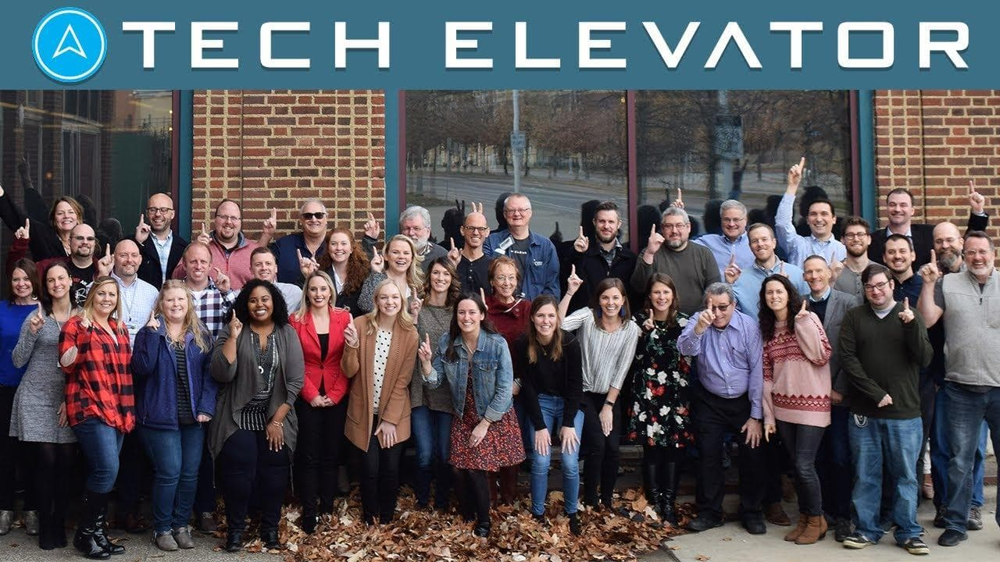

I am thrilled to announce that I have joined **VMWare** as a *Spring Developer Advocate*. I have so many emotions going through my head right now as I sit down to write this article. The ones that stand out the most to me are excited and proud.

I’m excited for the opportunity that lies ahead and I know that this is just the start, there is a lot of work ahead. I’m proud of always believing in myself even when I had doubts if this was the career for me. I’m a  self-taught developer and over my 22+ years, the only person I have been trying to prove anything to was myself. A job should never define you or your worth but this is a dream job and you better believe I’m going to celebrate this one 🥳

## A Trip down Spring Memory Lane

If you have been following me and my content you know that I am a huge fan of Spring, the ecosystem, and the community. I thought I would take this opportunity to tell you how and when I got started with Spring as well as what I have been up to lately.

My first introduction to the Spring Framework was around 2012 when I did some freelancing on a few side projects. I remember being impressed with the versatility of the framework but I also remember it being incredibly complex to stand up a new project. Trying to figure out what dependencies you needed, which ones played nicely together, and how to configure a basic application was not easy.

In 2013 I was working for a company that was moving a lot of their ColdFusion-based web applications over to Groovy & Grails. I was a huge fan of Groovy because it made things that were complex in Java really easy. Grails was a convention over configuration framework that allowed us to focus on the business logic and less on the infrastructure. For those that weren’t around for this Groovy & Grails at this time did for us what modern Java & Spring Boot do today.

### SpringOne 2013

My company sent a few of us to SpringOne that year and my main goals for that conference were to see the rock stars of the Groovy & Grails world like Graeme Rocher, Burt Beckwith, Jeff Brown, Guillarme Laforge, Venkat Subramanian, Ken Kousen, Paul King, Dan Woods, and many more. I learned so much at that conference from them and a lot of others. I remember the sheer number of people at this conference and just being in awe. I was used to going to conferences where there were a few hundred and there were probably 2,000+ there.

<aside>
💡 Below is a picture from the room I stayed in and you can see the construction of what is now Levi Stadium in Santa Clara, where the San Francisco 49ers play. I also still have that USB key/bottle opener that I received at that conference!
</aside>

It was in the opening night Keynote that I first heard about Spring Boot. Adrian Colyer and Dave Syer gave a good overview of what Spring Boot would do for Spring Developers. If you have never watched the keynote (or it's been a while) I would encourage you to check out just how far Spring has come since its debut!

<iframe width="100%" height="500" src="https://www.youtube.com/embed/jplkJIHPGos" title="YouTube video player" frameborder="0" allow="accelerometer; autoplay; clipboard-write; encrypted-media; gyroscope; picture-in-picture" allowfullscreen></iframe>

A quote that stuck out to me then and stays true today:

> “Spring Boot really puts the developer enjoyment back.”
>

As I said before as a developer my experience with Spring wasn’t a great first impression. Spring could have a solution for every problem under the sun but if developers didn’t enjoy using it, it might not be as popular as it is today. While I was excited to hear about the work they were doing with Spring Boot it was still new and I was focused on working with Groovy and Grails.

### SpringOne 2015

I started playing with Spring Boot about 6 months later in April 2014 when version 1.0 was released. At this point, I wasn’t using it for anything serious but I do remember prototyping some applications at work to see if could solve some of the problems we were facing.

In 2015 I made my triumphant return to SpringOne which took place on September 14-17 at the Marriott in Washington DC. I remember this fondly because my coworker and friend Sam Farmer lived in DC and I got to spend some time with him and his family. The hotel and convention center was honestly one of the best settings for a conference I have ever been to. I also really enjoyed the chance to be a tourist in DC for a few days with some friends.

<aside>
💡 Here are a few images that I took from SpringOne 2015

</aside>

This time around I was there to learn as much as I could about **Spring Boot** because at this point I realized it was going to take over the Java world. I mainly focused on beginner sessions around Spring Boot, Spring Data, Spring Cloud, and I focused on what questions developers were asking. I consumed as much knowledge as I could and I came home with a purpose.

I began working on my first course, [Learn Spring Boot](https://www.udemy.com/course/spring-boot-intro/?referralCode=2B0F1F9DE0DC40C97DC5) as soon as I got home. I realized that while there were some courses out there on Spring Boot, I could offer a different perspective. A lot of people believe that you need to be an expert to teach and that is a huge misconception. You only need to be one step ahead of your intended audience, which I now was.

I would launch this course on November 17th just in time for the big Udemy Black Friday Sale. This course would end up being almost 14 hours in length and as a sidebar, I would not recommend making that long of a course as your first one. As you can see from the screenshot this course has almost 24,000 students worldwide.

I cringe looking back at some of the videos I created for this course but you have to start somewhere. Don’t let production quality stop you if you know your content is good. I now have 6 courses and close to 140,000 students in 184 countries. That still blows my mind and I’m very grateful for that opportunity 🙏 I’m hoping I have some time this year to update my existing courses as well as the opportunity to create some new ones.

### SpringOne 2021

After attending a couple of conferences in person I was excited to be selected to speak at my first SpringOne. While this conference was virtual that didn’t change my excitement level. I was going to share the “virtual” stage with so many amazing speakers, some of which I have looked up to since that first conference in 2013.

My presentation was on [Full-Stack Development with Spring Boot and Vue](https://www.danvega.dev/blog/2021/08/30/spring-one-2021/). If you follow me you know I am a big fan of using Vue for frontend development. Much like Spring Boot does for backend development Vue simplifies so many things and lets me focus on building out my features.

A big advantage of giving a remote conference talk for me was that I was in a familiar setting. I create videos for YouTube so being able to sit down at my desk, have my external monitors, keyboard, and mouse made everything easy.

Well, easy until I got a text from my now boss Tasha telling me that Zoom had dropped on their end for everyone and that I was probably talking to air. She was right, I didn’t even notice and was just rambling to nobody. I logged right back in and without hesitation, I picked up right where I left off. I like to think that I impressed a few people, including Tasha with how calm and collected I was. What everyone fails to realize is that I have raised 2 babies during Covid, very few things rattle me these days 🤣

<iframe width="100%" height="500" src="https://www.youtube.com/embed/VkrGHqwSPVA" title="YouTube video player" frameborder="0" allow="accelerometer; autoplay; clipboard-write; encrypted-media; gyroscope; picture-in-picture" allowfullscreen></iframe>

### SpringOne 2022 & Beyond!

My hope is that we return to an in-person conference this year and I get to spend some time talking to all of you. I can’t tell you how excited I am to hear what problems you’re facing and how I can help. In the meantime, if you’re interested in me speaking at your conference or user group please feel free to reach out to me on [Twitter](http://twitter.com/therealdanvega).

## What have I been up to?

After a quick history lesson, I thought I would take some time to tell you what I have been up to lately and what led to this opportunity.

### Tech Elevator

I joined Tech Elevator back in 2018 and I can honestly say that no other company has had an impact on me the way they did. Tech Elevator is a coding BootCamp where you can learn how to code and the soft skills needed to start a career in software development. It was great to see people change careers and their lives after going through our program.

I was hired on as a Curriculum Developer. My job was to help improve the curriculum the students went through as well as the materials the instructors would use to teach with. We had 2 tracks, Java and .NET. In these tracks, the students would learn the skills needed to be well-rounded full-stack developers.

I was particularly excited to work on both the Java and Vue content. On the Java side, I helped us move from Java 8 to Java 11 and Spring + Eclipse over to Spring Boot & IntelliJ. I had a lot of fun updating content and in some cases rewriting entire days of the curriculum. I had a lot of fun improving our tests including our tests of tests which involved a lot of reflection 🤯

Even though I created my own curriculum in the past, Tech Elevator gave me a great guide to what it takes to create a really good experience for the instructor and the student. I miss it there, the energy the students came in with every day was infectious. I hope to make it back there and share some more wisdom with them this year.

### Briebug

I spent a year with [Briebug](https://briebug.com/) and I was recently promoted to Principal Enterprise Architect. Briebug is a consulting company and I worked on one client the entire time I was there. This client was the largest logistics company in the world and I got an opportunity to work on some really cool projects that were at a scale I wasn’t used to working on.

All of the projects I worked on were projects using Spring Boot, Spring Cloud, and Pivotal Cloud Foundry (PCF). I also had the opportunity to design a new system from the ground up that ended up being a set of 10 or so Microservices.

What I really enjoyed about this process is that a lot of the team members were new to Microservices and Spring Cloud in general. I ended up setting up office hours meetings every single day that gave the developers the opportunity to ask questions, and if there were no questions that day I would go through code reviews and explain what changes we needed to make and why.

I really enjoy mentoring and teaching so these are some of my fondest memories over the past year. At the end of the day, I learned that I didn’t like consulting and working for 2 companies, it’s not for everyone. I enjoyed my time with Briebug, my coworkers, and the core values the company stands for.

## Spring Developer Advocate 🥑

Now that you know a little bit of my history I want to take some time to tell you why this is a ***dream job*** for me. I have always had a passion for the art of Software Development. For as long as I can remember though what has brought me the most joy throughout my career is helping others.

I come from a time when there was no StackOverflow or YouTube. I remember struggling with something and thinking to myself, someone else is having a hard time with this too so I am going to blog about it and hopefully save someone the stress of figuring this out.

During this time I found my superpower. Has anyone ever asked you “What is your superpower”? I used to get asked this and I would have no answer but I do now. My superpower is the ability to break down complex problems into easy-to-understand byte-sized chunks, also referred to as problem-solving. I’m good at that and then explaining the problem and solution to others.

I think if you take the experience I have of being in this industry for 22 years, Course Development, Curriculum Development, Writing, YouTube, and my ability to connect with others it’s a surprise I didn’t end up in Advocacy sooner.

### VMware

I’m ecstatic to join such a world-class organization and I’m not taking this opportunity lightly. In this role, I will get to help customers and developers by informing them of solutions to problems. I really hope to be an inspiration to you the way so many have been for me over the years.

I’m so thankful to my boss Tasha Isenberg for giving me this opportunity. Everyone I talk to her raves about her as a person and a Boss and I can already see why. I’m so excited to join such an amazing team of advocates who are all some of the best developers and teachers in the industry.

I’m excited to call Josh Long a coworker, he is someone I have looked up to for a long time and I’m eager to learn from him. I’m excited to work with Nate Schutta who is one of the easiest people In the world to have a conversation with. He also did something very important for me, he introduced me to Ted Lasso.

<iframe src="https://giphy.com/embed/ZYKLgA1pB1WSPQASCs" width="480" height="270" frameBorder="0" class="giphy-embed" allowFullScreen></iframe>
<a href="https://giphy.com/gifs/AppleTV-ted-lasso-tedlasso-ZYKLgA1pB1WSPQASCs">via GIPHY</a>

The one thing I am really looking forward to as the world continues to open back up is to get back to in-person conferences. I hope to be speaking at a few more this year and I already have my eyes on **SpringOne**. If you see me at a conference or a [SpringOne Tour stop](https://tanzu.vmware.com/developer/tv/springone-tour/) please say hello 👋🏻 and let’s talk about any of the problems you’re facing.

## Thank you 🙏

There are so many people that I would like to thank for being there for me throughout my career. I have certainly worked my butt off over the years but I have also been incredibly lucky to be surrounded by some really great people. In no particular order I want to thank the following people:

- My Wife & Kids ❤️
- Tasha Isenberg
- Dana Hawthorne
- Ken Kousen
- Nate Schutta
- Josh Long
- Jesse Sanders
- John Kim
- Andrew Veliath
- David Winrich
- Jason Delmore
- Sam Farmer
- Lance Staples
- Phil Rodopolous
- Todd Sharp
- Raymond Camden
- Tracy Ash
- Sharat Chander
- Julien Dubois

## Conclusion

If you can’t tell I am beyond excited about the opportunity that lies ahead of me. I’m going to find a good way for you to reach out and let me know what content you want me to create around Spring. Until I have something in place please feel free to reach out to me on [Twitter](http://twitter.com/therealdanvega).
