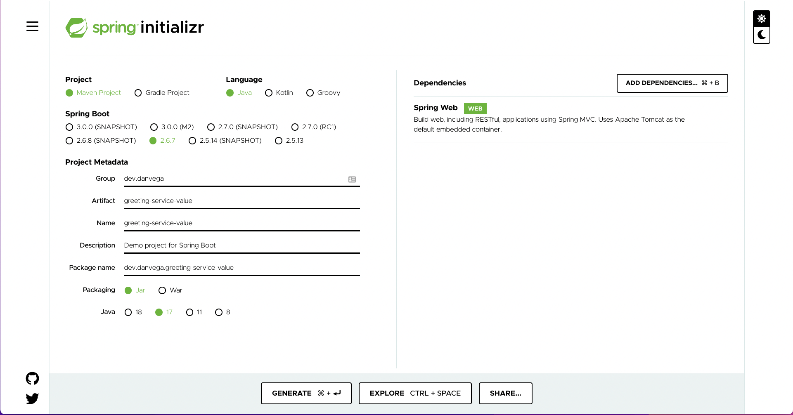

Spring Boot allows you to configure your application through a number of property sources. A property source, simply put, is a source for your configuration such as Java properties files, YAML files, environment variables, command line arguments and more.

In this article you will learn about how to set configuration properties and values and then inject them into your application using the `@Value` annotation. You will also learn about Spring Boot’s property source order and how to override configuration values.

## Spring Boot @Value Annotation

For this example I am using a simple application that I bootstrapped using [start.spring.io](http://start.spring.io) and the only dependency you need is Spring Web.



The first thing you will need to do is to create a new class named `GreetingController` and to mark it as a `@RestController.` Next, create a method named `home` that returns the hard coded String “**Hello, World**”. To make this accessible on the root context annotate it with `@GetMapping.`

If you were to run this application and open [http://localhost:8080](http://localhost:8080) you should see the text **Hello, World!** While this works and is a bit of a contrived example this greeting message might not be something you want to hard code. Any value that you want to be configurable should move to configuration.

```java
@RestController
public class GreetingController {

    @GetMapping
    public String home() {
        return "Hello, World!!";
    }

}
```

One of the property sources at your disposal are config data such as `application.properties` and the `YAML` variants. Open up `application.properties` and add the following key/value:

```bash
welcome.salutation=Hello
```

With the property set you need a way to inject that value of it into your controller. This is where the [@Value](https://docs.spring.io/spring-framework/docs/current/javadoc-api/org/springframework/beans/factory/annotation/Value.html) annotation will help by allowing us to use property-driven dependency injection. Create a new field of type String called `welcomeSalutation`.

```java
@RestController
public class GreetingController {

    private String welcomeSalutation;

    @GetMapping
    public String home() {
        return "Hello, World!!";
    }

}
```

You can now add the `@Value` annotation which expects The actual value expression such as `#{systemProperties.myProp}`or property placeholder such as `${my.app.myProp}.` Instead of returning the hard coded salutation you can now use the field in the return statement of your `home()` method.

```java
@RestController
public class GreetingController {

    @Value("${welcome.salutation}")
    private String welcomeSalutation;

    @GetMapping
    public String home() {
        return welcomeSalutation + ", World!";
    }

}
```

If you run the application you should see the same Hello, World! text displayed on the page. If you change the value in `applications.properties` and restart the app you should see that change reflected. Congrats, you have now externalized the value of welcomeSalutation to a property source.

You might not realize it yet but there is a problem you have solved for. If you remove the property from `application.properties` and try to run the application you will get an error. Spring is trying inject a value for a property it can’t find in any of its property sources. For this situation you should provide a default value in the case that `welcomeSalutation` isn’t set. You can do so by adding a colon after the property name and supplying the default value.

```java
@RestController
public class GreetingController {

    @Value("${welcome.salutation:👋🏻 Hello}")
    private String welcomeSalutation;

    @GetMapping
    public String home() {
        return welcomeSalutation + ", World!";
    }

}
```

Another great feature is that property values can be contrived from other properties:

```java
welcome.salutation=Hello
welcome.name=Dan
welcome.greeting=${welcome.salutation}, ${welcome.name}!
```

## Spring Boot Property Source Order

Now that you understand how to set a property and inject it into your application using the `@Value` annotation you need to understand the property source order. Spring Boot lets you externalize your configuration so that you can work with the same application code in different environments.

This means that while the welcome salutation is one value for local development it might be something different in another environment. I’m not going to cover every single property source here because the [Spring Boot Reference documentation](https://docs.spring.io/spring-boot/docs/current/reference/html/features.html#features.external-config) does a great job of that. All you need to know is that as you go down the list of property sources they can override previous ones. This means that command-line arguments override anything in config data (application.properties).

To test this out you can set a command line argument in IntelliJ by going to `Run > Edit Configurations > Environment > Program Arguments` and add the following arg:

```bash
--welcome.salutation=🤩Hello
```


Even with a value set in `application.properties` this command line argument will now be used because of the property source order. Restart the application and see this change take affect.

## Configuration Properties

The `@Value` annotation is the easiest way to get a single value from a property source into your Spring application. One of the downsides is that there is no metadata generated for these properties and because of that you won’t get any Intellisense in your property files.

If you have one or more related properties you should really move them into a `@ConfigurationProperties` class and with that you will get metadata generated for them. I have a tutorial on creating a class or record using `@ConfigurationProperties` and setting default values that you can check out below.

`youtube:https://youtu.be/Gqn_q2sAebg`

## Conclusion

While the `@Value` annotation is the easiest way to inject configuration values into your application it might not always be the right choice. Knowing when to use it and when to reach for `@ConfigurationProperties` is half the battle (_Go Joe!_). The other part of this is understanding that Spring Boot has a number of property sources and that there is a specific order in which they are loaded. I hope this tutorial helped you out and always friends...

Happy Coding<br/>
Dan

