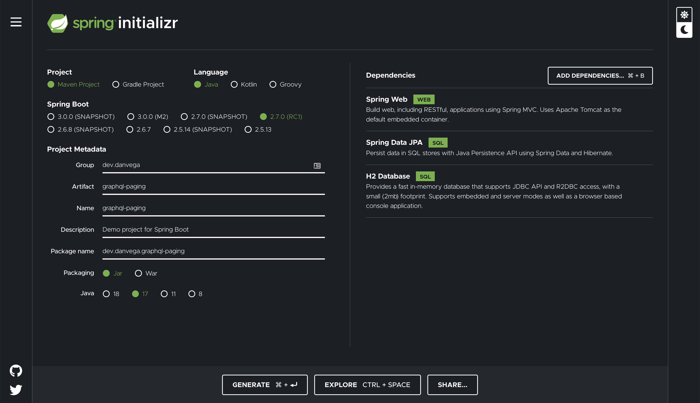
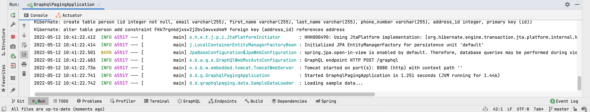
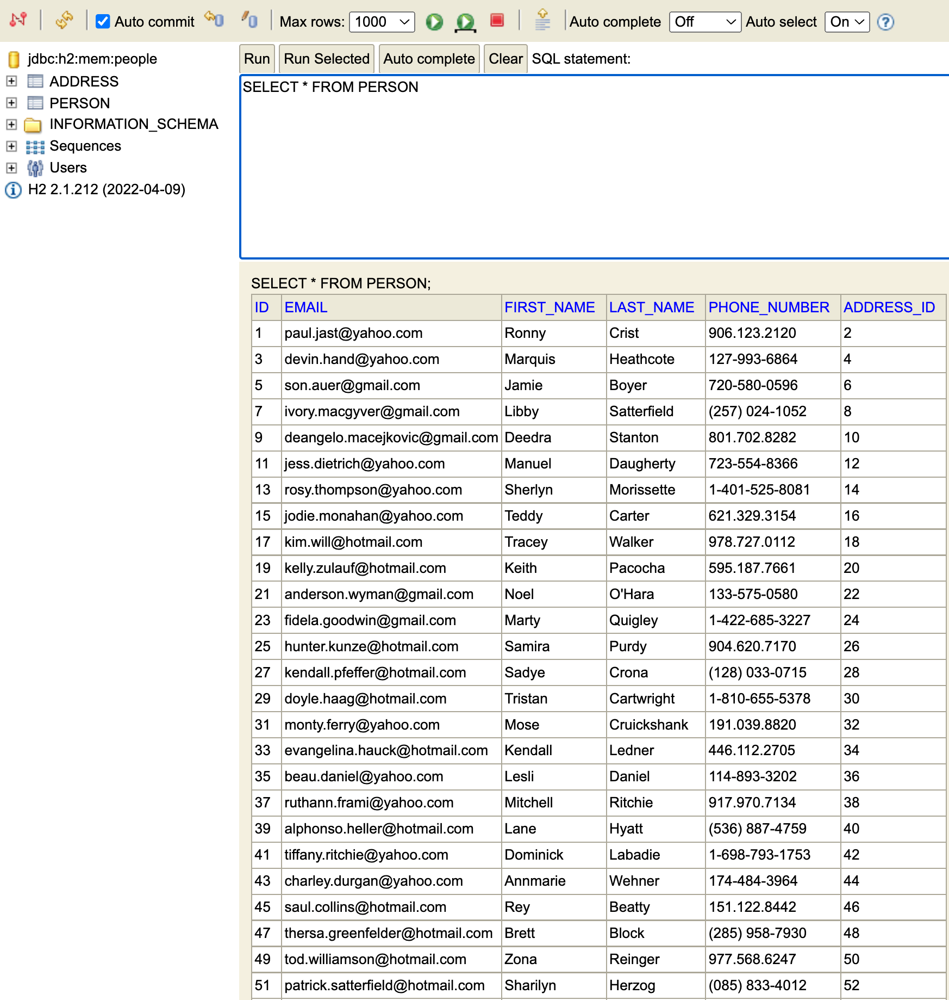

In this tutorial, you are going to learn how to work with pagination in Spring Data JPA. If you have a few records you can just return all of them from a single API endpoint. In the real world though you will probably have more than a few records. In this case you wouldn’t want to return all of the records to the client for performance reasons.

On the client you would display a smaller number of records at a time and allow the user to click on next, previous or a specific page number. To simulate that in this demo you will use a third party library to create a large dataset.

## Spring Data JPA

To get started head over to [start.spring.io](http://start.spring.io) and create a new application with the following:



To get started open up `application.properties` and set the following properties for your database:

```bash
spring.h2.console.enabled=true
spring.datasource.generate-unique-name=false
spring.datasource.name=people

spring.jpa.show-sql=true
```

With the database connection in place you need to start by defining your entities. This application is going to model a CRM where you have a person and their address. Create a new model package and add the following `Person` and `Address` entities:

```java
@Entity
public class Person {

    @Id @GeneratedValue
    private Integer id;
    private String firstName;
    private String lastName;
    private String phoneNumber;
    private String email;
    @OneToOne(cascade = CascadeType.ALL)
    @JoinColumn(name = "address_id", referencedColumnName = "id")
    private Address address;

    public Person() {
    }

    public Person(String firstName, String lastName, String phoneNumber, String email, Address address) {
        this.firstName = firstName;
        this.lastName = lastName;
        this.phoneNumber = phoneNumber;
        this.email = email;
        this.address = address;
    }

		// getters, setters & toString

}
```

```java
@Entity
public class Address {

    @Id @GeneratedValue
    private Integer id;
    private String address;
    private String city;
    private String state;
    private String zip;

    public Address() {
    }

    public Address(String address, String city, String state, String zip) {
        this.address = address;
        this.city = city;
        this.state = state;
        this.zip = zip;
    }

		// getters, setters & toString

}
```

### Spring Data JPA Repositories

With your entities in place you need a way to read and persist data from your database. This is where Spring Data really shines in giving you the functionality to perform most of your common operations right out of the box. What I really love is that this is a consistent programming model across all of the [Spring Data](https://spring.io/projects/spring-data) projects 👏🏻

Create a new interface (you heard me right) named `PersonRepository`. Alone this wont do much but the real power is made available to you when you extend one of the Spring Data Repositories:

- [Repository<T,ID>](https://docs.spring.io/spring-data/commons/docs/current/api/org/springframework/data/repository/Repository.html)
- [CrudRepository<T,ID>](https://docs.spring.io/spring-data/commons/docs/current/api/org/springframework/data/repository/CrudRepository.html)
- [PagingAndSortingRepository<T,ID>](https://docs.spring.io/spring-data/commons/docs/current/api/org/springframework/data/repository/PagingAndSortingRepository.html)
- Reactive versions...

You are going to extend the `PagingAndSortingRepository` which gives you 2 methods you will need for pagination. This interface in turn extends the `CrudRepostiory` so you will also get all of the CRUD methods for free.

When you extend a repository you have to give a type which for this example will be `Person` and the 2nd argument is the type of the `@id` in `Person` which is an `Integer`. At runtime Spring will see that you have extended one of the repositories and turn this into an implementation that you can use.

```java
package dev.danvega.graphqlpaging.repository;

import dev.danvega.graphqlpaging.model.Person;
import org.springframework.data.repository.PagingAndSortingRepository;

public interface PersonRepository extends PagingAndSortingRepository<Person,Integer> {

}
```

### Sample Data Loader with a Command Line Runner

You need a way to load some data when the application starts. You could create a SQL file in the `resources/` directory but who wants to write SQL by hand? Instead you can write some Java code and persist some new records to the database.

The way you can achieve this is by utilizing an interface called the `CommandLineRunner`. This will allow you to execute some code after the `ApplicationContext` is created and right before the `SpringApplication.run()` method executes. I have written a post on the [CommandLineRunner here](/command-line-runner) if you would like to read more about it.

You will need to create a new class called `SampleDataLoader` that implements the `CommandLineRunner` interface. Implement the single method from the command line runner named `run()` and for now just log a message. If you run the application you should see that message in your console.

```java
@Component
public class SampleDataLoader implements CommandLineRunner {

    private final Logger logger = LoggerFactory.getLogger(SampleDataLoader.class);
    private final PersonRepository repository;

    public SampleDataLoader(PersonRepository repository) {
        this.repository = repository;
    }

    @Override
    public void run(String... args) throws Exception {
        logger.info("Loading sample data...");
    }

}
```



Now that you know that the run method will execute right before the application starts this is a good place to add some data to our database. Create a new instance of `Person` and use the `CrudRepositories` save method to persist a new record to the database. If you visit the [H2 Console](http://localhost:8080/h2-console) you should your new person and address records.

```java
@Override
public void run(String... args) throws Exception {
    Person person = new Person("Dan",
            "Vega",
            "216.555.1212",
            "danvega@gmail.com",
            new Address("Street","City","State","Zip"));

    repository.save(person);
}
```

While this works it’s going to take us a long time to get enough sample data in our database to properly test out pagination.

### Java Faker

[Java Faker](https://github.com/DiUS/java-faker) is a really great library that allows you to generate fake data. I [created a tutorial](https://youtu.be/UzBOv_SHUng) on this if you’re interested in watching that.

In the run method you can create a new `IntStream` which allows you to create 100 new `Person` objects. Inside of the person constructor you are going to use the Faker library to generate fake data for each of the fields.

```java
private final PersonRepository repository;
private final Faker faker;

public SampleDataLoader(PersonRepository repository) {
    this.repository = repository;
    this.faker = new Faker();
}

@Override
public void run(String... args) throws Exception {

    // create 100 rows of people in the database
    List<Person> people = IntStream.rangeClosed(1,100)
            .mapToObj(i -> new Person(
                    faker.name().firstName(),
                    faker.name().lastName(),
                    faker.phoneNumber().cellPhone(),
                    faker.internet().emailAddress(),
                    new Address(
                            faker.address().streetAddress(),
                            faker.address().city(),
                            faker.address().state(),
                            faker.address().zipCode()
                    )
            )).toList();

    repository.saveAll(people);
}
```

If you run the application you should see 100 records in the `Person` and `Address` table. Not only do you have data but you have some pretty valid data that you can also do some filtering and sorting on.



Now that you have some data in the database you can focus on pagination.

### Spring Data JPA Pagination

To get started on the web side create a new `PersonController` that is annotated with `@RestController` and `@RequestMapping`. In this controller you will create a field of type `PersonRepsoitory` and have an instance of the repository autowired for you through constructor injection. If you want to learn why constructor injection is the preferred method for dependency injection in Spring check out [this video](https://youtu.be/aX-bgylmprA).

```java
@RestController
@RequestMapping("/api/people")
public class PersonController {

    private final PersonRepository repository;

    public PersonController(PersonRepository repository) {
        this.repository = repository;
    }

}
```

If you take a look at the `PagingAndSortingRepository` you will see a method called `findAll()` that takes an argument of type `Pageable`.

```java
public interface PagingAndSortingRepository<T, ID> extends CrudRepository<T, ID> {

	/**
	 * Returns all entities sorted by the given options.
	 *
	 * @param sort the {@link Sort} specification to sort the results by, can be {@link Sort#unsorted()}, must not be
	 *          {@literal null}.
	 * @return all entities sorted by the given options
	 */
	Iterable<T> findAll(Sort sort);

	/**
	 * Returns a {@link Page} of entities meeting the paging restriction provided in the {@link Pageable} object.
	 *
	 * @param pageable the pageable to request a paged result, can be {@link Pageable#unpaged()}, must not be
	 *          {@literal null}.
	 * @return a page of entities
	 */
	Page<T> findAll(Pageable pageable);
}
```

Pageable is actually an interface but there is an implementation of that interface that we can use called [PageRequest](https://docs.spring.io/spring-data/commons/docs/current/api/org/springframework/data/domain/PageRequest.html). If you look at the API there is a static method `of(int page, int size)` that takes the page and size of the request.

The page is the page number which starts at 0 and the size the number of records to display per page. This means that if you want the first 10 records you can call `PageRequest.of(0,10)`. With that information you should have what you need to create an endpoint that allows the consumer to provide those values.

```java
@RestController
@RequestMapping("/api/people")
public class PersonController {

    private final PersonRepository repository;

    public PersonController(PersonRepository repository) {
        this.repository = repository;
    }

    @GetMapping
    public Page<Person> findAll(@RequestParam int page, @RequestParam int size) {
        PageRequest pr = PageRequest.of(page,size);
        return repository.findAll(pr);
    }

}
```

If you run the application and visit [http://localhost:8080/api/people?page=0&size=3](http://localhost:8080/api/people?page=0&size=3) you should see 3 records displayed. If you change the page request parameter to 1 you should see the next 3 people in the database.

If you notice the return type of the endpoint it is a `Page<Person>`. At this point it would serve you well to inspect the JSON returned from the API. There is a lot of data in there that might be useful to the client calling your API.

```java
{
  "content": [
    {
      "id": 1,
      "firstName": "Britany",
      "lastName": "Pacocha",
      "phoneNumber": "287-165-0052",
      "email": "andera.prohaska@hotmail.com",
      "address": {
        "id": 2,
        "address": "4638 Elmer Turnpike",
        "city": "Mannfort",
        "state": "Mississippi",
        "zip": "08278"
      }
    },
    {
      "id": 3,
      "firstName": "Darrick",
      "lastName": "Koepp",
      "phoneNumber": "900.079.5978",
      "email": "gigi.langworth@gmail.com",
      "address": {
        "id": 4,
        "address": "77288 Darleen Isle",
        "city": "Walshstad",
        "state": "Washington",
        "zip": "62580"
      }
    },
    {
      "id": 5,
      "firstName": "Kristal",
      "lastName": "Simonis",
      "phoneNumber": "(599) 177-7520",
      "email": "jasmine.kozey@yahoo.com",
      "address": {
        "id": 6,
        "address": "7532 Kirlin Glens",
        "city": "North Lauren",
        "state": "New Mexico",
        "zip": "09585"
      }
    }
  ],
  "pageable": {
    "sort": {
      "empty": true,
      "sorted": false,
      "unsorted": true
    },
    "offset": 0,
    "pageNumber": 0,
    "pageSize": 3,
    "paged": true,
    "unpaged": false
  },
  "last": false,
  "totalPages": 34,
  "totalElements": 100,
  "first": true,
  "size": 3,
  "number": 0,
  "sort": {
    "empty": true,
    "sorted": false,
    "unsorted": true
  },
  "numberOfElements": 3,
  "empty": false
}
```

## Conclusion

Congratulations 🥳 You just created an application that uses the Spring Data Paging and Sorting Repository. This allows the client to display a small number of records when working with a large dataset. If you have any questions about what you built today, please let me know. As always friends...

Happy Coding!<br/>
Dan

