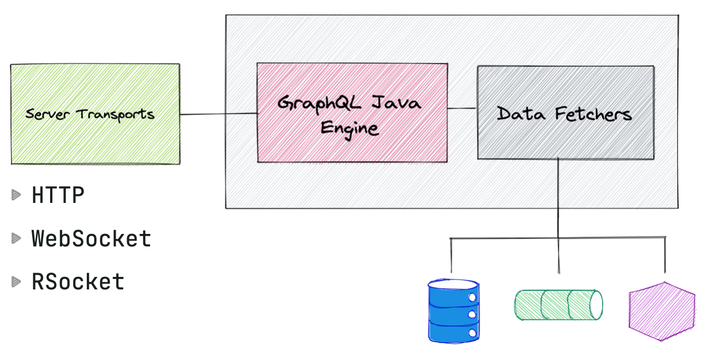
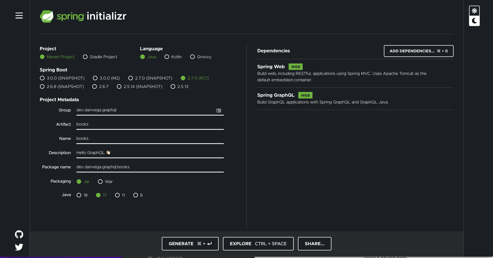
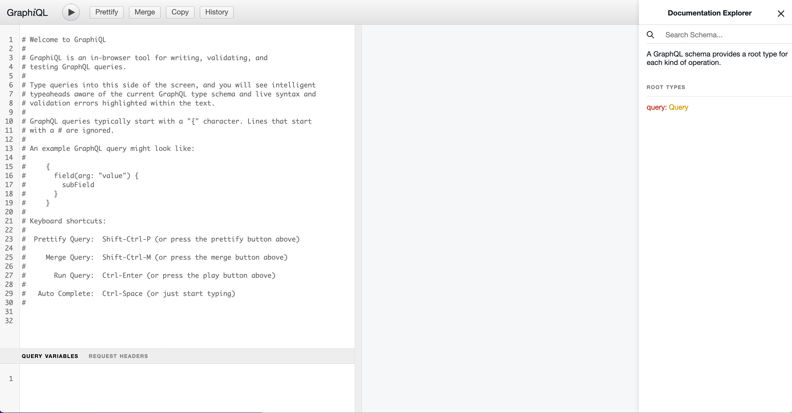
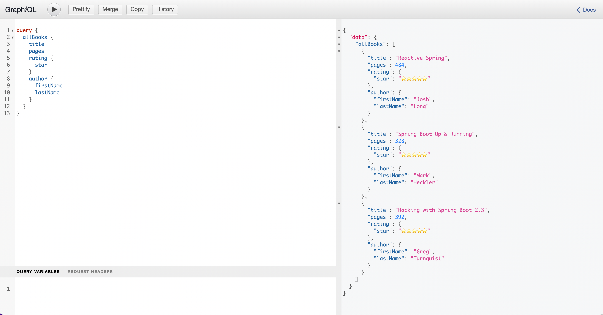

In this tutorial you are going to learn how to get up and running with [Spring for GraphQL](https://spring.io/projects/spring-graphql). At the time of this article being published Spring for GraphQL 1.0 is close to being released. This is a huge milestone and the culmination of a really great collaboration between the Spring team and the [GraphQL Java](https://www.graphql-java.com/) team.

Before you start writing code you should take some time to understand what GraphQL is and why you might reach for it in your next application. By the end of this tutorial you will have what you need to build your first GraphQL API using Spring for GraphQL.

## Why GraphQL

There are so many things to learn but your time is valuable and you need to spend it wisely. That said, don’t dive into something just because everyone else is talking about. Let’s discuss why you should spend some of that valuable time learning GraphQL.

If you’re currently building REST APIs you have probably come across this scenario. The API might have started out for a single purpose like feeding data to your frontend client for the web. Even if you stay right there this application might of evolved over time and may have even split into micro frontends. As this application grows you are constantly getting requests for new endpoints that return the data in a specific shape.

The next evolution of this API is when more and more clients have requirements for data. You might have 3rd party services, internal microservices, mobile applications and IoT applications all with their own specific data requirements.

Each of these clients have specific limitations and data requirements. The web application for this application has a ton of real estate on the screen so it can request a lot of data and display it to the user. The web client also doesn’t have to think about constraints like battery life or connection speeds.

When you move to a mobile application you do have to think about things like screen size, battery life and connection speeds. Because of those constraints you might have setup new endpoints for your mobile applications to return smaller data sets.

This is where GraphQL really stands out and provides a solution to a real problem. GraphQL has a single endpoint and lets each individual client request exactly what data they need. Gone are the days of standup up new endpoints each time a new requirement is raised.


## What is GraphQL

Now that you understand why you would reach for GraphQL let’s talk about some of the fundamentals of it. First off GraphQL is a query language for your API, and a server-side runtime for executing queries using a type system you define for your data. It is an alternative to REST & SOAP and in most cases will replace those, not sit alongside them.

GraphQL **isn't tied to any specific database or storage engine** and is instead backed by your existing code and data. This is an important concept to understand so we should start there.

In your existing applications your REST API is also not tied to any specific database. In your Rest Controller endpoints you accept the arguments you need and in turn delegate to a service or repository for the data. GraphQL is no different so if you’re asking questions like “How does GraphQL connect to my database” you’re asking the wrong ones.

GraphQL was created back in 2012 by Facebook. They were facing a lot of the same problems we discussed in the previous section. They had these massive amounts of data sets and mobile was becoming the dominant way users were accessing their application.

GraphQL was open sourced back in 2015 and is now governed by a [neutral foundation](https://graphql.org/foundation/) made up of some really great companies. You will find implementations of the [GraphQL Spec](https://spec.graphql.org/) in almost every language. This means that after you learn it on the Java side you should be able to move over to JavaScript and hit the ground running.


### GraphQL Client + Server 🤝

GraphQL is technology for client / server data exchange. The client + server part means there are two sides to this story.

On the client side you’re working with the Query Language. This isn’t SQL, kind of looks like JSON and is something we refer to as a Domain Specific Language (DSL). Like anything there is a little bit of an overhead in learning how to write these queries but once you get the hang of it they are quite intuitive and expressive. This is a query you will write later on to retrieve all of the books along with its author.

```graphql
query {
  allBooks {
    title
    pages
    rating {
      star
    }
    author {
      firstName
      lastName
    }
  }
}
```

On the server side we have an execution engine that will execute these queries mapping each of the fields to resolvers, also known as data fetchers.

### GraphQL Type System

If you have never seen GraphQL before you can take a good guess at what you’re doing with the query above. You are selecting fields on objects where the root object is a book and inside of that book there is a rating and author type.

Just looking at this query though you aren’t exactly sure what each type is and what fields might be available on the sub-types like rating and author. This is where a schema enters the conversation and is able to describe and validate what fields you can query for.

**Type Language**

The GraphQL Schema Language allows us to create a consistent schema across languages. This means that if you’re using Java, JavaScript or Go you will understand a GraphQL schema because it is language agnostic. Let’s take a look at some of the types that make up a GraphQL schema.

**Object Types and Fields**

Object types and fields are a common type that you will work with in any GraphQL Schema. Once you have your models in place in your Spring application you will need to define what objects and fields you want to make available in your API. The following is a schema definition for a Book object:

```graphql
type Book {
  id: ID!
  title: String
  pages: Int
  rating: Rating
  author: Author
}
```

- The values on the left are the field names
- The values on the right are the types
  - ID, String & Int are built-in Scalar types
  - Rating & Author are Object Types that you define
- The `!` simply tells us that you can always expect a value back and will never need to check for null.

You will learn more about building schemas when you build your first Spring for GraphQL application later in this tutorial.

**Scalar Types**

As you learned in the previous section there are built-in Scalar types. GraphQL comes with the following types out of the box:

- `Int`: A signed 32-bit integer.
- `Float`: A signed double-precision floating-point value.
- `String`: A UTF-8 character sequence.
- `Boolean`: `true` or `false`.
- `ID`: The ID scalar type represents a unique identifier, often used to refetch an object or as the key for a cache. The ID type is serialized in the same way as a String; however, defining it as an `ID` signifies that it is not intended to be human-readable.

If you need to define a custom type like a date you can do so but this needs to be configured on the server side.

**Root Operation Types**

After you have setup your object types you will need a way to read and write data from your API. There are 3 root operation types:


- **Query**: Used to read data
- **Mutation**: Used to create, update and delete data
- **Subscription**: Similar to a query allowing you to fetch data from the server. Subscriptions offer a long-lasting operation that can change their result over time.

The following defines the Query operation in our schema. The values on the left are the field names (query names) and the values on the right are the return type. In the first example the brackets around `Book` simply means that it could return more than 1.

```graphql
type Query {
  allBooks: [Book]
  findOne(id: ID!): Book
}
```

**Arguments**

Each field on a GraphQL object type can have one or more arguments. The `findOne` query above defines a single argument of type ID. The `!` states that the ID can’t be null and must be supplied. When you write a query against that you can pass in the id like so:

```graphql
query {
  findOne(id: 2) {
    title
    pages
    rating {
      star
    }
    author {
      firstName
      lastName
    }
  }
}
```

There are more types to learn about but they basic types will get you up and running.

## Spring for GraphQL

Now that you have some background on the what and why of GraphQL it’s time to learn about Spring for GraphQL. As I mentioned earlier this project is result of a really great collaboration between the Spring team and the [GraphQL Java](https://www.graphql-java.com/) team.

### GraphQL for Java

GraphQL Java was released in 2015 shortly after Facebook open sourced GraphQL. GraphQL Java is the server side execution engine and it does this one thing really well. This means that it doesn’t try and focus on the whole story and it’s limited on purpose.

GraphQL for Java has been tried and tested by some of the biggest companies in the world, including Twitter. Here is a tweet noting that Twitter is running GraphQL for Java in production and serving 500k requests per second. That is insane and tells you the library is ready for the greatest place on the internet... **PRODUCTION** 👏🏻

[https://twitter.com/graphql_java/status/1450195999373205506?lang=en](https://twitter.com/graphql_java/status/1450195999373205506?lang=en)

### Spring for GraphQL

So GraphQL for Java is the execution engine, why do we need Spring for GraphQL? GraphQL Java Engine itself is only concerned with executing queries. It doesn't deal with any HTTP or JSON related topics. The first thing Spring does is provide server transports in the form of:



- Http (Spring MVC or Spring Webflux)
- WebSocket
- RSocket

The next feature Spring brings to the table is what it does best. Spring makes the process of integrating with a library seamless and takes away the pain of dependency management, configuration and lets you focus on building out the features of your application.

When you select **Spring GraphQL** as a dependency in the Spring Initializer you will get the `spring-boot-starter-gaphql` dependency added to your build. \*\*\*\*

**Spring Boot Starter GraphQL**

- Dependency Management
- Auto Configuration
- Properties
- Metrics
- GraphiQL UI and Schema Pages

You will also get testing support out of the box in the form of the `spring-graphql-test` starter which provides:

- GraphQL Slice Tests
- GraphQL Tester

Now that you have a good understand of what Spring for GraphQL is its time to write your first application 🤩

## Build your first GraphQL API with Spring for GraphQL

To build your first GraphQL API head over to [start.spring.io](http://start.spring.io) and while you’re there you might as well bookmark it 😉 Create a new project using Java 17+, Spring Boot 2.7+ and select the following dependencies:

- Spring Web
- Spring GraphQL



### The Data Layer

As I mentioned earlier the GraphQL layer isn’t tied to any specific database and is backed by your existing code + data. To demonstrate this you are going to create an application that isn’t tied to any specific database and hold its records in memory.

This application is going to manage your book reading list. To get started you will need to model a Book, Author and Rating object. You could write a normal class with constructors, getters & setters, equals & hash code and a toString or you can save yourself some keystrokes and use a record type.

```java
public record Book(Integer id, String title, Integer pages, Rating rating, Author author) {

}
```

```java
public record Author(Integer id, String firstName, String lastName) {

    public String fullName() {
        return firstName + " " + lastName;
    }

}
```

```java
public enum Rating {
    FIVE_STARS("⭐️⭐️⭐️⭐️⭐️️️️"),
    FOUR_STARS("⭐️⭐️⭐️⭐️"),
    THREE_STARS("⭐️⭐️⭐️"),
    TWO_STARS("⭐️⭐️"),
    ONE_STAR("⭐️");

    private String star;

    Rating(String star) {
        this.star = star;
    }

    @JsonValue
    public String getStar() {
        return star;
    }
}
```

Now that you have your data models in place you need a way to store data and retrieve it. You could go the route of Spring Data JPA and I just created [a tutorial on that here](https://www.danvega.dev/blog/2022/05/12/spring-data-jpa-pagination/). To keep this simple and less focused on the data layer you can just store the data in a collection.

Create a book and author repository class using the following code:

```java
@Repository
public class BookRepository {

    private final AuthorRepository authorRepository;

    private List<Book> books = new ArrayList<>();

        public BookRepository(AuthorRepository authorRepository) {
        this.authorRepository = authorRepository;
    }

    public List<Book> findAll() {
        return books;
    }

    public Book findOne(Integer id) {
        return books.stream()
                .filter(book -> book.id() == id)
                .findFirst().orElseThrow(() -> new RuntimeException("Book not found"));
    }

    @PostConstruct
    private void init() {
        books.add(new Book(1,
                "Reactive Spring",
                484,
                Rating.FIVE_STARS,
                authorRepository.findByName("Josh Long")));
        books.add(new Book(2,
                "Spring Boot Up & Running",
                328,
                Rating.FIVE_STARS,
                authorRepository.findByName("Mark Heckler")));
        books.add(new Book(3,
                "Hacking with Spring Boot 2.3",
                392,
                Rating.FIVE_STARS,
                authorRepository.findByName("Greg Turnquist")));
    }

}
```

If you’re not aware the `@PostConstruct` annotation is used on a method that needs to be executed after dependency injection is done to perform any initialization.

```java
@Repository
public class AuthorRepository {

    private List<Author> authors = new ArrayList<>();

    public List<Author> findAll() {
        return authors;
    }

    public Author findById(int id) {
        return authors.stream()
                .filter(author -> author.id() == id)
                .findFirst()
                .orElseThrow(() -> new RuntimeException("Author not found"));
    }

    public Author findByName(String name) {
        return authors.stream()
                .filter(author -> author.fullName().equals(name))
                .findFirst()
                .orElseThrow(() -> new RuntimeException("Author not found"));
    }

    @PostConstruct
    private void init() {
        authors.add(new Author(1,"Josh","Long"));
        authors.add(new Author(2,"Mark","Heckler"));
        authors.add(new Author(3,"Greg","Turnquist"));
    }
}
```

### GraphQL Layer

With your data layer in place it’s time to turn your attention to GraphQL. By convention Spring will look for GraphQL Schema’s in the `/src/main/resources/graphql` directory. You can configure this location but for this example let’s just use the default by creating a new file `schema.graphqls` in that directory.

You will start by defining your object types which look like the model objects you create in Java above. The field names are the left and the types are on the right. There are [built-in scalar types](https://graphql.org/learn/schema/) like ID, String, Int, Float, and Boolean and you can also reference object types that you have created.

```graphql
type Book {
  id: ID!
  title: String
  pages: Int
  rating: Rating
  author: Author
}

type Rating {
  rating: String
  star: String
}

type Author {
  id: ID!
  firstName: String
  lastName: String
  books: [Book]
}
```

Next you will create a root level operation called Query. You will name the query `allBooks` and this will return a list of books:

```graphql
type Query {
  allBooks: [Book]
}
```

### The Web Layer

With your GraphQL Schema in place you need a transport layer for your API. In other words, how are clients going to access your API? In this example you selected Spring Web (Spring MVC) as a dependency so you can use HTTP.

Create a new controller called `BookController` and mark with the `@Controller` annotation. You will need a way to retrieve your data so create a new field of type `BookRepository` and use [constructor injection](https://youtu.be/aX-bgylmprA) to get an instance of that injected into your controller.

```java
@Controller
public class BookController {

    private final BookRepository bookRepository;

    public BookController(BookRepository bookRepository) {
        this.bookRepository = bookRepository;
    }
}
```

Next create a method called `findAll` that will delegate to the repository to return all of the books in the collection:

```java
@Controller
public class BookController {

    private final BookRepository bookRepository;

    public BookController(BookRepository bookRepository) {
        this.bookRepository = bookRepository;
    }

    public List<Book> findAll() {
        return bookRepository.findAll();
    }
}
```

With that method in place you need a way to map that method to the GraphQL Schema you created earlier. How can you tell Spring that when the query named `allBooks` is called to execute the `findAll` method?

```graphql
type Query {
  allBooks: [Book]
}
```

There are annotations that are going to help us with the schema mappings. The first one is called `@SchemaMapping` and you will need to supply 2 arguments. Type name is the top level operation like Query, Mutation or Subscription. Value is the name of the query as its defined in the GraphQL schema.

```java
@Controller
public class BookController {

    private final BookRepository bookRepository;

    public BookController(BookRepository bookRepository) {
        this.bookRepository = bookRepository;
    }

    @SchemaMapping(typeName = "Query",value = "allBooks")
    public List<Book> findAll() {
        return bookRepository.findAll();
    }
}
```

This is the minimum you need to get a GraphQL API up and running. You need a way to test what you have done so far and you could write some tests but we will look at that later.

### GraphiQL

GraphiQL is a graphical interactive in-browser GraphQL IDE. This is a great place to learn and test out your GraphQL queries. GraphiQL is disabled by default so if you would like to use it you will need to open up `[application.properties](http://application.properties)` and enable it with the following property:

```bash
spring.graphql.graphiql.enabled=true
```

With that in place you can run your application and visit [http://localhost:8080/graphiql](http://localhost:8080/graphiql). The left pane is for writing queries and the right pane will display your results. The first thing you will notice is that you get some help context on how to start writing queries.



One of the features I really love about GraphQL is that it’s self documenting. If you look on the far right pane you will see a documentation explorer. The root types (Query, Mutation & Subscription) are listed if you click on the right side `Query` you will be given a list of queries defined on the schema. Right now you only have one and it returns a collection of books. If you click on Book you can see what fields are available along with their types.

Because of that schema you will also get intellisense as you start writing queries. A query starts with `query {` type that and on the next line type the letter a:

```graphql
query {
  a
}
```

You should be presented with a drop down with a value of `allBooks`. Based on the schema the UI here knows what queries are available to you. This is why you will hear a lot of people praise the developer experience for GraphQL and I am in that group of people 👏🏻

Paste the following query in the left pane and hit the play button above to execute it:

```graphql
query {
  allBooks {
    title
    pages
    rating {
      star
    }
    author {
      firstName
      lastName
    }
  }
}
```



Now that you can fetch all of the records in a collection how about finding a single record. In your schema you will need to define a new query with the name `findOne` but this time it will take an argument. This argument is named id, has a type of ID and will return a single Book.

```java
type Query {
    allBooks: [Book]
    findOne(id: ID!): Book
}
```

If you head back over to the `BookController` you can define a new method called `findOne`.

```java
@Controller
public class BookController {

    private final BookRepository bookRepository;

    public BookController(BookRepository bookRepository) {
        this.bookRepository = bookRepository;
    }

    @SchemaMapping(typeName = "Query",value = "allBooks")
    public List<Book> findAll() {
        return bookRepository.findAll();
    }

    public Book findOne(@Argument Integer id) {
        return bookRepository.findOne(id);
    }
}
```

The first thing you will notice is a new annotation `@Argument.` In the web world if you wanted to bind a method argument to a request parameter you would use the `@RequestParam` annotation. This is similar but you aren’t working with request parameters you’re working with arguments. This annotation will bind a named GraphQL argument onto a method parameter.

Remember that to map the GraphQL schema query named `findOne` to this method you need to add a `@SchemaMapping` annotation.

```java
@SchemaMapping(typeName = "Query", value="findOne")
public Book findOne(@Argument Integer id) {
    return bookRepository.findOne(id);
}
```

This is a little verbose and lucky for you there is an alternative. In the web world you have specialized annotations of `@RequestMapping` like `@GetMapping`, `@PostMapping` and so on. In GraphQL there are special annotations for root types like `@QueryMapping`, `@MutationMapping`, and `@SubscriptionMapping`. `@QueryMapping` is a composed annotation that acts as a shortcut for @SchemaMapping with typeName="Query". The trick here is that the value is derived from the method name. This means that if your method name matches the name of the query defined in your schema all you need is the `@QueryMapping` annotation.

```java
@QueryMapping
public Book findOne(@Argument Integer id) {
    return bookRepository.findOne(id);
}
```

If you restart the application you should be able to execute the following query.

```graphql
query {
  findOne(id: 1) {
    title
    pages
    rating {
      star
    }
    author {
      firstName
      lastName
    }
  }
}
```

Congratulations 🥳 you just built your first GraphQL API in Spring. There is more to learn as you start building out full featured applications but you can do a lot with the basics you learned here today!

### Frontend

I’m not going to walk through this code but there is a fronted built in Vue located in `/src/frontend.` If you want to learn more about running the frontend and the backend you can checkout the readme. If you want to learn more about how I build full-stack Java applications with Spring boot you can check out this [post](https://www.danvega.dev/blog/2021/01/22/full-stack-java-vue/).

The important part on the GraphQL side is that everything runs through a single endpoint `/graphql`. In a REST application you might add a `@CORS` annotation to a REST Controller but because you aren’t configuring request mappings in each controller you need a way to configure CORS. The easiest way to do this is by setting the one of the available CORS properties available to you. In this example I just allow everything by setting the following property:

```bash
spring.graphql.cors.allowed-origins=*
```

## What’s Next?

We really just touched on the basics on how to get started with building GraphQL APIs in Spring. If you would like to learn more I have some resources for you below. I also want to let you know that I have a bunch of content planned.

- I’m working on the outline of a course that will teach you all about the basics of building, testing and deploying GraphQL applications for Spring. If you want to be notified when this available I will be releasing it to everyone subscribed to my [newsletter](https://www.danvega.dev/newsletter/) first.
- I have a webinar coming up where we will cover some of this on June 21 and you can [register here](https://tanzu.vmware.com/content/webinars/jun-introduction-to-spring-for-graphql).
- [SpringOne Tour](https://tanzu.vmware.com/developer/springone-tour/) - I will be giving an intro to Spring for GraphQL in some of of tour stops so if your a location where we are visiting please stop by and say hello 👋🏻

### Resources

- [Github Repository for this tutorial](https://github.com/danvega/spring-books)
- [Spring for GraphQL](https://spring.io/projects/spring-graphql)
- [GraphQL Java](https://www.graphql-java.com/)
- [Learn GraphQL](https://graphql.org/learn/)

## Conclusion

Spring for GraphQL is an exciting new project and we are just getting started. If you have any questions about building GraphQL APIs in Spring feel free to reach out and ask them. In the meantime follow me on [Twitter](http://twitter.com/therealdanvega) to stay up to date with everything I am working on.

