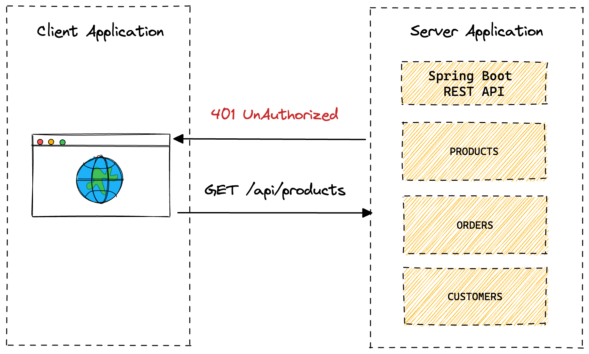
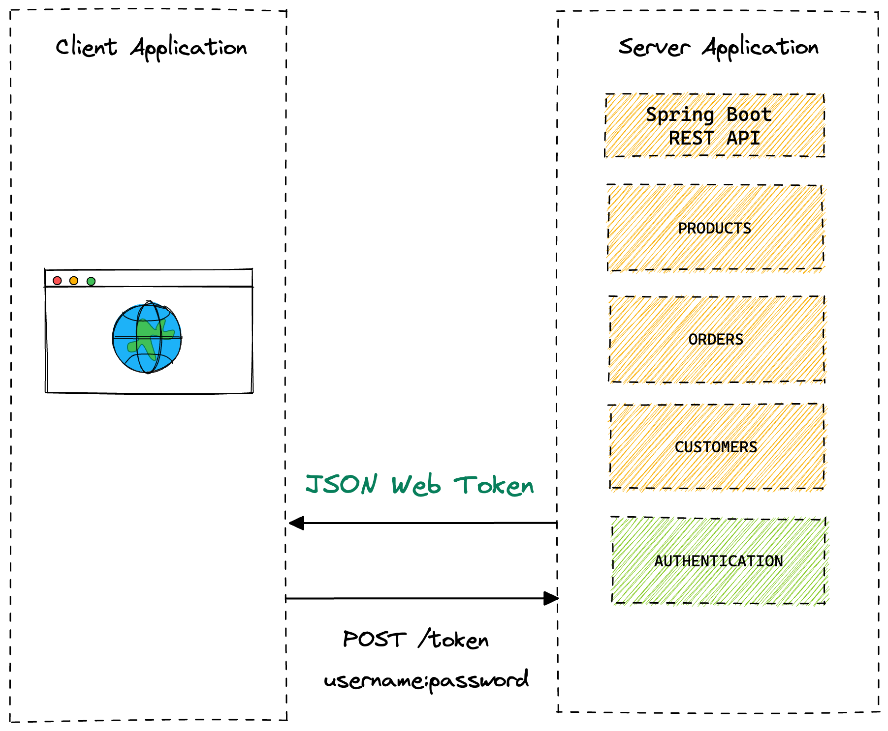
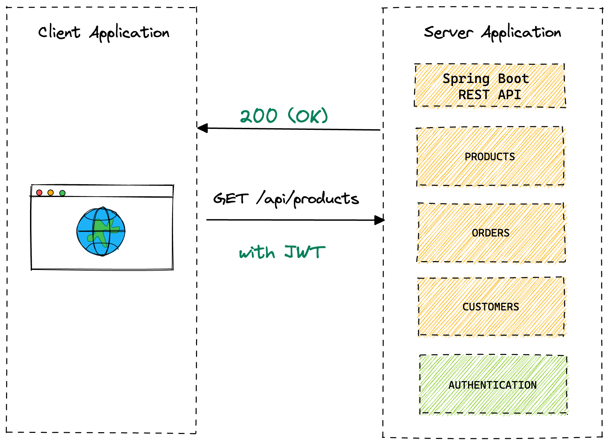
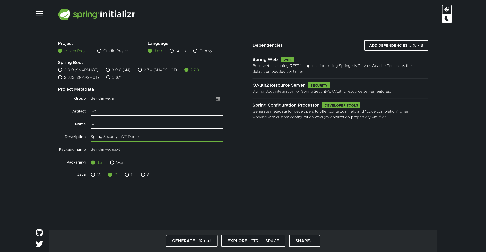
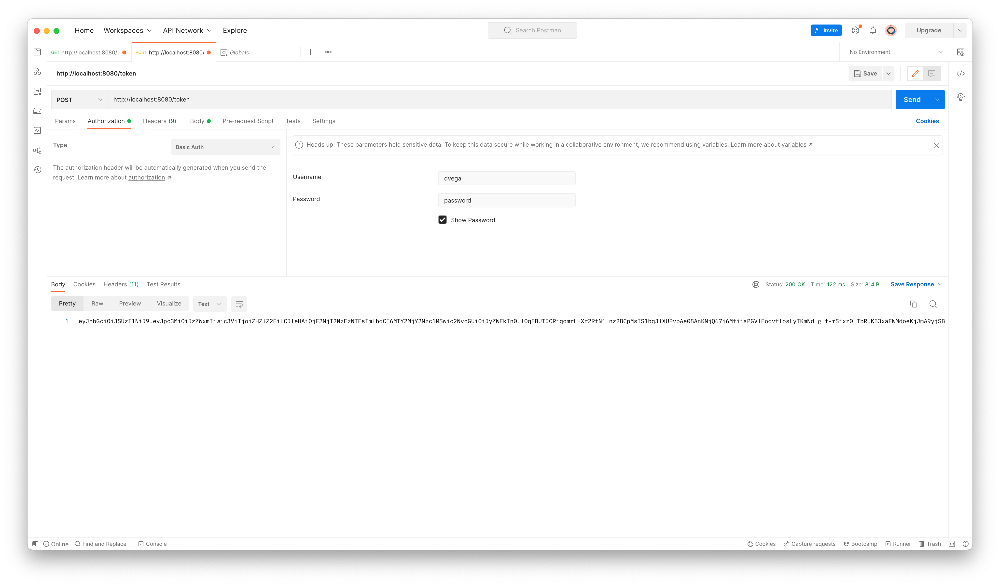
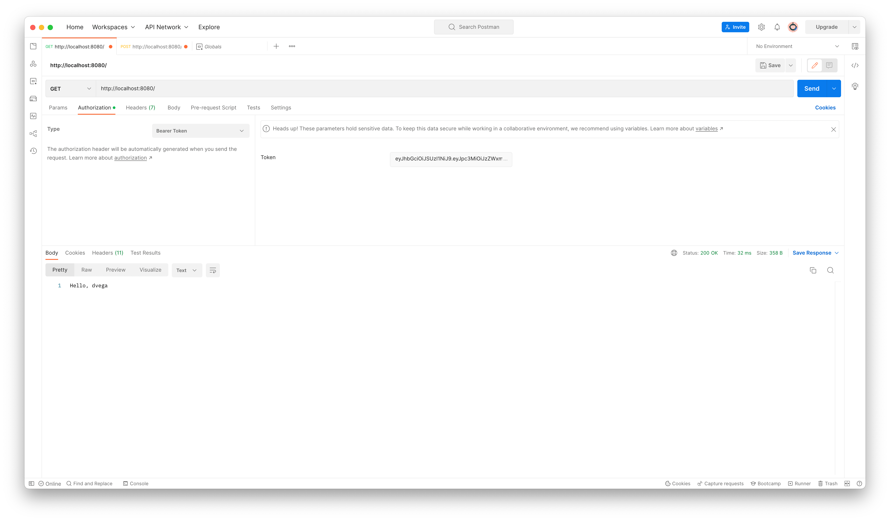
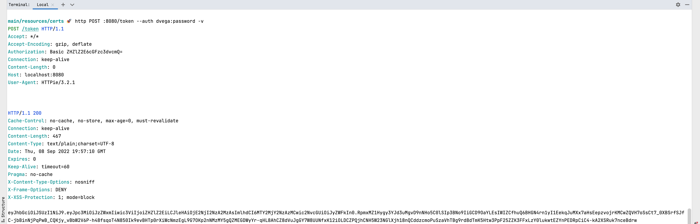
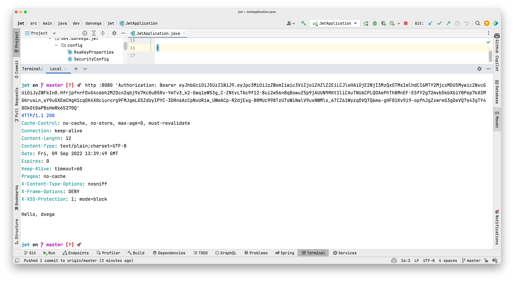

If you perform a quick search on how to secure REST APIs in Spring Boot using JSON Web Tokens you will find a lot of the same results. These results contain a method that involves writing a custom filter chain and pulling in a 3rd party library for encoding and decoding JWTs.

After staring at these convoluted and confusing tutorials I said there has to be an easier way to do this. I did what anyone with direct access to the Spring Security team would do, I asked them for help. They informed me that indeed Spring Security has built-in support for JWTs using oAuth2 Resource Server.

In this tutorial, you are going to learn how to secure your APIs using JSON Web Tokens (JWT) with Spring Security. I’m not saying this approach is easy by any stretch but for me, it made a lot more sense than the alternatives.

[Github Repository](https://github.com/danvega/jwt)

## Application Architecture

Before we get into writing some code I want to make sure we are all on the same page regarding what we are building. In the example below you have a client application which could be a simple command-line application, a full frontend application written in something like Angular or Vue, or some other service in your system.

This client application will make calls to a server application written in Spring Boot that exposes data via REST API. In the following example, it’s a monolith but the same would apply if you had a distributed architecture. There are currently 3 REST controllers that expose the resources products, orders, and customers.

What you will do is secure all of the resources so that when the client makes a call to the REST API the client will get a *401 (Unauthorized)* which means the client request has not been completed because it lacks valid authentication credentials for the requested resource**.**



### JSON Web Tokens (JWT)

A JSON Web Token is an open method for representing claims securely between two parties. A JWT is a set of claims (JSON property–value pairs) that together make up a JSON object. It consists of three parts:

- Header: Consists of two properties: { "alg": "HS256", "typ": "JWT" }. alg is the algorithm that is used to encrypt the JWT.
- Payload: This is where the data to be sent is stored; this data is stored as JSON property–value pairs.
- Signature: This is created by encrypting, with the algorithm specified in the header: (i) the base64Url-encoded header, (ii) base64Url-encoded payload, and (iii) a secret (or a private key):

```
HMACSHA256(base64UrlEncode(header) + "." + base64UrlEncode(payload), secret|privateKey)
```

The final JWT consists of three parts. Each is base64Url-encoded and separated from the next by a dot. See the openid.net and jwt.io websites for more details.

You will introduce a new authentication controller that a client can make a request to with their authentication credentials (username + password) and when they are successfully authenticated the service will return a JWT.



The client will then store the JWT and each subsequent request will pass it via the Authorization header. When the Server application receives the request with the JWT it will verify that it is a valid token and if it is will allow the request to continue.



## Getting Started

To get started you are going to head over to [start.spring.io](http://start.spring.io) and create a new project. Fill in the metadata for the project and add the following dependencies:

- Spring Web
- oAuth2 Resource Server
- Spring Configuration Processor



This will generate the following dependencies in your `pom.xml`

```xml
<dependency>
    <groupId>org.springframework.boot</groupId>
    <artifactId>spring-boot-starter-web</artifactId>
</dependency>
<dependency>
    <groupId>org.springframework.boot</groupId>
    <artifactId>spring-boot-starter-oauth2-resource-server</artifactId>
</dependency>
<dependency>
    <groupId>org.springframework.boot</groupId>
    <artifactId>spring-boot-configuration-processor</artifactId>
    <optional>true</optional>
</dependency>
```

I know what you’re thinking, what about Spring Security? If you dig into the `spring-boot-starter-oauth2-resource-server` you will find that it includes the Spring Security Starter that contains everything you need.

## REST API

The first thing you will need to do is to create a REST API that you want to be secured. For demo purposes and to keep it simple create `HomeController` in the `controller` package with a single method that returns a String. Request Mapping handler methods can accept a range of arguments, one of which is `java.security.Principal`. This will allow you to print out the username of the currently authenticated user.

Spring Security takes a secure-by-default approach to security. This means that if you start your application and try to visit [http://localhost:8080](http://localhost:8080) you will be redirected to a login page. If you want to log in you can enter the username of `user` and the password is generated and should be listed in the console output.

```java
@RestController
public class HomeController {

	@GetMapping
    public String home(Principal principal) {
        return "Hello, " + principal.getName();
    }

}
```


## Spring Security Configuration

The default security configuration is enough to get you up and running but you will need to provide your own to fit the needs of your application. In the past, you would extend the `WebSecurityConfigurerAdapter` but that has been deprecated in Spring Security 5.7.x. If you’re interested in learning more about this change you can check out [this tutorial](https://youtu.be/s4X4SJv2RrU).

To get started create a new class in the `config` package called `SecurityConfig`. This class will have the following configuration:

```java
@Configuration
@EnableWebSecurity
public class SecurityConfig {

    @Bean
    public SecurityFilterChain securityFilterChain(HttpSecurity http) throws Exception {
        return http
                .csrf(csrf -> csrf.disable()) // (1)
                .authorizeRequests( auth -> auth
                        .anyRequest().authenticated() // (2)
                )
                .sessionManagement(session -> session.sessionCreationPolicy(SessionCreationPolicy.STATELESS)) // (3)
                .httpBasic(Customizer.withDefaults()) // (4)
                .build();
    }

}
```

1. Disable Cross-Site Request Forgery (CSRF)
2. The user should be authenticated for any request in the application.
3. Spring Security will never create an HttpSession and it will never use it to obtain the Security Context.
4. Spring Security’s HTTP Basic Authentication support is enabled by default. However, as soon as any servlet-based configuration is provided, HTTP Basic must be explicitly provided.

<aside>
⚠️ WARNING: Never disable CSRF protection while leaving session management enabled! Doing so will open you up to a Cross-Site Request Forgery attack.
</aside>

Now that you have a custom security configuration in place you need a user that isn’t the default one provided by Spring Boot. The following configuration will create an in-memory user using the `NoOpPasswordEncoder` This is a password encoder that does nothing and is useful for testing but should **NOT** be used in production.

```java
@Bean
public InMemoryUserDetailsManager users() {
    return new InMemoryUserDetailsManager(
            User.withUsername("dvega")
                    .password("{noop}password")
                    .authorities("read")
                    .build()
    );
}
```

With the new user configured you should be able to restart the application and visit [http://localhost:8080](http://localhost:8080). You will be presented with a dialog asking for a username and password and if everything works you should be able to log in with `dvega` + `password`.


## OAuth 2.0 Resource Server

If you watched my previous tutorial everything you have done so far should be familiar but I know that’s not what you’re here for. Spring Security supports protecting endpoints using two forms of OAuth 2.0 Bearer Tokens:

- JWT
- Opaque Tokens

This is handy in circumstances where an application has delegated its authority management to an [authorization server](https://tools.ietf.org/html/rfc6749) (for example, Okta or [Spring Authorization Server](https://spring.io/projects/spring-authorization-server)). This authorization server can be consulted by resource servers to authorize requests.

In this tutorial, you will use self-signed JWTs which will eliminate the need to introduce an authorization server. While this works for this example, your application requirements might be different so when is it no longer acceptable to use self-signed JWTs? This is a question I also posed to the Spring Security team and got some really great answers.

<blockquote>
When you reach the point where the trade-offs for self-signed JWTs are not acceptable. An example might be the moment you want to introduce refresh tokens.
</blockquote>

<blockquote>
I'd add that a distinct authorization server makes more sense when you have more than one service or you want to be able to harden security (isolating something as critical as authentication provides value because the attack surface is reduced)
</blockquote>

We could spend a lot of time talking about Authorization and Resource servers. To keep this tutorial on the topic I will leave you some really great resources that I would recommend you go through them when you have some time.

- [OAuth2 Resource Server](https://docs.spring.io/spring-security/reference/servlet/oauth2/resource-server/index.html)
- [OAuth2 Resource Server JWT](https://docs.spring.io/spring-security/reference/servlet/oauth2/resource-server/jwt.html)
- [Spring Authorization Server](https://spring.io/projects/spring-authorization-server)

### OAuth 2 Resource Server Configuration

Now that you know what a resource server is and what it is used for you need to configure one. You can do so in your security config by setting `.oauth2ResourceServer()`. This could be a custom resource server configurer or you can use the `OAuth2ResourceServerConfigurer` class provided by Spring.

The `OAuth2ResourceServerConfigurer` is an `AbstractHttpConfigurer` for OAuth 2.0 Resource Server Support. By default, this wires a `BearerTokenAuthenticationFilter`, which can be used to parse the request for bearer tokens and make an authentication attempt.

This configuration class has the following options available:

- `accessDeniedHandler` - Customizes how access denied errors are handled.
- `authenticationEntryPoint` - Customizes how authentication failures are handled.
- `bearerTokenResolver` - Customizes how to resolve a bearer token from the request.
- `jwt`(Customizer) - Enables Jwt-encoded bearer token support.
- `opaqueToken`(Customizer) - Enables opaque bearer token support.

You are going to use JWT so the configuration option can use a method reference and will look like `OAuth2ResourceServerConfigurer::jwt`

```java
@Bean
public SecurityFilterChain securityFilterChain(HttpSecurity http) throws Exception {
    return http
            .csrf(csrf -> csrf.disable())
            .authorizeRequests( auth -> auth
                    .anyRequest().authenticated()
            )
            .oauth2ResourceServer(OAuth2ResourceServerConfigurer::jwt)
            .sessionManagement(session -> session.sessionCreationPolicy(SessionCreationPolicy.STATELESS))
            .httpBasic(withDefaults())
            .build();
}
```

When you use the JWT customizer you need to provide one of the following:

- Supply a Jwk Set Uri via `OAuth2ResourceServerConfigurer.JwtConfigurer.jwkSetUri`
- Supply a JwtDecoder instance via `OAuth2ResourceServerConfigurer.JwtConfigurer.decoder`
- Expose a JwtDecoder bean.

If you try and run the app without providing one of the options above you will receive the following error:

```bash
Description:

Parameter 0 of method setFilterChains in
org.springframework.security.config.annotation.web.configuration.WebSecurityConfiguration
required a bean of type 'org.springframework.security.oauth2.jwt.JwtDecoder' that could not be found.

Action:

Consider defining a bean of type 'org.springframework.security.oauth2.jwt.JwtDecoder'
in your configuration.
```

### Signing JSON Web Tokens

The next step is to create a new `JwtDecoder` bean but I think we need to talk about what we are going to do here. As you learned earlier there are 3 parts to the JWT, the header, payload, and signature. The signature is created using by encrypting the header + payload and a secret (or private key).

A JWT can be encrypted using either a symmetric key (shared secret) or asymmetric keys (the private key of a private-public pair).

- Symmetric key: The same key is used for both encryption (when the JWT is created) and decryption (MobileTogether Server uses the key to verify the JWT). The symmetric key—also known as the shared secret—is stored as a setting in MobileTogether Server. See Symmetric Key: Shared Secret for details of working with symmetric keys.
- Asymmetric keys: Different keys are used for encryption (private key) and decryption (public key). The public key is stored as a setting in MobileTogether Server so that the JWT can be verified. For information about using asymmetric encryption for JWTs, see Asymmetric Keys: Public Key.

There are pros/cons to each but it is generally recommended that you use Asymmetric keys so that is the approach you will take here.

### RSA Public & Private Keys

You are going to create a public / private key pair. This is something that you can do via code but I think it might make more sense if you do it manually here. I would create these in a new folder under `/src/main/rescurces/certs`. I am going to use **OpenSSL** which is installed by default on macOS but you should be able to install it on whatever OS you’re using.

Normally you could get away with running the first 2 commands. The reason for the 3rd command is that the private key needs to be in PEM-encoded PKCS#8 format. Switch to that certs directory and run each of the following commands separately.

```bash
# create rsa key pair
openssl genrsa -out keypair.pem 2048

# extract public key
openssl rsa -in keypair.pem -pubout -out public.pem

# create private key in PKCS#8 format
openssl pkcs8 -topk8 -inform PEM -outform PEM -nocrypt -in keypair.pem -out private.pem
```

If everything runs without error and you have both a public and private key you can delete `keypair.pem`

### JwtDecoder

With the public and private keys in place, you can return your focus to defining a `JwtDecoder` bean. First, create a new record class in the `config` package called `RsaKeyProperties` This will be used to externalize both the public and private key.

```java
@ConfigurationProperties(prefix = "rsa")
public record RsaKeyProperties(RSAPublicKey publicKey, RSAPrivateKey privateKey) {

}
```

If you run a build and open up `application.properties` you should get IntelliSense for the private and public key configuration. Add the following configuration so your application can find your keys.

```properties
rsa.private-key=classpath:certs/private.pem
rsa.public-key=classpath:certs/public.pem
```

Next you need to enable configuration properties on your main class:

```java
@SpringBootApplication
@EnableConfigurationProperties(RsaKeyProperties.class)
public class JwtDemoApplication {

	public static void main(String[] args) {
		SpringApplication.run(JwtDemoApplication.class, args);
	}

}
```

Back in `SecurityConfig`, you can get an instance of that autowired in for you:

```java
@Configuration
@EnableWebSecurity
public class SecurityConfig {

    private final RsaKeyProperties rsaKeys;

    public SecurityConfig(RsaKeyProperties rsaKeys) {
        this.rsaKeys = rsaKeys;
    }
```

Now you can create a `JwtDecoder` using the public key. This is something you would normally need to bring in a third-party library for but you won’t need to. One of the dependencies that the resource server brings in for you is ``spring-security-oauth2-jose` which contains a library called [Nimbus Jose JWT](https://connect2id.com/products/nimbus-jose-jwt). You can return a Nimbus JWT Decoder using the public key you just created.

```java
@Bean
JwtDecoder jwtDecoder() {
    return NimbusJwtDecoder.withPublicKey(rsaKeys.publicKey()).build();
}
```

At this point, you should be able to run the application without any errors.

## Auth Controller & Token Service

You have the keys in place and you have defined a decoder which is a way to decipher the JWT. If you remember back to our architecture diagrams earlier the user will need to log in with their username and password. If they pass authentication you will generate a new JSON Web Token and send it back in the response.


To do this you first need to create a bean of type `JwtEncoder` and you can do this in the `SecurityConfig`. The encoder will be used to encode the signature we learned about earlier into a token and sign it using our private key.

```java
@Bean
JwtEncoder jwtEncoder() {
    JWK jwk = new RSAKey.Builder(rsaKeys.publicKey()).privateKey(rsaKeys.privateKey()).build();
    JWKSource<SecurityContext> jwks = new ImmutableJWKSet<>(new JWKSet(jwk));
    return new NimbusJwtEncoder(jwks);
}
```

You could just use the encoder directly in the authentication controller but I feel like is something you should extract out to a service layer. Create a new class called `TokenService` in a new package called `service` which will use the new `JwtEncoder` to generate a token. In the following example, the token will expire after 1 hour but you can adjust it to fit your needs.

```java
@Service
public class TokenService {

    private final JwtEncoder encoder;

    public TokenService(JwtEncoder encoder) {
        this.encoder = encoder;
    }

    public String generateToken(Authentication authentication) {
        Instant now = Instant.now();
        String scope = authentication.getAuthorities().stream()
                .map(GrantedAuthority::getAuthority)
                .collect(Collectors.joining(" "));
        JwtClaimsSet claims = JwtClaimsSet.builder()
                .issuer("self")
                .issuedAt(now)
                .expiresAt(now.plus(1, ChronoUnit.HOURS))
                .subject(authentication.getName())
                .claim("scope", scope)
                .build();
        return this.encoder.encode(JwtEncoderParameters.from(claims)).getTokenValue();
    }

}
```

Next create a new controller in the `controller` package called `AuthController`. This is going to contain a single POST method that will use your new token service to generate a token for the authenticated user. As you can see there is some logging for debugging purposes so that in development you will see the user requesting a JWT and the token that was created.

```java
@RestController
public class AuthController {

    private static final Logger LOG = LoggerFactory.getLogger(AuthController.class);

    private final TokenService tokenService;

    public AuthController(TokenService tokenService) {
        this.tokenService = tokenService;
    }

    @PostMapping("/token")
    public String token(Authentication authentication) {
        LOG.debug("Token requested for user: '{}'", authentication.getName());
        String token = tokenService.generateToken(authentication);
        LOG.debug("Token granted: {}", token);
        return token;
    }

}
```

If everything was done correctly you should be able to start your application without error.

## Spring Security JWT Testing

With that, you should have your root path secured using JWT. Now you just need to test it.

### Manual Testing.

There are many ways that you can manually test this but In this tutorial, I will show you 2.

**Postman**

An easy way to test this is by using a tool like Postman. If you create a new POST request to the token endpoint you can select Basic Auth from the Authorization tab and enter your credentials. If everything works you will get back the generated JWT in the response.



Copy the JWT and create a new GET request for [http://localhost:8080](http://localhost:8080). Go to the Authorization tab and select Bearer Token and paste in the generated token. If you send the request you should get back the string returned from the home method in the `HomeController`.



**CommandLine**

I’m a big fan of the command line and a tool called [httpie](https://httpie.io/). It simplifies writing commands for testing our APIs in the terminal. You can send a request to the token endpoint with your credentials using the following command:

```bash
http POST :8080/token --auth dvega:password -v
```

The `-v` argument will print the request and the response



The response will contain the generated JWT token. If you make a request to the root path without the authorization header or without the correct token you will receive a *401 (Denied)* response. If however, you include the Authorization header in the correct format you will get the string returned from the home method in the `HomeController`.

```bash
http :8080 'Authorization: Bearer JWT_TOKEN_HERE'
```



### Automated Testing

Manually testing is great because you can see that everything is working as intended. However, you will need some automated tests in place so that as you make changes you can be confident that nothing has broken the existing functionality. I am not going to go to much into this but I wanted to provide you with a simple example of how to write such a test.

When you brought in the resource server there was one dependency that didn’t get brought in and that is `spring-security-test`. Before writing any security-related tests you will need to add this to your `pom.xml`.

```xml
<dependency>
	<groupId>org.springframework.security</groupId>
	<artifactId>spring-security-test</artifactId>
</dependency>
```

When you write a slice test that focuses on just the web layer configuration and service classes will not be added to the application context. To make everything work you will need to manually import the `SercurityConfig` and `TokenService` classes. These tests should be pretty self-explanatory but if you would like me to go though them please reach out and let me know.

```java
@WebMvcTest({HomeController.class, AuthController.class})
@Import({SecurityConfig.class, TokenService.class})
class HomeControllerTest {

    @Autowired
    MockMvc mvc;

    @Test
    void rootWhenUnauthenticatedThen401() throws Exception {
        this.mvc.perform(get("/"))
                .andExpect(status().isUnauthorized());
    }

    @Test
    void rootWhenAuthenticatedThenSaysHelloUser() throws Exception {
        MvcResult result = this.mvc.perform(post("/token")
                        .with(httpBasic("dvega", "password")))
                .andExpect(status().isOk())
                .andReturn();

        String token = result.getResponse().getContentAsString();

        this.mvc.perform(get("/")
                        .header("Authorization", "Bearer " + token))
                .andExpect(content().string("Hello, dvega"));
    }

    @Test
    @WithMockUser
    public void rootWithMockUserStatusIsOK() throws Exception {
        this.mvc.perform(get("/")).andExpect(status().isOk());
    }

}
```

## Conclusion

When I started going down the route of creating this tutorial my whole goal was to let you know there was an easier way to secure your APIs using JWTs. My hope is that now that you know Spring Security has built-in support for JSON Web Tokens using the oAuth2 Resource Server you can reach for it in your next project. This was just the starting line of how to use JWTs in your Spring Boot applications and by no means the finish line. If you have questions about your specific configuration please [reach out to me](https://twitter.com/therealdanvega).

I feel very fortunate that I get to work for a company like VMware and that I have access to some really smart people. That access means, even more, when you work with such a great group of people who are always willing to share their knowledge and help out. I would like to give a special shoutout to the following individuals for helping me put this together:

- Steve Riesenberg
- Rob Winch
- Josh Cummings
- Toshiaki Maki
