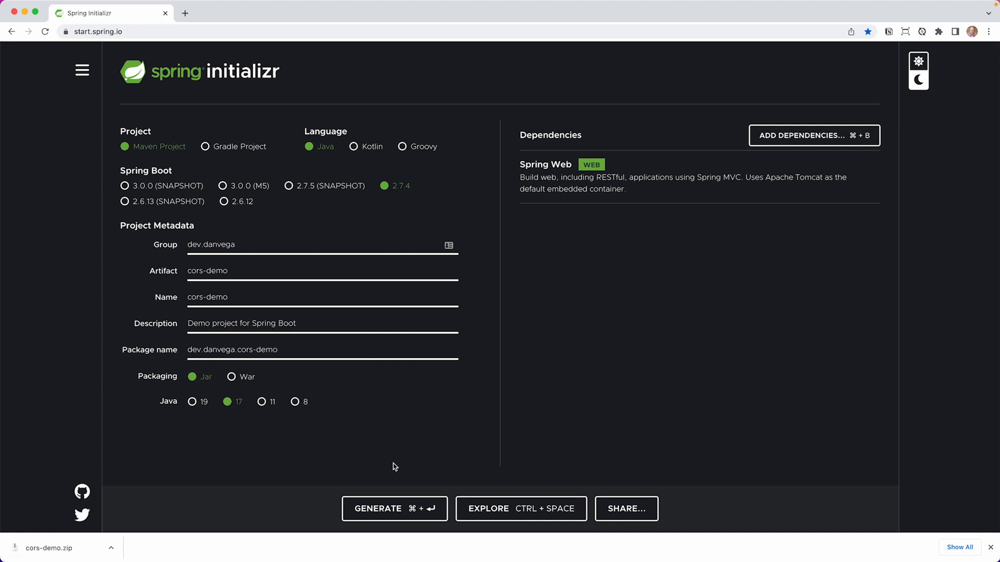

Authentication is a vital aspect of most applications, and Spring Boot provides several methods to control access. One of these methods is the use of CORS - a flexible, HTTP header-based mechanism that allows for the specification of authorized cross-domain requests. This article guides you through configuring CORS in Spring Boot at the controller, method, and global levels, as well as managing CORS when adding Spring Security.

## Getting Started

The tutorial assumes you have [Java](https://www.java.com/en/download/) and [Maven](https://maven.apache.org/) installed on your machine. You would also need an IDE such as [IntelliJ](https://www.jetbrains.com/idea/). All the resources and code used in this article are available [on this GitHub repository](https://github.com/danvega/spring-security-cors-demo). Let's dive right in!

## Creating a New Spring Boot Project

Start by creating a new Maven project at [start.spring.io](https://start.spring.io/), choosing Java as the language, Java 17 as the version, and fill in the `Group` as "dev.danvega" and `Artifact` as "cors-demo". The only dependency we would need for now is Spring Web.



Once done with the setup, generate the project and open the downloaded .zip file in your preferred text editor or IDE.

## Building Our Model

For our demo, we will create a `Coffee` model. In the `main` package within the `src` folder, create a new package named `model`. Within the `model` package, create a new class named `Coffee`. Here, we will create an `enum` called `Size` that contains the values `short`, `tall`, `grande`, and `venti`.

```java
public class Coffee {
    private Integer id;
    private String name;
    private Size size;

    // TODO: Add getters and setters
}

public enum Size {
    SHORT,
    TALL,
    GRANDE,
    VENTI
}
```

# Creating Our Controller

To begin, create a new package called `controller` in the `main` package. Inside the `controller` package, create a new Java class called `CoffeeController`.

In the `CoffeeController` class, we will use the `@RestController` annotation to indicate that the class is capable of accepting requests and returning responses. We will also set the `@RequestMapping` to "API/coffee". Finally, we will create a list of coffees and define two mappings: a `@GetMapping` to return all the coffees, and a `@DeleteMapping` to delete a specific coffee by ID.

```java
@RestController
@RequestMapping("API/coffee")
public class CoffeeController {
    private List<Coffee> coffeeList = new ArrayList<>(Arrays.asList(
            new Coffee(1, "Americano", Size.GRANDE),
            new Coffee(2, "Latte", Size.VENTI),
            new Coffee(3, "Macchiato", Size.TALL)
    ));

    @GetMapping
    public List<Coffee> findAll() {
        return coffeeList;
    }

    @DeleteMapping("/{id}")
    public void delete(@PathVariable Integer id) {
        coffeeList.removeIf(c -> c.getId().equals(id));
    }
}

```

If you run the application using the command `mvn spring-boot:run` (or directly from your IDE), you can view the coffee list at `localhost:8080/API/coffee`.

## Understanding CORS: Cross-Origin Resource Sharing

You're able to view the coffee list at the provided localhost URL because the request is coming from the same origin, where the domain and port match. However, issues may arise when cross-origin requests occur, such as when the domain, scheme, or port differ.

For example, suppose another application is running on a different port, say `localhost:5173`, and it attempts to fetch our coffee list from `localhost:8080/API/coffee`. In this case, CORS intervenes and blocks the request because it originates from a different port. If you're interested in learning more about this topic, [Mozilla's network documentation provides an in-depth explanation](https://developer.mozilla.org/en-US/docs/Web/HTTP/CORS).

## Configuring CORS in Your Spring Boot Application

So, how do we allow requests from other origins to access our APIs? Spring Boot provides a handy way to configure CORS using the `@CrossOrigin` annotation.

This annotation can be used at both method-level and class-level. For now, let's start by applying it at the class-level by adding `@CrossOrigin` at the top of our `CoffeeController` class.

```java
@RestController
@RequestMapping("API/coffee")
@CrossOrigin
public class CoffeeController {
    // controller content here...
}
```

With this configuration, the CORS error we received earlier when we tried to fetch the coffee list from `localhost:5173` should be resolved. However, this configuration allows access to all origins, which may not be suitable for most applications.

Therefore, if you want to allow specific origins, you can do so by passing them to the `@CrossOrigin` annotation. You can either use the `origins` property or pass them directly as the `value` property (which is an alias for `origins`). The syntax would look like this:

```java
@CrossOrigin(origins = "http://localhost:5173")
```

or

```java
@CrossOrigin("http://localhost:5173")
```

In either case, only requests from `localhost:5173` will be allowed, and other cross-origin requests will be blocked. This is more suitable for a production-grade application where you want only specific applications to access your APIs.

Moreover, the `@CrossOrigin` annotation can also be applied at a granular level, specifically on methods, which allows for fine-grained control over which API endpoints should allow cross-origin requests.

## Configuring CORS Globally

For larger applications with many controllers, it may be more efficient to configure CORS globally instead of annotating each controller or method separately. This can be done by creating a configuration class that implements the `WebMvcConfigurer` interface and overrides its `addCorsMappings` method.

```java
@Configuration
public class WebMvcConfig implements WebMvcConfigurer {
    @Override
    public void addCorsMappings(CorsRegistry registry) {
        registry.addMapping("/**")
        .allowedOrigins("http://localhost:5173")
        .allowedMethods("GET", "POST", "PUT", "DELETE");
    }
}

```

In the code above, we allow all endpoints (indicated by `/**`) to accept cross-origin requests from `localhost:5173` and permit the HTTP methods GET, POST, PUT, and DELETE.

## Configuring CORS With Spring Security

Adding Spring Security to a Spring Boot application changes things a bit. The issue is that CORS needs to be processed before Spring Security. This is because CORS makes a preflight request that does not contain any cookies. If Spring Security is processed first, it will reject the request as unauthenticated.

To solve this, we need to include a CORS configuration in our Spring Security configuration class. Spring's HTTP security has a `cors()` method that can be used to apply CORS configuration. Calling `cors()` without arguments configures Spring Security to use a bean named `CorsConfigurationSource`.

We can define this `CorsConfigurationSource` bean in our security configuration class itself.

```java
@EnableWebSecurity
public class SecurityConfig {
    @Bean
    public CorsConfigurationSource corsConfigurationSource() {
        CorsConfiguration configuration = new CorsConfiguration();
        configuration.setAllowedOrigins(Arrays.asList("http://localhost:5173"));
        configuration.setAllowedMethods(Arrays.asList("GET", "POST"));
        UrlBasedCorsConfigurationSource source = new UrlBasedCorsConfigurationSource();
        source.registerCorsConfiguration("/**", configuration);
        return source;
    }

    @Bean
    public SecurityFilterChain securityFilterChain(HttpSecurity http) {
        http.authorizeRequests().anyRequest().authenticated().and().httpBasic();
        return http.build();
    }
}

```

In the code above, we create a `CorsConfigurationSource` bean, define allowed origins and methods for CORS, register CORS configuration, and use this CORS configuration bean in our Spring Security configuration.

## Wrapping Up

In this detailed step-by-step guide, we covered ways to configure CORS for your Spring controllers and methods, create global configurations for ease, and do the same for when you introduce Spring Security into your Spring application. Configuring CORS properly ensures that your APIs are only accessed by trusted domains, providing an extra layer of security for your application.

If you found this article helpful or have any questions or comments, feel free to reach out. Happy coding!
