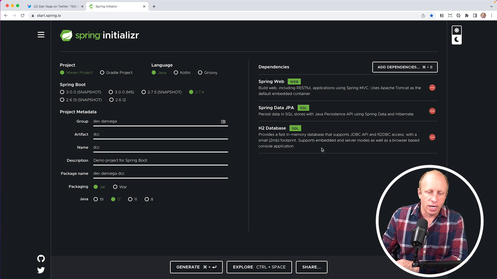

In this article, we'll discuss a recent tweet I sent out regarding the Domain Class Converter in Spring Data. The Domain Class Converter can convert any arbitrary input into a domain class managed by a Spring Data Repository (specifically a Crud Repository). We'll go through a tutorial that demonstrates how to use this feature.

If you're not already following me on Twitter, be sure to do so! I'm on Twitter as [TheRealDanVega](http://twitter.com/therealdanvega), where I share tips, discussions, and tutorials about Spring and programming in general.

## Getting Started

We'll begin by bootstrapping a simple Spring application that uses Spring Data JPA. Head over to <https://start.spring.io/> and create a new project with the following settings:

- Group ID: `dev.danvega`
- Artifact ID: `dcc` (for Domain Class Converter)
- Java: `version 17`
- Dependencies: `web`, `data-jpa`, `h2`

Once your project is generated, you can open it in your favorite IDE (I'll be using IntelliJ in this tutorial).

## Creating the Model, Repository, and Controller

Our application will revolve around blog posts. We'll create a simple `Post` entity with fields such as `id`, `title`, `content`, `publishedOn`, and `updatedOn`. To get started, create a `model` package in your project and add a new class called `Post`. Annotate this class with `@Entity`, and then create the necessary fields and methods, such as a no-argument constructor, getters, and setters.

```java
@Entity
public class Post {

    @Id
    private Integer id;
    private String title;
    private String content;
    private LocalDateTime publishedOn;
    private LocalDateTime updatedOn;

    public Post() {}

    public Post(Integer id, String title, String content) {
        this.id = id;
        this.title = title;
        this.content = content;
        this.publishedOn = LocalDateTime.now();
        this.updatedOn = LocalDateTime.now();;
    }

    // getters, setters & toString omitted

}
```

Next, create a `repository` package and add a new interface called `PostRepository`. This interface should extend the `CrudRepository` and take `Post` and `Integer` as its type arguments. By extending `CrudRepository`, we get basic CRUD functionality out of the box, such as `findById()`, `findAll()`, and `save()`.

```java
package dev.danvega.dcc.repository;

import dev.danvega.dcc.model.Post;
import org.springframework.data.repository.CrudRepository;

public interface PostRepository extends CrudRepository<Post,Integer> {
}
```

Finally, create a `controller` package and add a new class called `PostController`. Annotate this class with `@RestController` and add a `@RequestMapping` with the path set to `/api/posts`. Inject an instance of `PostRepository` using constructor injection, then create `findAll()` and `findById()` methods that leverage the repository's methods to return posts.

```java
@RestController
@RequestMapping("/api/posts")
public class PostController {

    private final PostRepository posts;

    public PostController(PostRepository posts) {
        this.posts = posts;
    }

    @GetMapping
    public Iterable<Post> findAll() {
        return posts.findAll();
    }

    @GetMapping("/{id}")
    public Post findById(@PathVariable Integer id) {
        return posts.findById(id);
    }

}
```

## Configuring the Application Properties

We need to configure our application to work with the H2 in-memory database. Open your `application.properties` file and add the following properties:

```properties
spring.h2.console.enabled=true
spring.h2.console.name=jpablog
spring.datasource.url=jdbc:h2:mem:japablog
spring.datasource.username=sa
spring.datasource.password=
spring.jpa.show-sql=true
```

These properties enable the H2 console, set its name to `jpablog`, configure the data source URL, and enable the display of generated SQL.

## Seeding the Database

To test our application, we need some initial data in our database. We can achieve this by creating a `CommandLineRunner` bean. This functional interface allows us to execute some code after the application context has been created and before the application runs.

In our `CommandLineRunner` bean, we'll inject an instance of `PostRepository` and use its `save()` method to create and save some sample `Post` objects to the database.

```java
@Bean
public CommandLineRunner seedData(PostRepository posts) {
  return args -> {
    posts.save(new Post(1, "Hello World", "Welcome to my blog"));
    posts.save(new Post(2, "Hello JPA", "Working with Spring Data JPA"));
  };
}

```

## Using the Domain Class Converter

With our application setup and initial data in place, we can now explore the main topic of this tutorial: the Domain Class Converter.

In our `PostController`, we have a `findById()` method that takes an `id` path variable and returns the corresponding post. We can simplify this method by leveraging the Domain Class Converter.

Instead of using an `Integer` parameter for the `id`, we can use a `Post` parameter directly, and annotate it with `@PathVariable("id")`. This tells Spring to use the Domain Class Converter to look up the `Post` by its `id` and assign it to the parameter.

```java
@GetMapping("/{id}")
public Post findById(@PathVariable("id") Post post) {
  return post;
}
```

Now our `findById()` method is simplified, and we no longer need to call the repository's `findById()` method explicitly in our controller.

## Testing the Application

Start the application and navigate to the H2 console at <http://localhost:8080/h2-console>. Connect to the database using the data source name (jpablog) and view the contents of the `POST` table. You should see the two sample posts we added earlier.

Now, test the `findAll()` and `findById()` endpoints in your browser:

- <http://localhost:8080/api/posts> should return a list of all posts.
- <http://localhost:8080/api/posts/1> should return the post with ID 1.
- <http://localhost:8080/api/posts/2> should return the post with ID 2.

## Conclusion

The Domain Class Converter is a useful feature that can simplify your Spring Data application by converting arbitrary input, like an ID, into a domain class managed by a Crud Repository. Though it may seem like a small change, it can make your code cleaner and more concise.

I hope you found this tutorial helpful! If you did, please give it a thumbs up, and don't forget to follow me on [Twitter](https://twitter.com/the_real_DanVega) for more tips, tutorials, and discussions about Spring Boot, Java, and programming in general. Happy coding!

