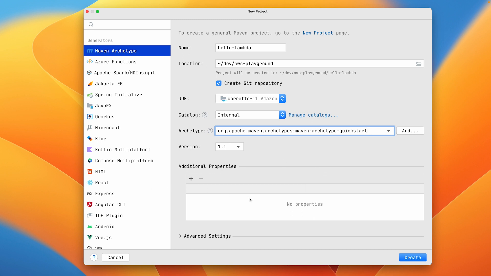
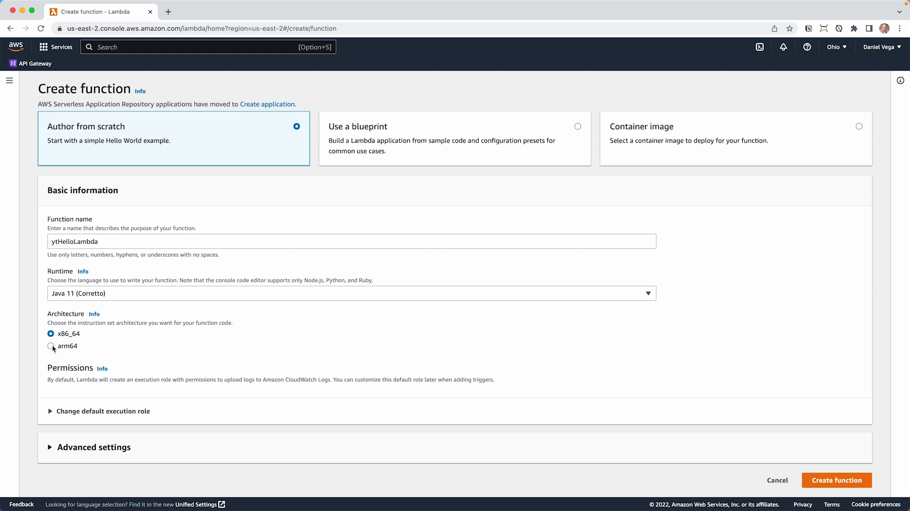

In this tutorial, I'll show you how to create a simple AWS Lambda function using Java. We'll start with a plain Java project, upload it to the AWS console, and test it. Along the way, I'll share some of the pain points I encountered while building serverless functions, and in a later tutorial you will see how you can overcome them using tools like Spring Cloud Function.

## Getting Started

First, create a new Java project using your favorite IDE or text editor. I'll be using IntelliJ IDEA Ultimate Edition, but you can also use the Community Edition or another tool of your choice.

Create a new Maven project and choose the `quickstart` archetype, which gives us a basic shell of an application. We'll be using Java 11 and JUnit 5.8.2 for our project.



To start, let's create a simple Java class that will hold our Lambda function. Name the class `HelloLambda`, and create a method called `handleRequest` that returns a `String`.

```java
public class HelloLambda {

    public String handleRequest() {
        return "Hello, AWS Lambda!";
    }

}
```

This is a very simple function that just takes a name as input and returns a greeting message. Now, let's create a test for our function using JUnit.

## Writing Tests

It's always a good practice to write tests for your functions. Create a new test class called `HelloLambdaTest` and add a method named `shouldReturnHelloMessage`.

```java
import org.junit.jupiter.api.Test;

import static org.junit.jupiter.api.Assertions.*;

class HelloLambdaTest {

    @Test
    void shouldReturnHelloMessage() {
        var sut = new HelloLambda();
        assertEquals("Hello, AWS Lambda!",sut.handleRequest());
    }

}
```

Run the test to make sure it passes. Now that we have our function and test, we need to package the function using the Maven Shade Plugin.

## Maven Shade Plugin

The Maven Shade Plugin is responsible for packaging the project classes together with their dependencies into a single "Uber JAR". This is what AWS Lambda expects when we upload our function.

To configure the Maven Shade Plugin, add a `build` section containing the plugin configuration to the `pom.xml` file:

```xml
<build>
    <plugins>
        <plugin>
            <groupId>org.apache.maven.plugins</groupId>
            <artifactId>maven-shade-plugin</artifactId>
            <version>3.2.4</version>
            <executions>
                <execution>
                    <phase>package</phase>
                    <goals>
                        <goal>shade</goal>
                    </goals>
                    <configuration>
                        <shadedArtifactAttached>true</shadedArtifactAttached>
                        <shadedClassifierName>aws-lambda</shadedClassifierName>
                    </configuration>
                </execution>
            </executions>
        </plugin>
    </plugins>
</build>
```

Now let's build our project using the following command:

```bash
mvn clean package
```

This will create a JAR file in the `target` directory of our project.

## Deploying and Testing the Lambda Function on AWS

Log into the [AWS Management Console](https://console.aws.amazon.com/), navigate to the Lambda service, and create a new function using the "Author from scratch" option. Give your function a name, choose the Java 11 (Corretto) runtime, and specify the Lambda handler using the format `package.class::method`.



Upload your JAR file built earlier by choosing "Upload a file from Amazon S3" or "Upload a .zip file", and configure the remaining settings according to your needs.

Once the function is created, you can test it using the AWS Console by creating a test event with an appropriate input. In our case, just pass a string as input. When you run the test, you should see the Lambda function return your greeting message.

You can also view logs and metrics for your Lambda function in the AWS Console.

## Conclusion and Next Steps

In this tutorial, we've created a simple AWS Lambda function using plain Java and deployed it to AWS. We did not use any AWS libraries or services directly in our Lambda function, making it easy to build and test locally.

As you start building more complex serverless functions, you may want to explore using AWS SDKs, integrating with other AWS services like S3 or DynamoDB, or using frameworks like Spring Cloud Function to simplify the development process.

Stay tuned for more tutorials in this series where we'll dive deeper into various AWS Lambda topics, like handling events, using the AWS CLI, and leveraging the AWS CDK for infrastructure-as-code.

