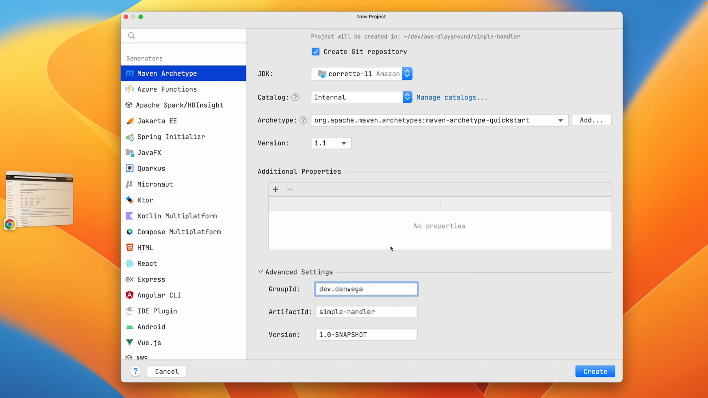

In this tutorial, we are continuing our journey to build AWS Lambda functions in Java. Previously, we looked at the quintessential "Hello World" example - how to create our first serverless function using Java. If you missed it, you can find the [previous tutorial here](https://www.danvega.dev/blog/2022/11/09/hello-aws-lambda-java/).

Today, we will make progress by introducing a new library from AWS - the **AWS Lambda Core Java Library**. This library is one of the few AWS offers to assist in building serverless functions.

Let's build a new project, pull in the dependency, discuss what this new dependency provides, and build and test a new serverless function.

## Setting Up the Project

First, let's create a new Maven project in IntelliJ using the `maven-archetype-quickstart` archetype. Once the project is created, update the `pom.xml` file to include the _AWS Lambda Core_ and _JUnit Jupiter_ dependencies:



```xml
<dependencies>
  <!-- AWS Lambda Java Core -->
  <dependency>
    <groupId>com.amazonaws</groupId>
    <artifactId>aws-lambda-java-core</artifactId>
    <version>1.2.1</version>
  </dependency>
  <!-- JUnit Jupiter -->
  <dependency>
    <groupId>org.junit.jupiter</groupId>
    <artifactId>junit-jupiter</artifactId>
    <version>5.8.2</version>
    <scope>test</scope>
  </dependency>
</dependencies>
```

The `aws-lambda-java-core` library is not required for building serverless functions with Java. This library does add some nice functionality including defining a handler method interface and the context object that the runtime passes to the handler. The library version may change, so make sure to check for the [latest version here](https://mvnrepository.com/artifact/com.amazonaws/aws-lambda-java-core).

## Creating the Lambda Function with AWS Lambda Core Java Library

In the `src/main/java` folder, create a new class named `SimpleHandler`. Use the AWS Lambda Core Java Library to implement the `RequestHandler` interface:

```java
import com.amazonaws.services.lambda.runtime.Context;
import com.amazonaws.services.lambda.runtime.RequestHandler;

public class SimpleHandler implements RequestHandler<String, String> {

    @Override
    public String handleRequest(String input, Context context) {
        // Our code will be added here
    }
}
```

In the `handleRequest` method, we can now access the `input` and `context` parameters provided by the AWS Lambda Core Java Library.

`Context` gives us access to useful information about the request, such as:

- Request ID
- Log group name
- Function name
- Version
- Identity
- Other details

Additionally, we can access a `LambdaLogger` instance, which is useful for logging within our Lambda function.

## Implementing the Lambda Function

In this example, our Lambda function will take a string input, convert it to uppercase, and return the result. To do this, we can use the `toUpperCase()` method provided by Java's `String` class:

```java
@Override
public String handleRequest(String input, Context context) {
    LambdaLogger logger = context.getLogger();
    logger.log("Function " + context.getFunctionName() + " called");
    return input.toUpperCase();
}
```

Now that we have our Lambda function implemented, we need to write tests for it.

## Writing Tests for the Lambda Function

Since our Lambda function depends on the `Context` parameter provided by the AWS Core Java Library, we need to find a way to provide this context during testing. One approach is to use mocking libraries, such as Mockito, to create mock instances of the `Context` and `LambdaLogger` classes.

Let's add Mockito to our project by updating our `pom.xml`:

```xml
<dependency>
    <groupId>org.mockito</groupId>
    <artifactId>mockito-junit-jupiter</artifactId>
    <version>4.5.1</version>
    <scope>test</scope>
</dependency>
```

Reload the Maven changes and create a new test class for our `SimpleHandler`:

```java
import com.amazonaws.services.lambda.runtime.Context;
import com.amazonaws.services.lambda.runtime.LambdaLogger;
import org.junit.jupiter.api.BeforeEach;
import org.junit.jupiter.api.Test;
import org.junit.jupiter.api.extension.ExtendWith;
import org.mockito.Mock;
import org.mockito.junit.jupiter.MockitoExtension;

import static org.junit.jupiter.api.Assertions.assertEquals;
import static org.mockito.ArgumentMatchers.anyString;
import static org.mockito.Mockito.doAnswer;
import static org.mockito.Mockito.when;

@ExtendWith(MockitoExtension.class)
class SimpleHandlerTest {

    private SimpleHandler simpleHandler;

    @Mock
    private Context context;

    @Mock
    private LambdaLogger logger;

    @BeforeEach
    void setUp() {
        // Set up your mocks
    }

    @Test
    void shouldReturnUppercaseOfInput() {
        // Write your test
    }
}

```

In the `setUp()` method, we need to configure our mocks and create a new instance of `SimpleHandler`:

```java
@BeforeEach
void setUp() {
    when(context.getLogger()).thenReturn(logger);

    doAnswer(invocation -> {
        System.out.println((String) invocation.getArguments()[0]);
        return null;
    }).when(logger).log(anyString());

    when(context.getFunctionName()).thenReturn("handleRequest");

    simpleHandler = new SimpleHandler();
}
```

Now we can write our test method:

```java
@Test
void shouldReturnUppercaseOfInput() {
    when(context.getFunctionName()).thenReturn("handleRequest");
    assertEquals("HELLO, WORLD!",handler.handleRequest("Hello, World!",context));
}
```

With the test in place, we can run it to ensure our Lambda function works as expected.

## Building and Deploying the Lambda Function

Finally, we can use the Maven Shade Plugin to package our Lambda function into an Uber JAR:

```xml
<build>
  <plugins>
    <plugin>
      <groupId>org.apache.maven.plugins</groupId>
      <artifactId>maven-shade-plugin</artifactId>
      <version>3.2.4</version>
      <executions>
        <execution>
          <phase>package</phase>
          <goals>
            <goal>shade</goal>
          </goals>
        </execution>
      </executions>
    </plugin>
  </plugins>
</build>
```

Run `mvn clean package` to build the JAR file, and then upload it to AWS Lambda through the AWS Management Console.

When testing the Lambda function within the console, you should now see the input string being converted to uppercase, and the Lambda function name being logged.

## Conclusion

And that's it! We've successfully built and deployed our serverless Lambda function using the AWS Lambda Core Java Library. With this foundation in place, we can now explore more complex use cases and even incorporate other AWS services and technologies, such as Amazon API Gateway and the AWS Lambda Java Events library.

Stay tuned for more tutorials on building serverless functions with Java, as well as an upcoming video on creating serverless functions using Spring Boot and Spring Cloud Functions. As always...

Happy Coding 😎🧑‍💻👩‍💻

