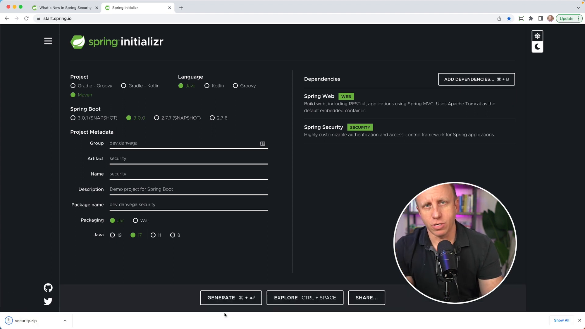

This article discusses the new features of Spring Security 6. If you haven't heard yet, Spring Boot 3.0 has been released, and if you include Spring Security as a dependency, you will now get Spring Security Version 6. In this blog post, we will delve into three important changes in Spring Security 6 and create a new Spring Boot 3 project together.

## Prerequisites

- Make sure you're using Java 17, as the baseline for Spring Boot 3 and Spring Security 6 is Java 17.
- Head over to [start.spring.io](https://start.spring.io/) to create a new Spring Boot 3 project with the Spring Security dependency.



## WebSecurityConfigurerAdapter Removed

In previous versions of Spring Security, you had to extend the `WebSecurityConfigurerAdapter` class to configure security settings. This class has been deprecated and removed in Spring Security 6. Instead, you should now take a more component-based approach and create a bean of type `SecurityFilterChain`. Here's an example:

```java
@EnableWebSecurity
@Configuration
public class SecurityConfig {

    @Bean
    public SecurityFilterChain securityFilterChain(HttpSecurity http) throws Exception {
        return http.build();
    }
}
```

## Authorize Http Requests

Instead of using `authorizeRequests`, which has been deprecated, you should now use `authorizeHttpRequests`. This method is part of the `HttpSecurity` configuration and allows you to configure fine-grained request matching for access control. Here's an example of how to use `authorizeHttpRequests`:

```java
@EnableWebSecurity
@Configuration
public class SecurityConfig {

    @Bean
    public SecurityFilterChain securityFilterChain(HttpSecurity http) throws Exception {
        return http.authorizeHttpRequests(auth -> auth
            .requestMatchers(PathRequest.toStaticResources().atCommonLocations()).permitAll()
            .anyRequest().authenticated())
            .formLogin();
            .build();
    }
}
```

In this example, we allow access to static resources, while requiring authentication for all other requests. If the syntax looks unfamiliar, this is because it is the Lambda DSL configuration. I have also written a tutorial on this, which can be found at [here](https://www.danvega.dev/blog/2023/03/15/spring-security-lambda-dsl/).

## RequestMatchers Replacing AntMatcher, MvcMatcher, and RegexMatcher

In Spring Security 6, `AntMatcher`, `MvcMatcher`, and `RegexMatcher` have been deprecated and replaced by `requestMatchers` or `securityMatchers` for path-based access control. This allows you to match requests based on patterns or other criteria without relying on specific matchers.

Here's an example that permits access to the `/greet` endpoint without authentication while requiring authentication for all other requests:

```java
@EnableWebSecurity
@Configuration
public class SecurityConfig {

    @Bean
    public SecurityFilterChain securityFilterChain(HttpSecurity http) throws Exception {
        return http.authorizeHttpRequests(auth -> auth
            .requestMatchers("/greet").permitAll()
            .anyRequest().authenticated())
            .formLogin()
            .build();
    }
}
```

Now, if you run your application and try to access the `/greet` endpoint, you should see that you can access it without needing to log in. However, if you try to access any other endpoint, you'll be prompted to log in.

## Wrapping Up

I hope you found this overview of the important changes in Spring Security 6 helpful. Remember to go through the [release notes](https://docs.spring.io/spring-security/site/docs/6.0.x/reference/html5/#new) for Spring Security 6, as there are many breaking changes and new features that you should be aware of. If you have questions about any of these changes or need help with your application, feel free to reach out.

As always, happy coding, friends!<br/>
Dan

