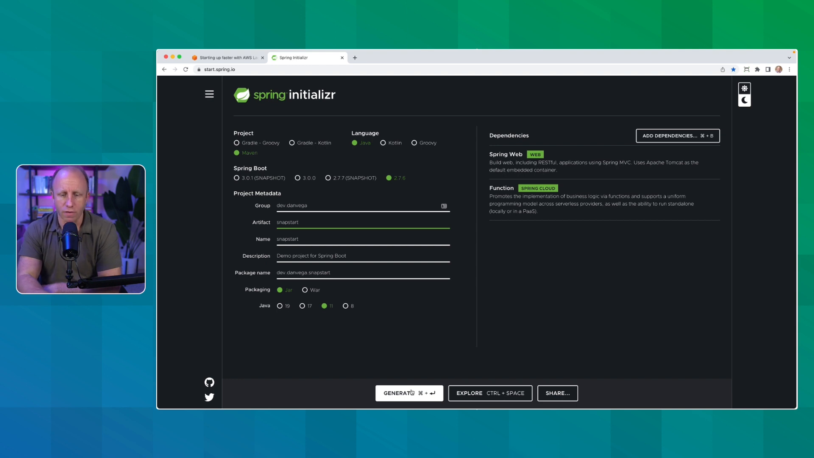

[AWS Lambda SnapStart](https://aws.amazon.com/blogs/compute/starting-up-faster-with-aws-lambda-snapstart/) is a new performance optimization developed by AWS that can significantly improve the startup time for your applications. Currently, it is only available for Java in certain regions, but Java is usually the runtime affected by cold start times. This feature delivers up to 10x faster function startup times for latency-sensitive Java applications at no extra cost and with no or minimal code changes. That's really nice!

In this blog post, we'll create a new project, include Spring Boot, and Spring Cloud Function. We'll talk about writing this function, pushing it to AWS Lambda, and then enabling SnapStart. Finally, we'll compare the init time before and after SnapStart.

## Creating a New Project

To create a new project, head over to [start.spring.io](https://start.spring.io/) and choose Maven as your build tool, Java as your language, and Spring Boot 2.7.6 because AWS doesn't support Java 17 yet. Make sure to add `web` and `Spring Cloud Function` as your project dependencies.



After generating the project, open it up in your favorite IDE.

## Writing the Function

In your main application class, create a new Bean with a Function that takes in a string and reverses it. Here's an example implementation:

```java
@Bean
public Function<String, String> reverse() {
    return string -> new StringBuilder(string).reverse().toString();
}
```

Now you can test your application locally to make sure the function works. Once you know the function works it’s time to deploy it to AWS Lambda.

## Building and Deploying to AWS Lambda

To build and deploy your function to AWS Lambda, follow these steps:

1. Add the Spring Cloud Function Adapter for AWS dependency to your `pom.xml`. Find more details in this article: [Serverless Spring](https://tanzu.vmware.com/developer/guides/spring/spring-cloud-function/#installation).
2. Modify your build plugins section in `pom.xml` as shown in the Serverless Spring article.
3. Run `mvn clean package` in your terminal to build your project.
4. Head over to the [AWS Management Console](https://aws.amazon.com/console/) and create a new function, authoring it from scratch. Choose the Coretto 11 runtime while creating the new function.
5. Upload the built `.jar` file from the `target` directory to your function.
6. Set the handler for your function to `org.springframework.cloud.function.adapter.aws.FunctionInvoker::handleRequest`.

## Testing Your Function and Enabling SnapStart

Now that your function is deployed to AWS Lambda, test it and observe the init duration. After the first run, the init duration should improve significantly.

To enable SnapStart, go to your function's configuration and edit the `Runtime Settings`. Set the supported runtime to Java 11 and turn on the SnapStart option. Save your changes and publish a new version of your function.

After enabling SnapStart, test your function again and observe the `Restore duration`. You should notice a significant decrease compared to the original init duration.

For example, your init duration may have gone from around 5 seconds to just 351 milliseconds. This is a huge improvement, and it's an exciting new feature for serverless Java developers.

## Conclusion

AWS Lambda SnapStart offers a great performance improvement for Java applications with minimal to no code changes required. This new feature will make serverless Java development more accessible and efficient, especially for latency-sensitive applications.

If you found value in this blog post, please consider signing up for my FREE weekly newsletter below. Thank you and as always friends…

Happy Coding!

