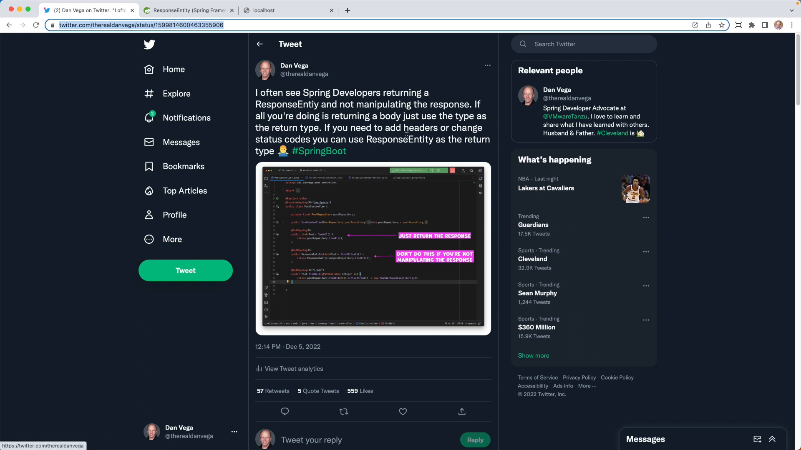

Recently, I sent out a [tweet](https://twitter.com/therealdanvega/status/1599814600463355906) that received a lot of attention. My tweet discussed the use of the ResponseEntity class in Spring framework and when to use it in your projects. In this blog post, I'll go through the ResponseEntity class in detail, and show you an example of how to use it in your next application.

## The Tweet

Here's the tweet I sent out:

> I often see spring developers returning a ResponseEntity and not manipulating the response. If all you're going to do is this and just return the body, just return that as the return type. If you need to customize the response and you need to add headers or change the status code, you can use a ResponseEntity as the return type.



This tweet got more than 600 likes, 57 retweets, and many comments. Let's get into the ResponseEntity class and see what it's all about.

## What is ResponseEntity?

According to the [Spring framework API docs](https://docs.spring.io/spring-framework/docs/current/reference/html/web.html#mvc-chapter.view-based-rendering), ResponseEntity is an extension of the HttpEntity class that adds an HTTP status code. It is used in the RestTemplate as well as in `@Controller` methods. You can also use it in Spring MVC as the return value from a controller method. RestController, in fact, is a combination of @Controller and another annotation, so ResponseEntity is useful when you're building a REST API.

Let's understand ResponseEntity better with an example.

## Activity Tracker Example

I'll use IntelliJ IDEA for this demonstration. Suppose we have a simple project for an activity tracker that records running activities. Each activity has a title, start time, and finish time. I've set up a simple Spring boot project with an ActivityController and an ActivityRepository using Spring Data.

```java
public record Activity(Integer id, String title, LocalDateTime started, LocalDateTime completed) { }
```

Let's create a method that allows us to get all the activities in the database.

```java
@GetMapping
public List<Activity> findAll() {
    return activityRepository.findAll(); //returns all activities from the repository
}
```

This method returns a list of activities. A common pattern I see is to change the return type of this method to ResponseEntity without manipulating the response.

```java
@GetMapping
public ResponseEntity<List<Activity>> findAll() {
    return ResponseEntity.ok(activityRepository.findAll()); // do NOT do this
}
```

Returning either a list of activities or a ResponseEntity list of activities generates the same output, so using ResponseEntity in this case is redundant. I also need to make sure I point out there there is absolutely nothing wrong with the code above.

### When to Use ResponseEntity

A ResponseEntity becomes useful when you want to manipulate the status code or add headers to the response. In this case, it makes sense to use ResponseEntity, as you cannot add new headers if you're just returning the list of activities:

```java
@GetMapping
public ResponseEntity<List<Activity>> findAll() {
    HttpHeaders responseHeaders = new HttpHeaders();
    responseHeaders.set("My-Custom-Header", "My-Custom-Value");
    return new ResponseEntity<>(activityRepository.findAll(), responseHeaders, HttpStatus.OK);
}
```

Now, when you make a request to this method, you'll see that the custom header is set in the response.

### Changing the Status Code

You might want to change the status code when you create a new activity. In this case, you can use the `@ResponseStatus` annotation to set a different status code. For example, if you want to return a 201 (Created) status code, you can do this:

```java
@PostMapping
@ResponseStatus(HttpStatus.CREATED)
public Activity createActivity(@RequestBody Activity activity) {
    return activityRepository.save(activity);
}
```

However, if the status code you want to set is conditional on some logic, then using ResponseEntity is the right choice.

## Wrapping Up

In summary, ResponseEntity is useful when you need to manipulate the status code or add custom headers to your response. It's not necessary to use ResponseEntity in other cases, such as when you're simply returning the data. A common argument I hear for using ResponseEntity is to be consistent with the return type for all methods. I’m not a big proponent of being consistent for consistent sake. This discussion on when to use ResponseEntity has been a valuable learning experience for me, and I hope it's been helpful for you too.

